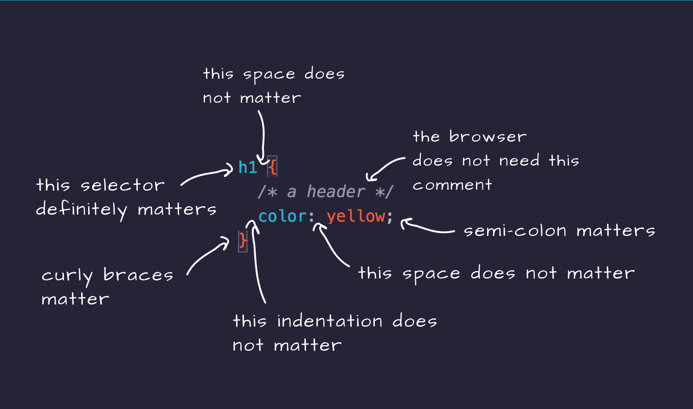
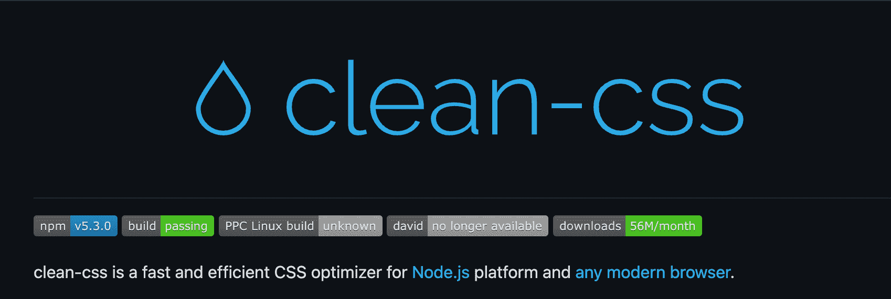
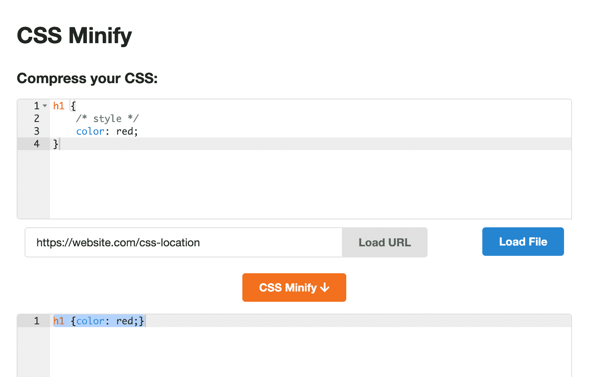
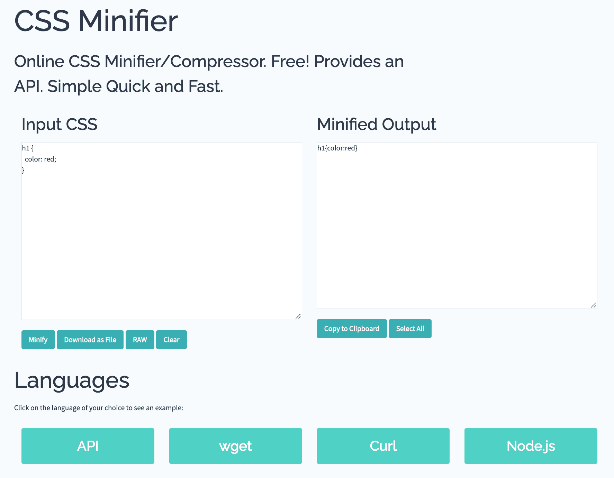

# CSS 缩小和压缩解释

> 原文：<https://www.freecodecamp.org/news/minify-css-css-minifying-and-compression-explained/>

缩小是减少代码大小以减小文件大小的过程。那么这如何应用于 CSS 呢？

看一下这段代码:

```
h1 {
  color: yellow;
}

p {
  color: pink;
} 
```

以及它的压缩版本:

```
h1 { color: yellow; } p { color: pink; } 
```

这两个代码块是相同的东西，它们以相同的方式工作，因为它们具有正确的 CSS 语法。但是这些代码块之间有两个不同之处:

*   与包含一行程序的第二个版本相比，第一个版本更具可读性和可理解性
*   与第二种方法相比，第一种方法会产生更大的文件。

在我的电脑上测试时，第一个有 46 字节的大小，而第二个是 40 字节的大小，第三个是 T2。这种差异可能看起来无关紧要，但是当您考虑一个更大的代码库的压缩版本所能产生的差异时，它就变得很明显了。

## 为什么压缩后的大小很重要？

当浏览器从服务器获取 HTML 文档时，它获取文档中链接的资源。这些资源包括图像、脚本和样式表。

CSS 文件越大，下载所需的资源(如网络带宽)就越多。此外，下载这些文件的时间越长。这会导致页面加载速度变慢，并影响整体用户体验。

对于小的 CSS 文件，这些开销可以忽略，但是随着程序的增长，压缩成为改善页面加载时间的重要因素。

## 所有浏览器需要的是有效的 CSS，而不是可读或格式化的 CSS

压缩文件的大小不会影响浏览器解析 CSS 的方式。浏览器不需要可读的 CSS 就能在网页上解释它。它只需要有效的 CSS(具有正确语法的 CSS 代码——花括号、分号等等)。

因此，多余的空格、注释和缩进对浏览器来说无关紧要。它只对发展有影响。

对于已部署的应用程序，您需要一个**可分发的**版本的 CSS。

**可发布的**版本并不意味着供人们阅读或在开发过程中使用——而是用于已部署的应用程序，因为它们只对浏览器有影响。

## 缩小的 CSS 是如何工作的？

缩小的目标是删除与浏览器解释 CSS 无关的 CSS 代码部分。

例如，这段代码:

```
h1 {
  /* a header */
  color: yellow;
} 
```

下面是代码中重要部分和不重要部分的图示:



代码注释可以帮助开发人员一起工作，记住为什么做出决策，并理解代码不同部分的用途。但是浏览器不需要这些信息。

空格和缩进提高了代码的可读性，但是浏览器可以阅读没有空格的代码。

元素选择器、花括号和分号是代码的重要组成部分，因为它们遵循 CSS 语法并帮助浏览器正确解释代码。

CSS 缩小方法从代码中取出浏览器不需要的部分，从而产生一个较小的文件，并使浏览器从服务器上下载这样的文件更快。

上述代码的简化版本是:

```
h1{color:yellow;} 
```

而且在浏览器上一切都很完美。

## 如何缩小 CSS

现在你理解了压缩 CSS 文件的相关性以及它们是如何工作的。那么如何缩小你的 CSS 文件呢？

当然，您不能在开发过程中编写缩小的 CSS 代码，因为这会使代码协作、阅读和理解变得困难。

这里有一些工具可以用来缩小你的 CSS。

### clean-css

clean-css 是一个 NPM 库，你可以用它在本地或远程服务器上缩小你的 css 文件。



### 丹的工具

Dan's Tools Minifier 是一款用于缩小 CSS 的在线 CSS 缩小工具。您可以将 CSS 粘贴到输入字段中，输入 CSS 文件所在的 URL，或者粘贴 CSS 文件。



Screenshot from the Dan's Tools CSS Minifier page

### 顶级 CSS Minifier

[Toptal CSS Minifier](https://www.toptal.com/developers/cssminifier/) 提供了一个 UI 来添加你的 CSS，并查看缩小后的输出。它还提供了一个 API 和插件，使这个过程自动化。



Toptal CSS Minifier screenshot

您可以应用更多的工具和配置来简化这一过程，这只是其中的一部分。

## 包裹

一般来说，缩小是优化网站的一个很好的方法。缩小 CSS 文件会增加页面加载时间，并且需要浏览器下载更少的资源。

在开发过程中，注释、缩进和其他格式可以提高代码的可读性和协作性。但是浏览器不需要这样。

CSS 缩小是压缩 CSS 文件大小的过程，通过在网页上去掉浏览器不需要解释的文件的不相关部分。

幸运的是，一些工具使它变得更容易，所以你可以享受开发的过程，并且在最后得到一个分布式版本。