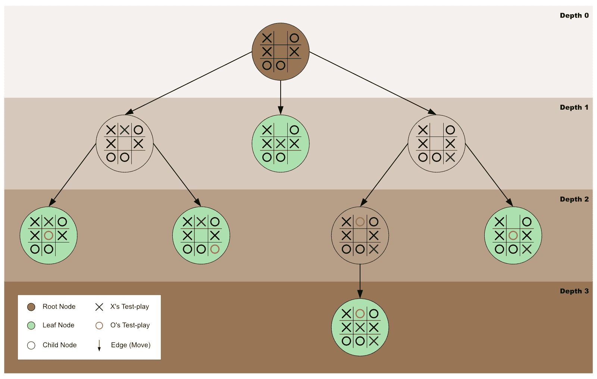
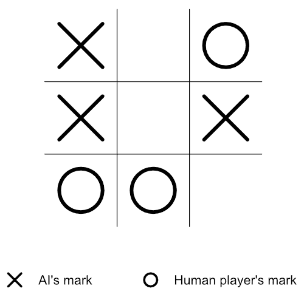
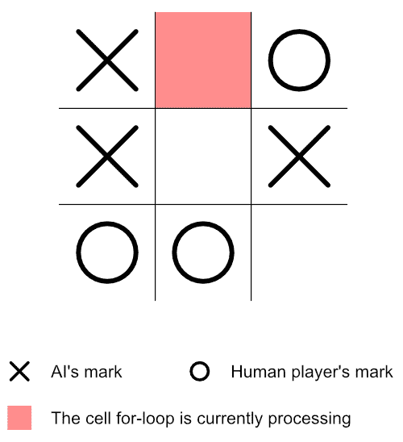
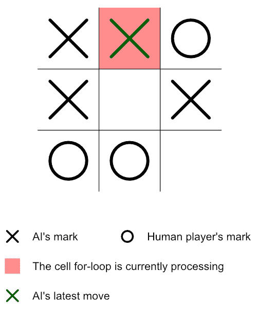
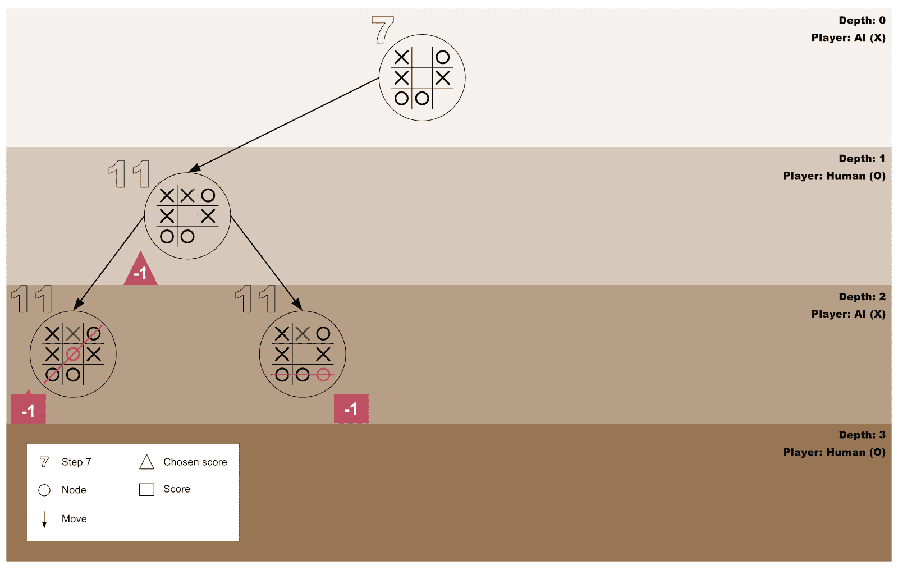
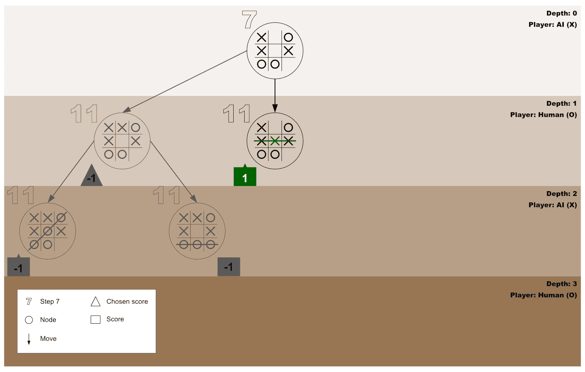
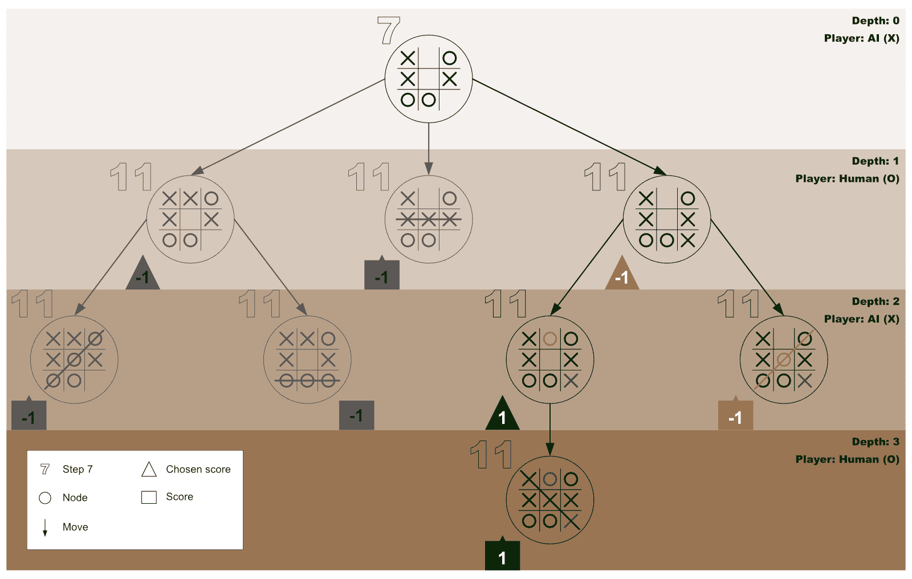
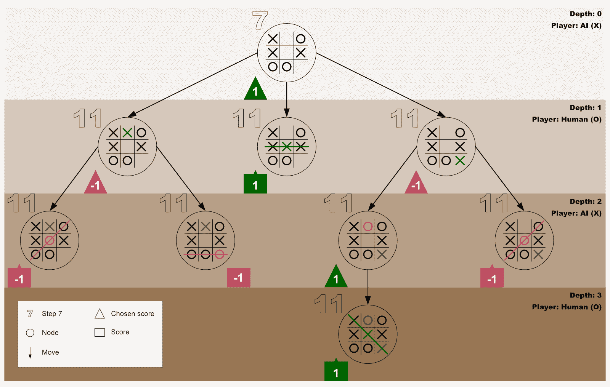
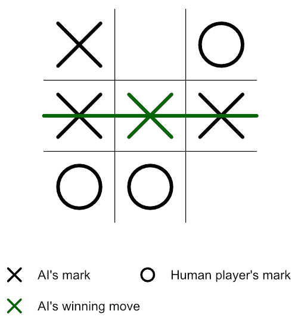

# 极大极小算法指南:如何创造一个无与伦比的人工智能

> 原文：<https://www.freecodecamp.org/news/minimax-algorithm-guide-how-to-create-an-unbeatable-ai/>

最近我在想——我怎样才能让电脑在井字游戏中不被打败？

嗯，我以为我很容易就能得到这个问题的答案。但是当我从文章到视频再到一系列的编码思考来来回回的时候，我只会变得更加困惑。

然而，我的“啊哈！”当我花时间去理解**极大极小算法**是如何工作的时候。

如果你也在类似的道路上，让我带你经历建立一个无与伦比的 AI(人工智能)的步骤。

## 步骤 1:理解极大极小算法的基础

一个**极大极小算法**是一个[递归](https://www.codesweetly.com/recursion/)程序，用来寻找最佳的游戏性，最小化任何输掉游戏的趋势，同时最大化任何赢得游戏的机会。

从图形上来说，我们可以将极小极大表示为对[博弈树的](https://en.wikipedia.org/wiki/Game_tree) [节点](https://en.wikipedia.org/wiki/Node_(computer_science))的探索，以发现最佳的博弈棋步。在这种情况下，树的根是游戏的当前状态——最小最大算法被调用的地方。



Figure 1: The game tree of a concluding tic-tac-toe game

在本指南中，我们的重点是使用 minimax 为井字游戏创建一个无与伦比的 AI。然而，[你也可以将它用于复杂的游戏](https://en.wikipedia.org/wiki/Minimax)，比如国际象棋，以及解决任何不确定性的一般决策。

在大多数情况下，最初调用 minimax 的玩家被称为*最大化玩家*。换句话说，minimax 的原始调用程序是希望最大化任何机会来赢得游戏的玩家。

相反，最大化玩家的对手被称为*最小化玩家*。因此，最小化玩家是其获胜机会必须最小化的玩家。

简而言之，极大极小算法是一个递归函数，用来帮助玩家(最大化者)决定游戏规则，使*最小化**最大化*输掉游戏的可能性。

## 步骤 2:熟悉本教程的根节点

为了使本教程更加精确，我们将使用的根节点(井字游戏的当前状态)将是一个接近结束状态的游戏棋盘，如下面的图 2 所示。

此外， **X** 标记将代表人工智能的标记，而 **O** 标记将是人类玩家的标记。



Figure 2: This tutorial’s root node

在井字游戏的当前阶段(如上图 2 所示)，轮到 **X** 玩(也就是轮到 AI)。由于棋盘上有三个空格子，这意味着 **X** 有三种可能的玩法选择——中上、居中或右下。

但是哪个才是最好的选择呢？哪一步棋最有助于 **X** 将输掉比赛的最大可能性降到最低？


Figure 3: AI player’s possible play choices

为了做出最佳决策，人工智能需要做以下工作:

1.  将井字游戏棋盘的当前状态(值)存储在一个数组中。(对于任何空单元格，单元格的索引将存储为其当前内容)。
2.  获取一个数组列表，其中只包含空单元格的索引。
3.  检查并确认特定玩家是否赢得了游戏。
4.  [递归地](https://www.codesweetly.com/recursion/)调用*最小最大值*在棋盘的每个空格子上。
5.  为玩家 **X** 和玩家 **O** 的每一个可能的移动返回一个分数。
6.  在所有返回的分数中，选择一个最好的(最高的)分数，它保证将人类玩家赢得游戏的可能性最小化。

因此，在下面的步骤中，我们将配置 AI 来完成上面的列表。因此，让我们从将棋盘的当前状态存储在一个数组中开始。

## 步骤 3:将棋盘的当前状态存储在一个数组中

我们的下一步是将棋盘上每个单元格的当前内容存储在一个数组中，如下所示:

```
const currentBoardState = ["X", 1, "O", "X", 4, "X", "O", "O", 8];
```

**注:**

*   我们的井字游戏棋盘的当前状态仍然如图 2 所示。
*   `currentBoardState`数组中的值`1`、`4`和`8`是板的空单元格的索引号。换句话说，我们没有使用空字符串，而是选择将空单元格的当前内容存储为它们各自的索引。

重要的是，在进入下一步之前，让我们明确定义谁的标记是`“X”`，谁拥有`“O”`。

```
const aiMark = "X";
const humanMark = "O";
```

上面的两个陈述表示 AI 的标记是 **X** ，而人类玩家的标记是 **O** 。

## 步骤 4:创建一个函数来获取所有空单元格的索引

下面的函数将过滤`currentBoardState`数组——该数组将作为函数的参数传入。然后它将返回一个新数组，包含所有既不是`“X”`也不是`“O”`的`currentBoardState`数组的项目。

```
function getAllEmptyCellsIndexes(currBdSt) {
    return currBdSt.filter(i => i != "X" && i != "O");
}
```

**注意:**记住我们在步骤 3 中创建的`currentBoardState`数组只包含值`“X”`、`“O”`和*棋盘的空单元格索引*。因此，上面的`getAllEmptyCellsIndexes()`函数过滤掉了在`currentBoardState`数组中出现的任何索引。

## 步骤 5:创建获胜者确定函数

下面的*赢家确定函数*的主要目的是接收一个`currentBoardState`数组和一个特定玩家的标记(标记`“X”`或`“O”`)作为其参数。

然后，它检查收到的标记是否在井字游戏棋盘上形成了获胜的组合。如果是，则返回布尔值`true`—否则，返回`false`。

```
function checkIfWinnerFound(currBdSt, currMark) {
    if (
        (currBdSt[0] === currMark && currBdSt[1] === currMark && currBdSt[2] === currMark) ||
        (currBdSt[3] === currMark && currBdSt[4] === currMark && currBdSt[5] === currMark) ||
        (currBdSt[6] === currMark && currBdSt[7] === currMark && currBdSt[8] === currMark) ||
        (currBdSt[0] === currMark && currBdSt[3] === currMark && currBdSt[6] === currMark) ||
        (currBdSt[1] === currMark && currBdSt[4] === currMark && currBdSt[7] === currMark) ||
        (currBdSt[2] === currMark && currBdSt[5] === currMark && currBdSt[8] === currMark) ||
        (currBdSt[0] === currMark && currBdSt[4] === currMark && currBdSt[8] === currMark) ||
        (currBdSt[2] === currMark && currBdSt[4] === currMark && currBdSt[6] === currMark)
    ) {
        return true;
    } else {
        return false;
    }
}
```

## 步骤 6:创建极大极小算法

一个**极大极小算法**只是一个普通的函数，它包含一旦函数被调用就要执行的语句。因此，创建算法的过程与创建任何其他函数是一样的。所以，现在让我们创建一个。

```
function minimax(currBdSt, currMark) {

    // Space for the minimax’s statements 

}
```

就是这样！我们已经创建了一个 **minimax** 函数——尽管是一个空函数。我们的下一步是用调用函数后将被执行的语句填充函数——我们将在下面完成。

**注意:**上面创建的 minimax 函数被设计成接受*两个参数*。
第一个是*当前棋盘内容的数组*列表——即`currentBoardState`数组的当前值。而第二个参数是*当前运行极小极大算法的玩家的标记*——即标记`“X”`或标记`“O”`。

## 步骤 7:第一次最小最大调用

为了避免本教程后面的任何混淆，让我们第一次调用 minimax 函数——同时传入数组`currentBoardState`和`aiMark`作为函数的参数。

```
const bestPlayInfo = minimax(currentBoardState, aiMark);
```

## 步骤 8:存储所有空单元格的索引

在这一步中，我们将调用在第 4 步中创建的`getAllEmptyCellsIndexes`函数，同时传入`currentBoardState`数组作为函数的参数。

然后，我们将把*返回的*数组索引列表存储在一个名为`availCellsIndexes`的变量中。

```
const availCellsIndexes = getAllEmptyCellsIndexes(currBdSt);
```

## 步骤 9:检查是否有终止状态

在这个阶段，我们需要验证井字板上是否存在终结状态(即输状态、赢状态或和棋状态)。我们将通过为每个玩家调用*获胜者确定函数*(在步骤 5 中创建)来完成这一验证。

如果该函数为人类玩家(最小化者)找到一个获胜状态，它将返回`-1`(这表示人类玩家赢了，而 AI 输了)。但是如果它为 AI 玩家(最大化器)找到了一个胜利状态，它就会返回`+1`(表示 AI 赢了，人类玩家输了)。

然而，假设赢家确定器函数无法在棋盘上找到任何空单元格或任何玩家的任何获胜状态。在这种情况下，它将返回`0`(零)——这意味着游戏已经以平局结束。

**注意:**上面显示的分数(`-1`、`+1`和`0`)是[启发式](https://www.vocabulary.com/dictionary/heuristic)值——这意味着如果我们更喜欢使用-25、+25 和 0，我们仍然会得到相同的结果。

现在让我们通过使用如下的 if 语句来实现终端状态验证:

```
if (checkIfWinnerFound(currBdSt, humanMark)) {
    return {score: -1};
} else if (checkIfWinnerFound(currBdSt, aiMark)) {
    return {score: 1};
} else if (availCellsIndexes.length === 0) {
    return {score: 0};
}
```

当有一个终端状态(输、赢或平局)时，活动的 minimax 函数将返回适当的终端状态分数(`-1`、`+1`或`0`)，并结束其调用。

如果活动的 minimax 在这里结束其调用，则算法将前进到步骤 12。

但是，当有*无*终端状态时，活动的 minimax 函数将执行下一条语句(下面的步骤 10)。

## 步骤 10:准备好测试在每个空白单元格上播放当前玩家标记的结果

由于第 9 步没有发现终端状态，我们必须设计一种方法来测试如果当前玩家(他将进行下一步游戏)在每个空单元格上游戏会发生什么。

换句话说，如果当前玩家在第一个可用的单元格上玩，而对手在第二个空单元格上玩，那么当前玩家会赢、输还是平局呢？还是还是会找不到终态？

或者，如果当前玩家在第二个可用单元格上玩，而对手在第一个空单元格上玩，会发生什么？

或者，第三个可用的单元格会是当前玩家玩游戏的最佳位置吗？

这次试驾是我们现在需要做的。但是在开始之前，我们需要一个地方来记录每个测试的结果——所以让我们首先创建一个名为`allTestPlayInfos`的数组。

```
const allTestPlayInfos = [];
```

所以，现在我们已经获得了一个存储每个试驾结果的地方，让我们通过创建一个 *for-loop 语句*开始试验，该语句将从第一个单元格开始遍历每个空单元格。

```
for (let i = 0; i < availCellsIndexes.length; i++) {

    // Space for the for-loop’s codes

}
```

在接下来的两个步骤中，我们将用它应该为每个空单元格运行的代码填充 for 循环。

## 步骤 11:在 for 循环当前正在处理的空单元格上试打当前玩家的标记

在进行这一步的任何操作之前，让我们回顾一下我们的电路板的当前状态。



Figure 4: The current state of the tic-tac-toe board

请注意，上面的板子仍然与图 2 的板子相同，只是我们用红色突出显示了 for 循环当前正在处理的单元格。

接下来，有一个存储这个测试的最终分数的地方会很有帮助—所以让我们创建一个对象，如下所示:

```
const currentTestPlayInfo = {};
```

此外，在试打当前玩家在红色单元格上的标记之前，让我们保存单元格的索引号——以便在这次试打之后很容易重置单元格的信息。

```
currentTestPlayInfo.index = currBdSt[availCellsIndexes[i]];
```

现在，让我们将当前玩家的标记放在红色单元格上(即当前正在被 for 循环处理的单元格)。

```
currBdSt[availCellsIndexes[i]] = currMark;
```

基于当前玩家的游戏，棋盘的状态将会改变以反映其最新的移动。



Figure 5: The new board — which reflects the current player’s latest move

因此，由于棋盘的状态已经改变，我们需要在新的棋盘上递归运行 minimax 同时传入新棋盘的状态和下一个玩家的标记。

```
if (currMark === aiMark) {
    const result = minimax(currBdSt, humanMark);
    currentTestPlayInfo.score = result.score;
} else {
    const result = minimax(currBdSt, aiMark);
    currentTestPlayInfo.score = result.score;
}
```

**注:**

*   此时对 minimax 的递归调用将是我们调用该函数的第 _____ 次。第一次调用发生在第 7 步。
*   这个递归调用将导致步骤 8 到 11 的重复。
*   假设在步骤 9 有一个终止状态。在这种情况下，当前的 minimax 调用将停止运行，并将返回的终端对象(例如，`{score: 1}`)存储在`result`变量中。
*   一旦有了终止状态，下一步就是步骤 12。
*   如果存在*无*终端状态，则在步骤 10，新板将开始第二个**for 循环**。
*   如果重复步骤 10，请用图 5 中的新板替换图 4 中的板。但是，用红色突出显示的单元格现在将是 for 循环当前正在处理的单元格。因此，请务必相应地反映这些变化。

## 步骤 12:保存最新的最终分数

在刚刚结束的 minimax 调用返回了它的终端状态值之后，活动的 for 循环将把`result`变量的分数保存到`currentTestPlayInfo`对象中，如下所示:

```
currentTestPlayInfo.score = result.score;
```

然后，由于返回的分数正式结束了当前的测试游戏，最好将当前棋盘重置回当前玩家移动之前的状态。

```
currBdSt[availCellsIndexes[i]] = currentTestPlayInfo.index;
```

此外，我们需要保存当前玩家的试玩结果，以备将来使用。因此，让我们通过将`currentTestPlayInfo`对象推送到`allTestPlayInfos`数组来实现这一点，如下所示:

```
allTestPlayInfos.push(currentTestPlayInfo);
```

**注:**

*   如果你从第 17 步到了这一步，请从第 18 步继续本教程。否则，考虑下一点。
*   如果激活的 for 循环已经循环完当前板的所有空单元，循环将在该点结束，下一步是*步骤 14* 。否则，循环将继续处理下一个可用单元(步骤 13)。

## 步骤 13:在下一个空单元格上运行活动的 for 循环

请记住，当前活动的 for 循环(从步骤 10 开始)只完成了前面空单元格的工作。因此，循环将继续在下一个空闲单元上测试播放当前玩家的标记。

换句话说，当前运行的 minimax 函数将重复步骤 **11** 和 **12** 。但是，本质上，请注意以下几点:

*   图 4 中突出显示的红色单元格将变为 for 循环当前正在处理的单元格。
*   请注意，图 5 也会改变。换句话说，当前玩家的移动现在将在 for 循环当前正在处理的单元格上。
*   在活动 for 循环完成其工作后，`allTestPlayInfos`数组将包含 for 循环已处理的每个空单元格的特定对象。
*   在`allTestPlayInfos`数组中的每个对象将包含一个`index`属性和一个`score`属性(以`{index: 8, score: -1}`为例)。
*   如果你从第 20 步到了这一步，那么，*完成第 12 步*后，请从*第 18 步*继续本教程。

## 步骤 14:计划如何为当前玩家获得测试分数最高的物品

在 for 循环完成了遍历当前棋盘的所有空白单元格的工作后，minimax 将立即:

1.  **创建一个空间**来存储参考号，这将有助于获得最佳的试玩对象。
2.  **获得当前玩家最佳试玩的参考编号**。
3.  **使用获取的参考号**为当前玩家获取试玩效果最好的物品。

事不宜迟，让我们在接下来的几个步骤中实现这个计划。

## 第 15 步:创建一个商店，供最佳测试演示参考

下面的变量是我们稍后将存储对最佳测试播放对象的引用的地方。(注意值`null`表示我们故意将变量留空)。

```
let bestTestPlay = null;
```

## 步骤 16:获取当前玩家的最佳试玩参考

现在有了一个`bestTestPlay`商店，活动的 minimax 函数可以继续获取当前玩家的最佳试玩参考，如下所示:

```
if (currMark === aiMark) {
    let bestScore = -Infinity;
    for (let i = 0; i < allTestPlayInfos.length; i++) {
        if (allTestPlayInfos[i].score > bestScore) {
            bestScore = allTestPlayInfos[i].score;
            bestTestPlay = i;
        }
    }
} else {
    let bestScore = Infinity;
    for (let i = 0; i < allTestPlayInfos.length; i++) {
        if (allTestPlayInfos[i].score < bestScore) {
            bestScore = allTestPlayInfos[i].score;
            bestTestPlay = i;
        }
    }
}
```

上面的代码意味着如果当前标记等于 AI 玩家的标记:

1.  用`-Infinity`的值创建一个`bestScore`变量。(注意，这个值只是一个占位符值，需要*小于`allTestPlayInfos`数组中的*所有分数。因此，使用`-700`会做同样的工作)。
2.  然后，对于`allTestPlayInfos`数组中的每个试玩对象，检查循环当前正在处理的试玩是否具有比当前`bestScore`更高的分数*。如果是，在`bestScore`变量和`bestTestPlay`变量中记录测试玩家详细信息。*

否则，如果当前标记是人类玩家的标记:

1.  用`+Infinity`的值创建一个`bestScore`变量。(同样，请注意，如果我们更喜欢使用`+300`，我们会得到相同的结果。它只是一个占位符值，需要大于`allTestPlayInfos`数组中所有分数的*。*
2.  然后，对于`allTestPlayInfos`数组中的每个试玩对象，检查循环当前正在处理的试玩是否具有比当前`bestScore`小的*分数*。如果是，在`bestScore`变量和`bestTestPlay`变量中记录测试玩家详细信息。

## 第 17 步:获得当前玩家测试分数最高的物品

最后，当前运行的 minimax 调用现在可以通过返回当前玩家的最佳测试对象来完成它的工作，如下所示:

```
return allTestPlayInfos[bestTestPlay];
```

请注意，minimax 将把返回的对象存储在从步骤 11 开始的第一个 for 循环的`result`变量中。然后，它将重复步骤 12。请只回顾第 12 步。然后，继续下面的教程。

## 第十八步:我们来复习一下

这个阶段是一个很好的时间来回顾我们到目前为止所做的事情。

**注:**

*   如果这是您第一次执行此步骤，请使用*步骤 19* 中的图表。
*   这是你第二次登上这个台阶吗？如果有，*步骤 21* 中的图就是你的了。
*   你是第三次来这里吗？做得好！查看*步骤 23* 中的图表。

## 步骤 19:用图表描绘我们的步骤

下图显示了人工智能和人类玩家的*第一次试玩*由人工智能玩家发起的第一次 for 循环调用。



Figure 6: First test-play which predicts a loss state for the AI (maximizer)

## 步骤 20:第一个 for 循环向前移动，处理下一个空单元格

当断定在第一个空单元上的游戏将以失败状态结束时，AI 通过重复步骤 13 前进以测试在第二个空单元上的游戏结果。

## 步骤 21:用图表描绘我们的步骤

下图显示了人工智能和人类玩家对人工智能玩家发起的第一次 for 循环调用的第二次测试。



Figure 7: Second test-play which predicts a win state for the AI (maximizer)

## 步骤 22:第一个 for 循环向前移动，处理下一个空单元

既然 AI 已经确认在第二个空单元上游戏将导致赢的状态，它通过重复步骤 13 进一步检查在第三个空单元上游戏的结果。

## 步骤 23:用图表描绘我们的步骤

下图显示了人工智能和人类玩家的第三次试玩，这是由人工智能玩家发起的第一次 for 循环调用。



Figure 8: Third test-play which predicts a loss state for the AI (maximizer)

## 步骤 24:为人工智能玩家获得测试分数最高的物体

此时(在第三次测试之后)，第一个 for 循环将已经处理了第一个棋盘的所有三个空单元格(在第 7 步传递给 minimax)。

因此，minimax 将不断前进，通过重复步骤 15 到 17，为 AI 玩家获得最佳测试玩法的对象。然而，*在第 17 步*时，请注意以下几点:

*   返回的对象现在将存储在我们在第 7 步创建的`bestPlayInfo`变量中。
*   Minimax 不会重复步骤 12，因为 for-loop 语句不再有效。



Figure 9: Overview of all test-plays and scores

## 步骤 25:使用 bestPlayInfo 中的数据

考虑到本教程的棋盘(一个接近结束状态的游戏棋盘——如步骤 2 的图 2 所示)，`bestPlayInfo`变量中的对象将是`{index: 4, score: 1}`。因此，人工智能现在可以使用它的索引值来选择最佳的单元格进行游戏。

### 例子

```
// Get all the board’s cells:
const gameCells = document.querySelectorAll(".cell");

// Below is the variable we created at step 3:
const aiMark = "X";

// Here is the bestPlayInfo we created at step 7 to contain the best test-play object for the AI player:
const bestPlayInfo = minimax(currentBoardState, aiMark);

// Play the AI’s mark on the cell that is best for it:
gameCells[bestPlayInfo.index].innerText = aiMark;
```

因此，人工智能玩家将赢得游戏，新的棋盘现在看起来像这样:



Figure 10: Final gameboard showing that the AI (player X) has won the game

## 步骤 26:本教程算法的鸟瞰图

下面是本教程的海贼王 minimax 算法。请随意将其插入到您的编辑器中。用它来玩各种游戏场景，并使用控制台测试，测试，再测试，直到你可以轻松地构建一个无与伦比的 AI。

记住，只有当你[甜蜜地](https://www.codesweetly.com/)编码时，编程才会更好——所以尽情享受吧！

```
// Step 3 - Store the board’s current state in an array and define each mark's owner:
const currentBoardState = ["X", 1, "O", "X", 4, "X", "O", "O", 8];
const aiMark = "X";
const humanMark = "O";

// Step 4 - Create a function to get the indexes of all the empty cells:
function getAllEmptyCellsIndexes(currBdSt) {
    return currBdSt.filter(i => i != "O" && i != "X");
}

// Step 5 - Create a winner determiner function:
function checkIfWinnerFound(currBdSt, currMark) {
    if (
        (currBdSt[0] === currMark && currBdSt[1] === currMark && currBdSt[2] === currMark) ||
        (currBdSt[3] === currMark && currBdSt[4] === currMark && currBdSt[5] === currMark) ||
        (currBdSt[6] === currMark && currBdSt[7] === currMark && currBdSt[8] === currMark) ||
        (currBdSt[0] === currMark && currBdSt[3] === currMark && currBdSt[6] === currMark) ||
        (currBdSt[1] === currMark && currBdSt[4] === currMark && currBdSt[7] === currMark) ||
        (currBdSt[2] === currMark && currBdSt[5] === currMark && currBdSt[8] === currMark) ||
        (currBdSt[0] === currMark && currBdSt[4] === currMark && currBdSt[8] === currMark) ||
        (currBdSt[2] === currMark && currBdSt[4] === currMark && currBdSt[6] === currMark)
) {
        return true;
    } else {
        return false;
    }
}

// Step 6 - Create the minimax algorithm:
function minimax(currBdSt, currMark) {
    // Step 8 - Store the indexes of all empty cells:
    const availCellsIndexes = getAllEmptyCellsIndexes(currBdSt);

    // Step 9 - Check if there is a terminal state:
    if (checkIfWinnerFound(currBdSt, humanMark)) {
        return {score: -1};
    } else if (checkIfWinnerFound(currBdSt, aiMark)) {
        return {score: 1};
    } else if (availCellsIndexes.length === 0) {
        return {score: 0};
    }

    // Step 10 - Create a place to record the outcome of each test drive:
    const allTestPlayInfos = [];

    // Step 10 - Create a for-loop statement that will loop through each of the empty cells:
    for (let i = 0; i < availCellsIndexes.length; i++) {
        // Step 11 - Create a place to store this test-play’s terminal score:
        const currentTestPlayInfo = {};

        // Step 11 - Save the index number of the cell this for-loop is currently processing:
        currentTestPlayInfo.index = currBdSt[availCellsIndexes[i]];

        // Step 11 - Place the current player’s mark on the cell for-loop is currently processing:
        currBdSt[availCellsIndexes[i]] = currMark;

        if (currMark === aiMark) {
            // Step 11 - Recursively run the minimax function for the new board:
            const result = minimax(currBdSt, humanMark);

            // Step 12 - Save the result variable’s score into the currentTestPlayInfo object:
            currentTestPlayInfo.score = result.score;
        } else {
            // Step 11 - Recursively run the minimax function for the new board:
            const result = minimax(currBdSt, aiMark);

            // Step 12 - Save the result variable’s score into the currentTestPlayInfo object:
            currentTestPlayInfo.score = result.score;
        }

        // Step 12 - Reset the current board back to the state it was before the current player made its move:
        currBdSt[availCellsIndexes[i]] = currentTestPlayInfo.index;

        // Step 12 - Save the result of the current player’s test-play for future use:
        allTestPlayInfos.push(currentTestPlayInfo);
    }

    // Step 15 - Create a store for the best test-play’s reference:
    let bestTestPlay = null;

    // Step 16 - Get the reference to the current player’s best test-play:
    if (currMark === aiMark) {
        let bestScore = -Infinity;
        for (let i = 0; i < allTestPlayInfos.length; i++) {
            if (allTestPlayInfos[i].score > bestScore) {
                bestScore = allTestPlayInfos[i].score;
                bestTestPlay = i;
            }
        }
    } else {
        let bestScore = Infinity;
        for (let i = 0; i < allTestPlayInfos.length; i++) {
            if (allTestPlayInfos[i].score < bestScore) {
                bestScore = allTestPlayInfos[i].score;
                bestTestPlay = i;
            }
        }
    }

    // Step 17 - Get the object with the best test-play score for the current player:
    return allTestPlayInfos[bestTestPlay];
} 

// Step 7 - First minimax invocation:
const bestPlayInfo = minimax(currentBoardState, aiMark);
```

## 有用的资源

*   [递归:关于递归你需要知道的事情](https://www.codesweetly.com/recursion/)