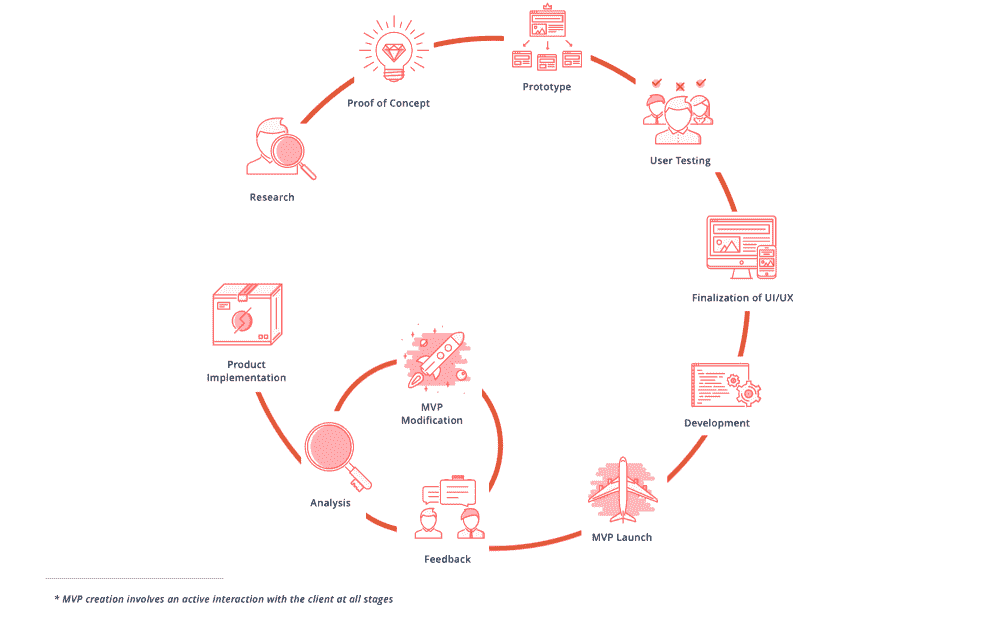
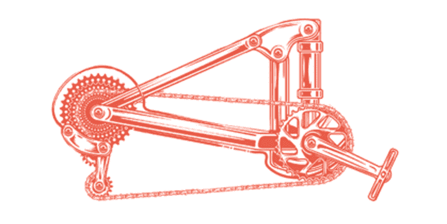
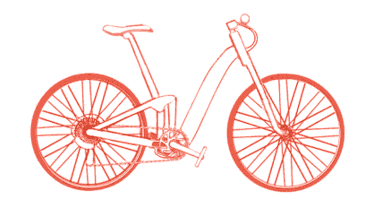
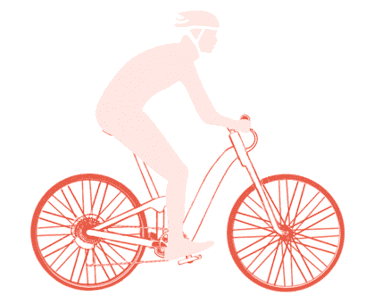
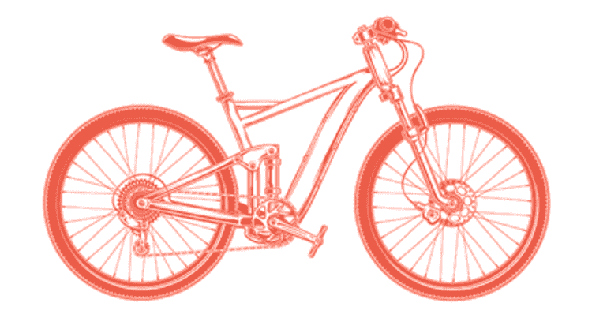

# 最小可行产品——如何为你的项目建立一个 MVP，为什么你应该这样做

> 原文：<https://www.freecodecamp.org/news/minimum-viable-product-between-an-idea-and-the-product/>

## 产品的功能刚好足以收集全面的定性反馈

概念证明、原型、线框、模型…什么实际上构成了最小可行产品(MVP)？

实际上，理解 MVP 的概念就像骑自行车一样容易。那么我们应该把 MVP 比作自行车吗？

让我们开始吧。在本文中，我将阐明:

*   什么是 MVP？
*   MVP 是如何开发的？
*   如果是自行车，MVP 会怎么开发？
*   为什么建立 MVP 很重要？

每个顾客都希望被倾听和理解。软件世界提供了过多的应用程序和网站，但只有其中一些受到用户的关注和喜爱。要想知道你的想法是否能在这个竞争环境中找到一席之地，首先要创造一个最小可行的产品。

## 什么是 MVP？

最小可行产品代表了软件产品发现过程中的一个主要阶段。本质上，它是最终用户可以使用的一组最少的必要功能。最小可行产品的概念在 2009 年广为人知，当时 Eric Ries 在他的书《精益创业 中提出了这个概念。

最小可行产品是一个绝佳的机会，让潜在用户表达他们的意见，并在产品最终发布前对其进行测试。

收集和分析定性反馈是 MVP 开发的主要任务。基于这些发现，您可以修改您的 MVP 并再次测试它。

这个过程变成了一个 MVP 产品开发的循环，一遍又一遍地进行，直到最终客户满意为止。

## **MVP 软件开发是如何进行的**

每个产品都是不同的，其开发过程也是如此。在我们进入如何创建 MVP 的细节之前，我想指出这是一个独立的迭代过程。

### 想法

起初，你有一个想法。即使你觉得它是革命性的和天才的，它可能仍然是相当模糊的。

### 产品发现

你的首要任务是实现你的想法。您可以从进行 [产品发现](https://keenethics.com/blog/product-discovery) 开始。你需要研究目标受众的需求、兴趣和人口统计特征。还有，分析竞争对手的优势和劣势。

然后你需要回顾所有可以实现的特性并选择必要的。在研讨会期间，借助图形、图表、表格或您认为最能代表数据的任何其他视觉材料，组织并展示这些信息。

现在，你的想法似乎更清晰了，但还是不太像样。

### 概念证明

接下来，您需要创建一个概念证明。基本上就是针对发现阶段进行总结，验证你的创新想法在现实生活中是否可以实施。

*好了，你知道你的想法是可行的，也是全面的*。*你知道这是可以做到的——但是怎么做呢？*

### 用户旅程

现在你需要理解用户打开应用程序后想看到什么。你想知道他们最有可能采取哪些行动，以及他们试图实现什么目标。

为此，您需要绘制一个用户旅程图。用户旅程是一个虚拟用户及其应用体验的可视化呈现。它们涵盖了一切，从用户意识到他们需要这项服务的那一刻，到他们第一次找到并点击你的应用，直到他们决定是否让这项服务成为他们生活方式的一部分。

用户旅程类似于一组语句，如下所示:

作为一个[用户角色]，我想做[功能]，以便[目标]。

例如，“作为一名网站管理员，我希望能够添加或删除用户，这样应用程序就不会有垃圾邮件发送者”。或者“作为一名未注册用户，我希望能够打开一个菜单，以便在注册之前了解应用程序提供的内容”。

### 原型

之后，就该开始 [原型](https://keenethics.com/blog/1517766794846-what-is-prototype-and-how-to-eat-it-in-a-right-way) 了。原型是产品的简化版本。它展示了最终的产品设计和导航。基本上就是一组你未来 app 的界面的图片。如果它是可点击的，您可以通过点击按钮在屏幕之间导航，以便了解用户流程。

原型甚至可能看起来像你的平台或移动应用的一个非常基础的版本。但是它不是最终产品，也不是 MVP，因为你不能把它展示给真正的用户。

在这里，你已经实现了你的想法。算是吧。只要它只是一个粗略的草案，就可以向所有利益相关者展示，但不能向最终用户展示。

### 最低可行产品开发

在这个阶段，你需要对用户界面/UX 做出最终决定，并完成视觉设计。之后，就该开始编码最小可行产品了。

最小可行产品看起来像一个最终的应用程序，感觉像一个最终的应用程序。但它功能少，设计或性能不一定是产品质量，代码质量可能更低。

*你的想法已经被阐明，你已经输入了代码，它已经部分实现了——现在它已经准备好迎接它的第一个用户*。

### 最低可行产品发布和测试

在您完成开发并启动 MVP 之后，您应该将它展示给实际用户的样本。在接下来的几天或几周内，你收集客户的反馈，分析结果，并相应地修改你的 MVP。

*一旦你看到你的客户完全满意，你就可以开始实施最终产品*。

## **举个例子怎么样？**

让我们想象一下，你想创造一辆自行车。一辆凉爽、坚固、环保的自行车。如果潜在客户不喜欢它，你的努力白费了怎么办？或者，如果你预算有限，需要先说服投资者，该怎么办？

开发过程将与我之前描述的非常相似。

### 产品发现:

你进行一个发现阶段:你了解什么是自行车，它由哪些部件组成，人们喜欢什么样的自行车，以及骑车人抱怨什么。之后，你要回答最重要的问题:你能做些什么让你的自行车脱颖而出。

### 概念证明:

比方说，你发现了如何创造一个永远不会从链环中掉出的自行车链条。一旦你有了一个清晰的想法，你就创建了你的机械装置:一条链条，带有一个链环和踏板——你的概念证明。

你把它展示给你的投资者，告诉他们更多关于你的想法，并得到他们的认可和支持来继续这个项目。

### 原型:

然而，现在还不是生产最终自行车的时候，因为你还没有看到它的实际尺寸。你制作了一个全尺寸的自行车复制品，仔细选择所有的颜色和材料，使它看起来像一个真实的产品。

然而，踏板还不会旋转，方向盘也不会转动。这是你的原型——看起来很不错，但是还不能工作。

### MVP 开发:

你的投资者再次审查你的想法并批准你的设计，但是现在他们需要看到功能。您再次创建了一辆全尺寸自行车，但现在，它有一个工作轮、踏板、刹车、齿轮和一个座位。这将是你的 MVP。

此时，您实际上可以让您的用户试用它。他们骑上自行车，测试它，并与你分享他们的意见。尝试的人越多，你的反馈就越全面。然而，一定不要把你的自行车给你不信任的人看，否则他们可能会把你的想法泄露给隔壁一个也以制造自行车为生的生产商。

### MVP 测试:

最后，你根据你的顾客所说的修改你的产品，直到你确信你已经得到了它。

### 最终产品开发:

只有在所有这些步骤之后，当你获得了投资者的资金支持和客户的认可，你就可以开始生产了。

你把木制座椅换成带坐垫的，在自行车上安装安全灯，润滑自行车链条，贴上标签和铃铛，开展营销活动，开始销售你的产品。

## 为什么 MVP 很重要？

最小可行产品只有一个真正的优势——但这是非常重要的一个。它给了你一个机会，让你在现实生活中与真实的用户一起测试你未来的产品。

这个简单的好处有很多积极的结果:

*   MVP 让你及时调整你的产品开发计划。
*   它是对你必然会犯的任何错误的警告，或者是对好的商业决策的确认。
*   这种方法通过优化规划过程和降低风险，为您节省了大量的时间、精力和金钱。
*   一个最小可行的产品可以提高动力，因为团队知道他们做的事很重要。
*   MVP 开发提供了一种测试产品想法的独特体验，这在你未来的职业生活中肯定会派上用场。

MVP 方法可以而且应该在各种行业中使用。虽然对于传统商品的制造商来说，这是一个漫长而艰苦的过程，但对于软件开发商来说，这却是相当简单和容易做到的。

一些企业在创造创新时可能会选择忽略最低可行产品阶段，但这多少是可以理解的，也是合理的。但是对于一个软件开发公司来说，是不可原谅的。

**最终，如果你决定冒一次险，在与你的目标受众沟通之前实施你的想法，你就在把金钱、时间、努力、精力、灵感和支持者押在了这条线上**。

## 你对 MVP 有什么想法吗？

我的公司 KeenEthics 在[开发最小可行产品](https://keenethics.com/approach-minimum-viable-product)方面经验丰富。如果你需要一个类似项目的免费估算，请随时与**联系。**

如果你喜欢这篇文章，你应该继续讨论[什么是原型，我们为什么需要它](https://keenethics.com/blog/1517766794846-what-is-prototype-and-how-to-eat-it-in-a-right-way)和[什么是模型，我们为什么需要它](https://keenethics.com/blog/1521631041972-the-importance-of-mockups)。

## 附言

非常感谢 Tania Matviiok 对本文的帮助。

KeenEthics 博客上发布的原始文章可以在这里找到:[最小可行产品:在一个想法和产品之间](https://keenethics.com/blog/minimum-viable-product)。