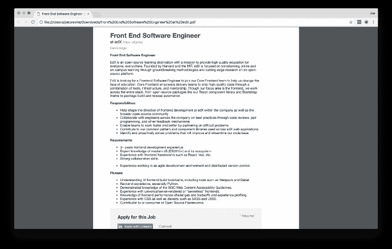
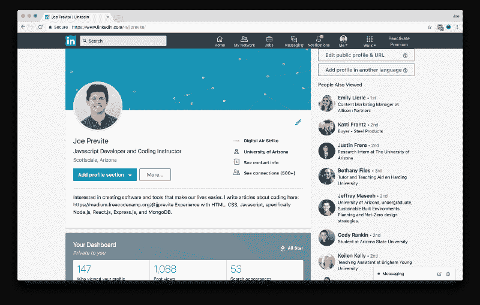
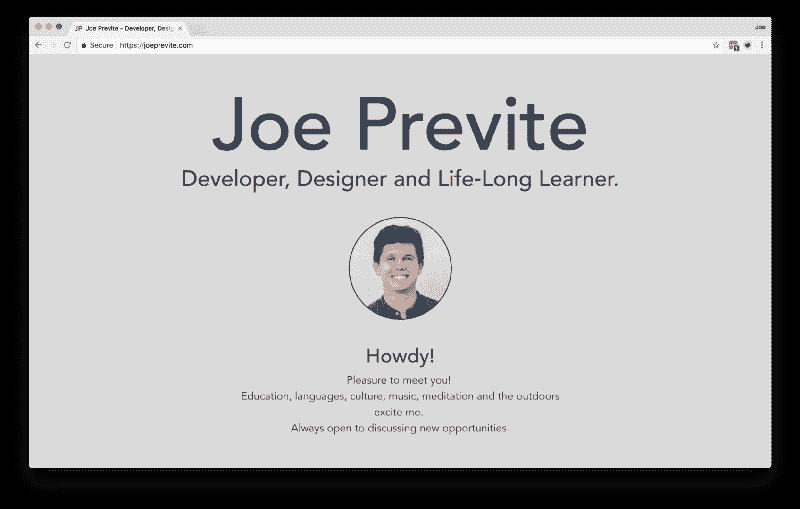
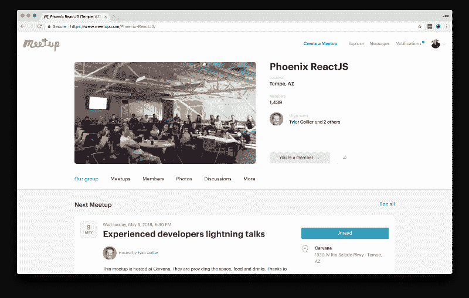

# 任务完成:我从 CNC2018 GetAJob 挑战赛中学到了什么

> 原文：<https://www.freecodecamp.org/news/mission-accomplished-what-i-learned-from-the-cnc2018-getajob-challenge-34c4406fdeed/>

### CNC2018 是什么？

CNC2018 代表 CodeNewbie 举办的 2018code newbie 挑战赛[。如果你没听说过 CodeNewbie，这是一个由 Saron Yitbarek 运营的社区和](https://2018.codenewbie.org/)[播客](https://www.codenewbie.org/podcast)。他们还在周日和周三主持[实时推特聊天](https://www.codenewbie.org/chat)。来看看 [@CodeNewbies](https://twitter.com/CodeNewbies) 。

CodeNewbie 挑战是一个四个任务的集合，可以帮助你提高你的技能。可用的任务侧重于帮助您实现与编码相关的目标。这四个选项是:

*   开始编码
*   编码更多
*   更多博客
*   找份工作

报名参加该轮后，您将收到一封包含您的第一个任务的电子邮件。每一轮持续七到九周。你每周通过电子邮件接受任务，你花多少时间就花多少时间。

我在一月份报名参加了“找份工作”的任务。在我完成挑战并接受一份开发工作之前，我完成了九个任务中的五个。

在本文中，我将分享我的背景故事，并向您介绍我在整个挑战中获得的见解。我希望你会发现它们有助于加快你的旅程。

### 从研究生辍学者到开发者

像社区中的大多数人一样，我并不总是想从事编程职业。当我上大学的时候，我决定学习我热爱的东西:外语。

在大学快结束的时候，当人们问我“你毕业后打算做什么”时，我感到很紧张我没有答案。

想到我最崇拜的人，我想我会喜欢在学术界做教授。我的目标是为改善美国的外语教育体系做出贡献。

通过我的意大利语教授，我最终获得了奖学金，在毕业后的秋季开始的研究生课程中学习意大利语。

我抓住了机会，满怀希望地朝着正确的方向前进。

尽管我热爱教授们、我的同事和这个项目，但我对学术界的未来心存疑虑。我与教授们就该领域的现状进行了坦诚的交谈，不幸的是，它看起来不像过去那样光明。

出于各种原因，我决定考虑其他职业选择。一次偶然的机会，我注意到脸书上有一则招聘编码训练营的广告。

"嗯……我想知道那会不会是我读研的另一种选择？"我心想。我调查了项目和费用。我不想申请更多的学生贷款，所以我研究了其他途径，找到了自由代码营。

几年前，我曾试图学习 web 开发的基础知识，但从未坚持下来。那个寒假快结束的时候，我决定在空闲时间学习编程，看看这是不是我认为我会喜欢的事情。

在那个学期，我很难找到时间来编码。在做两份工作、满负荷的课程和长途通勤之间，我努力挤出时间。2017 年 2 月，我决定加入 [#100DaysOfCode](http://100daysofcode.com/) ，承诺每天 30 分钟。

一个月后，我决定在那个夏天结束后离开我的研究生项目，尝试开始一个开发人员的职业生涯。

2017 年 7 月，我开始了我作为程序员的第一份带薪工作——在一家网页设计机构实习，担任前端职位。我学到了很多，我的技能比自学快十倍。我的老板说如果事情进展顺利，他会全职雇用我。

令我沮丧的是，我的实习于 2017 年 9 月结束，当时我的老板告诉我，“我认为你还没有达到初级开发人员的水平。”

我没有放弃，而是决定再找一份工作，并兼职学习。我在一个类似的领域找到了一个——数字营销。这似乎是一个很好的工具添加到我的工具箱。此外，我还找到了一份兼职工作，帮助 TA 并指导当地 meetup 的编码研讨会。

事情似乎进展顺利，但我仍然没有像我计划的那样全职编码。那是我找到 CNC2018，2018 年 1 月加入的。

以下是我从每周任务中学到的:

### 研究和学习职位描述

求职时很容易忽略职位描述的细节。在第 1 周，挑战向你展示了如何找出你在寻找什么。看看你感兴趣的公司，看看他们列出的技能、技术和他们需要的资格。请将此视为一张“松散的地图”,以帮助您保持正轨。

Example job listing I used during the challenge

web 开发的海洋在开始时会让人感到势不可挡。不要从一个资源切换到另一个资源，使用工作描述来引导你做下一件事。记住，工作描述中包含了很多想法。虽然他们不指望你知道所有的事情，但它会给你一些具体的东西来达到“工作就绪”的水平。

### 在 LinkedIn 上更改您的头衔

我认为 LinkedIn 是在科技行业找工作的关键。在第 2 周，你的任务是更新你的 LinkedIn 头衔和个人资料。

这向雇主展示了你对技术工作的专注和准备。这可能是招聘人员或招聘经理找到你的第一个地方。因此，我需要确保我的标题准确地反映了我在寻找什么。就我而言，我想找一份 JavaScript 开发人员的工作，所以我在 LinkedIn 上把我的头衔改成了这个。

不，你不需要成为专家就能把它放到 LinkedIn 上。如果你写代码并且知道如何构建东西，你就是一个开发者。这不仅向你的人际网络传达了你的新技能，也有助于招聘人员找到你。记住，他们整天都在用特定的关键词搜索 LinkedIn。如果你的头衔或简历中没有这些，他们就找不到你。

### 建立稳固的投资组合，使用 GitHub

第 2 周还要求你制作一个作品集，并将你的项目保存在 GitHub 上。这向雇主展示了你的能力。尽快建立一个投资组合，并在进行过程中添加项目。当你申请的时候，这比你的简历更重要。

雇主希望看到你能制造东西。它们不一定是巨大的项目。他们的唯一目的是证明你有能力将想法付诸实践。我听说一个好的规则是有一到两个全栈项目。

My portfolio built with Vue.js — [https://joeprevite.com/](https://joeprevite.com/)

你应该使用与你所追求的职业相关的技术来建立你的投资组合。例如，我想进入 JavaScript，所以我在 Vue.js 中建立了我的文件夹。

GitHub Pages 允许你免费托管你的网站，所以我建议新手去看看。还有，一定要把你的代码推送到 GitHub！雇主会查看你的知识库。

一个让你每天都投入的简单方法是保持一个“学习报告”,在那里你记录你学到了什么。一个朋友向我推荐了这个，作为每天进步的提醒。

### 聚会，聚会，聚会

找工作最重要的建议之一——去聚会！第三周的任务是参加一个聚会，练习你的“电梯推销”

CodeNewbie 鼓励这样做，因为它在以下几个方面让你受益:

*   你的人际关系网，这可能会带来一次工作面试
*   你可以练习分享你的故事
*   你参与当地社区

Phoenix ReactJS Meetup Page

几乎在我去过的每个科技聚会上，都会有人提到他们的公司正在招聘，或者他们知道有公司在招聘。我在凤凰城参加的最近一次 ReactJS 会议上，至少有 10 位演讲者在会议开始时走上讲台宣布职位空缺。

我在一个聚会上遇到了一个人，他最后给我介绍了我现在的工作。去找他们是值得的。

即使你第一次去的时候没有找到工作，你可能会遇到一个人，他最终会在你找工作的过程中发挥作用。

### 和人喝咖啡

我想提供的最后一个建议是和人喝咖啡。在第 5 周，你的目标是做“信息面试”，并找出公司在初级开发人员中寻找什么。

利用你拥有的网络！如果你在科技行业没有人脉，那就去找一个有人脉的朋友或熟人。记住，人们喜欢帮助别人。这就是我们社会进步的方式。

Photo by [rawpixel.com](https://unsplash.com/photos/dWyNHQbk45k?utm_source=unsplash&utm_medium=referral&utm_content=creditCopyText) on [Unsplash](https://unsplash.com/search/photos/coffee-meeting?utm_source=unsplash&utm_medium=referral&utm_content=creditCopyText)

邀请人们去喝咖啡，更多地了解他们所做的事情，以及他们为什么做这些事情。当我第一次找工作时，我的大学校友网络帮我联系了两位开发人员——一位在 Snapchat，一位在谷歌。

一个说“不要为了钱而选择工作”，另一个说，“为开源做贡献。”我强烈建议与目前从事该行业的人交谈，看看你能从他们身上学到什么。

### 任务已完成

通过遵循所有这些提示并完成 CNC2018 中的所有任务，我能够在完成整轮比赛之前找到一份工作。

接近二月底的时候，我向当地一家公司递交了申请，希望得到一个前端工程师的职位。我是在一次聚会上通过一个人发现这个角色的。他为公司工作，告诉我他们在招人。

我问他我们是否可以保持联系，他是否可以推荐我做这份工作。我们在 LinkedIn 上联系，当我提交申请时，他也给了我首席技术官的电子邮件。

不到一周之后，他们邀请我去面试。在与 CTO 简短交谈后，他让我会见团队的五名成员。这是一次非正式的面试。他们问了我各种关于 web 开发的问题，然后让我详细阐述我的作品集里的项目。我带着美好的感觉离开了面试。

同一周，首席技术官打电话给我，向我提供了这份工作。

SUCCESS!

我简直不敢相信。我最初的目标是在 2018 年 10 月之前找到一份开发者的工作。感谢 freeCodeCamp 社区和 CNC2018，我提前 7 个月完成了它。

三个月后，我在同一个地方工作，热爱我的工作。

### 参加第二轮挑战，给自己找份工作！

如果这些建议对你有益，我强烈建议你报名参加第二轮挑战！它将帮助你为找一份开发人员的工作做好准备，并为你提供快速到达那里的具体任务。

最后，如果你喜欢这篇文章，请为它鼓掌，发微博或与正在找工作的人分享。如果你有任何问题或者想打个招呼，请在 Twitter 上发个 DM 给我 [@jjprevite](https://twitter.com/jjprevite) ！

我喜欢认识新的人，并愿意尽我所能支持你的旅程。