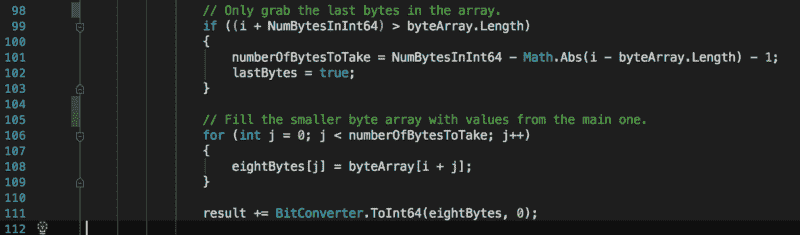

# 我作为初级开发人员所犯的错误——以及如何避免它们。

> 原文：<https://www.freecodecamp.org/news/mistakes-i-have-made-as-a-junior-developer-85260bdb992f/>

杰克·芬利

# 我作为初级开发人员所犯的错误——以及如何避免它们。

#### 对我作为软件开发员的头两年的反思。

“Two books on a desk near a MacBook with lines of code on its screen” by [Émile Perron](https://unsplash.com/@emilep?utm_source=medium&utm_medium=referral) on [Unsplash](https://unsplash.com?utm_source=medium&utm_medium=referral)

当您第一次涉足软件开发领域时，事情可能看起来令人畏惧且未知。离开大学，冒险进入现实世界是一大步，在找到立足点和信心之前，你会在路上跌跌撞撞很多次。

你可能已经对自己的能力有信心了。但是我问你，“你犯了多少错误？”

软件开发职业生涯的开始是掌握自己技能的旅程的开始。和任何领域一样，会有正确的挑战和机会，也有完全错误的机会。这篇文章反映了我在职业生涯早期所犯的错误，也是避免这些错误的指南。

### 得到这份工作

大学毕业后找到第一份工作并不容易。确保它是适合你的。

一家公司必须非常适合你，以及你希望你的职业发展方向。

#### 找出你的价值

Photo by [rawpixel](https://unsplash.com/@rawpixel?utm_source=medium&utm_medium=referral) on [Unsplash](https://unsplash.com?utm_source=medium&utm_medium=referral)

这个错误我犯了两次。当我在大学第二年得到我的第一份软件开发工作时，我正在经济上挣扎。这让我接受了第一份薪水。我觉得我需要接受这份工作，因为与我从学生福利中获得的微薄收入相比，这已经很不错了。我一点也不知道，就地点、位置和时间而言，它远低于市场价格。

我前面说过，这个错误我犯了两次。毕业后，我设法在别处找到了一份工作。他们要付给我比我当时多 25%的工资！

它仍然处于市场价格的低端。我很低调，我很乐意接受。我当时还不知道并非所有的权力都掌握在雇主手中。

你也可以出价。如果我花时间做一些适当的研究，我会看到我真正的价值。我推荐像 [PayScale](https://www.payscale.com/) 这样的网站给你一个提示。你甚至可以使用这样的网站作为谈判的来源。

#### 阅读评论

Glassdoor 是一个很好的资源。上市公司的真正员工已经努力为他们工作的公司打分。一般来说，对于员工的经历是好是坏，这些评论可能会有很大的分歧。

每种都找出一些，你会为自己找到中间立场。如果我早点阅读这些评论，我会在面试时避免一些可怕的经历。

#### 知道你将真正与什么一起工作

在我职业生涯的早期，我非常渴望为一家特定的公司工作(我的一个朋友在那里工作，并且很享受)，以至于我忘记停下来问我实际上在做什么。原来我和朋友不会在同一个部门，会在楼的另一边，后来甚至会在不同的楼层。我没有花时间去确定这份工作是否真的适合我。

这个错误的另一面是没有充分询问我将要使用的环境、工具和语言。

当我开始职业生涯的下一步时，我一定要问以下问题:

1.  版本控制策略和工具
    是行业标准吗？[饭桶](https://git-scm.com/)、 [TFS](https://docs.microsoft.com/en-us/visualstudio/releasenotes/tfs2018-update2) 、 [SVN](https://subversion.apache.org/) 还是[水银](https://www.mercurial-scm.org/)？如果你听说过，应该没问题。
2.  是否有 [CI/CD](https://en.wikipedia.org/wiki/CI/CD) 工具和环境？
    部署应该尽可能自动化。这会让你的生活轻松很多。
3.  部署的频率如何？
4.  我将在什么框架/语言中工作？
5.  你使用什么工具？哪个 IDE？
    [Visual Studio](https://visualstudio.microsoft.com/) ， [Rider](https://medium.com/@JackWFinlay/jetbrains-rider-first-impressions-159856cbdf04) 或者 [IntelliJ](https://www.jetbrains.com/idea/) 都是一些不错的选择。
6.  我将从事什么样的项目？
7.  该公司下一步打算使用什么样的技术？此外，这些变化处于什么样的水平？
    它们离成为公司日常使用还有多远？

### 在工作中

一旦你开始工作，挑战就不会停止。每天都会有新的方式挑战你。

#### 代码永远不会自我记录

Image of a code editor showing lines of code with comments. Credit: Jack Finlay

“我的代码是自文档化的，我不需要注释”。？刚开始专业编程的时候也是这么想的。我再也不会犯这种错误了。

注释是任何语言最强大的功能。它们可以传达你当时的想法。你需要在评论中抓住这一点。

我读过无数段代码，其中一个简单的注释会使复杂的代码和算法更容易理解和更新。

注释掉的代码比没有注释更糟糕。当你深入调查模式，试图发现一些东西是如何工作的，所有注释掉的代码只会让你的工作更加困难。一旦你注释掉一行，下一个阅读它的人将不知道你为什么这样做。

注意你的评论。好的评论不仅会减轻认知负荷，还会帮助你发现错误。

如果有些东西看起来不符合评论，它可能是错误的。或者它会给你一个很好的机会来实践下面的部分。

#### 早点问问题

不要等到你掉进了错误的兔子洞才寻求帮助。

等待寻求帮助可能只会让你得出错误的结论，或者更糟的是，你会打破一些东西。尽早提问，即使只是快速的谷歌搜索。当你真的需要提问的时候，由于害怕显得像个白痴，你没有提问的部分原因是你最终做错了事情。

问问题是你能做的最重要的事情之一，可以加速你的学习，并帮助你马上参与到项目中。如果需要提问的时候不提问，可能会做出一些错误的假设。

#### 什么都不假设

当你在一个项目中工作时，假设是定义你需要建立什么的重要部分。经常会有一些假设记录在你将要处理的票据上(如果你的公司使用一个票据或任务系统)。

在设计解决方案时，并不是每种情况都要考虑。一组正确的假设将有助于引导您找到正确的解决方案。

我花了几个小时错误地构建东西，甚至构建错误的东西，因为我做了不正确的假设。通常，当任务从业务分析师那里来的时候，它们会变得很充实，但是经常会有间隙。

不要做任何假设，除非他们已经为你陈述过，或者你已经问过了。

#### 在家工作

Photo by [Dillon Shook](https://unsplash.com/@dillonjshook?utm_source=medium&utm_medium=referral) on [Unsplash](https://unsplash.com?utm_source=medium&utm_medium=referral)

不要害怕偶尔要求在家工作。有时候，这是远离办公室压力和干扰，真正集中注意力的好方法。有些公司是建立在远程工作人员的基础上的。它当然有效。

也会有一些公司全力反对。我在新西兰的办公室和澳大利亚的一个团队一起工作了一年多。协作和合作仍然发生在网上。通过电子邮件、聊天和老式的电话，距离不会阻止你和同事一起工作。无论我是在办公室还是在家，都没有什么实际的区别，但无论如何，我都被迫呆在办公室。

寻找机会在家或任何可能的不同地方工作一天。

#### 实际编程时间

不幸的是，你不会一周 100%的时间都在编程。尽管这可能会让你痛苦，但也不全是坏事。反正编程也不是 100%代码。

你的大部分时间将花在会议上，通常会减少你花在编程上的时间。这是通过确保你编写最少的代码来设计最好的解决方案来实现的。

### 工作之外

有些人说这真的不重要，但其他人说你在工作之外做什么和你在工作中做什么一样重要。

#### 用自己的时间编程

一旦我意识到专有工具和语言是多么可怕的现实，我就开始学习我知道可以转移到另一家公司的技能。

如果你发现自己陷入了相同类型的环境中，了解一些关于更主流技术的事情将有助于你找到出路。这是一个两极分化的观点，但我相信，你花在职业发展上的时间对你将获得的机会有很大的影响。

#### 阅读

Photo by [Jonas Jacobsson](https://unsplash.com/@jonasjacobsson?utm_source=medium&utm_medium=referral) on [Unsplash](https://unsplash.com?utm_source=medium&utm_medium=referral)

现在我已经读了几本书，我希望我能早一点拿起更多的书。从书本上学到的东西数不胜数。在你休息的时候，在办公室，或者在去办公室的路上，拿几本看看。我认识的大多数人都有某种通勤方式，这是打发时间的好方法。

#### 写

Photo by [rawpixel](https://unsplash.com/@rawpixel?utm_source=medium&utm_medium=referral) on [Unsplash](https://unsplash.com?utm_source=medium&utm_medium=referral)

写作是推进你职业生涯的一个好方法。这就是我在这里尝试的。这不仅仅是一条建议，也是一种反思。一个好的博客也可以在你面临以前可能遇到的特殊问题时帮到你。如果你记录下挑战你的事情，它可能会帮助你。

一开始可能看起来很奇怪，但是把事情写下来是一种减压和缓解压力的好方法。我公开(大部分)我的作品，但你不必这样。我一半的帖子还在草稿文件夹里。

#### 锻炼

Photo by [Ayo Ogunseinde](https://unsplash.com/@armedshutter?utm_source=medium&utm_medium=referral) on [Unsplash](https://unsplash.com?utm_source=medium&utm_medium=referral)

在我职业生涯的头两年，我没有经常锻炼，这当然会影响到我。作为一名程序员，你一天的大部分时间都是坐着度过的，通常是不活动的，盯着屏幕。当然，你不会一整天都在编程，但是在开会和坐在办公桌前的时间里，你不会移动太多。尽你所能多锻炼。

#### 休息一段时间

工作时时刻刻都有空固然重要，但时不时抽出一些时间也很重要。如果你没有为一个大的假期存钱，有时让长周末变得特别长，或者到处休几天假也不错。许多国家提供不同数量的有保证的假期。确保尽可能利用这一点。

我犯了一个错误，尽可能多地节省假期，并在此过程中筋疲力尽。从经济上来说，这是一个好的决定，但对我的身心健康来说却不是。

### 感谢阅读！

我希望这份对我作为全职工作的头两年编程经历的反思，能为你的职业生涯提供一些启示。这对我来说是一个有趣的反思，我希望你能从中吸取一些东西。如果你有任何问题，请告诉我。