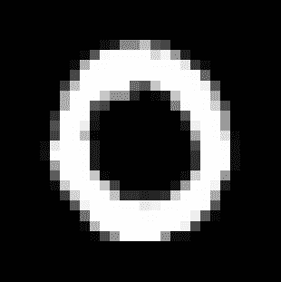
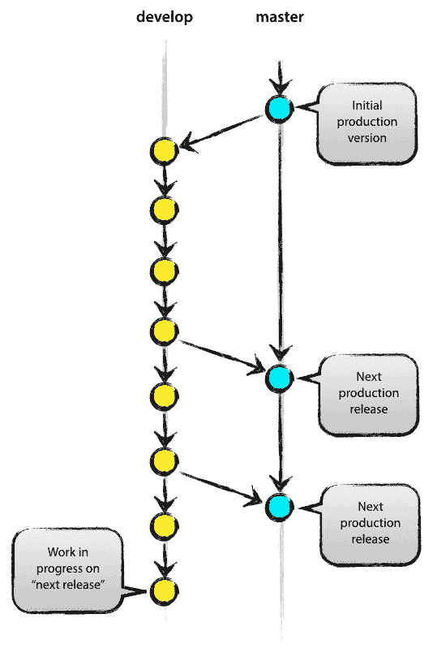
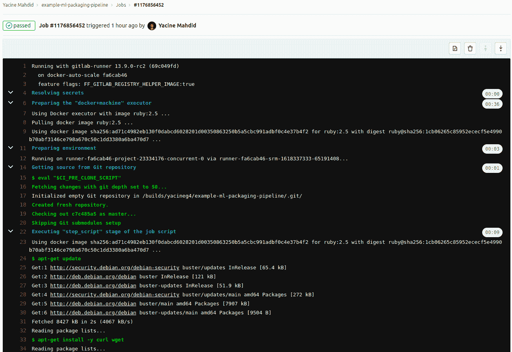

# 如何使用 Gitlab 包注册表自动发布机器学习模型

> 原文：<https://www.freecodecamp.org/news/ml-model-publishing-with-gitlab-package-registry/>

在本教程中，我们将学习如何在 Gitlab 包注册表中自动发布机器学习模型，并使它们可供您的队友使用。您还可以使用这种技术将代码的打包版本作为二进制文件共享。

如果你是 Gitlab 的初学者，并且不熟悉 CI/CD 技术，那么这篇教程就是为你准备的！对机器学习和深度学习的基本理解是有利的，但它不是理解 CI/CD 发布部分的要求。

### 以下是我们将要介绍的内容:

*   Gitlab 代码设置
*   深度卷积神经网络码
*   图像识别代码
*   分支方法论
*   CI/CD 上传
*   结论

## 首先，一些背景

在你的机器学习工程师职业生涯中的某个时候，你可能需要与其他开发人员分享你训练的模型。有多种方法可以做到这一点。

### 授予对存储库的访问权限

如果你不介意展示你的全部代码，这是一个非常可行的选择。

如果你使用一个好的分支方法，你的同事只需要查看主分支，就可以找出他们可以使用的最新模型。然后他们可以查看 README.md 以了解如何使用它。

然而，授予对存储库的完全访问权对您来说可能不是一个可行的选择。

### 手动共享最新型号

另一种方法是提取您想要公开的相关代码，并手动发送给他们。

如果您与不止一个人一起工作，这可能会变得有点混乱，因为您发送的模型可能不是最新的。这也让你有责任确保人们总是使用你的模型的最新版本。

### 自动共享最新型号

一个更简单的解决方案，即使在存储库代码可用的情况下，也是将打包负担放在 CI/CD 管道上。

这是本教程的主题，我们的设置如下所示:

*   代码库、CI/CD 工具集和包注册表都在 Gitlab 上
*   我们要打包的代码将是一个在 MNIST 数据集上简单训练的 PyTorch 神经网络，用于数字识别。
*   所有的说明和要求都在这个包里。

🚨**免责声明**🚨:您不应该这样部署 PyTorch 生产就绪模型！要了解如何做到这一点，请查看[火炬报](https://pytorch.org/tutorials/advanced/cpp_export.html)上的本教程。

让我们开始吧。

## Gitlab 代码设置

对于本教程，我们将捆绑四个文件:

*   **model.pth** :这是经过训练的模型的最新版本的腌制版本。
*   **run_mnist.py** :运行模型从 png 图像中检测手指的简单 Python 脚本。
*   **requirements.txt** :包含运行模型所需的所有依赖关系的文本文件。
*   **INSTRUCTION.md** :使用软件包的逐步说明。

任何有权访问软件包注册中心的人都可以免费使用该软件包，并且会自动更新。


The package will then look like this on Gitlab Package Registry!

让我们跳到神经网络代码，它是这篇关于数字识别的[综合文章](https://nextjournal.com/gkoehler/pytorch-mnist)的修改版。修改后的代码可以在[我的公共 Gitlab 库](https://gitlab.com/yacineg4/example-ml-packaging-pipeline)找到。

## 深度卷积神经网络码

在下一节中，您将看到大量关于深度神经网络的术语。这不是关于神经网络的教程，所以如果你对细节感到有点不知所措，你可以直接跳到**分支方法**部分。

请记住，我们已经训练了某种图像识别程序，给定一个代表数字的`.png`文件，它将能够告诉你它包含什么数字。

然而，对于那些想更好地了解深层神经网络如何工作的人来说，你可以看看我的教程[，在那里我从头构建了一个](https://youtu.be/b_w4eEiogaE)，或者直接在我的 Github 中检查[代码。](https://github.com/yacineMahdid/artificial-intelligence-and-machine-learning)

### 神经网络定义

网络定义代码非常简单，因为我们将使用的网络非常简单。它具有以下特点:

*   2 卷积层。
*   [Dropout](https://machinelearningmastery.com/dropout-for-regularizing-deep-neural-networks/) 应用于第二卷积层。
*   [Relu](https://machinelearningmastery.com/rectified-linear-activation-function-for-deep-learning-neural-networks/) 应用于所有神经元的激活函数。
*   2 个完全连接的层在最后用于推断。

```
import torch
import torchvision

import torch.nn as nn
import torch.nn.functional as F
import torch.optim as optim

# Define the network
# It's a 2 convolutional layer with dropout at the 2nd and finally 2 fully connected layer
# All layers use relu
class Net(nn.Module):
    def __init__(self):
        super(Net, self).__init__()
        self.conv1 = nn.Conv2d(1, 10, kernel_size=5)
        self.conv2 = nn.Conv2d(10, 20, kernel_size=5)
        self.conv2_drop = nn.Dropout2d()
        self.fc1 = nn.Linear(320, 50)
        self.fc2 = nn.Linear(50, 10)

    def forward(self, x):
        x = F.relu(F.max_pool2d(self.conv1(x), 2))
        x = F.relu(F.max_pool2d(self.conv2_drop(self.conv2(x)), 2))
        x = x.view(-1, 320)
        x = F.relu(self.fc1(x))
        x = F.dropout(x, training=self.training)
        x = self.fc2(x)
        return F.log_softmax(x, dim=1)
```

network definition for our CNN

### 培训功能

然后，我们创建了一个效用训练函数，以便使用梯度下降迭代地改进我们定义的网络。如果你想了解更多关于梯度下降的工作原理，请查看我的简短教程。

这种训练方案将做到以下几点:

*   迭代表示 28 乘 28 位数的一批训练数据。
*   使用[负对数似然成本函数](https://medium.com/deeplearningmadeeasy/negative-log-likelihood-6bd79b55d8b6)计算损失。
*   计算渐变。
*   使用梯度下降优化网络的权重。
*   以固定的时间间隔保存模型。

```
def train(network, optimizer, train_loader, epoch_id, log_interval=10):
  """Run the training regiment on the training set using train_loader

    Args:
        network: The instantiated network.
        optimizer: The optimizer used to change the weights.
        train_loader: the loader for the training set already setup
        epoch_id: the current id of the epoch used for cosmetic reason.
        log_interval: interval at which we print an output

    Returns:
        nothing, will save directly at root level the model and the optimizer state

  """

  # Set the network in training mode
  network.train()

  # Iterate over the full training set
  for batch_idx, (data, target) in enumerate(train_loader):

    # Calculate the gradients for this batch of data
    optimizer.zero_grad()
    output = network(data)
    loss = F.nll_loss(output, target)
    loss.backward()

    # Optimize the network
    optimizer.step()

    # Log and save every selected interval
    if batch_idx % log_interval == 0:

      print('Train Epoch: {} [{}/{} ({:.0f}%)]\tLoss: {:.6f}'.format(
        epoch_id, batch_idx * len(data), len(train_loader.dataset),
        100\. * batch_idx / len(train_loader), loss.item()))

      # This will save the state as a pickled object
      torch.save(network.state_dict(), './model.pth')
      torch.save(optimizer.state_dict(), './optimizer.pth')
```

training function for the model

训练的数据可以在这边[颜乐存网站](http://yann.lecun.com/exdb/mnist/)找到。这里我们使用 28 乘 28 PyTorch 张量格式的数据集进行训练。

### 测试功能

我们创建的下一个函数是一个测试函数，用于验证我们的网络是否在没有重用相同训练数据的情况下学到了一些东西。这个函数很简单，因为它只记录正确和不正确的预测。

```
def test(network, test_loader):
  """Run the testing regiment on the test set using test_loader

    Args:
        network: The instantiated and trained network.
        test_loader: the loader for the testing set already setup

    Returns:
        nothing, will only print result

  """

  # Variable instantiation
  test_loss = 0
  correct = 0

  # Move the network to evaluate mode instead of training
  network.eval()

  # setup torch so to not track any  gradient
  with torch.no_grad():

    # Iterate on all the test data and accumulate the loss
    for data, target in test_loader:
      output = network(data)
      test_loss += F.nll_loss(output, target, size_average=False).item()
      pred = output.data.max(1, keepdim=True)[1]
      correct += pred.eq(target.data.view_as(pred)).sum()

  # Average loss calculation and printing   
  test_loss /= len(test_loader.dataset)
  print('\nTest set: Avg. loss: {:.4f}, Accuracy: {}/{} ({:.0f}%)\n'.format(
    test_loss, correct, len(test_loader.dataset),
    100\. * correct / len(test_loader.dataset)))
```

Testing function used in the training/validation loop

这个函数将有助于检查我们的网络在每次训练迭代后的学习情况。

### 训练制度

最后，我们可以将上述所有内容与培训脚本的主体结合起来！一些事情正在发生，但最重要的几点如下:

*   我们静态地设置我们的超参数。定义它们的一个更好的方法是使用一个验证集来根据数据找出它们。
*   我们创建了数据加载器，它将接收数据，并以适合网络的形状输出张量。这些加载器将通过使用 MNIST 数据集的全局平均值和标准差对数据进行归一化来转换数据。
*   我们使用[带有动量](https://youtu.be/7EuiXb6hFAM)的随机梯度下降作为优化方法，这是我们可以使用的多种梯度下降方法之一。
*   我们循环通过完整的训练数据集的“纪元”，即在保留的测试数据集上进行测试时训练网络的时间量。

```
# Experimental Parameters that we can tweak
n_epochs = 3
batch_size_train = 64
batch_size_test = 1000
learning_rate = 0.01
momentum = 0.5

# Variable from the dataset that should stay as is
global_mean_mnist = 0.1307
global_std_mnist = 0.3081

# Random Seed for Reproducible Experimentation
random_seed = 42
torch.backends.cudnn.enabled = False
torch.manual_seed(random_seed)

# Data Loader to gather the data and then normalize them
train_loader = torch.utils.data.DataLoader(
  torchvision.datasets.MNIST('./data/', train=True, download=True,
                             transform=torchvision.transforms.Compose([
                               torchvision.transforms.ToTensor(),
                               torchvision.transforms.Normalize(
                                 (global_mean_mnist,), (global_std_mnist,))
                             ])),
  batch_size=batch_size_train, shuffle=True)

test_loader = torch.utils.data.DataLoader(
  torchvision.datasets.MNIST('./data/', train=False, download=True,
                             transform=torchvision.transforms.Compose([
                               torchvision.transforms.ToTensor(),
                               torchvision.transforms.Normalize(
                                 (global_mean_mnist,), (global_std_mnist,))
                             ])),
  batch_size=batch_size_test, shuffle=True)

# Initialize network and optimizer
network = Net()
optimizer = optim.SGD(network.parameters(), lr=learning_rate,
                      momentum=momentum)

# Test first to show that the model didn't learn a thing
test(network, test_loader)

# Train on the whole dataset multiple time and test
for epoch_id in range(1, n_epochs + 1):
  train(network, optimizer, train_loader, epoch_id)
  test(network, test_loader)
```

Main body of the code for the training

请注意，在保留的集合上测试您的网络以避免在训练数据上过度拟合是非常重要的。

上述所有脚本都可以在存储库的文件 [train_mnist.py 中找到。](https://gitlab.com/yacineg4/example-ml-packaging-pipeline/-/blob/master/train_mnist.py)

此时，我们可以训练一个模型，并以 pickle 格式定期保存它。

我们现在可以使用保存的训练模式来评估一个`.png`文件中的数字。

## 图像识别代码

假设我们有以下图像作为输入:



a small 0 digit

或者这个:


a bigger 7 digit

我们如何让工作在 28×28 py torch 张量上的网络评估这些数字呢？

如果我们遵循训练数据集所经历的大致相同的过程，这相当简单，即:

*   有灰度图像(没有颜色或 alpha 通道)
*   将图像大小调整为 28 x 28 像素
*   使用 MNIST 数据集的平均值和标准差对影像进行归一化。

```
if __name__ == "__main__":

    # Variable iniatilization
    global_mean_mnist = 0.1307
    global_std_mnist = 0.3081

    # Loading of the network with right weight
    result_path = './model.pth'
    model = Net()
    model.load_state_dict(torch.load(result_path))
    model.eval()

    # Setup the transform from image to normalized tensors
    transform = transforms.Compose([
                        transforms.Resize((28,28)),
                        transforms.ToTensor(),
                        transforms.Normalize(
                            (global_mean_mnist,), (global_std_mnist,))
                        ])

    # Parse the input from the user which should be a filename with the --image flag
    parser = OptionParser()
    parser.add_option("--image", dest = "input_image_path",
                      help = "Input Image Path")
    (options, args) = parser.parse_args()

    # Get the path to the image to decode
    input_image_path = str(options.input_image_path)

    # Open the image(s) and do the inference
    images=glob.glob(input_image_path)
    for image in images:

        # Convert the image to grayscale
        img = Image.open(image).convert('L')

        # Transform the image to a normalized tensor
        img_tensor = transform(img).unsqueeze(0)

        # Make and print the prediction
        output = model(img_tensor).data.max(1, keepdim=True)[1][0][0]
        print(f"Image is a {int(output)}")
```

evaluation code

如您所见，在应用转换之前，我们使用解析器在命令行上接受图像路径。一旦它们被应用，我们就可以把它输入到我们加载的模型中，并收集输出预测。

⚠️不要忘记在脚本中包含网络的定义(通过导入或复制粘贴)，否则 pickled 模型将无法正确加载。

我们现在可以像这样运行代码:

```
python run_mnist.py --image NAME_OF_IMAGE.png
```

这将简单地打印出模型对特定图像所包含内容的推断。

现在我们已经建立了基本的训练和评估代码，让我们讨论一下如何使用 git 分支来将这个模型发布到包注册中心。

## 分支方法论

如果你是一个人在做一个项目，简单地提交给 master/main 并完成它是非常诱人的。然而，这种工作方式很难维护，这使得整合适当的 CI/CD 工具成为一种痛苦。

如下所示的主/开发分支策略更易于维护:



Image from: https://nvie.com/posts/a-successful-git-branching-model/

通过始终保持主分支干净，我们可以很容易地标记 CI/CD 管道，以便在我们推进到主分支时立即触发。当我们改进我们的模型时，我们也将在开发分支中自由地提交我们所需要的。

当我们准备好进行新的部署时，我们只需要与主分支合并(或者更好的做法是进行合并请求/拉请求，然后合并)。

合并到 main 应该会触发 Gitlab 将我们模型的新版本上传到包注册中心。

让我们看看使用`.gitlab-ci.yml`文件自动发布到包注册表的简单方法。

## CI/CD 管道

`.gitlab-ci.yml`文件是存储库中的一个特殊文件，Gitlab 使用它来定义当您推送到存储库时 Gitlab 服务器应该做什么。

要了解 Gitlab 中 CI/CD 如何工作的更多信息，请前往这个 [Gitlab CI/CD 速成班](https://medium.com/faun/gitlab-ci-cd-crash-course-6e7bcf696940)。

在本教程中，我们的`.gitlab-ci.yml`文件如下所示:

```
image: pytorch/pytorch

variables:
  VERSION: "0.0.4" # To Change if needs be

stages:
  - upload

upload:
  stage: upload
  only:
    - master
  script:
    - apt-get update
    - apt-get install -y curl wget
    - 'curl --header "JOB-TOKEN: $CI_JOB_TOKEN" --upload-file ./model.pth "${CI_API_V4_URL}/projects/${CI_PROJECT_ID}/packages/generic/example-ml-packaging-pipeline/${VERSION}/model.pth"'
    - 'curl --header "JOB-TOKEN: $CI_JOB_TOKEN" --upload-file ./run_mnist.py "${CI_API_V4_URL}/projects/${CI_PROJECT_ID}/packages/generic/example-ml-packaging-pipeline/${VERSION}/run_mnist.py"'
    - 'curl --header "JOB-TOKEN: $CI_JOB_TOKEN" --upload-file ./requirements.txt "${CI_API_V4_URL}/projects/${CI_PROJECT_ID}/packages/generic/example-ml-packaging-pipeline/${VERSION}/requirements.txt"'
    - 'curl --header "JOB-TOKEN: $CI_JOB_TOKEN" --upload-file ./INSTRUCTION.md "${CI_API_V4_URL}/projects/${CI_PROJECT_ID}/packages/generic/example-ml-packaging-pipeline/${VERSION}/INSTRUCTION.md"' 
```

.gitlab-ci.yml

这个`.yml`文件的结构非常简单。我们的管道中只有一个阶段，即`upload`阶段。

在上传阶段，我们将只在`master`分支更新时运行`script`部分。我们运行的脚本只是使用`curl`将数据从这个存储库(4 个文件)转移到包注册中心。

让我们来看看我们正在使用的`curl`命令的结构:

```
 - 'curl --header "JOB-TOKEN: $CI_JOB_TOKEN" --upload-file ./NAME_OF_FILE "${CI_API_V4_URL}/projects/${CI_PROJECT_ID}/packages/generic/example-ml-packaging-pipeline/${VERSION}/NAME_OF_FILE"'
```

curl command

*   `--header`用于告诉 curl 您将在请求中包含一个[额外的报头。](https://curl.se/docs/manpage.html#-H)
*   `JOB-TOKEN`是我们的头，`$CI_JOB_TOKEN`是它的值。当一个任务被创建时，它是 Gitlab 服务器中的一个变量
*   `--upload-file`是一个标志，告诉我们将把一个[本地文件传输到远程 URL](https://curl.se/docs/manpage.html#-T) 。
*   `./NAME_OF_FILE`是我们要传输的本地文件的名称。
*   `${CI_API_V4_URL}/projects/${CI_PROJECT_ID}/packages/generic/example-ml-packaging-pipeline/${VERSION}/NAME_OF_FILE`是我们要传输文件的远程 URL 的位置。

这里`$CI_API_V4_URL`是我们正在使用的 Gitlab API 的 URL，`$CI_PROJECT_ID`在 Gitlab CI 中被定义为我们项目的 id，最后`VERSION`是我们在`.yml`文件顶部定义的版本号。

就是这样！当您将主分支更新到 Gitlab 上的远程存储库时，它将启动一个管道来运行您的打包作业。



The job will then be available and you will be able to check the trace on Gitlab!

您和您的队友将能够在包注册表部分看到文档，并在包中获得正确的版本化文件:


This is our v.0.0.5 of the example package!

要更全面地了解软件包 API 的功能，请阅读官方文档。

## 结论

在本教程中，您学习了如何使用 Gitlab CI/CD 打包、上传和自动化机器学习模型。

恭喜你！🎉🎉🎉

使用 Gitlab CI/CD 还可以做很多事情，例如:

*   在捆绑之前添加一个测试阶段，以确保代码中没有回归。
*   在绑定之后添加一个测试阶段，以确保您的模型在推理延迟方面的性能令人满意。
*   使用 TorchScript 的模型的更优化版本。
*   在上传步骤后添加新版本的自动社交通知。

要了解更多关于 Gitlab CI/CD 的信息，官方文档是一个很好的起点，而且[入门部分对初学者非常友好](https://docs.gitlab.com/ee/ci/quick_start/)。

如果你想阅读更多这类内容，可以看看我的[机械/软件工程文章](https://grad4.com/en/category/blog/grad4-engineering-blog/)。如果你想讨论这些，请随时在 [LinkedIn](https://www.linkedin.com/in/yacine-mahdid-809425163/) 或 [Twitter](https://twitter.com/CodeThisCodeTh1) :)上给我发 DM