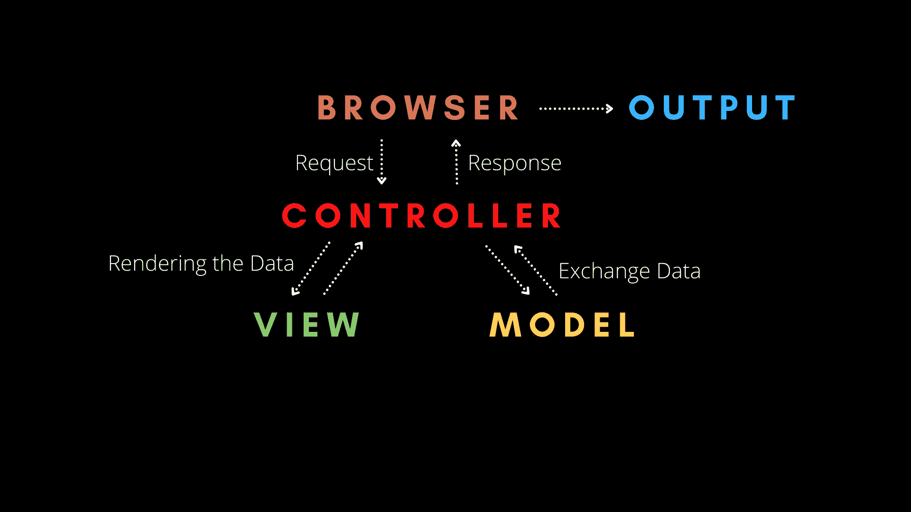
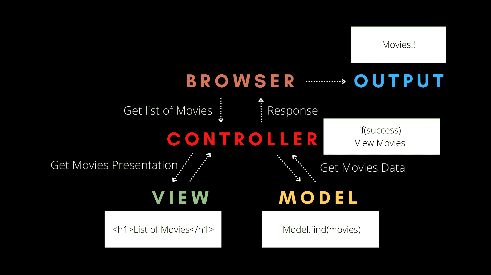

# 模型视图控制器架构如何工作——MVC 解释

> 原文：<https://www.freecodecamp.org/news/model-view-architecture/>

在过去的 20 年里，网站已经从简单的带有少量 CSS 的页面变成了更加复杂和强大的应用程序。

为了使这些应用程序更容易开发，程序员使用不同的模式和软件架构来简化代码。

## 但是首先，什么是软件架构？

架构是描述软件的系统化方式。它还指它与其他软件的关系，以及它们之间的交互方式。

软件架构还包括其他因素，如商业策略、质量属性、人类动态、设计和 IT 环境。

换句话说，架构是系统的**蓝图。**

## 模型-视图-控制器(MVC)架构

到目前为止，最流行的软件架构是模型-视图-控制器，或 MVC。

MVC 将任何大型应用程序分为三个部分:

1.  模型
2.  景色
3.  控制器

这些组件中的每一个都是为处理应用程序的特定方面而构建的，并且具有不同的用途。

### 模型

该模型包含用户使用的所有数据相关逻辑，如项目的模式和接口、数据库及其字段。

例如，客户对象将从数据库中检索客户信息，操作或更新他们在数据库中的记录，或者使用它来呈现数据。

### 景色

视图包含应用程序的 UI 和表示。

例如，customer 视图将包括所有的 UI 组件，比如文本框、下拉框和用户与之交互的其他东西。

### 控制器

最后，控制器包含所有与业务相关的逻辑，并处理传入的请求。它是模型和视图之间的接口。

例如，客户控制器将处理来自客户视图的所有交互和输入，并使用客户模型更新数据库。同一控制器将用于查看客户数据。

下面的图表有助于可视化 MVC 架构，以及所有组件如何协同工作:



Flow diagram of the Model View Controller

## MVC 架构如何工作

首先，浏览器向控制器发送一个请求。然后，控制器与模型交互以发送和接收数据。

控制器然后与视图交互以呈现数据。视图只关心如何呈现信息，而不关心最终的呈现。它将是一个动态 HTML 文件，根据控制器发送的内容呈现数据。

最后，视图将把它的最终表示发送给控制器，控制器将把最终数据发送给用户输出。

重要的是视图和模型永远不会相互影响。它们之间唯一的交互是通过控制器进行的。

这意味着应用程序的逻辑和界面永远不会相互交互，这使得编写复杂的应用程序更加容易。

让我们看一个简单的例子:



让我们看看这是怎么回事。首先，用户通过 web 浏览器或移动应用程序输入他们想要的电影列表。

然后，浏览器将请求发送到控制器，以获取电影列表。

接下来，控制器将要求模型从数据库中找到电影列表。

```
router.get('/',ensureAuth, async (req,res)=>{ 
	try{ 
		const movies = await Movies.find() (*) 
		res.render('movies/index',{ movies }) 
    } 

	catch(err){ console.error(err) 
		res.render('error/500') } }) 
```

The Controller sending request to ask for Movie List(Line number *)‌

然后，该模型搜索数据库，并将电影列表返回给控制器。

```
const mongoose = require('mongoose') 
const MovieSchema = new mongoose.Schema
({ 
	name:{ 
        type:String, 
        required:true 
    }, 
	description:{ 
    	type:String 
    } 
}) 

module.exports = mongoose.model('Movies',MovieSchema)
```

Movies Model Schema.

如果控制器从模型中获得电影列表，控制器将要求视图显示电影列表。

```
router.get('/',ensureAuth, async (req,res)=>{ 
	try{ const movies = await Movies.find() 
		res.render('movies/index', { movies (*) }) } 

	catch(err){ 
    console.error(err) res.render('error/500') } 
})
```

The Controller sending the Movie list to View to Render the list of movies(Line number *)

‌Then 视图将接收请求，并以 HTML 格式将呈现的电影列表返回给控制器。

```
<div class="col" style="margin-top:20px;padding-bottom:20px">
    <div class="ui fluid card"> 
        <div class="content"> 
        <div class="header">{{movie.title}}</div> 
        	</div> <div class="extra content"> 
            <a href="/movies/{{movie._id}}" class="ui blue button"> More from {{movie.description}} </a> 
        </div> 
    </div>
</div>
```

The View Returning List of Movies in form of HTML.

最后，控制器将获取 HTML 并将其返回给用户，从而获得电影列表作为输出。

## 包扎

有很多软件架构，但是模型-视图-控制器是最流行和使用最广泛的。它降低了代码的复杂性，使软件易于理解。

现在你知道了模型-视图-控制器背后的概念。

> 那都是乡亲们！快乐学习！