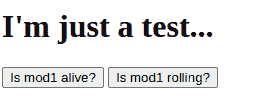
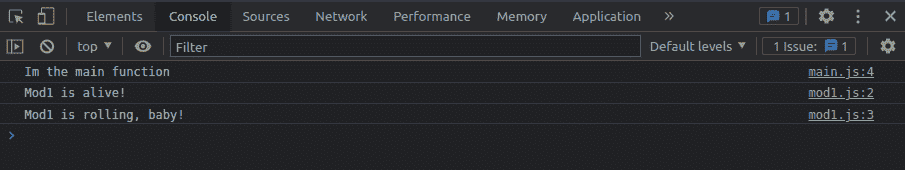
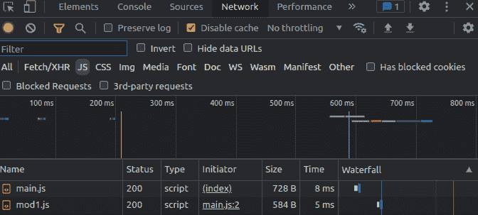
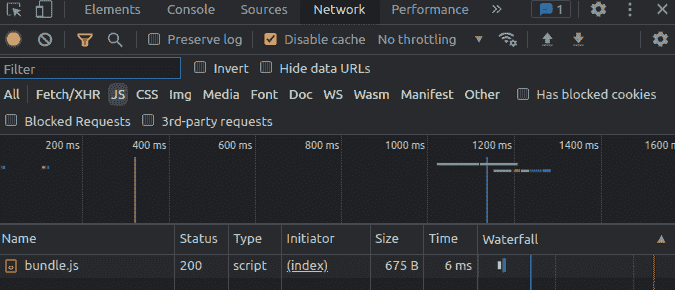

# JavaScript 中的模块——CommonJS 和 ESmodules 解释

> 原文：<https://www.freecodecamp.org/news/modules-in-javascript/>

大家好！在这篇文章中，我们将看看 JavaScript 中的模块。

模块是当今软件设计/架构中大量使用的一种技术。

首先，我们将了解它们是什么以及现有的不同类型的模块。然后我们将讨论为什么模块是有用的。然后我们将看到最常用的模块类型的例子和基本语法，最后我们将讨论捆绑，为什么它是必要的，以及如何做。

够了，我们走！=D

## 目录

*   [什么是模块，为什么它们有用](#whataremodulesandwhyaretheyuseful)
*   [模块类型](#typesofmodules)
    *   [CommonJS](#commonjsmodules)
    *   [搪瓷制品](#esmodules)
*   [使用模块](#usingmodules)
*   [捆绑模块](#bundlingmodules)
*   [综述](#roundup)

# 什么是模块，为什么它们有用

模块只是文件中的一段代码，您可以从其他文件中调用和使用它。模块化设计与将项目的所有代码放在一个文件中相反。

当开发一个大项目时，将我们的代码分成模块是非常有用的，原因如下:

*   它有利于将关注点和特性划分到不同的文件中，这有助于代码的可视化和组织。
*   当代码组织得很清楚时，它往往更容易维护，更不容易出错。
*   模块可以很容易地在我们项目的不同文件和部分中使用和重用，而不需要再次重写相同的代码。

我们可以把程序的所有组件分成几个部分或模块，并让每个部分负责一个单独的特性/关注点，而不是把程序的所有组件都放在一个文件中。

如果这个概念现在还不够清楚，不用担心。我们马上会看到一些例子。

# 模块类型

就像生活中的几乎所有事情一样，尤其是在 JavaScript 中，我们有很多方法来实现模块。

由于 JavaScript 最初只是作为一种小型的网站脚本语言而创建的，所以像模块这样的大型项目的特性在开始时并不被支持。

但是随着语言和生态系统的发展，开发人员开始意识到对这个特性的需求。因此开发了不同的选项和库来为 JavaScript 添加这个特性。

在众多可用的模块中，我们只看一下 CommonJS 和 ESmodules，它们是最新的、使用最广泛的。

旁注:你知道吗 [Javascript 最初是在仅仅 10 天的工作](https://thenewstack.io/brendan-eich-on-creating-javascript-in-10-days-and-what-hed-do-differently-today/)中创建的？

在分析 JavaScript 的复杂性和理解这种语言是如何发展的时候，我认为重要的是要记住，这种语言最初并不是为了做它现在做的事情而创建的。Javascript 生态系统的发展推动了许多已经发生的变化。

## CommonJS 模块

[CommonJS](https://en.wikipedia.org/wiki/CommonJS) 是一组用于在 JavaScript 上实现模块的标准。该项目由 Mozilla 工程师 Kevin Dangoor 于 2009 年启动。

CommonJS 主要用于带有 Node 的服务器端 JS 应用，因为浏览器不支持使用 CommonJS。

顺便提一下，Node 过去只支持 CommonJS 来实现模块，但现在它也支持 ESmodules，这是一种更现代的方法。

所以让我们看看 CommonJS 在实际代码中是什么样子的。

要实现模块，首先需要在电脑上安装一个 Node app。所以通过运行`npm init -y`创建一个。

首先让我们创建一个包含简单函数的`main.js`文件。

```
const testFunction = () => {
    console.log('Im the main function')
}

testFunction() 
```

好了，现在让我们假设我们想从主文件中调用另一个函数，但是我们不希望这个函数在主文件中，因为它不是我们核心特性的一部分。为此，让我们创建一个`mod1.js`文件，并将以下代码添加到其中:

```
const mod1Function = () => console.log('Mod1 is alive!')
module.exports = mod1Function 
```

`module.exports`是我们用来声明我们想要从该文件中导出的所有内容的关键字。

要在我们的`main.js`文件中使用这个函数，我们可以这样做:

```
mod1Function = require('./mod1.js')

const testFunction = () => {
    console.log('Im the main function')
    mod1Function()
}

testFunction() 
```

请注意，我们声明了我们想要使用的任何内容，然后将其分配给我们想要使用的文件的`require`。小菜一碟。；)

如果我们想从一个模块中导出多个东西，我们可以这样做:

```
const mod1Function = () => console.log('Mod1 is alive!')
const mod1Function2 = () => console.log('Mod1 is rolling, baby!')

module.exports = { mod1Function, mod1Function2 } 
```

在 main.js 文件中，我们可以像这样使用这两个函数:

```
({ mod1Function, mod1Function2 } = require('./mod1.js'))

const testFunction = () => {
    console.log('Im the main function')
    mod1Function()
    mod1Function2()
}

testFunction() 
```

差不多就是这样。很简单，对吧？它很简单，但却是一个强大的工具。=)

## ESmodules

现在我们来复习一下 ESmodules。ESmodules 是 ES6 (2015)推出的标准。想法是标准化 JS 模块如何工作，并在浏览器(以前不支持模块)中实现这个特性。

ESmodules 是一种更现代的方法，目前由带有 Node 的浏览器和服务器端应用程序支持。

让我们看看代码。我们再次从用`npm init -y`创建一个节点应用程序开始。

现在我们去我们的`package.json`并添加`"type": "module"`到它，像这样:

```
{
  "name": "modulestestapp",
  "version": "1.0.0",
  "description": "",
  "main": "index.js",
  "scripts": {
    "test": "echo \"Error: no test specified\" && exit 1"
  },
  "keywords": [],
  "author": "",
  "license": "ISC",
  "type": "module"
} 
```

如果我们不这样做，并试图在节点上实现 ESmodules，我们将得到如下错误:

```
(node:29568) Warning: To load an ES module, set "type": "module" in the package.json or use the .mjs extension.
...
SyntaxError: Cannot use import statement outside a module 
```

现在让我们重复同样的例子。在我们的`main.js`文件中，我们将有以下代码:

```
// main.js
import { mod1Function } from './mod1.js'

const testFunction = () => {
    console.log('Im the main function')
    mod1Function()
}

testFunction() 
```

在`mod1.js`我们会看到这个:

```
// mod1.js
const mod1Function = () => console.log('Mod1 is alive!')
export { mod1Function } 
```

注意，我们用`import`代替`require`，用`export`代替`module.exports`。语法有点不同，但行为非常相似。

同样，如果我们想从同一个文件中导出多个内容，我们可以这样做:

```
// main.js
import { mod1Function, mod1Function2 } from './mod1.js'

const testFunction = () => {
    console.log('Im the main function')
    mod1Function()
    mod1Function2()
}

testFunction() 
```

```
// mod1.js
const mod1Function = () => console.log('Mod1 is alive!')
const mod1Function2 = () => console.log('Mod1 is rolling, baby!')

export { mod1Function, mod1Function2 } 
```

ESmodules 中的另一个可用特性是导入重命名，可以像这样完成:

```
// main.js
import { mod1Function as funct1, mod1Function2 as funct2 } from './mod1.js'

const testFunction = () => {
    console.log('Im the main function')
    funct1()
    funct2()
}

testFunction() 
```

请注意，我们在每个函数后使用了`as`关键字，然后根据我们的意愿对其进行重命名。在后面的代码中，我们可以使用这个新名称来代替导入的原始名称。；)

你可以做的另一件事是一起导入所有导出，并把它们放在一个对象中，就像这样:

```
// main.js
import * as mod1 from './mod1.js' 

const testFunction = () => {
    console.log('Im the main function')
    mod1.mod1Function()
    mod1.mod1Function2()
}

testFunction() 
```

在我们的整个代码中，当我们想要明确每个导入来自哪里时，这可能是有用的。看到函数现在像`mod1.mod1Function()`一样被调用。

最后值得一提的是`default`关键词。使用它，我们可以为给定的模块设置默认的导出。像这样:

```
// mod1.js
const mod1Function = () => console.log('Mod1 is alive!')
const mod1Function2 = () => console.log('Mod1 is rolling, baby!')

export default mod1Function
export { mod1Function2 } 
```

默认导出意味着什么？嗯，这意味着我们在导入它的时候不需要去析构它。我们可以像这样使用它:

```
// main.js
import mod1Function, { mod1Function2 } from './mod1.js' 

const testFunction = () => {
    console.log('Im the main function')
    mod1Function()
    mod1Function2()
}

testFunction() 
```

我们甚至可以不使用`as`关键字来重命名导入，因为 JavaScript“知道”如果我们不进行析构，我们将引用默认导入。

```
// main.js
import lalala, { mod1Function2 } from './mod1.js' 

const testFunction = () => {
    console.log('Im the main function')
    lalala()
    mod1Function2()
}

testFunction() 
```

这也很好地总结了 ESmodules。我希望直截了当。=)

# 使用模块

好了，现在我们清楚了可用的不同类型的模块以及它们是如何工作的，让我们看看如何使用 HMTL 和普通 JS 在网站中实现模块。

让我们创建一个简单的 HTML 文件，它有一个标题、两个按钮和一个链接到我们的`main.js`文件的脚本标签。

```
<!-- index.html -->
<!DOCTYPE html>
<html lang="en">
<head>
    <meta charset="UTF-8">
    <meta http-equiv="X-UA-Compatible" content="IE=edge">
    <meta name="viewport" content="width=device-width, initial-scale=1.0">
    <title>Document</title>
</head>
<body>
    <h1>I'm just a test...</h1>
    <button id="isAlive">Is mod1 alive?</button>
    <button id="isRolling">Is mod1 rolling?</button>
    <script src="./main.js" type="module"></script>
</body>
</html> 
```

注意我在脚本标签上声明了`type="module"`。为了使用 JS 模块特性，我们需要这样做。如果我们不这样做，我们会得到这样一个错误:

```
Uncaught SyntaxError: Cannot use import statement outside a module 
```

如果我们打开我们的 HTML 文件，我们应该得到这样的结果:


我们的`main.js`文件会有这样的代码:

```
// main.js
import { mod1Function, mod1Function2 } from './mod1.js'

const testFunction = () => console.log('Im the main function')

document.getElementById('isAlive').addEventListener('click', () => mod1Function())
document.getElementById('isRolling').addEventListener('click', () => mod1Function2())

testFunction() 
```

我们只是给每个按钮添加了一个点击事件监听器，这样来自`mod1.js`文件的函数就可以执行了。

好了，现在我们可以提供我们的 HTML 文件，看看这是否可行。我们需要提供文件，我们不能只在浏览器中打开 HTML，因为我们会得到这样的 CORS 错误:

```
Access to script at ... from origin 'null' has been blocked by CORS policy: Cross origin requests are only supported for protocol schemes: http, data, chrome, chrome-extension, brave, chrome-untrusted, https. 
```

为了快速提供服务，你可以使用**实时服务器** VS 代码扩展，或者通过运行`npm init -y`然后运行`npx serve`来创建一个节点应用。

无论如何，一旦文件送达，我们可以点击每个按钮，并测试我们的功能执行正确。我们的控制台应该是这样的:


但是还有一件事。如果我们去浏览器的开发者工具的网络选项卡，按 JS 文件过滤，可以看到网站正在加载两个文件，`main.js`和`mod1.js` :


当然，如果我们要使用每个文件中的代码，两个文件都需要加载——但这不是最好的做法。这是因为浏览器需要执行两个不同的请求来加载所有必要的 JS。

我们应该总是试图将请求减少到最小，以提高我们项目的性能。因此，让我们看看如何在模块捆绑器的帮助下做到这一点。

旁注:如果你想要视频解释，[肯特·C·多兹有一个很棒的视频](https://egghead.io/lessons/javascript-use-javascript-modules-in-the-browser)。我真的建议你跟着他，他是最好的 JS 老师之一。[这是 Fireship 的另一个很酷的视频](https://www.youtube.com/watch?v=qgRUr-YUk1Q)。；)

# 捆绑模块

如前所述，将我们的代码分成模块是很好的，因为我们的代码库将更有组织性，重用我们的代码也更容易。

但是这些只是项目开发阶段的优势。在生产中，模块不是最好的东西，因为强迫浏览器对每个 JS 文件发出请求可能会损害站点的性能。

使用模块捆绑器可以很容易地解决这个问题。简单地说，模块捆绑器是将 JS 模块作为输入并将它们组合成一个文件的程序(许多模块捆绑器有更多的功能，但这是它们的核心概念)。

由于这一点，作为开发人员，我们可以对我们的项目进行编码，将它分成组织良好的部分，然后运行模块捆绑器来获得将在生产中使用的最终代码。

将“开发代码”转换为“生产代码”的这一步通常被认为是“构建”。

这有很多选项可以使用(比如 [Browserify](https://browserify.org/) ， [Parcel](https://parceljs.org/) ， [Rollup.js](https://rollupjs.org/guide/en/) ， [Snowpack](https://www.snowpack.dev/) ...)但是最广泛使用的是 [Webpack](https://webpack.js.org/) 。所以让我们看一个使用 Webpack 的例子。

*   旁注 1:如果你想更深入地了解模块捆绑器以及它们是如何工作的，Fireship 的这个很棒的视频可能是一个很好的起点。
*   旁注 2: Webpack 是一个非常健壮和复杂的工具，除了捆绑 JS 文件之外，它还可以做很多事情。如果你想了解更多，请查看他们的文档。

很好，现在我们可以通过运行`npm init -y`来创建一个节点应用程序(如果您还没有的话)。然后我们需要通过运行`npm i --save-dev webpack webpack-cli`来安装 Webpack 和 Webpack CLI。

接下来，我们将创建一个`webpack.config.js`文件，并将这段代码放入其中:

```
/* webpack.config.js */
const path = require('path');

module.exports = {
  entry: './main.js',
  output: {
    path: path.resolve(__dirname, 'dist'),
    filename: 'bundle.js',
  },
}; 
```

这个文件将负责 Webpack 的配置，以及它如何在我们的应用程序中工作。

我们首先要做的是设置入口文件(`entry: './main.js'`)。Webpack 将从读取该文件开始，然后分析所有的依赖项(从该文件导入的模块)。换句话说，入口文件是我们的主 JS 文件，所有其他模块都是从这里导入的。

然后我们声明输出——首先声明它的存储路径，然后声明捆绑文件的名称。

```
output: {
    path: path.resolve(__dirname, 'dist'),
    filename: 'bundle.js',
}, 
```

超级！现在让我们转到我们的`package.json`文件并添加一个`build`脚本，如下所示:

```
{
  "name": "testappv2",
  "version": "1.0.0",
  "description": "",
  "main": "main.js",
  "scripts": {
    "test": "echo \"Error: no test specified\" && exit 1",
    "build": "webpack"
  },
  "keywords": [],
  "author": "",
  "license": "ISC",
  "devDependencies": {
    "webpack": "^5.72.0",
    "webpack-cli": "^4.9.2"
  }
} 
```

然后我们可以回到我们的终端并运行`npm run build`。这应该会在我们的项目中创建一个`dist`目录，并在其中创建一个`bundle.js`文件。

如果您签出该文件，您将在其中看到以下代码:

```
(()=>{"use strict";document.getElementById("isAlive").addEventListener("click",(()=>console.log("Mod1 is alive!"))),document.getElementById("isRolling").addEventListener("click",(()=>console.log("Mod1 is rolling, baby!"))),console.log("Im the main function")})(); 
```

您将会看到，它实际上与我们在文件中分发的代码是一样的，但是都被捆绑在一个文件中并被缩小了。

剩下的唯一一件事就是修改我们的`index.html`文件中的脚本标签，这样它现在就可以使用捆绑的 JS，就像这样:

```
<!-- index.html -->
<!DOCTYPE html>
<html lang="en">
<head>
    <meta charset="UTF-8">
    <meta http-equiv="X-UA-Compatible" content="IE=edge">
    <meta name="viewport" content="width=device-width, initial-scale=1.0">
    <title>Document</title>
</head>
<body>
    <h1>I'm just a test...</h1>
    <button id="isAlive">Is mod1 alive?</button>
    <button id="isRolling">Is mod1 rolling?</button>
    <script src="./dist/bundle.js" type="module"></script>
</body>
</html> 
```

现在我们可以再次服务它，检查 JS 是否仍然正常工作，如果我们再次打开 network 选项卡，我们应该只看到一个文件被加载！=D


我希望这个简单的例子能帮助您理解模块捆绑器的相关性，以及它们如何帮助我们将模块化架构的优秀开发经验与良好的站点性能结合起来。

# 综述

好了，我们今天到此为止。在本文中，我们看到了什么是模块，为什么它们很酷，在 JavaScript 中实现模块的不同方法，以及一个将我们的代码与 Webpack 捆绑在一起的实际例子。

关于 JS 模块的完整指南，你可以看看这篇文章中的[。](https://developer.mozilla.org/en-US/docs/Web/JavaScript/Guide/Modules)

一如既往，我希望你喜欢这篇文章，并学到一些新东西。如果你愿意，你也可以在 [linkedin](https://www.linkedin.com/in/germancocca/) 或 [twitter](https://twitter.com/CoccaGerman) 上关注我。

干杯，下期再见！=D

