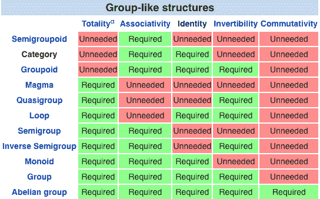
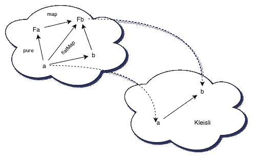

# 如何编写可组合函数和正确的程序

> 原文：<https://www.freecodecamp.org/news/monadic-composition-and-kleisli-arrows-1d96979bb32/>

作者:帕维尔·扎伊采夫

# 如何编写可组合函数和正确的程序

#### 单子和克莱斯利箭头概述


### 关于传统的一些话？

> 如果你没有写过单子，那你算不算程序员？

众所周知，任何写技术博客的受人尊敬的程序员一生中至少要写一篇关于单子的教程。大多数时候，它从**函子**开始，一路向上构建。困难的比较被画在这里和那里，用散布在周围的简短代码片段来演示几个应用程序——当然，所有的看起来都是完全正交的。

问题是在“什么是单子？”和“什么是单子”之间有一个巨大的概念鸿沟以及“如何在编程中使用单子？”

这种差距的主要原因是，人们通常不会以首先需要单子的方式来考虑他们的程序。如果你来自命令式的背景——我们大多数人都是这样——即使你最终变得实用，通常也需要一段时间才能看到全貌，并理解正确的做事方式。我们经常宣扬透明和纯洁。我们通常对这些东西分别意味着什么有一个大致的概念，但是把它们拼凑成一个连贯的概念需要一些时间。

这篇文章不是关于单子，而是关于编写可组合的函数和正确的程序。单子似乎是这个目标的副产品。希望下面的讨论也将有助于弥合上述概念上的差距。

### 都是因为那篇作文？‍

在程序设计中，有趣和重要的问题通常太复杂而不能作为一个整体来处理。程序员把它们分解成更小的、更容易理解的部分，一个一个地解决，然后把这些子问题的解决方案清晰地呈现出来。有许多方法可以做到这一点，但可以明确定义两种思想流派——声明式和命令式方法。

命令式方法将程序视为时间上的一系列计算，程序的单元是一条语句。一个语句做一些事情。例如，它可以将输出打印到控制台，为变量赋值，或者计算结果。

声明性方法是全局的。它只关心系统的初始和最终状态，程序的一个单元就是一个表达式。表达式**总是**计算出一个值。一般来说，推理一条语句比推理一个表达式更难，因为一条语句太宽泛，没有界限，而一个表达式对于它可能出现的所有程序总是确定地计算出相同的值。

如果你是一个函数式程序员，你遵循一个声明性的范例，你会把一个程序看成是函数的组合，而函数只是表达式。你可以把一个组合看作是两个或更多功能的融合。

如果你有一个函数 *f* 接受 A 类型的参数并返回 B 类型的结果，另一个函数 *g* 接受 B 类型的参数并返回 C 类型的结果，你可以通过将结果 *f* 传递给 *g* 来组合它们。你得到的是一个新函数，它接受 A 类型的参数并产生 c 类型的结果。这类似于演绎推理，演绎推理只是从前提到结论的逻辑步骤的组合。

问题是在真正的编程中并不那么简单，许多函数并不总是取相同的值，即使它们的参数取相同的值。这些函数进行网络调用，它们从文件和数据库中读取，向它们写入，处理大量不同的数据，打印到控制台，等等。函数变得**依赖于上下文，**并且它们越依赖于上下文，就越难组合它们。因此，如果你不得不处理函数，其中每一个函数都会在这里或那里引入一些复杂性，你最好找到一种方法来组合它们。

### 永恒的问题？

正如我已经提到的，编写有用的代码需要处理外部世界的混乱——一个处理效果和状态的问题。所谓影响，我指的是对外部世界的影响，比如写入数据库或打印到控制台。甚至一个简单的累死累活的项目也会产生效果。

许多情况传统上通过放弃函数的纯洁性来解决，包括但不限于:

*   访问/修改程序上下文之外的状态的计算。
*   可能失败或永远不会终止的计算
*   其结果可能只有将来某个时候才知道的计算，也称为异步计算
*   控制台输入和输出

可以想象，像这样表现的函数不是那么容易编写的。假设一个函数，给定一个输入字符串形式的用户名，从一个文件中读取，找到给定的用户，然后将他们的姓氏传递给下一个函数供以后处理。你如何表示这样一个函数？`String => Str` ing？但这并不完全正确，因为你确实得到了一个字符串，也确实返回了一个字符串，但你还在这两者之间做了其他事情，这取决于上下文——文件系统和文件。

在函数式编程中，我们通常将这些信息编码在函数的返回类型中。我们把一个计算的结果放在一个盒子里，可以这么说，我们的函数从`A =>`；B `to A =>` 框【B】。

这个盒子里发生的一切都是特定于实现的。但是函数的定义现在描述了它做什么，并允许处理函数的行为和组合它，好得多。

让我们看看上面的情况，试着为每一种情况想出一个盒子。

### 把所有的东西都装箱？

免责声明:在本文中，我将使用 Scala 来表达我的想法，因为它可以说是主流函数式编程语言之一。但是同样的概念可以很容易地翻译成任何具有强大静态类型系统和类型构造函数的函数式编程语言(比如 Haskell 和 OCaml)。

一个读取但不修改外部状态的函数可以被认为是一个也接受这个外部状态作为自变量的函数，并在给定一些输入参数的情况下产生一个结果。例如，从数据库或配置文件中读取数据。

我们还提供了一个`run`函数来具体化一个阅读器并计算结果。典型的使用案例是:

*   提供一个配置文件
*   堆叠读取器以设置应用程序
*   最后在配置文件的实例上执行`run`函数。

在 OOP 世界中，类似的方法是依赖注入。

携带计算状态的函数接受两个参数——一个参与实际计算的常规参数，以及将在整个合成过程中传播的状态。

我们提供了一个`run`函数，它产生当前写入者持有的结果。`Writer`的一个典型用例是在程序执行期间传播消息和错误，并提取最终结果旁边的日志。另一个用例是记录多线程环境中的步骤序列。因为计算的结果与特定的日志相关联，所以消息不会纠缠在一起。

永不终止的功能(例如长时间运行的进程)被提升到`Nothing`的**底层类型**。如果您期望您的计算或者返回值或者永远运行，您可以将其建模为结果类型和`Nothing`的不相交并集。一个例子是一个流消费者，它无限期地处理数据，直到某个事件使它让步。

一个可能失败的函数可以被建模为部分函数——没有为某些值定义的函数。所以我们就这么做了——有些情况下不返回任何值，而有些情况下返回实际值。如果您需要关于失败的信息，并且需要与抛出异常的 Java APIs 进行互操作，那么您可以在分离联合中携带错误信息。

异步计算不会在当前调用堆栈或程序的主流程上执行。它们可以被建模为接受处理程序或回调的函数。当这个处理程序最终被调用时——例如被其他线程或 web 服务器调用——就会产生结果。

`ExecutionContext`管理异步执行的细节。在 JVM 上，它是一个线程池，但不一定是处理异步的线程。函数`run`隐式地接受它，因为回调需要异步调用。每个调用`run`的函数也需要在其签名中包含一个**隐式** `ExecutionContext`。`ExecutionContext`也使得递归异步调用是堆栈安全的，因为每次调用一个函数时，你都会引入一个**异步边界**。正如我前面提到的，异步计算不会在同一个调用栈上执行。相当整洁。

控制台输入可以建模为一个两阶段的过程。在第一阶段，我们**描述**控制台输入可能产生的计算和结果。在第二阶段，我们运行或**解释**这个计算。保存计算结果的数据类型称为`IO`。所以我们的函数接受一个 singleton 并在一个`IO`中产生结果。

注意，因为我提到我们首先描述计算，所以我们传递按名称调用的参数`=>`；答:它们只在我们需要的时候执行。
控制台输出也可以通过`gh` IO 建模，用 o `ur` run 函数产生一个单例类型`of U` nit。

### 那么，现在怎么办？？

当然，我们用一个类型参数实现了所有的盒子，以说明类型的可变性。我们通过提供一个函数，将一些东西转换或映射到另一些东西。一些事物的类别到其他事物的类别之间的映射称为**函子**。

函子很酷，因为它们允许我们在内部转换内容，同时保留原始类别的结构，而不会把事情弄糟。当使用仿函数时，遵循[仿函数定律](https://en.wikibooks.org/wiki/Haskell/The_Functor_class#The_functor_laws)证明事情按预期工作。在文章的后面会清楚为什么**特别是这些**法律。

让我们定义一个为每种派生数据类型进行转换的 map 方法:

注意，这里我们定义了一个函数`pure`，它允许我们将一个纯计算提升为一个异步值。

太棒了，现在我们可以在盒子里绘制东西了。问题是——它没有用，因为，尽管我们可以在一个函子中进行序列计算，但我们不能组合产生函子的函数:

```
F1: A -> Functor[B] ==> F2: A -> Functor[B] ==> F3: A -> Functor[B]
```

`F1`、`F2`和`F3`中的每一个都可能做完全不同的事情。我们需要考虑到这一点，我们需要把它们组合起来。幸运的是，有一个很好的方法可以做到这一点。

### 哦不，又是那个家伙！？

好的，我需要写一个函数，为`A => Functor` [B]中的每个函子编写函数。作文的数学定义是:

```
If A =>; B and B => C then A => C
```

所以在我们的例子中:

```
If A => Functor[B] and B => Functor[C] then A => Functor[C]
```

先说一个读者。同样，只需遵循类型:

我们把构图定义为`andThen`。我们还定义了`pure`，它将一个值提升到一个函子中。

任何类别的作品都遵循两个简单的定律。

1.  它是关联的:

2.存在这样一个函数，称为**恒等式，**，当与来自左边或右边的任何函数组合时，再次产生那个函数:

你可以拿一支笔，一张纸，试着把这两个规律画出来。用圆圈和它们之间的连接代替实体作为箭头，你可以直观地向自己证明是这样的。还记得前面的函子定律吗？这是一回事。这些定律建立了每一类的可组合性。

作为程序员，我们主要处理一类集合——对象是集合或类型，箭头是函数。不是所有的数学结构都需要有一个恒等式，但是类别确实需要。

例如，恒等式可以用来表示两个对象“集合”是同构的还是相等的。正如我们将在本文后面看到的那样，它还可以在某些情况下提供保证。



Category only has two properties — simple enough.

参与`A => Functor`【B】并遵循这些合成法则，从而为同一类别 [ry 中的所有对象进行合成的函子不是毛刺](https://blog.plover.com/prog/burritos.html) ito。这是一个单子。

相应地，我们试图构建的函数实际上是`A => Monad`【B】。围绕它们的包装器，一个自然与 `a Monad`【B】相关的类别，被称为 kle isli categor`y. A => Mo`nad[`B] or K`lei sli arrows 只是一种组合这些功能的方式，仅此而已。



Kleisli has the same objects as the original category but arrows between a and b in Kleisli correspond to the arrows between a and Fb, where F is a functor.

### 作曲所有的东西！？

我们用箭头`>` == >代替类似 Java 的`andThen`。这叫鱼算子是因为长得像鱼？。我们还定义了一个函数`tion fl` atMap，giv`en a Mon`ad【A】 `and A =>` Monad[B]，p`roduces A =&g`t；单子[B]。这将使实现箭头更容易:

#### 幺半群

对于要成为单子的作者来说，第二种类型也应该是可组合的，并且只有当它是**单子**时才是可组合的。一个东西只有当它可以结合并有一个空元素时才是幺半群，空元素是一个单位元。

例如，求和的整数是单位元为 0 的幺半群。串联的字符串是具有空字符串的单位元的幺半群。并集是具有空集的单位元的幺半群。相交的集合形成半群而不是幺半群。非空集与空集相交产生空集。你明白身份为什么有用了吧？

其他单子很容易实现:

我们将详细讨论为什么`IO`看起来像这样，并在另一篇文章中讨论`Free`。

### 什么时候用哪个？？

`Kleisli`和`Monad`是一枚硬币的两面。很多函数式语言原生支持它们，但是对于 Scala，至少在当前的 2.12.8 版本中，你可以从像 Cats 和 Scalaz 这样的库中获得它们。它们分别有`Kleisli`和`Monad`的字体类别:`Kleisli[F[_], A, B]`和`Monad[A]`。

单子更擅长表达在某些上下文中发生的计算的顺序。在 Scala 中，我们通常通过利用 for comprehensions 来进行上下文排序。

有趣的事实:如果你为`IO`单子写`Kleisli`个箭头，你会得到你的计算机程序的描述。你的计算机程序本质上是一个巨大的`Kleisli`箭头，用一些`Unit`的输入和输出作为描述，执行这个程序的运行时环境作为解释器工作。

因此，默认情况下，每个程序都有一个`IO`上下文。如果你有一个产生错误的函数，它会创建一个`Option`或`Either.`的上下文，所以每个后续函数都应该有一个`A => Option`【A】`or A => Either[`A，B】的签名。用`in`一个 IO 程序 `it’s A => IO[O`选项`[A]] and A => IO[E` ither[A，B]]。您决定何时折叠该上下文或进一步嵌套它。Monad transformers 有助于嵌套上下文的排序，但这是另一篇文章的内容。

异步计算只能借助单子进行排序，因为单子**明确解决了同步和时间排序问题。例如，你使用未来组合子，它是在一元上下文中。**

`Kleisli`箭头组合子更合适时更好。例如，我们可以有一堆有效的或不纯的函数，我们可以融合它们，而不用将结果包装到`IO`中。当然，如果你愿意，你也可以创建一堆单独的程序，最后将它们组合成一个`Kleisli`并运行。

`Reader[A]`用`Kleisli`比用一元组合更好地表达，因为我们可以很容易地将小的局部`Kleisli`箭头组合成一个代表程序全局配置的`Kleisli`箭头。大的`Kleisli`箭头依赖于一些环境，比如生产和开发的配置文件。然后我们可以在最后运行它，并配置整个应用程序。

这种方法模仿了**依赖注入**的概念。这里我们演示了`KleisliIO`，一个来自 [ZIO](https://github.com/scalaz/scalaz-zio) 的有效的`Kleisli`，它执行阅读器功能来配置应用程序(为了节省空间，省略了错误类型):

### 结束？

咻，这是一个爆炸。我希望你喜欢这篇文章，现在明白什么会更好一点:)。

以下是一些有用的链接，可帮助您了解更多关于 Kleisli 和 composition 的内容:

*   [www.cse.chalmers.se/~rjmh/Papers/arrows.pdf](http://www.cse.chalmers.se/~rjmh/Papers/arrows.pdf)
*   [https://www.youtube.com/watch?v=qL6Viix3npA](https://www.youtube.com/watch?v=qL6Viix3npA)