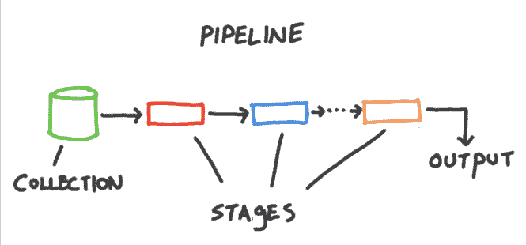

# 如何用 MongoDB 的聚合框架处理高级数据处理

> 原文：<https://www.freecodecamp.org/news/mongodb-aggregation-framework/>

MongoDB 已经走过了漫长的道路。尽管有许多 NoSQL 数据库，但当谈到 NoSQL 数据库时，MongoDB 是第一个想到的数据库。

尽管在喜欢 SQL 的人和喜欢 NoSQL 的人之间总是有一些争论，但事实是，像 MongoDB 这样的数据库解决了一个不同的问题。

在处理非结构化数据时，它们真的很方便，在这种情况下，快速有效地处理数据形状(并将其转化为相关知识)比老式 SQL 数据库提供的坚如磐石的性能更有帮助。

MongoDB 提供了一个强大的框架来实现这一点——也就是说，在服务器上操作数据:聚合框架。让我们深入了解一下，并涵盖一些要点，它是什么，以及它为什么重要。

## 什么是聚合框架？

聚合框架只是在 MongoDB 中查询集合中文档的一种方式。这个框架的存在是因为当您开始处理和操作数据时，您经常需要一起处理集合、修改它们、提取字段、重命名字段、将它们连接在一起、按字段对文档进行分组、分解不同文档中的字段数组等等。

MongoDB 自带的传统查询系统无法做到这一点(即 find 查询或 update 查询，或者您可能使用过的任何其他查询)。

MongoDB 中的简单查询集只允许您检索单个文档的全部或部分。它们并不真的允许你操作服务器上的文档，然后将它们返回到你的应用程序中。

这就是 MongoDB 的聚合框架的用武之地。这不是外部的，因为聚合是 MongoDB 内置的。您可以使用我制作的这个免费的 YouTube 播放列表来学习使用 MongoDB 聚合框架。

## 管道

聚合框架依赖于管道概念。让我们来看一个更好地解释它的图片:

在这里，你可以看到，我们拿起一个集合，并通过管道传递它。这个管道由某些阶段组成，在这些阶段中，某些**操作者**使用各种技术修改集合中的文档。最后，输出返回给调用查询的应用程序。

将它与一个简单的查询进行比较，比如 find。当然，它在大多数情况下都是有效的，但是当您想在检索数据的同时修改数据时，它并不真正有用。

要么您需要获取文档并在服务器上的应用程序中相应地修改它们，要么更糟，您将它们发送到客户端并让前端代码为您修改它。

在这两种情况下，你都在浪费资源和带宽。因此，聚合框架巧妙地解决了这个问题。让我们看看它是如何处理操作符的。

## 管道运营商

在 MongoDB 中，管道是由各种运算符组成的数组，这些运算符按照程序员指定的规则，接受一堆文档，吐出修改后的文档。下一个操作符接收前一个操作符发出的文档，因此，它被称为管道。

与常规的 MongoDB 查询不同，在一个管道中可以有许多操作符，并且这些操作符也可以重复。

让我们来看看 MongoDB 中一些常见的管道操作符。

### $组

该操作符允许您根据文档中的某个字段将一组文档分组在一起。它还可以用于将文档中的各种字段组合在一起。

我非常相信一张图胜过一千句话的说法。一个视频抵得上 1000 张图片(好吧，技术上来说是更多的图片，但是没关系)，所以让我们看一个关于这个的快速视频:

[https://www.youtube.com/embed/zwjRdEhn2xs?feature=oembed](https://www.youtube.com/embed/zwjRdEhn2xs?feature=oembed)

### $匹配

匹配管道操作符的工作方式与常规的查找操作符非常相似。然而，这样做的好处是它可以多次使用，因为您处于管道环境中！这使得它很强大。

让我们看看它是如何运用在一个系列上的:

[https://www.youtube.com/embed/uQ2Kom7Z9Ug?feature=oembed](https://www.youtube.com/embed/uQ2Kom7Z9Ug?feature=oembed)

### 美元限额

$skip 管道操作符跳过前 N 个文档，并将其余文档传递给下一个操作符。让我们看一个简单的例子:

[https://www.youtube.com/embed/Wvy_njVn7x8?feature=oembed](https://www.youtube.com/embed/Wvy_njVn7x8?feature=oembed)

### $跳过

$skip 管道操作符跳过前 N 个文档，并将其余文档传递给下一个操作符。让我们看一个简单的例子:

[https://www.youtube.com/embed/eZ8_khznKkk?feature=oembed](https://www.youtube.com/embed/eZ8_khznKkk?feature=oembed)

### $展开

这个操作符是我个人最喜欢的。$unwind 接受一个数组字段，并将其分解成多个 N 个子文档，第 I 个文档包含数组的第 I 个特定值，作为字段名的值。

结合$group 和$match 等其他操作符，这对于数据处理来说变得非常强大。听起来很困惑？让我们看一个简单的例子:

[https://www.youtube.com/embed/V4UoZvb-YW8?feature=oembed](https://www.youtube.com/embed/V4UoZvb-YW8?feature=oembed)

### $项目

project 操作符允许您从每个文档中提取一些字段，并丢弃其余的。不仅如此，您还可以重命名拨弦字段、连接琴弦、取出子琴弦等等！

让我们简单地看看这是如何工作的:

[https://www.youtube.com/embed/k_lBewsUMGg?feature=oembed](https://www.youtube.com/embed/k_lBewsUMGg?feature=oembed)

## 使用聚合框架的最佳实践

权力越大，责任越大。您也可以很容易地利用聚合框架进行简单的查询，所以确保您没有编写糟糕的数据库查询是很重要的。

首先，请记住以下几点:

1.  MongoDB 将拒绝任何占用超过 100MB 内存的操作符，并将抛出一个错误。因此，请确保尽快减少数据，因为单个操作符不应占用超过 100MB 的内存。
2.  秩序很重要！将$match 放在第一位将减少传递给管道其余部分的文档数量。将$project 放在下一个位置将通过去掉字段来进一步减小单个文档的大小。
3.  最后，确保完成所有需要使用索引字段的工作(排序、匹配等。)在使用$project 或$unwind 之类的运算符之前。这是因为这些操作符创建的新文档没有原始文档的索引。

## 结论

MongoDB 是一个很棒的数据库工具，对于想要快速迭代的小型创业公司和企业来说非常有用。这部分是由于它宽松的限制和宽容的天性。

我自己在 [codedamn](https://codedamn.com) 也在使用 MongoDB 一个为像你这样的开发者提供的平台，在这里每个人都可以学习和交流！

和平！