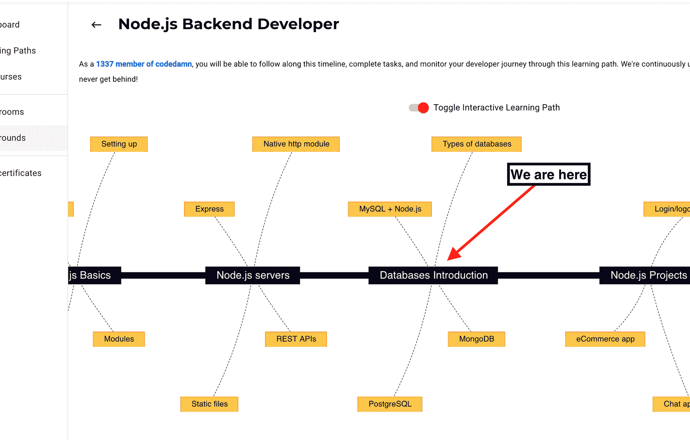

# 如何使用 MongoDB+mongose 和 node . js——后端开发人员的最佳实践

> 原文：<https://www.freecodecamp.org/news/mongodb-mongoose-node-tutorial/>

MongoDB 无疑是当今最受欢迎的 NoSQL 数据库之一。它有一个伟大的社区和生态系统。

在本文中，我们将回顾在使用 Node.js 设置 MongoDB 和 Mongoose 时应该遵循的一些最佳实践。

## 本文的先决条件

这篇文章是 part codedamn 的[后端学习路径](https://codedamn.com/learning-paths/backend)中的一篇，我们从后端基础开始，并详细介绍它们。因此，我假设你已经有了一些 JavaScript(和 Node.js)的经验。

目前我们在这里:



如果你对 Node.js/JavaScript 或后端没有什么经验，[这可能是一个很好的起点](https://codedamn.com/learning-paths/backend)。你也可以在这里找到 mongose+MongoDB+node . js 上的[免费课程。让我们开始吧。](https://codedamn.com/learn/node-mongodb-fundamentals)

## 你为什么需要猫鼬？

为了理解我们为什么需要 Mongoose，让我们了解一下 MongoDB(和一个数据库)在架构层面上是如何工作的。

*   您有一个数据库服务器(例如，MongoDB 社区服务器)
*   您有一个正在运行的 Node.js 脚本(作为一个进程)

MongoDB 服务器监听 TCP 套接字(通常)，Node.js 进程可以使用 TCP 连接来连接它。

但是在 TCP 之上，MongoDB 也有自己的协议来理解客户端(我们的 Node.js 进程)到底想要数据库做什么。

对于这种通信，我们没有学习必须在 TCP 层发送的消息，而是借助一个“驱动程序”软件(在本例中称为 MongoDB 驱动程序)将其抽象出来。MongoDB 驱动程序在这里作为 [npm 包提供。](https://www.npmjs.com/package/mongodb)

现在请记住，MongoDB 驱动程序负责连接和抽象来自您的低级通信请求/响应——但这只能让您成为一名开发人员。

因为 MongoDB 是一个无模式数据库，所以它提供了比初学者所需更多的功能。更大的权力意味着更大的出错面积。您需要减少代码中可能出现的 bug 和错误。你需要更多。

遇见猫鼬。Mongoose 是对原生 MongoDB 驱动程序(我上面提到的 npm 包)的抽象。

抽象的一般经验法则(我理解的方式)是，每一个抽象都会失去一些低级的操作能力。但这并不一定意味着它是坏的。有时，它会将生产率提高 1000 倍以上，因为您从来不需要完全访问底层 API。

考虑这个问题的一个好方法是，从技术上讲，用 C 和 Python 创建一个实时聊天应用程序。

对于开发人员来说，Python 示例实现起来会更容易、更快，而且生产率更高。

C *也许*更有效率，但是它会在生产力/开发速度/错误/崩溃方面付出巨大的代价。另外，在大多数情况下，你不需要拥有 C 给你的能力来实现 websockets。

类似地，使用 Mongoose，您可以限制低级 API 访问的表面积，但是可以释放大量潜在的收益和良好的 DX。

## 如何连接 mongose+MongoDB

首先，让我们快速地看看在 2020 年应该如何使用 Mongoose 连接到您的 MongoDB 数据库:

```
mongoose.connect(DB_CONNECTION_STRING, {
	useNewUrlParser: true,
	useUnifiedTopology: true,
	useCreateIndex: true,
	useFindAndModify: false
})
```

这种连接格式确保您使用的是 Mongoose 的新 URL 解析器，并且没有使用任何过时的做法。如果你愿意，你可以在这里深入阅读所有这些反对信息[。](https://mongoosejs.com/docs/deprecations.html)

## 如何执行猫鼬操作

现在让我们继续快速讨论 Mongoose 的操作，以及应该如何执行它们。

猫鼬给了你两件事的选择:

1.  基于光标的查询
2.  完全提取查询

### 基于光标的查询

基于游标的查询意味着您一次只能处理一条记录，而从数据库中一次只能获取一个或一批文档。这是在有限的内存环境中处理大量数据的有效方式。

假设您必须在 1GB/1 的核心云服务器上解析总大小为 10GB 的文档。您不能获取整个集合，因为那不适合您的系统。光标是一个好的(也是唯一的？)选项在这里。

### 完全提取查询

在这种类型的查询中，您可以一次性获得查询的完整响应。在很大程度上，这是您将要使用的。因此，我们在这里将主要关注这种方法。

## 如何使用猫鼬模型

模特是猫鼬的超能力。它们帮助您实施“模式”规则，并将节点代码无缝集成到数据库调用中。

第一步是定义一个好的模型:

```
import mongoose from 'mongoose'

const CompletedSchema = new mongoose.Schema(
	{
		type: { type: String, enum: ['course', 'classroom'], required: true },
		parentslug: { type: String, required: true },
		slug: { type: String, required: true },
		userid: { type: String, required: true }
	},
	{ collection: 'completed' }
)

CompletedSchema.index({ slug: 1, userid: 1 }, { unique: true })

const model = mongoose.model('Completed', CompletedSchema)
export default model 
```

这是一个直接来自 codedamn 代码库的精简示例。这里你应该注意一些有趣的事情:

1.  尽量保持`required: true`在所有需要的字段上。如果您在创建对象时不使用静态类型检查系统(如 TypeScript)来帮助您使用正确的属性名，那么这将是一个巨大的痛苦。另外，免费验证也非常酷。
2.  定义索引和唯一字段。也可以在模式中添加属性。索引是一个广泛的话题，所以我不会在这里深入探讨。但是在很大程度上，它们真的可以帮助你加快查询速度。
3.  显式定义集合名称。虽然 Mongoose 可以根据模型的名称自动给出一个集合名称(例如，这里的`Completed`)，但在我看来这太抽象了。您至少应该知道您的数据库名称和代码库中的集合。
4.  如果可以的话，使用枚举来限制值。

## 如何执行 CRUD 操作

CRUD 的意思是 **C** reate， **R** ead， **U** pdate 和 **D** elete。这是您可以在数据库中执行任何类型的数据操作的四个基本选项。让我们快速地看一些这些操作的例子。

### 创建操作

这仅仅意味着在数据库中创建新记录。让我们使用上面定义的模型来创建一个记录:

```
try {
    const res = await CompletedSchema.create(record)
} catch(error) {
	console.error(error)
    // handle the error
}
```

同样，这里有几个要点:

1.  使用 async-await 代替回调(看起来不错，没有突破性的性能优势)
2.  在查询周围使用 try-catch 块，因为您的查询*可能会因为多种原因而失败(重复记录、不正确的值等等)*

### 读取操作

这意味着从数据库中读取现有值。这听起来很简单，但是有几个你应该知道的关于 Mongoose 的问题:

```
const res = await CompletedSchema.find(info).lean()
```

1.  你能看到那里的`lean()`函数调用吗？对性能超级有用。默认情况下，Mongoose 处理从数据库返回的文档，并在其上添加它的*魔法*方法(例如`.save`
2.  当您使用`.lean()`时，Mongoose 返回普通的 JSON 对象，而不是内存和资源密集型文档。让查询在你的 CPU 上更快更便宜。
3.  然而，如果你真的想更新数据，你可以省略`.lean()`(我们接下来会看到)

### 更新操作

如果您已经有了一个 Mongoose 文档(没有用`.lean()`触发)，您可以简单地继续修改 object 属性，并使用`object.save()`保存它:

```
const doc = await CompletedSchema.findOne(info)
doc.slug = 'something-else'
await doc.save()
```

请记住，这里进行了两次数据库调用。第一个在`findOne`上，第二个在`doc.save`上。

如果可以的话，应该总是减少命中数据库的请求数量(因为如果比较内存、网络和磁盘，网络几乎总是最慢的)。

在另一种情况下，您可以使用如下查询:

```
const res = await CompletedSchema.updateOne(<condition>, <query>).lean()
```

它只会对数据库进行一次调用。

### 删除操作

用 Mongoose 删除也很简单。让我们看看如何删除单个文档:

```
const res = await CompletedSchema.deleteOne(<condition>)
```

与`updateOne`一样，`deleteOne`也接受第一个参数作为文档的匹配条件。

还有另一种叫做`deleteMany`的方法，只有当你知道要删除多个文档时才应该使用。

在任何其他情况下，总是使用`deleteOne`来避免意外的多次删除，尤其是当您试图自己执行查询时。

## 结论

本文是 Node.js 开发人员对 Mongoose 和 MongoDB 世界的简单介绍。

如果你喜欢这篇文章，作为开发者，你可以通过遵循 [codedamn 后端学习路径](https://codedamn.com/learning-paths/backend)来更进一步。如有任何反馈，请随时通过[推特](https://twitter.com/mehulmpt)联系我！