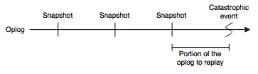

# MongoDB 时间点恢复

> 原文：<https://www.freecodecamp.org/news/mongodb-point-in-time-recoveries-or-how-we-saved-600-dollars-a-month-and-got-a-better-backup-55466b7d714/>

作者:吉特

# **MongoDB 时间点恢复**


Image by Russel Alton via [choplogik.org](http://choplogik.org/)

### (…或者我们如何每月节省 600 美元并获得更好的备份解决方案)

在 [Gitter](http://gitter.im) 这家小型创业公司，我们每天都在努力工作，为社区提供最好的聊天(你查过[乒乓大战](https://gitter.im/dexterneo/ping_pong_wars)吗？)，同时保持低成本。因此，当我发现我们每月要为数据库的基本备份服务支付 600 美元，而不是魔方和精酿啤酒时，我认为有轻松取胜的空间。

在备份数据库时，时间点恢复是最先进的。也就是说，能够查明特定的事务(通常是灾难性的)，并完全恢复到该点的数据集状态。我们的解决方案仅提供每小时备份，这不足以满足我们的需求。然而，我们为此付出了很多钱。呸。

在 Gitter，我们在 EC2 实例上使用 MongoDB 和 EBS 卷来存储我们的数据集。在设计支持时间点恢复的内部备份系统时，这种解决方案非常方便，而且比看起来容易得多。我会告诉你我们是怎么做的。

### 快照

首先，快照部分。我们定期用我写的脚本拍快照。它是基于来自 MongoDB 的官方教程的[,所以这里没有什么太令人惊讶的。当您想要启动新的副本节点时，快照也非常方便:只需使用基于最新快照的数据卷创建一个新实例，将其添加到副本集，MongoDB 将只重放不到一小时的操作日志，这比完全重新同步快得多。](https://docs.mongodb.org/ecosystem/tutorial/backup-and-restore-mongodb-on-amazon-ec2/)

您希望将数据文件和日志存储在同一个 EBS 卷上:大多数情况下，这不会影响 I/O 性能，否则实现一致性会很棘手。

然后，您需要拍摄 EBS 卷的快照。你可以使用你最喜欢的 AWS 界面来实现。请记住，拍摄快照是一个即时操作:一旦 AWS 接收到 api 调用，卷将在其当前状态下被“拍摄”,因此您可以安全地恢复您的写操作。然而，建议在辅助节点上执行此操作。

拍摄 EBS 快照的优势在于，AWS 会压缩数据块，并且只在 S3 存储差异，这意味着进一步节省了成本。

整个“冻结蒙戈；拍摄快照；解冻 mongo”对我们来说需要大约 1.4 秒，所以考虑到它给我们带来的巨大便利，这是一个可以承受的权衡。此外，EBS 快照解决方案的优势在于，AWS 会压缩数据块，并且仅在 S3 存储差异数据，这进一步节省了成本。

工作完成，你是一个节省成本的英雄！关闭所有那些昂贵的账户，凑钱加薪。但这就足够了吗？

### 复苏

MongoDB 数据集的 EBS 快照的粒度取决于您获取快照的频率，比如每 30 分钟甚至一小时。这可能还不够，每分钟拍一次快照可能有点过头了(您仍然有一分钟的时间间隔)。不管你怎么说，有些数据会丢失，即使只是很少。为了避免这种情况，您可以使用 MongoDB 操作日志来重放从快照时间到欺诈时间的事务，并填充时间间隙。请注意，这只有在您的操作日志窗口足够宽的情况下才有效，因此在调整操作日志的大小时要非常小心。你可以通过使用[这个 statsd 发射器](https://github.com/omame/mongodb-tools/blob/master/mongodb-oplog-window-size)来关注它。

此外，操作日志必须在副本节点上可用，即使整个数据集都消失了。最坏的情况是，破坏数据集的事务是如此糟糕，以至于您最终将恢复到快照时间，考虑到灾难的严重性，这并不是一个坏的观点。

那么你能从哪里得到操作日志呢？次节点通常也是一个不错的选择。您可以使用 mongodump 转储操作日志，但是有一个警告:您希望只转储在您正在恢复的快照中的最后一个事务之后发生的事务。原因是，例如，当存在唯一索引约束时重放插入会导致还原失败。因此，您需要从两方面调整操作日志:在快照之后和灾难性事件之前。



为此，您需要在快照中找到最后一个事务的时间戳。使用灾难事件之前拍摄的快照创建 EBS 卷，并将其装载到实例上。启动 mongod 绑定到本地主机和一个临时端口，比如 27272。然后运行以下查询:

```
$ mongo —-port 27272 local> db.oplog.rs.find({}, {ts: 1,}).sort({ts: -1}).limit(1){"ts" : Timestamp(1459850401, 11)}
```

使用刚刚为查询计算的时间戳从辅助副本节点转储操作日志。这将创建一个名为 oplog 的目录，其中包含 oplog 集合 bson 文件和集合元数据，我们将忽略这些内容。不要害怕转储操作日志:这不是一个非常繁重的操作，如果你有合理的带宽，只需要几秒钟。

```
$ mongodump -h sendondary-node \--db local \--collection oplog.rs \--out oplog \--query '{"ts": { "$gt": { "$timestamp": {"t": 1459850401, "i": 11}}}}'
```

将 bson 数据转换成 json，以便人们能够阅读:

```
$ bsondump oplog/local/oplog.rs.bson > oplog.json
```

找到虚假事务的时间戳，该时间戳表示您想要重放操作日志之前的时间点:

```
$ grep "Hello. My name is Inigo Montoya. You killed my father. Prepare to die." oplog.json{"ts":{"$timestamp":{"t":1459852199,"i":1}},"h":{"$numberLong":"-6882763316726998947"},"v":2,"op":"i","ns":"quotes.movies","o":{"_id":{"$oid":"570393abf5d634897f2360a3"},"quote":"Hello. My name is Inigo Montoya. You killed my father. Prepare to die.","character":"Inigo Montoya","title":"The Princess Bride"}
```

在这种情况下，您的时间戳是 1459852199:1。

接下来，将操作日志移动到 mongorestore 将查找它的位置:

```
mv oplog/local/oplog.rs.bson oplog/oplog.bson
```

现在，您可以使用— oplogLimit 设置分隔符来重放操作日志了:

```
$ mongorestore -h localhost:27272 --oplogReplay --oplogLimit 1459852199:1 oplog
```

时间来验证您的数据库，但应该没有任何问题，如果你仔细按照指示。

现在，您可以在生产环境中重启实例了。干得好！

*这篇文章由[丹尼尔·瓦莱里阿尼](https://twitter.com/escociao)撰写。*