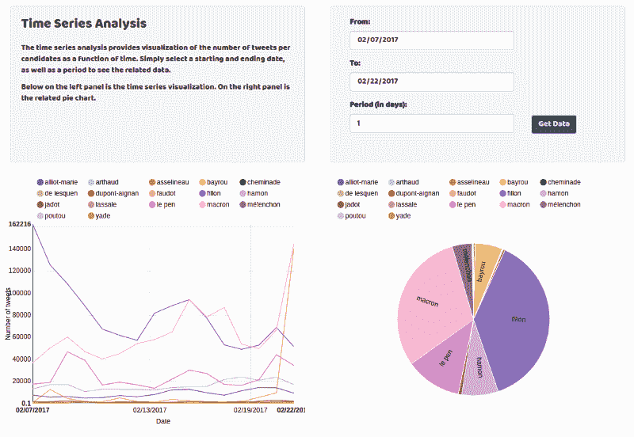
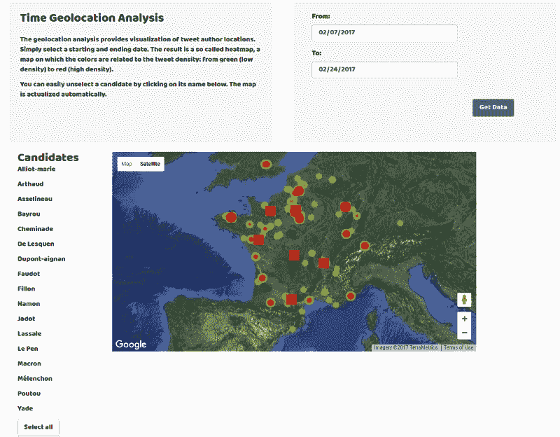
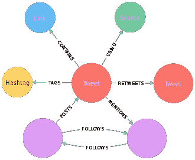

# 用 Python 在 Twitter 上监控法国总统选举

> 原文：<https://www.freecodecamp.org/news/monitoring-the-french-presidential-election-on-twitter-with-python-6a2a9310e6f4/>

由罗曼·塔利诺

# 用 Python 在 Twitter 上监控法国总统选举


The 16 French Presidential candidates. Photos from Reuters.

不久前，我读了 Laurent Luce 的这篇好文章，他解释了他是如何实现一个系统来收集与 2012 年法国总统选举相关的推文。文章写得非常好，强烈推荐阅读。

这让我有了为 2017 年大选实施类似措施的想法。但是我想增加一些功能:

*   我想使用图形数据库，而不是使用 SQL 数据库来存储数据。主要原因是试验这样一个系统，但很容易看出这是一个非常适合社交媒体数据的系统。
*   我希望能够实时监控数据。实际上，这意味着数据需要在到达时进行处理。这还包括将分析后的数据提供给具有数据可视化的网站。
*   理想情况下，我想对推文进行情感分析。我会训练一个学习算法，并沿着数据管道实现它，以实时提供其结果。



[Time Series Analysis](https://www.auguratech.com/#/twitter/time_series)

我设法建造了这一切。你可以去[我的个人网站](https://www.auguratech.com/#/twitter)上看看是什么样子。到目前为止，有两个简单的分析:

*   [第一个](https://www.auguratech.com/#/twitter/time_series)是时间序列分析，它显示了每个候选人的推文数量作为日期的函数。除了能够选择开始/结束日期和时间段之外，您还可以通过在可视化视图中单击候选人的姓名来显示您希望看到的候选人。
*   [第二个分析](https://www.auguratech.com/#/twitter/geospatial)显示推文的地理位置。选项相对类似于第一个分析。



[Tweet geolocation analysis](https://www.auguratech.com/#/twitter/geospatial)

为了从 Twitter 上收集数据，我使用了类似于 Laurent Luce 的方法。我将向您展示我采用的不同方法，而不是关注相似之处。

#### 将推文存储在图形数据库中

正如我所说的，我希望将数据存储在图形数据库中。我选择了用 [Neo4J](https://neo4j.com/) 。在图形数据库中，数据使用节点、边和属性结构的组合来建模。



[Image credit](http://network.graphdemos.com/)

在我们的例子中，节点可以代表一条 tweet、一个用户甚至一个标签。它们可以用标签来区分。节点之间的关系是通过边连接它们来处理的。例如，用户节点可以通过帖子关系连接到 tweet 节点。

这种关系是定向的。一条推文不能发布一个用户，但可以提到一个用户。

最后，节点和边(关系)都可以拥有属性。例如，一个用户有一个名字，一条 tweet 有文本。

当与图形数据库交互时，对象图映射器(OGM)特别有用。在这个项目中，我一直在使用 [Neomodel](https://github.com/robinedwards/neomodel) 。它公开了一个相对类似于 Django 模型 API 的 API。您将模型定义为:

如您所见，属性和关系都已定义。我邀请您查看我的 github repo 中的模型文件，查看完整的数据模型定义。

Neo4J 是一个 NoSQL 数据库，它使用一种叫做 Cypher 的非 SQL 查询语言。这是一种非常简单的语言。例如，以下查询将返回用户发布的包含单词“fillon”(候选之一)的所有 tweets:

```
MATCH (u:User)-[:POSTS]->(t:Tweet) WHERE t.text contains "fillon" return t
```

Neomodel 是一个 OGM，它提供了一个 API，所以你不必手动编写很多查询。您可以通过运行以下命令获得与上面相同的结果:

```
Tweet.nodes.filter(text__contains="fillon")
```

#### 来自 Twitter 的流媒体

Twitter 提供了两种获取数据的方式。第一种是通过标准的 REST API。每个端点的访问都是有限的，因此这不是我们的首选解决方案。

幸运的是，Twitter 还提供了一个流媒体 API。通过设置一个过滤器，我们可以接收所有通过这个过滤器的推文(限制在 t 时刻发布的推文总量的 1%)。库 [Tweepy](https://github.com/tweepy/tweepy) 促进了这个过程。

正如您在 [my repo](https://github.com/romaintha/twitter/blob/master/twitter/streaming_api.py) 中看到的，您需要定义一个监听器类，它将在流式传输时触发一些动作。例如，每当一条 tweet 被流化时，就调用方法“on_status”。

此外，我定义了一个 Streaming 类，它的职责是向 Twitter 认证，用上面的监听器实例化一个 Tweepy 流，并公开一个方法来启动流。“start_streaming”方法接受一个“to_track”参数，这是一个要过滤的单词列表。

你必须用一堆参数实例化流类。除了 Twitter API 凭证，您还需要“pipeline”和“batch_size”参数。后者是一个指定一次处理的 tweets 数量的数字。

由于处理一条 tweet 需要将它保存到 Neo4J 中，因此逐个处理是一项非常昂贵的操作。以 100 个为一批(在某些情况下甚至更多)保存它们可以显著提高性能。

“pipeline”参数必须是对一个函数的引用，该函数将接收一批 tweets。在里面，你可以自由地做任何你想做的事。我在 [utils.py](https://github.com/romaintha/twitter/blob/master/twitter/utils.py) 模块中提供了一个例子。

如您所见，这个函数调用了在 [tasks.py](https://github.com/romaintha/twitter/blob/master/twitter/tasks.py) 模块中定义的异步 Celery 任务。[芹菜](http://www.celeryproject.org/)是 Python 分布式任务队列库。我把它和 [RabbitMQ](https://www.rabbitmq.com/) 一起用作消息代理。那么它是如何工作的呢？让我们回到 [utils.py](https://github.com/romaintha/twitter/blob/master/twitter/utils.py) 模块中的“streaming_pipeline”函数，并关注这一行:

```
bulk_parsing.delay(users_attributes, tweets_attributes)
```

在处理这一行时，不是同步处理“bulk_parsing”函数，而是将一条消息发布给一个代理(这里是 RabbitMQ)。它允许消费者(工作人员)检索这些消息，从而异步和并行地处理“bulk_parsing”任务。为什么会这样？因为它支持 tweet 处理的水平扩展。如果消息积累的速度超过了您的处理速度，您可以添加更多的工作人员来帮助处理它们。

最后说一句。我希望流程尽可能地通用，也就是说，如果流程需要更改——或者需要添加一些东西——它必须很容易做到。在这种情况下，我可以只更改“streaming_pipeline”函数并添加一些异步任务。修改起来又快又方便。

感谢阅读！

*   请务必查看我的 Github repo 中的代码[。](https://github.com/romaintha/twitter)
*   你可以在我的网站上看到所有这些活动[，在那里我用它来提供一些分析。](http://network.graphdemos.com/)