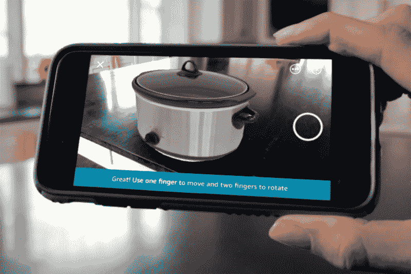
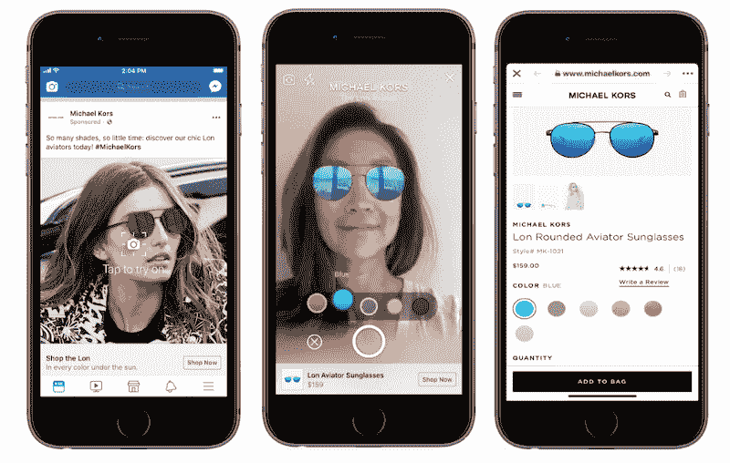
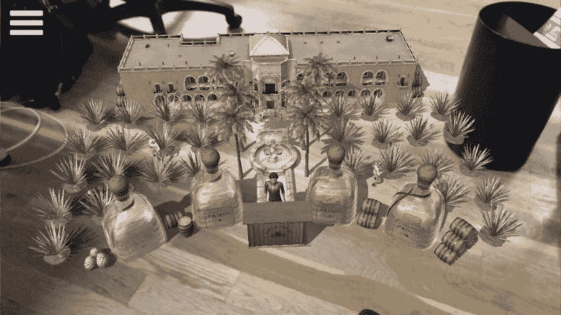
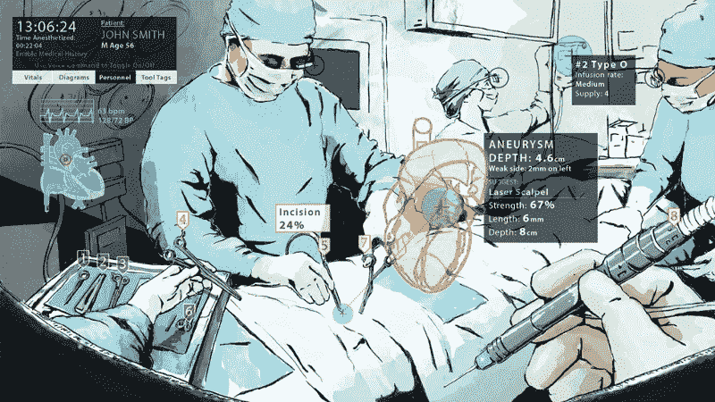
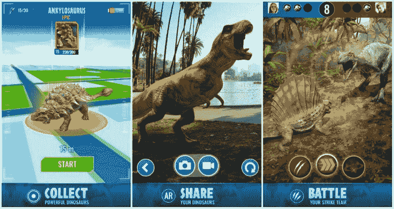

# 更多隐藏在众目睽睽之下的“未来”技术:增强现实

> 原文：<https://www.freecodecamp.org/news/more-future-tech-thats-hiding-in-plain-sight-augmented-reality-fd9680391e8f/>

作者詹姆斯·许

# 更多隐藏在众目睽睽之下的“未来”技术:增强现实

正如我在上一篇关于热门未来技术的文章中所讨论的，人工智能(AI)、增强现实(AR/VR)、区块链和物联网(IoT)似乎离主流采用还有很长的路要走。

像 **Ready Player One** 和 **Avengers: Infinity Wars** 这样的电影只是通过将现实技术与幻想相结合来延续这种看法，使我们在现实世界中使用的技术在这个过程中显得原始。

然而现实呢？

人工智能、AR/VR、区块链和物联网已经在我们的日常生活中扮演着重要的角色，无数的例子隐藏在显而易见的地方。

在我们系列的第一部分中，我们探索了人工智能(AI)是如何深入整合到我们日常使用的应用程序中的。在本文中，我们将深入探讨**增强现实(AR)。**

### 什么是增强现实？

不要与 100%由计算机生成的图像驱动的虚拟现实(VR)相混淆，**增强现实(AR)** 是一种将计算机生成的视觉效果与用户对真实世界的实时视图相结合的技术，从而产生一种复合视图。

The Pixels movie was a somewhat loose interpretation of augmented reality.

在很大程度上，今天的 AR 意味着通过智能手机等设备的镜头来体验。(微软试图推广头戴式 AR，或其所谓的“混合现实”，在一些领域正在获得牵引力，但仍可被视为小众。)

现代智能手机配备了享受迷人 AR 体验所需的一切:

*   用于提供真实世界的视频馈送的数码相机。
*   存储和运行软件应用程序的计算机。
*   一个强大的处理器能够**计算机视觉** (CV)，用于将计算机生成的图像准确地放置到真实世界中。
*   能够显示实时合成视图的高分辨率显示器。
*   陀螺仪传感器，用于感测方向变化，使合成视图更具吸引力/动态性。

如今，体验有意义的 AR 应用所需的所有硬件都可以在任何现代智能手机中找到，这一事实带来了巨大的商机。

### 电子商务中的 AR

把辛苦赚来的钱花在你从未亲眼见过的家具上可能会很有挑战性。而且，即使你已经亲自看过一件家具，问题仍然存在，可能会阻止你扣动购买的扳机。

与我的咖啡桌和边桌搭配会怎么样？对我的客厅来说是不是太传统了？在花卉墙纸和粗毛地毯的映衬下，这种颜色会显得俗气吗？

同样，在时尚电子商务中，如果你不去试衣间看看它是否与你穿的牛仔裤和靴子相配，你怎么知道那件名牌夹克穿在你身上是否真的好看？

这就是 AR 的用武之地。

像[亚马逊](https://www.amazon.com/adlp/arview)、[宜家](https://highlights.ikea.com/2017/ikea-place/)和[塔吉特](https://techcrunch.com/2017/10/24/target-adds-ar-shopping-to-its-mobile-website/)这样的公司已经在他们的移动应用程序中添加了 AR 功能，允许你将虚拟物体“放置”到你的环境中，预览它们在你家里或办公室中的实际外观。你可以把一个虚拟花瓶放在你实际的咖啡桌上(多亏了平面探测)，或者毫不费力地把一个虚拟衣柜推到你卧室的墙上。

Native mobile ecommerce apps can be upgraded to provide AR previews, as Amazon has done on both iOS and Android.

在时尚界，迈克高仕将利用脸书基于 AR 的广告活动，为用户提供一种简单的方式，让他们在购买前“试戴”太阳镜和其他时尚商品。

Soon, any Facebook advertiser will be able to launch AR-based ad campaigns.

允许购物者试用 AR 商品的电子商务公司认为，这样做将大大提高转化率，从而有助于增加销售收入。

### 营销和广告中的 AR

即使在以转换为中心的电子商务世界之外，企业也发现增强现实可能是吸引和吸引潜在客户的完美方式。

Snapchat 的摄影爱好者 Snap 已经部署了一个名为 Lens Studio 的商业平台，允许企业“创建品牌化的 AR 体验”。Snapchat 的 AR 体验是基于 AR 的相机滤镜，称为“镜头”，Snapchat 用户已经非常熟悉，部分原因是早期的镜头，如互联网轰动一时的“跳舞的热狗”。

下面是宝马的 Snapchat 镜头:

脸书也已经开始与选定的客户(包括之前提到的迈克高仕)测试基于 AR 的广告，预计将在 2018 年晚些时候向更广泛的广告客户提供 AR 广告活动。早期结果很有希望。华硕报告称，其基于增强现实的测试活动[的参与度是其非增强现实对手](https://www.mobilemarketer.com/news/michael-kors-is-first-to-test-ar-ads-in-facebook-news-feed/527504/)的 10 倍。

除了这些平台，CPG 公司正在创建独立的 AR 体验，为食品或饮料产品带来活力，不为别的，只为增加客户参与度和制造轰动。墨西哥龙舌兰酒公司 Patrón 去年推出了一款 AR 应用，让你种植自己的龙舌兰田，从那里出现了一家酒厂和调酒师，告诉你你想知道的关于创造 Patrón 龙舌兰酒的一切。

The Patrón Experience lets you plant your own agave field and distillery on any flat surface.

对于计划新产品发布或企业活动的公司来说，增加 AR 体验可以帮助增加观众参与度和媒体报道。

想想三星的 Galaxy S9 产品发布会，与会者能够见证他们的姓名徽章变成虚拟的交互式 Galaxy S9 手机，就在他们的手中。

### 工业和医疗程序中的 AR

即使你不是工业技术人员或外科医生，你也可能理解这些职业固有的复杂性。走错一步，就会有生命危险。

多亏了 AR，对于这些专业人士来说，事情变得简单多了。

能源巨头 BP 已经开始[使用 AR 帮助现场的技术人员](https://www.fieldbit.net/news/fieldbit-expands-collaboration-with-bp-to-deploy-smart-glasses-and-fieldbit-hero/)进行设备维护。借助这项新技术，BP 工程师可以佩戴 ar 耳机，将实时视频传输给远程专家，远程专家可以诊断问题，然后将相关说明和图表实时放到现场技术人员的视野中(通过 AR 耳机)。这使得技术人员可以腾出手来进行必要的维修。

类似的用例正在医疗领域中开发[，其中 ar 耳机可以提供关于外科手术和重要健康信息的实时和免提信息，而无需将目光从患者身上移开。](https://hbr.org/2018/03/how-augmented-reality-will-make-surgery-safer)

A glimpse of what AR-enabled surgery might look like. Source: The Augmentarium at the University of Maryland (illustration by Brian G. Payne)

### AR 游戏

自从 Pokemon Go 首次凭借其地理定位和基于 AR 的探索的杀手组合占领世界以来，已经过去了两年，它允许每个男人，女人和孩子在现实世界中实现他们的 Pokemon trainer 幻想。

Pokemon Go 的大受欢迎([至今收入近 20 亿美元](https://variety.com/2018/gaming/news/pokemon-go-2-years-1-billion-1202867409/))激起了对 AR 游戏的大量兴趣和资金。

《侏罗纪世界:活着》于今年早些时候推出，与《口袋妖怪 Go》流行的基于地点和以收集为导向的游戏没有太大差异。

Pokemon Go, but with dinosaurs?

一款《行尸走肉》AR 手游([行尸走肉:我们的世界](https://www.thewalkingdeadourworld.com/))上个月刚刚推出，Pokemon Go 创作者 Niantic 预计将于今年某个时候在[推出基于 AR 的《哈利·波特:巫师团结》](https://www.forbes.com/sites/davidthier/2018/07/02/harry-potter-wizards-unite-release-date-when-will-niantics-next-big-game-come-out/#12a0a9e65cde)。

不可否认，当今 AR 游戏的一个主要弱点是，AR 组件对于核心游戏来说往往不是必不可少的。

新发布的《行尸走肉:我们的世界》是一款“ar 可选”游戏——在这款游戏中，绝大多数用户似乎完全跳过了 AR 模式(部分原因是它对游戏的进展不是必不可少的，但也因为 AR 模式似乎与平面检测斗争。)

即使是拥有出色 AR 体验的 Pokemon Go 也是 AR 可选的。你可以在不启动 AR 模式的情况下抓住口袋妖怪，尽管发现一只稀有的口袋妖怪坐在你的洗衣机上更令人愉快。

其中一些限制是应用程序所基于的软件开发工具包(SDK)所固有的。苹果的 ARKit 和谷歌的 ARCore SDKs 分别决定了今天 iOS 和 Android 设备上移动 AR 体验的天花板。

不过，两家公司似乎都致力于增强对更丰富的 ar 体验的支持。

今年早些时候宣布的苹果 arKit 2 将允许更好的基于 AR 的游戏体验。

例如，考虑这个基于 ARKit 2 的 AR 游戏的苹果演示，其中多个玩家能够在“共享体验”中与相同的虚拟对象进行交互。当涉及到多人 AR 游戏时，这种机制打开了一个可能性的宇宙。

### 为什么 AR 会比 VR 更快获得主流采用

大多数现代智能手机都标配了你现在体验有意义的 AR 所需的每个硬件组件。

这种低准入门槛与虚拟现实(VR)形成鲜明对比。

要让 VR 工作，用户必须拥有一个虚拟现实耳机，它使用户能够看到虚拟世界，同时屏蔽掉现实世界的所有痕迹。VR 头戴设备通常与运行 VR 应用程序的计算机或电话分开购买。虽然低端虚拟现实体验可以使用智能手机插入廉价的虚拟现实耳机(如 15 美元的谷歌 Cardboard)，但更身临其境和可信的虚拟现实体验(例如 Oculus Rift 和 HTC Vive)需要现代游戏电脑和耳机，总成本可能超过 1500 美元。

AR 超过 VR 的另一个优势是它的多功能性。

AR 应用程序是为各种各样的真实世界用例而设计的。而且，因为在使用 AR 时，你可以保持对实际环境的可见性，所以安全不是一个大问题——至少不会比你在玩 Candy Crush 或在 Instagram feed 上聊天时更重要。

另一方面，虚拟现实最好是在没有其他人的房间里享受，与台式电脑和运动传感器等设备相连。这限制了虚拟现实的用途，将虚拟现实降级为游戏、娱乐和复杂的商业或政府模拟(例如航空或军事训练)的用例。

以下是苹果首席执行官蒂姆·库克如何解释他对 AR 相对于 VR 的看好:

> “AR 让我非常兴奋，因为我可以在任何地方看到它的用途。我可以看到它在教育、消费、娱乐和体育方面的用途。在我所了解的每一个行业中，我都能看到这一点。我也喜欢[AR]不孤立。我不喜欢我们的产品被大量使用。我喜欢我们的产品放大我们。我认为 AR 可以帮助扩大人类的联系。我从来不是这样的虚拟现实粉丝，因为我认为它恰恰相反。虚拟现实显然有一些很酷的利基类的东西。但在我看来并不深刻。AR 是深刻的。”

### AR 的可及性也很深远

尽管有些 AR 体验令人瞠目结舌，令人瞠目结舌，但 AR 体验实际上并不难创造或享受。

从消费者的角度来看(需求方)，任何拥有现代智能手机的人都可以下载支持 AR 的应用程序，并开始享受增强现实的好处。

从业务方面(供应方面)来看，创建 AR 体验就像与具有 AR/VR 开发能力的[知名软件公司合作](https://citrusbits.com/)一样简单。

最难的部分，就像新兴技术经常遇到的那样，是开始的时候。