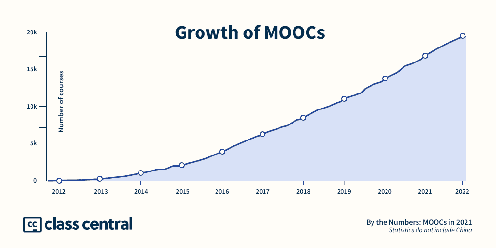
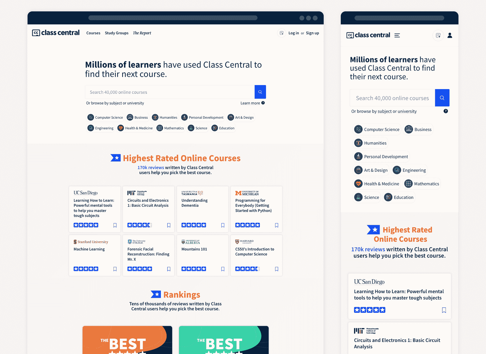

# 年度 100 大免费大学课程(按受欢迎程度排名)

> 原文：<https://www.freecodecamp.org/news/most-popular-free-online-courses/>

很久以前的 2012 年，一些斯坦福大学的教授决定在网上免费提供他们的课程。

媒体将这些课程命名为“mooc”——大规模开放在线课程。他们称 2012 年为“[MOOC](https://www.classcentral.com/report/mooc-hype-year-1/)年”

十年后的今天，MOOC 生态系统已经覆盖了来自约 1000 所大学的 2.2 亿名学习者和 19.4 万门课程。我一直在给在线教育网站 Tripadvisor 的[课堂中心](https://www.classcentral.com/)的课程分类。我们已经帮助超过 5000 万的学习者找到了他们的下一门课程。[我们刚满 10 岁](https://www.classcentral.com/report/class-central-2021-review/)！

如果你对这些课程不感兴趣，要么通过我们的[科目页面](https://www.classcentral.com/subjects)浏览 Class Central 的 50，000 门在线课程的广泛目录，要么看看我们策划的[课程集](https://www.classcentral.com/collections)。

[Class Central Homepage](https://www.classcentral.com/)

## 我的课程排名方法

首先，我浏览了班级中心的数据库，列出了 2021 年首次开设的所有课程。大约有 2900 门课程。

然后，我编写了刮刀来收集四个不同提供商的注册人数:Coursera、edX、FutureLearn(一个大型欧洲 MOOC 平台)和 Swayam(一个大型印度 MOOC 平台)。它们都在课程页面上显示有多少学生注册。

这些提供商在 2021 年推出的课程注册人数总计超过 680 万。

广受欢迎的 MOOC 讲师芭芭拉·奥克利教授的两门课程也榜上有名。这些课程，即[不凡的感觉教学](https://www.classcentral.com/course/uncommon-sense-teaching-46410)和[像专家一样学习](https://www.classcentral.com/course/learn-like-a-pro-science-based-tools-to-become-be-40292)，也是中央课堂[最佳时间汇编](https://www.classcentral.com/collection/top-free-online-courses)的一部分。

事不宜迟，以下是...

## 最受欢迎的免费在线课程

以下是 2021 年推出的最受欢迎的免费在线课程(按受欢迎程度排序)。

[**Excel for Everyone: Core Foundations**](https://www.classcentral.com/course/excel-for-everyone-core-foundations-32133)
*The University of British Columbia via edX*
Learn Excel fundamentals including data wrangling, spreadsheet management, and basic data analysis.

[**Introduction to Statistics**](https://www.classcentral.com/course/stanford-statistics-33479)
*Stanford University via Coursera*
You will gain the foundational skills that prepare you to pursue more advanced topics in statistical thinking and machine learning.

[**Inglés para todos: nivel básico**](https://www.classcentral.com/course/ingles-para-todos-nivel-basico-46392)
*Universidad del Rosario via edX*
Este curso te proporciona herramientas para que inicies tu aprendizaje de inglés desde las expresiones y estructuras más básicas.

[**CS50's Introduction to Programming with Scratch**](https://www.classcentral.com/course/cs50s-introduction-to-programming-with-scratch-39309)
*Harvard University via edX*
A gentle introduction to programming that prepares you for subsequent courses in coding.

[**The Digital Marketing Revolution**](https://www.classcentral.com/course/digital-marketing-revolution-54370)
*University of Illinois at Urbana-Champaign via Coursera*
This course examines this issue by asking how the Digital Revolution has impacted marketing in an analog world. The learning approach will be highly interactive, meaning that you will have both the opportunity to engage in a variety of hands-on activities and to participate as a member of a rich learning community.
★★★★★ ([7 ratings](https://www.classcentral.com/course/digital-marketing-revolution-54370#reviews))

[**Financial Accounting**](https://www.classcentral.com/course/edx-financial-accounting-18040)
*Massachusetts Institute of Technology via edX*
How do investors, creditors, and other users analyze financial statements to assess corporate performance? Learn financial accounting, how to read financial statements, and how to gather inputs to valuation models.

[**Early Childhood Development: Global Strategies for Implementation**](https://www.classcentral.com/course/early-child-development-global-strategies-for-imp-27971)
*Harvard University via edX*
Examine best practices in child and family policies, advocacy, financing, and pathways to scale—learning how to generate innovative, scalable intervention strategies that supports early childhood development. Together, Harvard University and UNICEF bring global experience from communities to policy makers, evidence and experts from around the world.

[**Mental Health and Nutrition**](https://www.classcentral.com/course/mental-health-and-nutrition-22097)
*University of Canterbury via edX*
Learn what foods and nutrients should and should not be consumed to improve mental wellbeing and explore the fundamental role that nutrition plays in our mental health.

[**Mathematical Methods for Quantitative Finance**](https://www.classcentral.com/course/edx-mathematical-methods-for-quantitative-finance-18041)
*Massachusetts Institute of Technology via edX*
Learn the mathematical foundations essential for financial engineering and quantitative finance: linear algebra, optimization, probability, stochastic processes, statistics, and applied computational techniques in R.

[**Remote Work Revolution for Everyone**](https://www.classcentral.com/course/remote-work-37070)
*Harvard Business School via edX*
In Remote Work Revolution for Everyone, you will learn to excel in the virtual-work landscape. You will learn how to build trust, increase productivity, use digital tools intelligently, and remain fully aligned with your remote team.

[**A Bridge to the World: Korean Language for Beginners Ⅰ**](https://www.classcentral.com/course/korean-beginners-35056)
*Sungkyunkwan University via Coursera*
This course is an introductory course to Korean language that aims to cultivate basic communication skill for those that are interested in learning Korean language.

[**Food Fermentation: The Science of Cooking with Microbes**](https://www.classcentral.com/course/fermentation-cooking-with-microbes-32763)
*Harvard University via edX*
In Food Fermentation: The Science of Cooking with Microbes, explore the roles that microbes play in the production, preservation, and enhancement of diverse foods in a variety of culinary traditions, and learn about the history of food fermentations.

[**Fundamentals of Digital Marketing**](https://www.classcentral.com/course/fundamentals-of-digital-marketing-21883)
*University System of Maryland via edX*
Learn the varied and changing approaches to digital marketing, such as mobile and omnichannel marketing and attribution and marketing mix modeling to inform your organization’s digital marketing strategy.

[**Entrepreneurship Adventures - مغامرات ريادة الأعمال**](https://www.classcentral.com/course/entrepreneurship-adventures-45218)
*King Abdullah University of Science and Technology (KAUST) via edX*
خلال ثمانية أسابيع ستساعدك دورة مغامرات ريادة الأعمال على تطوير فكرك الريادي وبناء فريق عمل متكامل والانطلاق بمشروعك الناشئ. تمنحك هذه الرحلة تجربة مثيرة تضعك في غرفة التحكم لتختبر قدرتك على اتّخاذ القرارات اليومية والمصيرية التي يواجهها رواد الأعمال عند الانطلاق بمشاريعهم الناشئة. ستخوض في كل أسبوع مغامرة شيقة لتتحدى أفكارك المسبقة عن ريادة الأعمال وتختبر قدراتك القيادية وتتعلم من مغامرات أصحاب المشاريع الريادية. بنهاية هذه المغامرة سجد فرصتك لبداية مشروعك الريادي!

[**Human Resources Analytics**](https://www.classcentral.com/course/human-resources-analytics-32615)
*University of California, Irvine via Coursera*
This course focuses on identifying effective data sources, developing meaningful metrics, designing long-term measures, and applying results in support of organizational strategy and tactics.

[**IELTS Writing Section Skills Mastery**](https://www.classcentral.com/course/ielts-writing-40666)
*University of California, Irvine via Coursera*
The lessons in this course will improve your overall skills in writing and prepare you for every type of writing prompt on the test, increasing your chances of getting your target band score.

[**Derivatives Markets: Advanced Modeling and Strategies**](https://www.classcentral.com/course/edx-derivatives-markets-advanced-modeling-and-strategies-18042)
*Massachusetts Institute of Technology via edX*
Financial derivatives are ubiquitous in global capital markets. Students will obtain a sophisticated understanding of valuation methods; tools for quantifying, hedging, and speculating on risk; and a basic familiarity with major markets and instruments.

[**Data Analysis: Statistical Modeling and Computation in Applications**](https://www.classcentral.com/course/statistics-computation-and-applications-22414)
*Massachusetts Institute of Technology via edX*
A hands-on introduction to the interplay between statistics and computation for the analysis of real data. -- Part of the MITx MicroMasters program in Statistics and Data Science.

[**Blended and Online Learning Design**](https://www.classcentral.com/course/blended-and-online-learning-design-26559)
*University College London via FutureLearn*
Learn to develop the best pedagogy for your students using blended and online learning methods.

[**JavaScript Basics**](https://www.classcentral.com/course/javascript-basics-36577)
*University of California, Davis via Coursera*
This course introduces the programming language JavaScript and shows the websites that include the type of interactions students will eventually be able to develop.  Learners will understand the importance of how JavaScript was developed and why such history impacts the way JavaScript is currently written and in future releases.

[**Low-Budget Video Production: Visual Communication for Small Charities**](https://www.classcentral.com/course/low-budget-video-production-for-small-charities-33568)
*The Open University via FutureLearn*
Understand how video can expand and enhance your organisation’s communications and develop practical skills for your productions.

[**UX Design**](https://www.classcentral.com/course/edx-ux-design-21087)
*HEC Montréal via edX*
Master Design Thinking and UX Design through user-centred design to deliver innovative user experiences. Learn divergent ideation methods to bring creativity to problem-solving, and convergent ideation methods to innovate within your business context.

[**Essentials Of Data Science With R Software - 1: Probability And Statistical Inference**](https://www.classcentral.com/course/swayam-essentials-of-data-science-with-r-software-1-probability-and-statistical-inference-22970)
*Indian Institute of Technology Kanpur via Swayam*
Any data analysis is incomplete without statistics. After getting the data, the statistical tools aims to extract the information hidden inside the data.

[**Foundations of Modern Finance II**](https://www.classcentral.com/course/edx-foundations-of-modern-finance-ii-18039)
*Massachusetts Institute of Technology via edX*
Learn fundamental principles of modern finance, including valuation models, methods for risk analysis, derivative instruments and investment management.

[**Excel for Everyone: Data Management**](https://www.classcentral.com/course/excel-for-everyone-data-management-32132)
*The University of British Columbia via edX*
Further your Excel skills to manage larger datasets and more complex data wrangling, management and modelling.

[**Academic English**](https://www.classcentral.com/course/academic-english-ace101x-44685)
*University of Queensland via edX*
A practical and introductory course to build your skills in academic writing.
★★★★★ ([1 rating](https://www.classcentral.com/course/academic-english-ace101x-44685#reviews))

[**Online Advertising & Social Media**](https://www.classcentral.com/course/online-advertising-social-media-21885)
*University of Maryland, College Park via edX*
Learn how to develop Online Advertising Ecosystems complete with Social Media/Social Network and Media Big Data analysis for better decision making in all forms of outreach.

[**Arduino para niños ¡vamos al espacio!**](https://www.classcentral.com/course/arduino-para-ninos-y-jovenes-55121)
*The Pontificia Universidad Javeriana via edX*
El curso de Arduino está orientado a público infantil y juvenil; los exploradores, es decir, los estudiantes, serán invitados a participar en varias misiones para que una nave espacial llegue a la tierra sana y salva.

[**Excel Power Tools for Data Analysis**](https://www.classcentral.com/course/excel-power-tools-35045)
*Macquarie University via Coursera*
Welcome to Excel Power Tools for Data Analysis. In this four-week course, we introduce Power Query, Power Pivot and Power BI, three power tools for transforming, analysing and presenting data.

[**Digital Marketing Analytics: Tools and Techniques**](https://www.classcentral.com/course/digital-marketing-analytics-tools-and-techniques-21884)
*University of Maryland, College Park via edX*
Learn how to leverage leading tools and approaches to digital marketing data analysis. Dive into SEO and Paid search strategies, web analytics, online testing, machine learning and AI/Big Data applications to strengthen your digital marketing efforts and leverage your resources most effectively.

[**Database Design and Basic SQL in PostgreSQL**](https://www.classcentral.com/course/database-design-postgresql-37623)
*University of Michigan via Coursera*
In this course you will learn more about the historical design of databases and the use of SQL in the PostgreSQL environment.

[**Game Design and Development 1: 2D Shooter**](https://www.classcentral.com/course/game-design-and-development-1-32228)
*Michigan State University via Coursera*
If you love games and want to learn how to make them, then this course will start you down that path.

[**Deploying TinyML**](https://www.classcentral.com/course/edx-deploying-tinyml-21643)
*Harvard University via edX*
Learn to program in TensorFlow Lite for microcontrollers so that you can write the code, and deploy your model to your very own tiny microcontroller. Before you know it, you’ll be implementing an entire TinyML application.

[**像专家一样学习:基于科学的工具变得更擅长任何事情**](https://www.classcentral.com/course/learn-like-a-pro-science-based-tools-to-become-be-40292)
*via edX*
你是否花了太多时间学习，结果却令人失望？你会因为无聊和容易分心而推迟学习吗？这个课程是为你准备的！
★★★★([89 评分](https://www.classcentral.com/course/learn-like-a-pro-science-based-tools-to-become-be-40292#reviews))

[**Excel for every one:数据分析基础**](https://www.classcentral.com/course/excel-for-everyone-data-analysis-fundamentals-32131)
*英属哥伦比亚大学通过 edX*
执行高级数据角力、分析和仪表盘可视化，帮助驱动战略决策。

[**数据结构&算法一:数组列表、链接列表、堆栈和队列**](https://www.classcentral.com/course/data-structures-algorithms-i-arraylists-linkedlis-23256)
*佐治亚理工学院 via edX*
工作原理数据存储在数组、数组列表&链接列表节点中。通过可视化了解它们的操作和性能。用递归方法实现低级线性、链接的数据结构，并探索它们的边缘情况。将这些结构扩展到抽象数据类型、堆栈、队列和队列。

[**Uncommon Sense Teaching**](https://www.classcentral.com/course/uncommon-sense-teaching-46410)
*via Coursera*
You’ll discover why you should help students use two different neural routes to help them be both flexible and fast in their learning.
★★★★★ ([149 ratings](https://www.classcentral.com/course/uncommon-sense-teaching-46410#reviews))

[**Methods of molecular biology**](https://www.classcentral.com/course/methods-of-molecular-biology-25374)
*St. Petersburg State Polytechnic University via Coursera*
This multidisciplinary course will be interesting for students and specialists in the field of chemistry, ecology, mathematics, physics, medicine, and legal sciences, as well as to a wider audience, since it reveals various aspects of molecular biology and its methodological tools in an interesting and comprehensive language.

[**Scripting with Python**](https://www.classcentral.com/course/scripting-with-python-32104)
*Southern New Hampshire University via edX*
Explore fundamental programming with hands-on activities that help you build applications using Python.

[**Get Started With Digital Marketing**](https://www.classcentral.com/course/beginning-your-digital-marketing-journey-22101)
*Coventry University via FutureLearn*
What is digital marketing and why is it so valuable to businesses in today’s world? Find out with Coventry University Online.

[**Building your Screenplay**](https://www.classcentral.com/course/edx-building-your-screenplay-21286)
*University of Cambridge via edX*
Learn to strengthen you skills as a screenwriter, while diversifying your knowledge and understanding of the demands of global film and TV production.

[**Cybersecurity for Everyone**](https://www.classcentral.com/course/cybersecurity-for-everyone-43819)
*University of Maryland, College Park via Coursera*
Cybersecurity is not only for computer scientists and engineers. And it affects everyone. If you want your organization to understand how to better address your cybersecurity, this is the course for you and your colleagues to take -- especially your non-technical colleagues.

[**CAD/CAM Computer Aided Design / Computer Aided Manufacturing**](https://www.classcentral.com/course/swayam-cad-cam-computer-aided-design-computer-aided-manufacturing-22925)
*IGNOU via Swayam*
The Computer Aided design (CAD) is a Process use of Computers and software’s to aid in the creation, Modification, Analysis, or Optimization of a design.

[**Programación en Python**](https://www.classcentral.com/course/programacion-python-32745)
*Universidad de los Andes via Coursera*
¡Te damos la bienvenida al curso de Programación en Python de la Universidad de los Andes!

[**Launch Your Online Business**](https://www.classcentral.com/course/launch-online-business-39285)
*State University of New York via Coursera*
Learners who complete the course will gain an understanding of different business models, learn strategies for naming their business, and so on.

[**Operations Research (1): Models and Applications**](https://www.classcentral.com/course/operations-research-modeling-33417)
*National Taiwan University via Coursera*
This course introduces frameworks and ideas about various types of optimization problems in the business world. In particular, we focus on how to formulate real business problems into mathematical models that can be solved by computers.

[**С/C++ for competitive programming**](https://www.classcentral.com/course/c-for-competitive-programming-34329)
*Moscow Institute of Physics and Technology via Coursera*
The "C/C++ for competitive programming" online course will introduce the basic concepts of the language, such as variables, data types.

[**Penetration Testing - Discovering Vulnerabilities**](https://www.classcentral.com/course/edx-penetration-testing-discovering-vulnerabilities-21433)
*New York University (NYU) via edX*
Learn fundamentals of penetration testing, including an Introduction to Penetration Testing Methodologies, Recognisance and Enumeration for Penetration Testers, Scanning and Vulnerability Enumeration.

[**Introduction to Object-Oriented Programming with Java I: Foundations and Syntax Basics**](https://www.classcentral.com/course/introduction-to-java-programming-i-foundations-an-23279)
*Georgia Institute of Technology via edX*
Learn the foundational basics of the Java programming language.

[**Principles of Engineering**](https://www.classcentral.com/course/principles-of-engineering-37681)
*King's College London via FutureLearn*
Gain a fascinating introduction to engineering principles and learn about key engineering skills, processes, and technologies.

[**Academic Writing in English for ESL Learners**](https://www.classcentral.com/course/academic-writing-for-learners-of-english-33498)
*University College London via FutureLearn*
Develop your academic writing skills in English as a second language (ESL) learner and advance your English writing at university.

[**Let's Get Started: Building Self-Awareness**](https://www.classcentral.com/course/edx-let-s-get-started-building-self-awareness-19743)
*University System of Maryland via edX*
Effective leaders know themselves well. They capitalize on their strengths and manage their weaknesses using self-awareness.Learn how self-aware you are and how you can use self-awareness to intentionally develop your management and leadership skills.
★★★★★ ([54 ratings](https://www.classcentral.com/course/edx-let-s-get-started-building-self-awareness-19743#reviews))

[**Essentials Of Data Science With R Software - 2: Sampling Theory And Linear Regression Analysis**](https://www.classcentral.com/course/swayam-essentials-of-data-science-with-r-software-2-sampling-theory-and-linear-regression-analysis-22971)
*Indian Institute of Technology Kanpur via Swayam*
The introductory tools of sampling theory and regression analysis are detailed in this course. How to use them with the popular free R statistical software R and what are the interpretations of the outcome is the objective of the course to be taught..  

[**Anatomy of the Upper and Lower Extremities**](https://www.classcentral.com/course/anatomy-extremeties-58598)
*Yale University via Coursera*
This course has two main parts, one for the lower extremity and the other for the upper extremity.  We will show how the various systems that supply and organize the limb control its function.

[**Advanced Fluid Mechanics 1: Fundamentals**](https://www.classcentral.com/course/advanced-fluid-mechanics-1-22514)
*Massachusetts Institute of Technology via edX*
Learn the fundamental principles underlying fluid dynamics; including the kinematics of deformation, hydrostatics & buoyancy, inviscid flow and the application of Bernoulli’s theorems, as well as applications of control volume analysis for more complex problems of engineering interest.

[**Marketing digital en redes sociales**](https://www.classcentral.com/course/marketing-digital-en-redes-sociales-40309)
*Universitat Politècnica de València via edX*
Aprende todo lo que necesitas saber para que tu marca o empresa se posicione en el mercado, obtenga nuevos clientes, aumente sus ventas y rentabilice al máximo la inversión de publicidad en redes sociales.
★★★★☆ ([10 ratings](https://www.classcentral.com/course/marketing-digital-en-redes-sociales-40309#reviews))

[**AI & Law**](https://www.classcentral.com/course/ai-law-27963)
*Lund University via Coursera*
The course aims to equip members of the general public with an elementary ability to understand the meaningful potential of AI for their own lives. The course also aims to enable members of the general public to understand the consequences of using AI and to allow them to interact with AIs in a responsible, helpful, conscientious way.
[**Manejo del enfermo semicrítico y crítico por COVID-19**](https://www.classcentral.com/course/covid-19-esp-32153)
*University of Barcelona via Coursera*
Después de realizar este curso serás capaz de conocer los elementos clave del abordaje del paciente crítico y semicrítico por COVID-19, basados en la evidencia científica disponible y que puedan ayudarte en la toma de decisiones clínicas.

[**工程师数值方法**](https://www.classcentral.com/course/numerical-methods-engineers-32822)
*香港科技大学 via Coursera*
课程包含 74 个简短的讲座视频和 MATLAB 演示。每次讲座或演示后，都有问题要解决或程序要编写。本课程分为六周，每周末都有一次评估测验和一个较长的编程项目。
★★★★([12 评分](https://www.classcentral.com/course/numerical-methods-engineers-32822#reviews))

[**Java 和面向对象编程简介**](https://www.classcentral.com/course/java-object-oriented-programming-22535)
*宾夕法尼亚大学 via Coursera*
本课程提供了 Java 语言和面向对象编程的简介，包括 Java 语法的概述以及它与 Python 等语言的区别。

[**用于搜索、排序和索引的算法**](https://www.classcentral.com/course/algorithms-searching-sorting-indexing-40796)
*科罗拉多大学博尔德 via Coursera*
本课程涵盖算法设计和分析的基础知识，以及用于排序数组、数据结构(如优先级队列)、哈希函数和应用程序(如 Bloom filters)的算法。

[**全球住房设计**](https://www.classcentral.com/course/global-housing-design-21893)
*代尔夫特理工大学通过 edX*
了解为可持续城市发展开发充足的住房和包容性居住环境所需的关键设计策略。

[**词形和一般现在时**](https://www.classcentral.com/course/word-forms-simple-present-tense-47949)
*加州大学欧文分校 via Coursera*
在这门课“词形和一般现在时”中，你将学习不同的词形，如名词、专有名词、复数形式和单数形式。你将学习何时使用冠词“a”和“an”

[**Professional Business Presentations**](https://www.classcentral.com/course/professional-business-presentations-32128)
*Doane University via edX*
Professional Business Presentations, will dive into the world of presenting information both in written and verbal form. This course discusses how to effectively create presentations with quality formatting, the proper design elements and organization.

[**Let’s Get Personal: Working with Personality Type**](https://www.classcentral.com/course/edx-let-s-get-personal-working-with-personality-type-19745)
*University System of Maryland via edX*
Effective leaders capitalize on their strengths & manage their weaknesses. Build your power skills by understanding the MBTI, personality type assessment, and how to use your type to your greatest advantage as an effective leader.
★★★★☆ ([5 ratings](https://www.classcentral.com/course/edx-let-s-get-personal-working-with-personality-type-19745#reviews))

[**Leadership: Creating Public Value**](https://www.classcentral.com/course/creating-public-value-56463)
*Harvard University via edX*
In Leadership: Creating Public Value, learn how to face and meet today’s challenges and design a public value proposition that is both actionable and value creating.

[**TOEFL Reading and Listening Sections Skills Mastery**](https://www.classcentral.com/course/toefl-reading-listening-sections-skills-mastery-40785)
*University of California, Irvine via Coursera*
This course prepares non-native speakers of English to take the reading and listening sections of the TOEFL iBT exam. This course takes a close look at every type of listening and reading question that you may encounter on the test and provides effective strategies for tackling each type.

[**Computer Vision and Image Processing – Fundamentals and Applications**](https://www.classcentral.com/course/swayam-computer-vision-and-image-processing-fundamentals-and-applications-22937)
*Indian Institute of Technology Guwahati via Swayam*
The intent of this course is to familiarize the students to explain the fundamental concepts/issues of Computer Vision and Image Processing, and major approaches that address them.  

[**Estrategias de Emprendimiento**](https://www.classcentral.com/course/estrategias-de-emprendimiento-40825)
*Tecnológico de Monterrey via Coursera*
Este curso busca ayudar al emprendedor a ser capaz de desarrollar un plan de operación y expansión, basado en la generación de objetivos de estabilización y crecimiento para su negocio, a partir de sus fortalezas y oportunidades detectadas, así como de un análisis de su situación actual, aprovechando así las oportunidades del entorno y adecuando su Modelo de Negocio y sus estrategias financieras, mismas que plasmará en un Pitch para presentar su plan a todos los Stakeholders actuales y futuros.

[**Efficient HVAC Systems**](https://www.classcentral.com/course/edx-efficient-hvac-systems-19388)
*Delft University of Technology via edX*
Learn how to decide on efficient combinations of energy conversion systems and how to distribute and control air and energy flows in buildings whilst minimizing carbon emissions and optimizing thermal comfort in close consideration with the architect.

[**Pre-University Physics**](https://www.classcentral.com/course/pre-university-physics-32823)
*Delft University of Technology via edX*
Prepare for your technical studies by reviewing the fundamentals of physics. Become familiar with the way physics and physics-related topics are taught at university level.

[**US-China Relations: Past, Present and Future**](https://www.classcentral.com/course/us-china-relations-past-present-and-future-22415)
*National University of Singapore via edX*
This course will provide an overview of the economic, military, political and cultural dimensions of the rising United States-China geopolitical contest. It will examine the strategic perspectives and mistakes of both countries, and suggest what can be done to prevent further escalation of the contest.

[**Cell Biology: Cellular organization, division and processes**](https://www.classcentral.com/course/swayam-cell-biology-cellular-organization-division-and-processes-22928)
*Indian Institute of Science Bangalore via Swayam*
This course focuses on cell organization, and the molecules and intracellular processes crucial for life and inheritance. A particular emphasis is on DNA transactions such as chromosome organization, replication, chromosome segregation, etc.  

[**Implant Dentistry**](https://www.classcentral.com/course/edx-implant-dentistry-17214)
*The University of Hong Kong via edX*
Learn Implant Dentistry from world-class specialists and researchers! Join the state of art in the biology, the technology and clinical management in implant dentistry today!

[**Digital Marketing and Data Driven Analytics**](https://www.classcentral.com/course/digital-marketing-and-data-driven-analytics-23300)
*Tecnológico de Monterrey via edX*
Digital Marketing is the backbone element which uses platforms and digital technologies, such as any kind of device to maintain connected to the users. Once the users are part of this ecosystem, the companies convert this random data in accurate algorithms to improve the effectiveness of any marketing campaign.

[**Foundations of Finance**](https://www.classcentral.com/course/foundations-of-finance-52903)
*University of Cambridge via edX*
This course provides a rigorous, but straightforward, introduction to the key concepts of financial understanding. Using real-world case studies and practitioner interviews, as well as timely knowledge checks, you will integrate your new knowledge and problem solving skills with practical application. No prior knowledge is required or assumed.

[**Effective Programming in Scala**](https://www.classcentral.com/course/effective-scala-39307)
*École Polytechnique Fédérale de Lausanne via Coursera*
Scala is an expressive and versatile programming language. In this course, you will learn how to get the most out of Scala to solve common programming tasks such as modeling business domains, breaking down complex problems into simpler problems, manipulating data, or running parallel tasks.

[**Algebra: Elementary to Advanced - Equations & Inequalities**](https://www.classcentral.com/course/algebra-i-44578)
*Johns Hopkins University via Coursera*
This course is intended for students looking to create a solid algebraic foundation of fundamental mathematical concepts from which to take more advanced courses that use concepts from precalculus, calculus, probability, and statistics.

[**R Programming Fundamentals**](https://www.classcentral.com/course/r-programming-fundamentals-40742)
*Stanford University via edX*
This course covers the basics of R: a free programming language and software environment used for statistical computing and graphics. R is widely used by data analysts, statisticians, and data scientists around the world.

[**Introducción a Power BI para los negocios**](https://www.classcentral.com/course/introduccion-a-power-bi-para-los-negocios-45216)
*Universitat Politècnica de València via edX*
Te presentamos los componentes de Power BI, te mostramos la herramienta gratuita Power BI Desktop y te enseñamos a usarla para cargar y tratar datos de diversas fuentes, relacionar los datos importados e incorporar medidas para extraer la información importante y manejar las visualizaciones gráficas más habituales y utilizar los filtros para presentarla de la mejor manera posible.
★★★★★ ([19 ratings](https://www.classcentral.com/course/introduccion-a-power-bi-para-los-negocios-45216#reviews))

[**Adaptive Markets: Financial Market Dynamics and Human Behavior**](https://www.classcentral.com/course/adaptive-markets-financial-market-dynamics-and-hu-22543)
*Massachusetts Institute of Technology via edX*
A completely new way of thinking about financial markets, institutions, and innovation that reconciles human behavior with market efficiency using concepts from evolutionary biology, cognitive neuroscience, and artificial intelligence.

[**Managing Conflicts on Projects with Cultural and Emotional Intelligence**](https://www.classcentral.com/course/edx-managing-conflicts-on-projects-with-cultural-and-emotional-intelligence-19747)
*University System of Maryland via edX*
Great program managers understand and heal bad communication habits and conflicts that arise within project teams and stakeholders. Learn how by leveraging emotional and cultural intelligence using the Coordinated Management of Meaning (CMM).
★★★★★ ([112 ratings](https://www.classcentral.com/course/edx-managing-conflicts-on-projects-with-cultural-and-emotional-intelligence-19747#reviews))

[**Basic construction materials**](https://www.classcentral.com/course/swayam-basic-construction-materials-22914)
*Indian Institute of Technology Madras via Swayam*
The course intends to provide basic information on the structure and properties of construction materials to undergraduate students. The contents of the course will focus on a fundamental understanding of the structure of common materials, the types of bonds, and mechanisms of damage and failure in materials.

[**UX Research**](https://www.classcentral.com/course/edx-ux-research-21092)
*HEC Montréal via edX*
In this MOOC you will learn how to connect with users at every step of a digital product’s life and how to develop empathy and recognize insights that will nourish the design and evaluation processes.

[**Crédito y cobranza**](https://www.classcentral.com/course/credito-32118)
*Universidad Nacional Autónoma de México via Coursera*
Este curso, ofrecido por la UNAM, se enfoca en la función crediticia, es decir, la importancia del crédito en el ciclo de los negocios, la determinación de necesidades de un departamento de crédito, las políticas de crédito, análisis de los solicitantes, así como su emisión, y todo lo relacionado con la recuperación de éstos, minimizando en todo momento los riesgos de incobrabilidad.

[**RF and millimeter-Wave Circuit Design**](https://www.classcentral.com/course/rf-mmwave-circuit-design-32152)
*Eindhoven University of Technology via Coursera*
This unique Master-level course offered by the Center for Wireless Technology Eindhoven (CWT/e) of the Eindhoven University of Technology, The Netherlands, provides students with in-depth knowledge and hands-on experience on RF and mmWave circuit design.

[**体育分析基础:体育中的数据、表示和模型**](https://www.classcentral.com/course/foundations-sports-analytics-43778)
*密歇根大学 via Coursera*
本课程介绍了如何使用 Python 来分析体育中的团队表现。学员将发现各种可用于表示体育数据的技术，以及如何基于这些分析技术提取叙述。

[**Deep Learning - IIT Ropar**](https://www.classcentral.com/course/swayam-deep-learning-iit-ropar-22947)
*Indian Institute of Technology, Ropar via Swayam*
In this course we will learn about the building blocks used in these Deep Learning based solutions. Specifically, we will learn about feedforward neural networks, convolutional neural networks, recurrent neural networks and attention mechanisms.  

[**Financial Modeling**](https://www.classcentral.com/course/financial-modeling-40842)
*Higher School of Economics via Coursera*
.In this course you will learn how to build for your project a financial model with all reports and ratios that used in project finance. We will go through the path from a blank Excel workbook, discuss the best practice for financial modeling, dig into technical and financial aspects of the methods and ratios that we use in the model.

[**(Basic French : Course 1) BFLI 001:Parler de soi / Talking About Oneself**](https://www.classcentral.com/course/swayam-basic-french-course-1-bfli-001-parler-de-soi-talking-about-oneself-34180)
*IGNOU via Swayam*
This course is aimed at teaching basic communication skills in French to the learner. It has sections on introducing oneself, speaking about oneself and simple introduction conversations, with exercises and activities

[**Introduction to Korean Philosophy and Culture**](https://www.classcentral.com/course/introduction-to-korean-philosophy-and-culture-34085)
*Sungkyunkwan University via Coursera*
This course will give you the cultural and historical background to begin your journey into Korean philosophy, and there is no prerequisite knowledge on philosophy required.
★★★★★ ([1 rating](https://www.classcentral.com/course/introduction-to-korean-philosophy-and-culture-34085#reviews))

[**Korean for Beginners: Step 1**](https://www.classcentral.com/course/korean-for-beginners-part-1-37634)
*Saint Petersburg State University via Coursera*
In our course, you will be able to not only master Korean on an elementary level, but also gain the necessary knowledge about the Korean culture and traditions, which is crucial in learning the language.
★★★★★ ([2 ratings](https://www.classcentral.com/course/korean-for-beginners-part-1-37634#reviews))

[**Decentralized Finance (DeFi) Infrastructure**](https://www.classcentral.com/course/decentralized-finance-infrastructure-duke-56221)
*Duke University via Coursera*
In this first course, we begin by exploring the origins of DeFi and take a broad historical view from the earliest barter economies, such as the first peer-to-peer exchanges of bartering, to present day.

[**Renewable Energy: Fundamentals and Job Opportunities**](https://www.classcentral.com/course/renewable-energy-fundamentals-32691)
*University at Buffalo via Coursera*
This course prepares you to recognize the complexities and nuances of different renewable energy solutions, as well as relevant career opportunities (both technical occupations and roles not typically associated with clean energy).

[**Programa con Python**](https://www.classcentral.com/course/programa-con-python-22513)
*The Pontificia Universidad Javeriana via edX*
En este MOOC, aprenderás a desarrollar tus primeros programas en Python, un lenguaje de programación que, por su simplicidad y posibilidades, permite la creación de programas sencillos, de forma rápida y ágil. Este es tu primer paso para desarrollar habilidades básicas de programación.

[**Probability Theory: Foundation for Data Science**](https://www.classcentral.com/course/probability-theory-foundation-for-data-science-43771)
*University of Colorado Boulder via Coursera*
Understand the foundations of probability and its relationship to statistics and data science.  We’ll learn what it means to calculate a probability, independent and dependent outcomes, and conditional events.  

[**Self-Driving Cars with Duckietown**](https://www.classcentral.com/course/self-driving-cars-with-duckietown-21872)
*ETH Zurich via edX*
The first robotics and AI MOOC with scale-model self-driving cars. Learn state-of-the-art autonomy with your own real robot (Duckiebot).

[**Stand Up!; Comedy Writing and Performance Poetry**](https://www.classcentral.com/course/edx-stand-up-comedy-writing-and-performance-poetry-21290)
*University of Cambridge via edX*
Prepare to perform your comic writing and/or poetry to a live audience, as well as develop transferable writing skills and communication expertise that will be relevant in any profession. This course will broaden your understanding how to structure a stand-up comedy set, as well as allow you to understand how to use narrative form in your performance poetry texts.

[**Density Functional Theory**](https://www.classcentral.com/course/density-functional-theory-27988)
*École Polytechnique via Coursera*
The aim of this course is to give a thorough introduction to Density Functional Theory (DFT). DFT is today the most widely used method to study interacting electrons, and its applicability ranges from atoms to solid systems, from nuclei to quantum fluids. In this course, we introduce the most important concepts underlying DFT, its foundation, and basic ideas.

[**English Language Learning Through Sustainability**](https://www.classcentral.com/course/english-language-for-sustainability-45953)
*University of Otago via FutureLearn*
Are you an EAL student interested in sustainability? Develop your vocabulary to effectively communicate sustainability issues.

[**Workplace Wellbeing: How to Build Confidence and Manage Stress**](https://www.classcentral.com/course/surviving-the-workplace-on-managing-stress-and-bu-43878)
*Luleå University of Technology via FutureLearn*
Discover workplace wellbeing through stress management, building self-esteem, task prioritisation, and healthy relationships.

[**Rebuilding Our Relationship with Food**](https://www.classcentral.com/course/food-relationship-mindful-eating-health-40897)
*Stanford University via Coursera*
In this course, we’ll explore the history of our changing food environment, the science behind cravings for unhealthy foods AND most importantly, you’ll learn some concrete strategies for rebuilding your relationship with food.

[**Competitive Programming for Beginners**](https://www.classcentral.com/course/competitive-programming-for-beginners-27986)
*Moscow Institute of Physics and Technology via Coursera*
This online course will help you to join the world of competitive programming and even become worldwide competitions participant! The course includes theoretical and practical aspects that are necessary to solve problems of any difficulties.