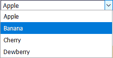
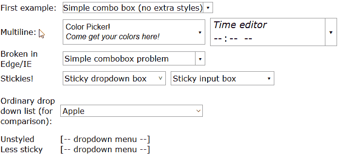
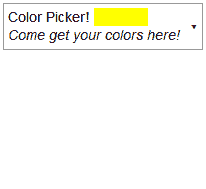

# 逐行:点击打开下拉列表和菜单的高级 CSS 技巧

> 原文：<https://www.freecodecamp.org/news/mostly-css-drop-down-combo-boxes-4ff4bb182ff7/>

大卫·皮格拉斯

# 逐行:点击打开下拉列表和菜单的高级 CSS 技巧


从我记事起，总有两种选择器。



一种是上面的文字可以编辑，另一种是不能编辑。HTML 包括第二种，没问题:

```
<select>
    <option>Apple</option>  
    <option>Banana</option>  
    <option>Cherry</option>  
    <option>Dewberry</option>
</select>
```

但是当我得知第一种在 HTML 中并不存在时，我感到很震惊。哦，有一个叫做`[datalist](https://developer.mozilla.org/en-US/docs/Web/HTML/Element/datalist)`的东西，但它不能正常工作——用户不能点击某个东西来查看整个列表，当你开始键入时，如果它们不是以用户键入的相同字符串开头，项目就会立即开始消失。

但是 CSS 是一个强大的设计工具:整个 [视频](https://codepen.io/elad2412/full/hBaqo/) [游戏](https://minocernota.com/articles/pure_css_game/)都是由 CSS、HTML 和一些图片文件构建而成的。(太好了，我刚刚失去了一半的观众。)

这并不意味着 CSS 可以做**任何事情**，但它确实意味着至少有“黑客”来完成各种各样的技巧。那些玩过游戏的人可能有兴趣了解一下这个行业的一些技巧，我认为弄清楚如何做一个组合框有很多东西要学。

在本文中，您将了解这个东西是如何工作的:



在 Windows 中，我们称之为“组合框”，因为它们结合了顶部(通常是一个文本字段)和弹出部分(通常是一个下拉列表)。

### 如何使用它

组合框可以由 div 和/或 spans 构成。请记住，HTML 解析器有一些嵌套规则。例如，它不允许`p`成为`div`或`ul`的祖先，并且`span`不能成为`p`或`div`的祖先。(这些规则不适用于编辑 DOM 的 JavaScript/React 代码)

CSS 需要三个子元素:首先是顶部(总是显示的内容)，然后是向下箭头的`****<span class=****"downarrow" ****tabindex=****"-1"****></span>****`，最后是下拉框中显示的内容:

```
<div class="combobox">
  <div>Simple combo box</div>
  <div tabindex="-1" class="downarrow"></div>
  <div>
    Contents of drop-down popup go here
  </div>
</div>
```

默认情况下，只有单击向下箭头(▾)时，下拉菜单才会打开。要在顶部内容被点击时打开盒子，您需要将`dropdown`类添加到`combobox`，并将`tabindex="0"`属性添加到第一个子元素:

```
<div class="combobox dropdown">
  <div tabindex="0">Simple combo box</div>
  <div tabindex="-1" class="downarrow"></div>
  <div>
    Contents of drop-down popup go here
  </div>
</div>
```

****注:**** `tabindex="-1"`的意思是“你可以点击给它焦点，但不能用键盘上的 Tab 键来聚焦”。`tabindex="0"`表示“您可以通过单击或 tab 键来聚焦它，浏览器将选择 Tab 键聚焦不同元素的顺序。”与`<select>`元素不同，弹出框不能超出浏览器窗口(这可能是对所有用户定义内容的有意限制——如果用户定义的内容可以超出页面区域的边缘，可能会有网站试图迷惑或欺骗用户的安全风险。)

作为一个奖励，你可以制作一个下拉列表，它是**而不是**一个只有`dropdown`类的组合框:

```
<div class="dropdown">
   *** <span tabindex="0">Dropdown menu</span> *** 
   <div>
     Contents of drop-down popup go here
   </div>
</div>
```

这是一个点击打开的下拉菜单(如果你想要一个在鼠标悬停而不是点击时打开的下拉菜单，已经有很多关于它的教程了。)

在这种情况下，最后一个元素包含下拉内容，所有其他子元素总是可见的，但只有具有`tabindex`属性的元素才能被单击以打开弹出区域。

您可以安全地编辑组合框及其子框的边距和边框，而不会打乱其行为，但有一点除外:不要让`padding-right`变得太小，因为▾向下箭头显示在填充中——它的大小至少应该是`1em`。

#### 摘要

*   `combobox`类是用于组合框的
*   `dropdown`类用于当顶部内容被点击时下拉的菜单和组合框(还记得`tabindex="0"`)
*   `downarrow`类添加了向下箭头图标(`tabindex="-1"`是必需的，因为它不能通过 CSS 添加。)
*   `combobox`或`dropdown`的最后一个子节点是下拉内容。

并且可以[预览带源代码的演示](https://codepen.io/qwertie/pen/QBYMdZ)。

### 我们将需要的 CSS 功能

为此我们需要大量的材料。这里有一个列表(可以随意跳过，以后再读。)

#### 选择器

**基本选择器:**
`.a`表示“用`class='a'`匹配元素”。
`A, B`意为“匹配选择器`A`或选择器`B`”。
`A B`表示“匹配一个以`A`元素为祖先的`B`元素”。
`A > B`意为“匹配一个父元素为 A 元素的 B 元素”。

`**:first-child**` **伪选择器:**`*:first-child`表示“匹配任何元素，只要它是某个父元素的第一个子元素”。

**`:last-child`伪选择器:**
`*:last-child`表示“匹配任意元素，只要它是另一个元素的最后一个子元素”。例如，`.combobox > *:last-child`用`class="combobox"`查找任何元素的最后一个子元素。

`**:empty**` **伪选择器:**
`.downarrow:empty`表示“如果一个元素中没有任何东西(甚至不是纯文本)，就用`class="downarrow"`匹配它”。

`**:only-child**` **伪选择器:**`*:only-child`表示“匹配任何元素，如果它是某个其他元素的唯一子元素”。

`**:not**` **伪选择器:**
`.dropdown:not(.sticky)`表示“如果一个元素没有`sticky`类，就用`dropdown`类匹配它”。

`**:focus**` **伪选择器:**
`.downarrow:focus`的意思是“如果一个元素有**焦点**，因为它有一个`tabindex`，并且它是用鼠标点击或者用 Tab 键选择的，那么将这个元素与`downarrow`类匹配”。

`**:hover**` **伪选择器:**
`.foo:hover`表示“当鼠标指针在某个元素上面时，将该元素与`foo`类匹配”。

`A ~ B`表示“如果更早的兄弟匹配`A`，则匹配`B`”。

#### 风格

**基本样式:**
在继续之前，请确保您理解了[盒模型](https://www.w3schools.com/css/css_boxmodel.asp)及其各种相关样式(包括`width`、`height`、`min-width` 和`max-height`)。你还应该了解其他基本风格，如`font-size`、`font-family`、`color`和`background-color`。

你还应该了解单位，尤其是[最常见的单位](https://css-tricks.com/the-lengths-of-css/) :
`px`，`em`，`rem`，`%`。

`**box-sizing: border-box**` **样式**
这意味着一个元素的宽度和高度[包括填充和边框](https://css-tricks.com/international-box-sizing-awareness-day/)。

`**display:**` **风格**
我们将使用`display: block`，它将一个元素显示为一个“块”，就像一个段落，因为两个相邻的块之间有换行符。

我们还将使用`display: inline-block`，它显示一个元素**内联**，就像一个段落中的图标图像，但仍然允许边距、边框和填充。

我们不会显式使用`display: inline`，它用于没有边距、边框或填充的元素，它们之间不需要换行符(`<b>like this</b>`)。

[了解更多关于显示器的](https://css-tricks.com/almanac/properties/d/display/)。

`**position:**` **样式**
在组合框中，我们将看到这种样式是如何用于从正常的文档流中提取元素的。

元素通常有一个样式`position: static`，意思是“正常放置在页面上”。

`position: relative`和`static`很像，除了两点:第一，元素可以左右上下移动，不影响任何其他元素。
但是，组合框不需要这个特性。`relative`的第二个作用是将元素标记为“已定位”。

这很重要，因为另一个位置`absolute`相对于其最近的“定位”祖先来定位元素。具体来说，下拉弹出菜单将使用`position: absolute`来确定自己相对于组合框顶部的位置，因此组合框本身被标记为`relative`。

另外，`absolute`元素不会影响页面上其他项目的位置，甚至它自己的父元素也不会，这正是我们想要的弹出框。

`**left**` **、`top`、`right`和`bottom`风格**
这些风格与`position: relative`和`position: absolute`一起使用，它们对每一个的作用略有不同。稍后会详细介绍。

[了解更多关于定位的](https://www.w3schools.com/css/css_positioning.asp)。

`**outline:**` **样式**
轮廓是在元素的正常边框之外绘制的额外边框。它通常用于突出显示一个元素，就像表明它已经被用户“选中”了。因为大纲预计是临时的，它们不会占用页面上的空间，所以添加大纲不会将其他元素推开。

`**box-shadow:**` **样式**
在元素“下”画阴影(嗯，其实阴影是画在元素外**，如果元素没有背景看起来很奇怪)。这将是方便的下拉弹出！**

`**z-index:**` **样式**
该样式改变浏览器绘制元素的顺序。一个更高的 z-index 会导致一个元素被绘制到后面，这样它就会出现在页面上其他元素的上面。

我们需要一个大的 z-index 来显示我们的下拉弹出窗口，这样它就会出现在所有东西的上面。弹出窗口的子窗口将获得一个新的“堆叠上下文”，这基本上意味着它们将被自动绘制在弹出窗口的顶部，这很好。

[注意](https://www.smashingmagazine.com/2009/09/the-z-index-css-property-a-comprehensive-look/) : `z-index`只对“定位”元素有效。

`**cursor:**` **样式**
控制鼠标光标的[外观](https://developer.mozilla.org/en-US/docs/Web/CSS/cursor)。

`**text-align:**` **样式**
横向[文字对齐](https://developer.mozilla.org/en-US/docs/Web/CSS/text-align) ( `left`、`right`或`center`)。

`**pointer-events:**` **样式**
这个样式的`none`设置使得一个元素对于[鼠标点击](https://developer.mozilla.org/en-US/docs/Web/CSS/pointer-events)“不可见”。

`**transform:**` **style**
允许你旋转、缩放、倾斜或平移一个块(或内嵌块)元素。这些[转换](https://www.w3schools.com/cssref/css3_pr_transform.asp)很智能，也会影响鼠标输入。

例如，您可以将文本旋转 30 度，但仍然用鼠标选择它。

`**transition:**` **风格**
风格变化时启用[动画](https://developer.mozilla.org/en-US/docs/Web/CSS/CSS_Transitions/Using_CSS_transitions)。

`opacity:` **style**
一个介于 0 和 1 之间的数字控制一个元素被看到的难易程度:
`1`是使一个元素完全可见的正常值
`0`使一个元素完全不可见。(不像`visibility: hidden`和`display: none`这两种隐藏东西的方法，`opacity: 0`不会阻止鼠标与元素互动。)

在本文中，我们将使用不透明度来制作动画——通过制作`opacity: 0`和`opacity: 1`之间的过渡动画，我们可以使一个元素淡入或淡出。

#### 伪元素

`**::before**`或`**::after**` :
指的是中的一个虚拟元素**，该虚拟元素位于之前选择的元素中，位于其正常内容之前或之后。**

例如，如果你写`p::before { content: "!" }`，那么`!`将出现在每一段的开头。

我们可以用`content`和`::before`或者`::after`来画向下的箭头(▾).

### 准备初次亮相

`.combobox`和`.dropdown`需要是`relative`，这样下拉弹出菜单可以相对于它们定位。`display: inline-block`允许组合框有边距、填充和边框。与`display: block`不同，它允许其他东西出现在同一行(比如标签或其他组合框。)

```
.combobox, .dropdown { 
  /* "relative" and "inline-block" (or just "block") are needed
     here so that "absolute" works correctly in children */
  position: relative;
  display: inline-block;
}
```

组合框(而不是下拉列表)将有内置边框:

```
.combobox {
  border: 1px solid #999;
  padding-right: 1.25em; /* leave room for ▾ */
}
```

颜色`#999`比 Chrome 的`<select>`元素上的边框略深，比 FireFox 的`<select>`元素略浅，所以看起来和两者没有太大区别。

#### 我们如何画向下的小箭头(▾)？

这里的难点是控制它的高度。组合框可能有不可预知大小的内容:小字体、大字体、一行或两行。箭头“按钮”需要有相同的高度，这样无论用户在哪里点击它都可以工作——边框内的任何地方都应该工作。

**那么，如何才能让箭头适应它左边同胞的高度呢？**
[CSS grid](https://developer.mozilla.org/en-US/docs/Web/CSS/CSS_Grid_Layout) 可以直截了当地完成这一点，但并不是所有浏览器都支持。也许 Flexbox 也能完成这项工作，但是我决定使用一个老技巧来兼容老版本的浏览器:绝对定位。

有了绝对定位，我可以强制箭头和它的容器一样高。

这种方法的缺点是箭头会存在于文档的正常流程之外，所以浏览器不会为它预留任何空间。相反，我们将在右边给组合框一些填充(上面的`1.25em`)，箭头将位于填充内。

在绝对定位模式下，`top`将元素的上边缘相对于其容器的上边缘对齐:`top: 0`意味着两个上边缘将在同一位置。类似地`left: 0`将元素的左侧与容器的左侧对齐，依此类推。

正坐标相对于容器“向内”推动元素，因此`top: 10px`意味着“将元素的顶部从父元素的顶部向下放置 10px”，而`bottom: 10px`意味着“将元素的底部从父元素的底部向上放置 10px。”

在这种情况下，我们需要`top: 0; bottom: 0; right: 0; width: 1.25em`将箭头从上到下放在右侧。

```
.combobox > .downarrow, .dropdown > .downarrow {
  display: block;     /* Allow margin/border/padding/size */
  position: absolute; /* Outside normal flow */
  top: 0;    /* Align top of downarrow with top edge of combobox */
  bottom: 0; /* Align bottom of downarrow with bottom of combobox */
  right: 0; /*Align right edge of downarrow with right of combobox*/
  width: 1.25em;

  cursor: default; /* Use arrow cursor instead of I-beam */
  nav-index: -1; /* sets tabindex, nonfunctional in most browsers */
  border-width: 0;        /* disable by default */
  border-color: inherit;  /* copy parent border */
  border-left: inherit;   /* copy parent border */
}
```

这里，`display: block`和`display: inline-block`的效果一样，所以我用了短一点的。我还禁用了通常显示在文本上的 I-beam 鼠标光标(因为向下箭头算作文本)。

CSS 中其实有一种设置`tabindex`的方法，叫做`nav-index`。但是大部分浏览器都不支持，所以如果你发现你的组合框只在 Opera 中有效，你就知道为什么了。

因此，您必须在`class="downarrow"`旁边添加`tabindex="-1"`。

这段代码禁用了边框，警告说如果其他 CSS 增加了`border-left-width`，边框颜色/样式应该从父元素(组合框)继承。顺便说一下，您可以在默认情况下不从父属性继承的任何属性上使用`inherit`选项。

我决定应该有一个左边的边界，如果弹出窗口不会打开时，左侧被点击。这样，下拉箭头看起来就像一个按钮，巧妙地暗示它可以被点击。记住计划:只有`dropdown`，而不是单独的`combobox`，会在左侧聚焦时打开。

因此，当单独使用`combobox`时，我将添加一个边框:

```
.combobox:not(.dropdown) > .downarrow {
  border-left-width: 1px;
}
```

接下来，如果用户为我们提供了一个空的`<span class="downarrow"></span>`，我们需要使用`::before`(或`::after`)和`content`神奇地添加缺少的向下箭头字符:

```
.downarrow:empty::before {
  content: '▾';
}
```

向下箭头也需要在`.downarrow`元素内居中。`text-align: center`将文本水平居中，但垂直居中比较棘手。`vertical-align: middle`不起作用，因为它被设计成将**内联**元素**与周围的文本**对齐。我们想要的是将向下箭头伪元素与**父** `.downarrow`容器对齐。

有一个窍门:

```
.downarrow::before, .downarrow > *:only-child {
  text-align: center; /* Center horizontally */
  /* vertical centering trick */
  position: relative; /* Allow the element to be shifted */
  top: 50%;           /* Move down by 50% of container size */
  transform: translateY(-50%); /* Move up by 50% of element size */
  display: block;     /* `transform` requires block/inline-block */
}
```

记住，只有当`.downarrow`为空时，我们才添加`::before`内容。如果用户已经提供了他们自己的自定义向下箭头元素，我们仍然希望它居中，因此有了`.downarrow > *:only-child`选择器。

如果组合框包含一个`<input>`元素，它不应该有边框:

```
.combobox > input {
  border: 0 /* combo box already has a border */
}
```

下一个部分是可选的，但是通常组合框的第一个子元素的宽度应该是其父元素`.combobox`的 100%,这样如果组合框比它的第一个子元素宽，第一个子元素就会延伸以匹配。如果用户用 spans 而不是 div 来构造组合框(也许它可以放在一个`<p>`中)，将第一个孩子设置为`inline-block`是有意义的，这样它可以有填充和边距。

```
.combobox > *:first-child {
  width: 100%;
  box-sizing: border-box; /* so 100% includes border & padding */
  display: inline-block;
}
```

### 准备下拉列表

最初我们只是想隐藏它，所以我们可以使用`display: none`。

但是为了准备它何时可见，让我们也设置一些其他的属性。从`position: absolute`开始，所以它在正常的文档流之外(记住一个`absolute`元素是相对于它最近的`relative`祖先，也就是`.combobox`或`.dropdown`)定位的)。当显示时，它应该有一个边框和背景，当然，下面也有一个阴影。

这里你看到`box-shadow: 1px 2px 4px 1px #4448`，意思是“在元素右边显示一个阴影 1px，向下 2px，模糊 4px，让阴影 1px 大于元素本身，颜色为#4448”。我们还需要一个漂亮的大 z-index，这样弹出窗口将出现在所有其他内容的顶部:

```
.dropdown > *:last-child,
.combobox > *:last-child {
  display: none;          /* hidden by default */
  position: absolute;     /* outside document flow */
  left: 0;          /* Left side of popup = left side of parent */
  top: 100%;        /* Top of popup = 100% below top of parent */
  border: 1px solid #999; /* gray border */
  background-color: #fff; /* white background */
  box-shadow: 1px 2px 4px 1px #4448; /* shadow behind */
  z-index: 9999;          /* draw on top of everything else */
  min-width: 100%;        /* >= 100% as wide as its container */
  box-sizing: border-box; /* width includes border & padding */
}
```

在这里，我使用了`left: 0`和`top: 100%`来正确定位弹出窗口，但是在这种情况下，弹出窗口的**默认**位置实际上是相同的，所以这些样式并不真正必要。

要使下拉框可见，我们真正需要的是`display: block`。

但是我们需要哪些选择器来实现这一点呢？

```
??? {
  display: block;
}
```

最明显的是，下拉列表应该在这三种情况下显示。

1.  用户点击了`.downarrow`
2.  用户点击或定位到`.dropdown`
3.  用户点击或定位到`.dropdown`的子节点

下拉框是最后一个子框，所以我们需要将`*:last-child`选择器和`:focus`组合起来，以检测上面的某个东西何时被点击或切换到:

```
.combobox > .downarrow:focus ~ *:last-child,
.dropdown:focus              > *:last-child,
.dropdown > *:focus          ~ *:last-child {
  display: block;
}
```

不过，我们还没完。如果用户点击一个文本框或者下拉框里面的一个链接会怎么样？点击会导致`.downarrow`或者`.dropdown`失去焦点，导致下拉框瞬间消失。

在链接的情况下，当鼠标按钮按下时，浏览器聚焦链接，但是直到松开鼠标按钮，浏览器才跟随链接。所以如果下拉瞬间消失，下拉中的任何链接都无法跟随！

要解决这个问题，我们应该在`:last-child`中的某个东西获得焦点时保持盒子打开:

```
.combobox > .downarrow:focus ~ *:last-child,
.dropdown:focus > *:last-child,
.dropdown > *:focus ~ *:last-child,
.combobox > *:last-child:focus-within,
.dropdown > *:last-child:focus-within {
  display: block;
}
```

**注意:**这在 Edge/IE 中不起作用(下面描述了一种变通方法)。

如果第二次点击向下箭头，我们应该隐藏下拉框。这可以通过以下方式实现:

```
.downarrow:focus {
  pointer-events: none; /* Causes second click to close */
}
```

这使得`.downarrow`在拥有焦点时对鼠标事件不可见，这样当你点击它时，你实际上点击的是它后面的东西(T1)。这导致它失去焦点，进而导致下拉框消失。

我们可以对`.dropdown`做同样的事情，所以再次点击`.dropdown`的顶部区域会使其消失:

```
.dropdown > *:not(:last-child):focus,
.downarrow:focus,
.dropdown:focus {
  pointer-events: none; /* Causes second click to close */
}
```

这基本上行得通。但是，如果你的顶部区域包含一个文本框，有一个副作用，因为文本框不能正常处理鼠标输入。但是，我发现文本框仍然可以使用。

在 Firefox 中，如果你在弹出窗口关闭时启动，你可以点击并拖动来选择文本，但是当弹出窗口打开时，它不起作用。在 Edge 中则相反:只有当弹出窗口打开时，你才可以点击并拖动来选择文本。无论哪种方式，它基本上都是可用的，因为如果用户第一次输入不成功，他可能会重试一次。

Chrome 的行为……前后矛盾。在任何情况下，为了获得完美的行为——单击关闭文本框而不导致文本框失去焦点——我认为 JavaScript 是必需的。

### 收尾

组合框通常应该有边距。但这似乎是可选的，因为默认情况下`<input>`控件没有:

```
.combobox {
  margin: 5px;
}
```

让我们用动画打开盒子，让这个东西更酷。

属性是制作动画最简单的方法。事实上，就我们的目的而言，像`transition: 0.4s;`这样的简单命令可以为所有支持的风格启用动画。但是到目前为止，我们唯一改变的风格是`display`，对`display`的改变不能被动画化。

所以让我们试着通过修改现有的样式来制作从`opacity: 0`到`opacity: 1`的动画过渡…

```
.dropdown > *:last-child,
.combobox > *:last-child {
  display: none;
  /* 
     ... other styles same as before ...
  */
  opacity: 0;
  transition: 0.4s;
}

.combobox > .downarrow:focus ~ *:last-child,
.dropdown:focus > *:last-child,
.dropdown > *:focus ~ *:last-child,
.combobox > *:last-child:focus-within,
.dropdown > *:last-child:focus-within {
  display: block;
  opacity: 1;
  transition: 0.15s;
}
```

过渡时间控制**进入**当前状态所需的时间。所以这段代码的意思应该是“用 0.15 秒的时间让**显示**，用 0.4 秒的时间让**隐藏**”

但是**动画不起作用**。结果[发现](https://stackoverflow.com/questions/39304002/css-transition-disabled-by-displaynone)阻止了动画。相反，我们需要使用另外一种隐藏东西的方式。另一种隐藏东西的方法是用`visibility: hidden`。不幸的是，这也部分阻止了动画——显示弹出窗口的动画起作用，但是隐藏弹出窗口的动画不起作用。

我们不能依靠`opacity: 0` **本身**来隐藏一个元素，因为鼠标仍然可以和一个有`opacity: 0`的元素交互。然而，我们可以用`pointer-events: none`解决这个问题。

因此，渐强和渐弱的工作方式如下所示:

```
.dropdown > *:last-child,
.combobox > *:last-child {
  display: block;
  /* 
     ... other styles same as before ...
  */
  transition: 0.4s;
  opacity: 0;
  pointer-events: none;
}

.combobox > .downarrow:focus ~ *:last-child,
.dropdown:focus > *:last-child,
.dropdown > *:focus ~ *:last-child,
.combobox > *:last-child:focus-within,
.dropdown > *:last-child:focus-within {
  display: block;
  transition: 0.15s;
  opacity: 1;
  pointer-events: auto;
}
```

我们可以添加的另一个功能是将弹出框移动到位，比如制作动画`top`:

```
.dropdown > *:last-child,
.combobox > *:last-child {
  display: block;
  /* 
     ... other styles same as before ...
  */
  top: 0;
  opacity: 0;
  transition: 0.4s;
  pointer-events: none;
}

.combobox > .downarrow:focus ~ *:last-child,
.dropdown:focus > *:last-child,
.dropdown > *:focus ~ *:last-child,
.combobox > *:last-child:focus-within,
.dropdown > *:last-child:focus-within {
  display: block;
  top: 100%;
  opacity: 1;
  transition: 0.15s;
  pointer-events: auto;
}
```



我认为这有点“过头”，所以没有在[最终版本](https://codepen.io/qwertie/pen/QBYMdZ)中包含。

最后，我们应该有一个焦点矩形——当组合框“活动”时显示的边框。

首先让我们为向下箭头添加一个聚焦框:

```
.downarrow:focus {
  outline: 2px solid #48F8;
}
```

理想情况下，组合框本身应该有一个聚焦框，如下所示:

```
.combobox:focus-within {
  outline: 2px solid #48F;
}
```

这在 Chrome 中运行良好。但是在 Firefox 61 中,`outline`被扩展到边界之外来包围整个弹出框，这看起来有点奇怪，尤其是当弹出框的宽度与顶部不同时。在 Edge 中轮廓根本不显示，因为 Edge 不支持`:focus-within`(见下文)。那么，我们能做些什么呢？

我决定用这个:

```
.combobox > *:not(:last-child):focus {
  outline: 2px solid #48F8;
}
```

这将围绕焦点子框而不是组合框本身绘制一个轮廓。但是如果子框和封闭的组合框大小不一样，这有时看起来也很奇怪。所以我添加了透明度(`#48F8`而不是`#48F`)来使它不那么明显，因此在最坏的情况下也不那么奇怪。

#### 粘性

到目前为止，我们的风格是只在某些东西被聚焦时才打开盒子。因此，如果您单击弹出区域中的纯文本，弹出窗口会关闭。在最终版本中，我扩展了保持弹出窗口打开的原因列表，加入了一个`sticky`样式，在鼠标悬停时保持下拉菜单打开，这样点击就不会关闭对话框

```
.combobox > .downarrow:focus ~ *:last-child,
.dropdown:focus > *:last-child,
.dropdown > *:focus ~ *:last-child,
.combobox > *:last-child:focus-within,
.dropdown > *:last-child:focus-within,
.combobox > .sticky:last-child:hover,
.dropdown > .sticky:last-child:hover {
  display: block;
  top: 100%;
  opacity: 1;
  transition: 0.15s;
  pointer-events: auto;
}
```

正如我前面所讨论的，当组合框的顶部区域包含一个文本框时，就会出现问题。为了让你容易地避免这个问题，我调整了现有的 CSS，如果`.dropdown`元素也有`sticky`类，那么`pointer-events: none`样式是**而不是**应用的:

```
.dropdown:not(.sticky) > *:not(:last-child):focus,
.downarrow:focus,
.dropdown:focus {
  pointer-events: none; /* Causes second click to close */
}
```

最后，如果一个`.dropdown`列表包含链接，会有一点不方便。单击一个链接后，列表不会自动关闭，因为该链接有焦点，并且我们对下拉列表进行了编程，使其在孩子有焦点时不会关闭。

为了避免这种情况，我增加了对新的`less-sticky`类的支持。和`sticky`一样，`less-sticky`在鼠标悬停时保持弹出窗口打开。与`sticky`不同，`less-sticky`不会在孩子获得焦点时保持弹出窗口打开。

所以我们新的选择器列表变得很长:

```
.combobox > .downarrow:focus ~ *:last-child,
.dropdown:focus > *:last-child,
.dropdown > *:focus ~ *:last-child,
.combobox > .sticky:last-child:hover,
.dropdown > .sticky:last-child:hover,
.combobox > .less-sticky:last-child:hover,
.dropdown > .less-sticky:last-child:hover,
.combobox > *:last-child:focus-within:not(.less-sticky),
.dropdown > *:last-child:focus-within:not(.less-sticky) {
  display: block;
  opacity: 1;
  transition: 0.15s;
  pointer-events: auto;
  top: 100%;
}
```

我们甚至还没有完成，因为这还不兼容 Edge 和 Internet Explorer。

### 边缘案例

当我让我的组合框在 Firefox 和 Chrome 中完美运行时，我沮丧地看到它在 Edge 中完全丑陋和不可用。哪里出了问题？

首先，边框消失了，因为 Edge 和 IE 不支持边框不透明，就像在`rgb(200,150,100,50)`或`#8888`中一样。我用`#8888`作为边界。为了让它在 Edge 上工作，我把它改成了`#999`。

另一种方法是为边缘提供透明的边框:

```
border: 1px solid #888;  /* Edge/IE can't do border opacity */
border: 1px solid #8888; /* All other browsers */
```

第二，尽我所能地点击——下拉 div 就是不往下掉！

在解决这个问题时，我学到了一些新东西——如果浏览器不理解 CSS 声明中使用的选择器，它会**忽略整个块**。

例如，如果你写了`.x, .y, .z:unknown { margin:1em }`，那么`x`和`y`不会得到边距，仅仅是因为浏览器不理解`unknown`。

原来 Edge 不理解`:focus-within`，当下拉区域深处的`input`元素被点击时，它允许下拉区域保持打开。问题是，我混淆了支持和不支持的选择器。

为了让 Edge 工作，我需要为使用`:focus-within`的选择器分别重复整个“如何打开下拉列表”样式，这样这些选择器就不会阻止其他选择器工作。

然后，作为缺少`:focus-within`的解决方法，我决定尝试[检测边缘](https://stackoverflow.com/questions/43528940/how-to-detect-ie-and-edge-browsers-in-css)，并在鼠标处于`:hover`状态时自动保持任何`.dropdown`列表打开。这样，仍然可以在下拉区域中使用一个聚焦的元素(比如一个`a href`或一个`input`)，尽管如果鼠标离开它，它会很快消失。

这一切的代码如下:

```
/* List of situations in which to show the dropdown list. */
.combobox > .downarrow:focus ~ *:last-child,
.dropdown:focus > *:last-child,
.dropdown > *:focus ~ *:last-child,
.combobox > .sticky:last-child:hover,
.dropdown > .sticky:last-child:hover,
.combobox > .less-sticky:last-child:hover,
.dropdown > .less-sticky:last-child:hover,
.combobox > *:last-child:focus:not(.less-sticky),
.dropdown > *:last-child:focus:not(.less-sticky) {
  display: block;
  opacity: 1;
  transition: 0.15s;
  pointer-events: auto;
}

/* focus-within not supported by Edge/IE. Unsupported selectors 
   cause the entire block to be ignored, so we must repeat all 
   styles for focus-within separately. */
.combobox > *:last-child:focus-within:not(.less-sticky),
.dropdown > *:last-child:focus-within:not(.less-sticky) {
  display: block;
  opacity: 1;
  transition: 0.15s;
  pointer-events: auto;
}

/* detect Edge/IE and behave if though less-sticky is on for all
   dropdowns (otherwise links won't be clickable) */
@supports (-ms-ime-align:auto) {
  .dropdown > *:last-child:hover {
    display: block;
    opacity: 1;
    pointer-events: auto;
  }
}

/* detect IE and do the same thing. */
@media all and (-ms-high-contrast: none), (-ms-high-contrast: active) {
  .dropdown > *:last-child:hover {
    display: block;
    opacity: 1;
    pointer-events: auto;
  }
}
```

第三，`outline`风格在 Edge 中不起作用。同样的问题是 Edge 不支持透明轮廓。

解决方案是边缘的特殊不透明样式:

```
outline: 2px solid #8AF; /* Edge/IE can't do outline transparency */  
outline: 2px solid #48F8;
```

第四，我在一个`<label>`元素中放置了两个组合框，试图打开第二个总是会打开第一个。事实证明，在 Edge 中，如果使用鼠标，只能选择标签中的第一个输入元素。

第五，下拉框没有阴影。这又是因为我使用了透明的阴影，Edge 又需要自己的特殊 CSS:

```
box-shadow: 1px 2px 4px 1px #666; /* Edge can't do shadow opacity */
box-shadow: 1px 2px 4px 1px #4448;
```

Internet Explorer 11 有几乎完全相同的限制，所以修复 Edge 基本上修复了 IE，只是 IE 需要一种不同于 Edge 的浏览器检测技术。

### 将弹出窗口与顶部区域同步

不幸的是，CSS 无法为我们做到这一点。所以在最后一个演示中，当弹出部分发生变化时，JavaScript 用于更新组合框的顶部。例如，我使用这个基于 jQuery 的代码来更新颜色选择器的顶部:

```
function parentComboBox(el) {
  for (el = el.parentNode; el && 
    Array.prototype.indexOf.call(el.classList, "combobox") <= -1;)
    el = el.parentNode;
  return el;
}
$(".combobox .color").mousedown(function() {
  var c = this.style.backgroundColor;
  $(parentComboBox(this)).find(".color")[0].
    style.backgroundColor = c;
});
```

### 最终版

[点击此处](https://codepen.io/qwertie/pen/QBYMdZ)在 CodePen 上查看带有源代码的演示。