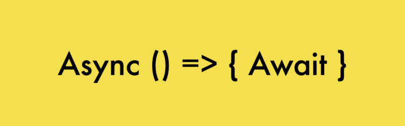

# 如何在节点中从回调到异步等待

> 原文：<https://www.freecodecamp.org/news/moving-from-callbacks-to-async-await-in-node-c3da26460dd1/>

作者 Nitish Phanse

# 如何在节点中从回调到异步等待



我最近有机会再次与 Node 合作。作为承诺的忠实粉丝，我从未尝试过异步等待。为什么？因为承诺对我很管用，这就是原因。

对简单的控制器来说，肯定的承诺工作良好。将数据库查询和错误处理结合起来，那么承诺可能会很糟糕。是的，即使你把它们锁起来。如果你的第四个承诺需要你的第二个承诺链中的一些已解决的价值呢？但是我通常还是会通过(*在函数范围的顶部定义一个 let 变量，并重新分配它，然后进一步使用它*)。

### 用例定义

我正在创建一个简单的 API 规范，路径是`**POST /users**` 。帖子正文包含一些用户详细信息。如果数据库中存在该用户，则更新其值，否则会在数据库中创建一个新条目。

为了简单起见，我没有使用任何 ORM /数据库。我正在创建一个虚拟用户模型，并使用`setTimeout`来模拟 API 调用和 DB 查询。对于错误处理的情况，我也使用`Math.random()`来决定是否抛出一个错误。

> 我将首先通过回调进行这些调用，然后是承诺，最后使用 async/await。

现在是写代码的时候了。

#### **简易快递服务器**

#### **用户模型**

这个用户模型代码是一个伪用户对象，它将进行模拟 API 调用。有两种类型的电话:一种是回电，另一种是承诺。两者实际上都在做同样的事情。同样，为了简单起见，我在这里硬编码了很多东西。

### 回收

进行任何非阻塞 I/O 的传统方式是回调，其中任何 I/O 调用都是

```
someAsyncOperation(dataObject, function(error, success) {
```

```
 if (error) {    // handle error  } else {    // do something with success  }})
```

如果您正在执行一个异步操作，这很好。如果你最终做了多个带有回调的异步操作，你将会得到所谓的*地狱*回调金字塔。

#### ***优点:***

1.  便于单一异步操作。允许简单的数据和错误控制。
2.  应该适用于每个节点版本和几乎所有的节点包。由于回调是函数，它们不需要任何编译器。

#### ***缺点:***

1.  对于多个嵌套的异步操作，这会创建一个回调地狱
2.  必须对每个操作进行错误处理(没有全局异常处理程序)

### 承诺

承诺是有三种主要状态的对象——待定、已解决和拒绝。根据异步动作的响应，承诺要么被解决，要么被拒绝。多个承诺可以一个接一个地串连起来。底部的一个 catch 处理程序足以处理任何承诺中的错误。

#### ***优点:***

1.  允许异步操作的简单链接。无论在`.then`函数中返回什么，都可以链接到下一个`.then`函数中。
2.  如果任何一个链接的承诺抛出异常，底部的一个 catch 处理程序将捕获一个错误。

#### ***缺点:***

1.  大多数库可能需要像蓝鸟一样的 promisify 包装器，除非它们支持开箱即用的承诺。
2.  链式函数的作用域是独立于函数本身的。因此，在第二个链中解析的一些数据不能在第四个链中使用，除非声明了一个全局 let 变量。

### 异步/等待

Async / await 最终仍然是一个承诺。这只是一种以同步方式编写异步代码的方式。

每个异步函数都必须加上前缀`async`。其中的每一个异步动作都要加上前缀`await`。此外，每个异步函数都返回一个可以进一步解析的承诺。

#### ***优点:***

1.  简洁的代码。我怎么强调这一点都不为过。可以在 try 块中访问所有已解析的位。
2.  整个块可以被视为代码的一个同步位。(尽管它本质上是异步的)。
3.  向异步代码添加 try、catch。
4.  catch 块中的一个统一错误处理程序。

#### ***缺点:***

1.  Node 8+内置了异步等待。对于旧版本，服务器端代码需要一个 babel transpiler。
2.  添加 async 关键字不是很直观。
3.  在 promise 构造函数中使用 async/await 是一种反模式。

4.同样，对于一些只支持回调的库，可能需要一个全局 promisify 库来支持异步/等待

### **结论**

总之，我认为我们将一个特殊的用例从一种形式的回调转换成了最终异步等待的承诺。

总的来说，我认为 async await 代码非常简洁易懂。由于人们想学习 Node，他们发现异步位是一项令人生畏的任务。此外，来自 Java、PHP 甚至 Python 背景的人可以很容易地开始在 node 中制作应用程序，而不用担心回调/承诺。

希望这篇文章是有帮助的。万一有什么错误，请告诉我。会很乐意纠正他们。