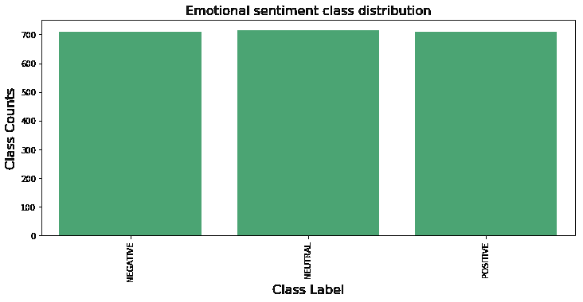
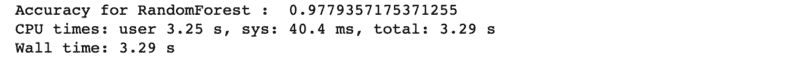
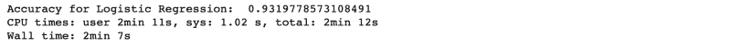
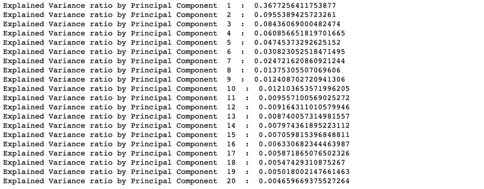
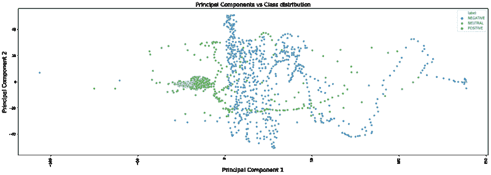
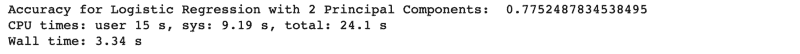
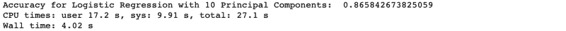
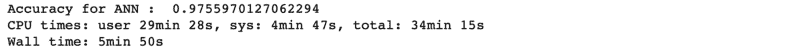
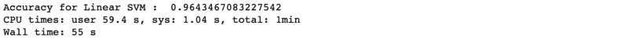
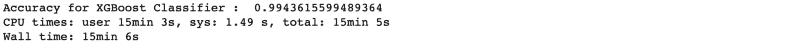

# 基于 Sci-kit learn & XGBoost 的多类分类:基于脑波数据的案例研究

> 原文：<https://www.freecodecamp.org/news/multi-class-classification-with-sci-kit-learn-xgboost-a-case-study-using-brainwave-data-363d7fca5f69/>

作者 Avishek Nag(机器学习专家)

# 基于 Sci-kit learn & XGBoost 的多类分类:基于脑波数据的案例研究

#### 不同分类器对高维数据的准确性和性能比较


Photo Credit : Pixabay

在机器学习中，高维数据的分类问题确实具有挑战性。有时，非常简单的问题由于“维数灾难”问题变得非常复杂。

在本文中，我们将看到不同分类器的准确性和性能是如何变化的。我们还将看到，当我们没有独立选择分类器的自由时，我们如何进行特征工程来使一个差的分类器表现良好。

### **理解“数据源”&问题公式化**

对于本文，我们将使用来自 [Kaggle](https://www.kaggle.com/birdy654/eeg-brainwave-dataset-feeling-emotions) 的“EEG 脑波数据集”。该数据集包含来自 EEG 耳机的电子脑波信号，并且是时间格式。在撰写本文时，还没有人在这个数据集上创建任何“内核”——也就是说，到目前为止，Kaggle 还没有给出解决方案。

因此，首先，让我们先读取数据，看看有什么。


数据集中有 2549 列，而“标签”是我们分类问题的目标列。所有其他列，如‘mean _ D1 _ a’、‘mean _ D2 _ a’等，描述的是脑电波信号读数的特征。以“fft”前缀开始的列很可能是原始信号的“快速傅立叶变换”。我们的目标列“标签”描述了情感情绪的程度。

按照 Kaggle 的说法，这是一个挑战:“我们能从脑电波读数中预测情感情绪吗？”

让我们首先从列“label”了解类分布:



Fig 1

因此，对于情感情绪，有三个等级，“积极的”，“消极的”和“中性的”。从条形图中可以清楚地看出，类别分布并不偏斜，这是一个目标变量为“标签”的“多类别分类”问题。我们将尝试使用不同的分类器，并观察其准确性水平。

在应用任何分类器之前，列“标签”应与其他特征列分开(“mean_d_1_a”、“mean_d2_a”等是特征)。

```
label_df = brainwave_df['label']brainwave_df.drop('label', axis = 1, inplace=True)brainwave_df.head()
```

由于这是一个“分类”问题，我们将对每个要尝试的“分类器”遵循以下惯例:

1.  我们将对数据集使用“交叉验证”(在我们的例子中，将使用 10 倍交叉验证)方法，并取平均准确度。这将为我们提供分类器准确性的整体视图。
2.  我们将使用基于“流水线”的方法来组合所有预处理和主分类器计算。ML“管道”将所有处理阶段包装在一个单元中，并且本身充当“分类器”。这样，所有阶段都变得可重复使用，也可以用于形成其他“管道”。
3.  我们将跟踪每种方法构建和测试的总时间。我们称之为“耗时”。

对于以上内容，我们将主要使用 Python 中的 scikit-learn 包。由于这里的特征数量非常多，我们将从一个能够很好地处理高维数据的分类器开始。

### **随机森林分类器**

“随机森林”是一个基于树和 bagging 方法的集成分类器。它将通过概率熵计算方法自动减少特征的数量。让我们看看:



准确率非常高，达到 97.7%，“总耗时”非常短(仅 3.29 秒)。

对于这个分类器，不需要像缩放或噪声去除这样的预处理阶段，因为它完全是基于概率的，并且完全不受比例因子的影响。

### **逻辑回归分类器**

“逻辑回归”是一个线性分类器，其工作方式与线性回归相同。



我们可以看到准确率(93.19%)比“随机森林”低，而“耗时”比“随机森林”高(2 分 7 秒)。

“逻辑回归”受到因变量不同取值范围的严重影响，从而迫使“特征缩放”。这就是为什么 scikit-learn 的“StandardScaler”被添加为预处理阶段。它会根据均值和单位方差为零的高斯分布自动缩放要素，因此所有变量的值范围为-1 到+1。

花费大量时间的原因是所需的高维度和缩放时间。数据集中有 2549 个变量，每个变量的系数应按照逻辑回归过程进行优化。此外，还有一个多重共线性的问题。这意味着线性相关的变量应该组合在一起，而不是单独考虑。

多重线性的存在会影响精度。因此，现在的问题变成了，“我们能否减少变量的数量，减少多重共线性，并改善所用的时间？"

#### **主成分分析**

主成分分析可以将原始的低层次变量转换到高维空间，从而减少所需变量的数量。所有的共线变量聚集在一起。让我们对数据进行主成分分析，看看哪些是主要的 PC:



我们将 2549 个变量映射到 20 个主成分。从上面的结果来看，很明显，前 10 台电脑很重要。前 10 个样本的解释差异率的总百分比约为 0.737 (0.36 + 0.095 +)..+ 0.012).或者可以说，前 10 个 PC 解释了整个数据集的 73.7%的方差。

因此，这样我们就可以将 2549 个变量减少到 10 个变量。那是一个戏剧性的变化，不是吗？理论上，主成分是从数学映射中生成的虚拟变量。从业务角度来看，无法判断它们涵盖了数据的哪一个物理方面。这意味着，在物理上，主成分不存在。但是，我们可以很容易地使用这些 PC 作为任何 ML 算法的定量输入变量，并得到非常好的结果。

为了形象化，让我们拿起前两台电脑，看看如何使用“散点图”区分不同类别的数据。

```
plt.figure(figsize=(25,8))sns.scatterplot(x=pca_vectors[:, 0], y=pca_vectors[:, 1], hue=label_df)plt.title('Principal Components vs Class distribution', fontsize=16)plt.ylabel('Principal Component 2', fontsize=16)plt.xlabel('Principal Component 1', fontsize=16)plt.xticks(rotation='vertical');
```



Fig 2

在上面的图中，三个类以不同的颜色显示。因此，如果我们对这两个 PC 使用相同的“逻辑回归”分类器，那么根据上面的图，我们可以说第一个分类器将从其他两个案例中分离出“中性”案例，第二个分类器将分离出“阳性”和“阴性”案例(因为对于 3 类问题将有两个内部逻辑分类器)。让我们试试看准确度。



耗时(3.34 秒)减少，但准确率(77%)下降。

现在，让我们拿起所有 10 台电脑运行:



与 2 个 PC 案例相比，我们发现准确性有所提高(86%)，并且“花费的时间”略有增加。

因此，在这两种情况下，我们看到与正常的逻辑回归相比准确性较低，但在“耗时”方面有显著改善。

可以使用不同的“solver”和“max_iter”参数进一步测试准确性。我们用‘佐贺’作为‘求解器’，用 L1 罚分，用 200 作为‘最大迭代’。这些值可以改变，以获得对精度的可变影响。

虽然“逻辑回归”给出的准确度较低，但在某些情况下，PCA 可能特别需要它。在具有非常大的维度空间的数据集中，PCA 成为“线性分类器”的明显选择。

在某些情况下，如果已经定义了 ML 应用程序的基准，并且只有有限的一些“线性分类器”可供选择，那么这种分析将会很有帮助。这种情况在大型组织中很常见，因为这些组织已经定义了标准，不可能超越它们。

### 人工神经网络分类器

人工神经网络分类器是非线性的，具有自动特征工程和降维技术。scikit-learn 中的“MLPClassifier”作为人工神经网络工作。但是这里也需要对数据进行基本的缩放。让我们看看它是如何工作的:



准确度(97.5%)非常好，尽管运行时间很长(5 分钟)。

高“耗时”的原因是神经网络需要严格的训练时间，并且维数也很高。

一般惯例是从总数据大小的 50%的隐藏层大小开始，后续层将是前一层的 50%。在我们的例子中，它们是(1275 = 2549 / 2，637 = 1275 / 2)。隐藏层的数量可以作为超参数，并可以调整为更好的准确性。在我们的例子中是 2。

### 线性支持向量机分类器(SVM)

我们现在将对数据应用“线性 SVM ”,看看准确度如何。这里也需要缩放作为预处理阶段。



准确率达到 96.4%，略低于“随机森林”或“人工神经网络”。“耗时”为 55 秒，远远优于“安”。

### 极端梯度推进分类器

XGBoost 是一个基于提升树的集成分类器。和‘random forest’一样，也会自动减少特征集。为此，我们必须使用 scikit-learn 中没有的单独的“xgboost”库。让我们看看它是如何工作的:



准确率(99.4%)非常好，但“耗时”(15 分钟)相当高。如今，对于复杂的问题，XGBoost 以其精确的结果成为数据科学家的默认选择。由于其内部的集合模型结构，它具有较高的运行时间。不过 XGBoost 在 GPU 机器上表现不错。

### 结论

从所有的分类器来看，很明显，就准确性而言,“XGBoost”是赢家。但是如果我们把“花费的时间”和“准确性”一起考虑，那么“随机森林”是一个完美的选择。但我们也看到了如何使用简单的线性分类器，如“逻辑回归”和适当的特征工程，以提供更好的准确性。其他分类器不需要那么多的特征工程工作。

选择一个完美的“分类器”取决于需求、用例以及可用的数据工程环境。

Jupyter 笔记本上的整个项目可以在这里找到[。](https://github.com/avisheknag17/public_ml_models/blob/master/mental_emotional_sentiment_classification/notebooks/emotion_classifier.ipynb)

#### 参考资料:

[1] XGBoost 文档—[https://xgboost.readthedocs.io/en/latest/](https://xgboost.readthedocs.io/en/latest/)

[2]random forest workings—[http://data aspirant . com/2017/05/22/random-forest-algorithm-machine-learing/](http://dataaspirant.com/2017/05/22/random-forest-algorithm-machine-learing/)

[3]主成分分析—[https://towards data science . com/a-一站式主成分分析-5582fb7e0a9c](https://towardsdatascience.com/a-one-stop-shop-for-principal-component-analysis-5582fb7e0a9c)

[4]逻辑回归—[http://ufldl . Stanford . edu/tutorial/supervised/Logistic Regression/](http://ufldl.stanford.edu/tutorial/supervised/LogisticRegression/)

[5]支持向量机—[https://towards data science . com/Support-Vector-machine-introduction-to-machine-learning-algorithms-934 a 444 FCA 47](https://towardsdatascience.com/support-vector-machine-introduction-to-machine-learning-algorithms-934a444fca47)