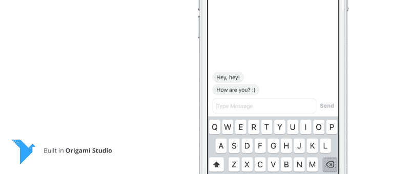
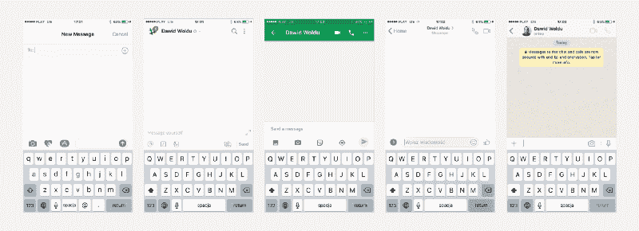
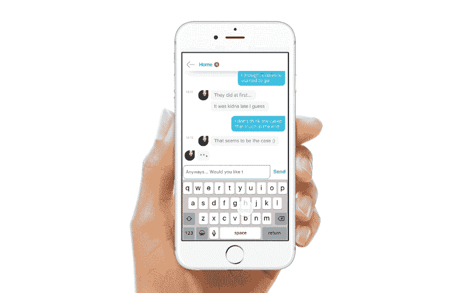

# 多输入现场消息应用程序概念

> 原文：<https://www.freecodecamp.org/news/multi-input-field-messaging-app-concept-911096778de3/>

by Dawid Woldu



# 多输入现场消息应用程序概念

前一段时间[我在一篇中型文章](https://medium.com/@dawdus/freeing-the-bubbles-context-aware-messaging-app-8466abdcda27)中分享了上下文感知信使应用的想法。这个想法挑战了所有 messenger 应用程序背后的设计限制，即一次只能写一条消息。

我在这些应用程序中一直缺少的是保存我正在输入的信息，然后输入并发送其他信息的方法。然后返回到先前撰写的消息并继续。只是为了不跑题，让我的对话有条不紊。



Left to right: Messages, Slack, Hangouts, Messenger, Whatsapp.

我今天做的方式涉及到文本字段相关手势的顺序:**长按，全选，剪切，键入，发送，长按，粘贴，继续。**

我的概念允许用一次点击来替换那个序列，但这取决于应用程序是否根据对话的上下文来识别保存消息的需要。我构建了一个 Quartz Composer 原型来展示这个功能:



但是我从来没有分享过原型，因为它没有功能，只允许一个额外的输入字段，并且完全是为了录制视频。此外，Quartz Composer 的折纸原型在该设备上运行得不太好(更不用说没有原生键盘)。

[Origami Studio](http://origami.design) 的发布让我重新审视了这个概念，并构建了一个功能齐全的原型来分享。

我抛弃了上下文感知部分，并允许在你喜欢的时候，根据你的需要保存尽可能多的草稿。

### 这是新原型的演示视频。

### 折纸工作室中的建筑。

我可以为我在构建 proto 时遇到的每个技术挑战写一篇单独的文章/教程，但是我将限制自己在这里仅仅简单地列出其中的一些。希望这些简短的描述足以让你在遇到类似的问题时有所启发。如果不是，请不要犹豫，直接 [ping 我](https://twitter.com/dawidwoldu)。

### **多行输入字段。**

Origami Studio 中的文本字段组件不允许多行输入。当你双击它来显示它的内容，你会发现实际的文本输入组件。问题是它没有光标/插入符号。所以通过测量文本字段中最后一个字母的位置来黑进光标。


每次你输入一个字母，我会检查它是否是一个空格，如果是，我会把它的索引添加到一个空格数组中。然后我假设每当输入的高度增加时，文本将在最后一个记录的空格处断开。然后，我测量文本的其余部分，将光标放在新行的正确位置。当你不点击空格时，我只是测量适合该行的文本大小。

### **构建对话源。**

这里的挑战是动态创建聊天气泡，同时保持提要中的正确顺序。当 bot 开始输入时，你可以看到提要上的最后一个气泡，上面有 3 个跳跃点。但是，如果你在它完成输入之前发送消息，你的气泡应该在机器人的气泡之前到达提要。我设法通过保存两个消息数组来使它工作。临时的(机器人打字)和最终的，并在机器人开始打字或发送消息时在它们之间切换。

我用 bot 消息创建了一个 JSON 配置文件，允许您配置 bot 发送的内容和时间，以及它是否应该等待您的消息开始输入。

```
{"message":"Ok, I'm dumb. What do you want from me?!", "waitforuser":2,"delay":1}
```

**waitforuser** —描述机器人在开始输入之前应该等待多少用户消息。零意味着它根本不会等待用户。
**延迟**—bot 开始打字前的时间(秒)。

### **创建/删除输入字段并管理其顺序。**

每当你创建输入字段时，我就在循环补丁上增加计数，但是一旦你不再需要这个字段，我就试图从循环中删除这个字段，并保持其他输入字段的顺序和内容。对我来说，这是不可能的，因为**循环补丁没有保存对它们正在复制的**元素的实际实例的引用。我通过隐藏和重用未使用的字段来解决这个问题，而不是将它们从循环中移除。

### 下载！

你可以从我的 [Google Drive](https://drive.google.com/drive/folders/0B9oWvt9KHdw0T2hOcUdlUFMtMVk?usp=sharing) 下载 Origami 原型、JSON 文件以及多行文本字段组件。

#### **用户手册:**

**长按发送按钮**保存当前文本并创建新的输入字段。(是的！它是不可发现的。我知道。)
原型为在设备上使用而优化。(不能隐藏键盘)

### **最后一分钟发现有趣的事实:**

*原型在使用表情符号时崩溃。？
*多行输入字段光标在打字超快的时候会表现不稳定(反正我是分享)。
*当您在 bot 开始键入的准确时间发送消息时，空的 bot 消息会出现在提要中。
*其他 bug 修复和性能提升。(什么？！)