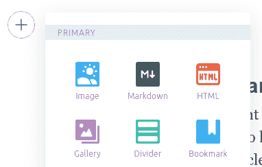
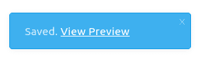

# 如何在文章中嵌入选择题

> 原文：<https://www.freecodecamp.org/news/multiple-choice-quiz-template/>

根据我的经验，用实践练习来补充学习大大提高了我对一个主题的理解。尤其是当我可以边走边测试自己的知识，并收到每个问题的即时反馈时。

多项选择的测验形式非常适合这一点。我开发了一种在我为 freeCodeCamp 写的数学文章中嵌入选择题的方法，我想向其他作者展示如何做同样的事情。

## 如何在文章中添加代码

Ghost 编辑器允许您在整篇文章中嵌入代码块。可以通过单击带有加号 **(+)** 的圆形按钮来访问代码编辑器，该按钮用于添加图像、YouTube 视频等:



点击“HTML”按钮为文章添加一个编辑器。编辑器支持 HTML，CSS，甚至 JavaScript。

开始添加代码后，单击编辑器框架外的任意位置来呈现代码并查看进度。双击渲染输出以重新打开编辑器窗口:


要测试代码的功能，请按 Ctrl/⌘ + S 保存文章，然后点击左下角的“查看预览”按钮:



您的文章将在一个单独的选项卡中打开，在那里您可以看到一旦您的文章发布，您的代码将如何呈现。花些时间检查一下你的选择题测验的样式和功能。

下一节提供了多项选择测验的样板代码。你需要做的就是把它粘贴到你自己的文章里，修改一下问题和答案。

## 多项选择测验的工作原理

您可以添加任意数量的不同问题。然而，虽然你的文章可能有多个小测验，但它们都包含在幕后的一个 HTML 主体中。每个问题元素都以下列代码开始:

```
<div style='transform: scale(0.65); position: relative; top: -100px;'>
  <h3>WRITE YOUR QUESTION HERE</h3>
  <p>Choose 1 answer</p>
  <hr />
```

以下每个`div`元素都包含一个可能的答案:

```
 ...
  <div id='block-11' style='padding: 10px;'>
    <label for='option-11' style=' padding: 5px; font-size: 2.5rem;'>
      <input type='radio' name='option' value='6/24' id='option-11' style='transform: scale(1.6); margin-right: 10px; vertical-align: middle; margin-top: -2px;' />
      ANSWER 1</label>
    <span id='result-11'></span>
  </div>
  <hr />

  <div id='block-12' style='padding: 10px;'>
    <label for='option-12' style=' padding: 5px; font-size: 2.5rem;'>
      <input type='radio' name='option' value='6' id='option-12' style='transform: scale(1.6); margin-right: 10px; vertical-align: middle; margin-top: -2px;' />
      ANSWER 2</label>
    <span id='result-12'></span>
  </div>
  <hr />
  ...
```

在编写的时候，Ghost 的嵌入式代码编辑器不支持模板文字，所以有些东西必须硬编码。

请记住，所有问题实际上都是在后台一起加载的，因此每个`id`中的两位数字代表以下内容:

*   **第一个**数字表示文章中选择题的顺序(1 为第一题，2 为第二题，以此类推)
*   **第二个**数字表示每个可能答案在其问题块中的顺序(1 是答案选项一，2 是答案选项二，依此类推。)

比如，`block-12`代表**题****1/答案选择 2** ，而`block-43`则是**题 4/答案选择 3** 。

对于不同的问题块来说，这种索引惯例是必要的，以便彼此独立地发挥作用。

类似的逻辑也适用于负责交互性的函数名。处理用户交互的代码放在`<script>`标签中，由两部分组成。第一部分是评估答案和显示结果的函数:

```
function displayAnswer1() {
    if (document.getElementById('option-11').checked) {
      document.getElementById('block-11').style.border = '3px solid limegreen'
      document.getElementById('result-11').style.color = 'limegreen'
      document.getElementById('result-11').innerHTML = 'Correct!'
    }
    if (document.getElementById('option-12').checked) {
      document.getElementById('block-12').style.border = '3px solid red'
      document.getElementById('result-12').style.color = 'red'
      document.getElementById('result-12').innerHTML = 'Incorrect!'
      showCorrectAnswer1()
    }
    if (document.getElementById('option-13').checked) {
      document.getElementById('block-13').style.border = '3px solid red'
      document.getElementById('result-13').style.color = 'red'
      document.getElementById('result-13').innerHTML = 'Incorrect!'
      showCorrectAnswer1()
    }
    if (document.getElementById('option-14').checked) {
      document.getElementById('block-14').style.border = '3px solid red'
      document.getElementById('result-14').style.color = 'red'
      document.getElementById('result-14').innerHTML = 'Incorrect!'
      showCorrectAnswer1()
    }
  }
```

顾名思义，`displayAnswer1`函数处理文章中的第一个问题。如果你的文章中有第三个问题，`displayAnswer3`会处理。

在上面的例子中，`option-11`是正确的答案，第一个`if`块中的样式被更新以显示正确的答案被选中。如果选择了任何其他不正确的答案，样式会更新以反映这一点。

您可以在自己的文章中随意使用`displayAnswer_`函数。请记住在正确和不正确的答案后面附上适当的样式。

下面是处理用户交互的第二部分代码:

```
function showCorrectAnswer1() {
    let showAnswer1 = document.createElement('p')
    showAnswer1.innerHTML = 'Show Corrent Answer'
    showAnswer1.style.position = 'relative'
    showAnswer1.style.top = '-180px'
    showAnswer1.style.fontSize = '1.75rem'
    document.getElementById('showanswer1').appendChild(showAnswer1)
    showAnswer1.addEventListener('click', () => {
      document.getElementById('block-11').style.border = '3px solid limegreen'
      document.getElementById('result-11').style.color = 'limegreen'
      document.getElementById('result-11').innerHTML = 'Correct!'
      document.getElementById('showanswer1').removeChild(showAnswer1)
    })
  }
```

这个函数被称为`showCorrectAnswer1`，因为它处理文章中的第一个选择题。如果你的文章有不止一个问题，你必须添加`showCorrectAnswer2`、`showCorrectAnswer3`等等。

请调整代码中使用的样式和尺寸，并根据您的喜好进行定制。另外，我肯定还有其他方法来实现选择题，但这是我的，我很乐意与您分享。

下面是完整的代码和一个工作示例:

```
<div style='transform: scale(0.65); position: relative; top: -100px;'>
  <h3>What fraction of a day is 6 hours?</h3>
  <p>Choose 1 answer</p>
  <hr />

  <div id='block-11' style='padding: 10px;'>
    <label for='option-11' style=' padding: 5px; font-size: 2.5rem;'>
      <input type='radio' name='option' value='6/24' id='option-11' style='transform: scale(1.6); margin-right: 10px; vertical-align: middle; margin-top: -2px;' />
      6/24</label>
    <span id='result-11'></span>
  </div>
  <hr />

  <div id='block-12' style='padding: 10px;'>
    <label for='option-12' style=' padding: 5px; font-size: 2.5rem;'>
      <input type='radio' name='option' value='6' id='option-12' style='transform: scale(1.6); margin-right: 10px; vertical-align: middle; margin-top: -2px;' />
      6</label>
    <span id='result-12'></span>
  </div>
  <hr />

  <div id='block-13' style='padding: 10px;'>
    <label for='option-13' style=' padding: 5px; font-size: 2.5rem;'>
      <input type='radio' name='option' value='1/3' id='option-13' style='transform: scale(1.6); margin-right: 10px; vertical-align: middle; margin-top: -2px;' />
      1/3</label>
    <span id='result-13'></span>
  </div>
  <hr />

  <div id='block-14' style='padding: 10px;'>
    <label for='option-14' style=' padding: 5px; font-size: 2.5rem;'>
      <input type='radio' name='option' value='1/6' id='option-14' style='transform: scale(1.6); margin-right: 10px; vertical-align: middle; margin-top: -2px;' />
      1/6</label>
    <span id='result-14'></span>
  </div>
  <hr />
  <button type='button' onclick='displayAnswer1()' style='width: 100px; height: 40px; border-radius: 3px; background-color: lightblue; font-weight: 700;'>Submit</button>
</div>
<a id='showanswer1'></a>
<script>
  //    The function evaluates the answer and displays result
  function displayAnswer1() {
    if (document.getElementById('option-11').checked) {
      document.getElementById('block-11').style.border = '3px solid limegreen'
      document.getElementById('result-11').style.color = 'limegreen'
      document.getElementById('result-11').innerHTML = 'Correct!'
    }
    if (document.getElementById('option-12').checked) {
      document.getElementById('block-12').style.border = '3px solid red'
      document.getElementById('result-12').style.color = 'red'
      document.getElementById('result-12').innerHTML = 'Incorrect!'
      showCorrectAnswer1()
    }
    if (document.getElementById('option-13').checked) {
      document.getElementById('block-13').style.border = '3px solid red'
      document.getElementById('result-13').style.color = 'red'
      document.getElementById('result-13').innerHTML = 'Incorrect!'
      showCorrectAnswer1()
    }
    if (document.getElementById('option-14').checked) {
      document.getElementById('block-14').style.border = '3px solid red'
      document.getElementById('result-14').style.color = 'red'
      document.getElementById('result-14').innerHTML = 'Incorrect!'
      showCorrectAnswer1()
    }
  }
  // the functon displays the link to the correct answer
  function showCorrectAnswer1() {
    let showAnswer1 = document.createElement('p')
    showAnswer1.innerHTML = 'Show Corrent Answer'
    showAnswer1.style.position = 'relative'
    showAnswer1.style.top = '-180px'
    showAnswer1.style.fontSize = '1.75rem'
    document.getElementById('showanswer1').appendChild(showAnswer1)
    showAnswer1.addEventListener('click', () => {
      document.getElementById('block-11').style.border = '3px solid limegreen'
      document.getElementById('result-11').style.color = 'limegreen'
      document.getElementById('result-11').innerHTML = 'Correct!'
      document.getElementById('showanswer1').removeChild(showAnswer1)
    })
  }
</script>
```

### 6 小时是一天的几分之一？

选择 1 个答案

* * *

* * *

* * *

* * *

* * *

你也可以在 GitHub 上找到完整的样板代码[。](https://github.com/sandroarobeli/quiz-template/blob/master/testTemplateHTML.txt)