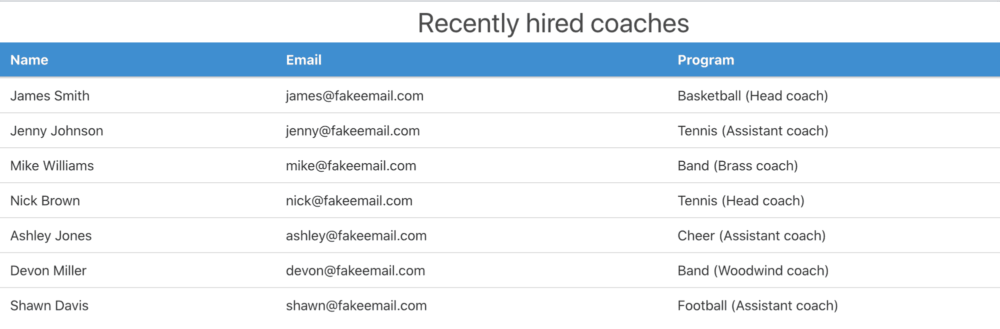
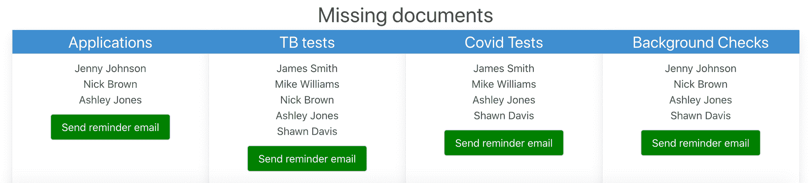
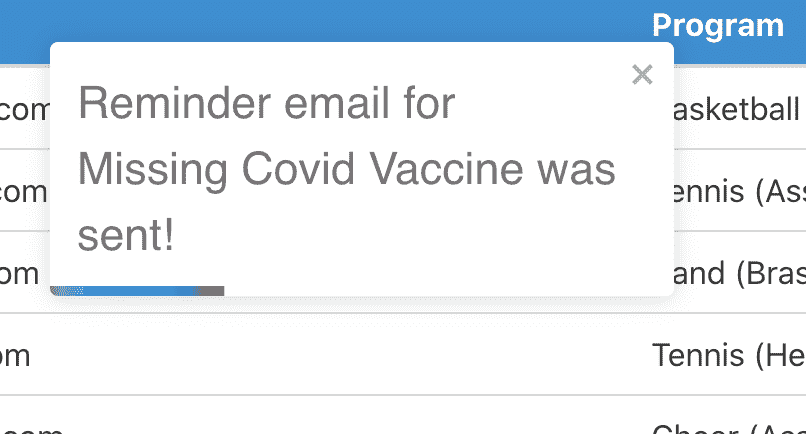
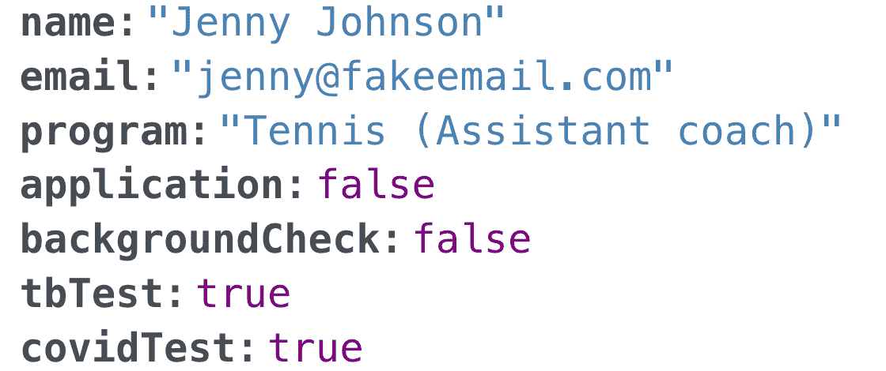
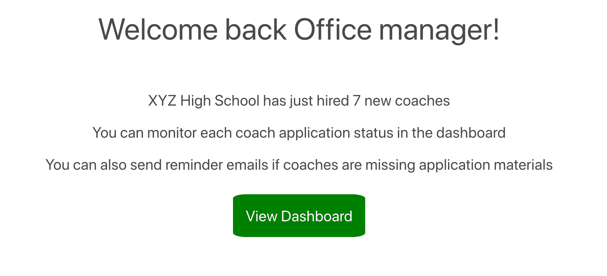
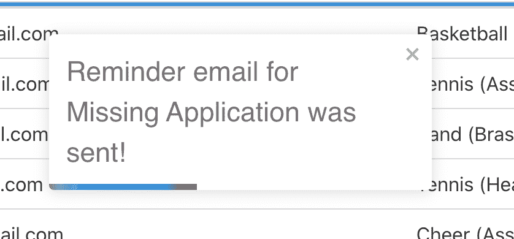
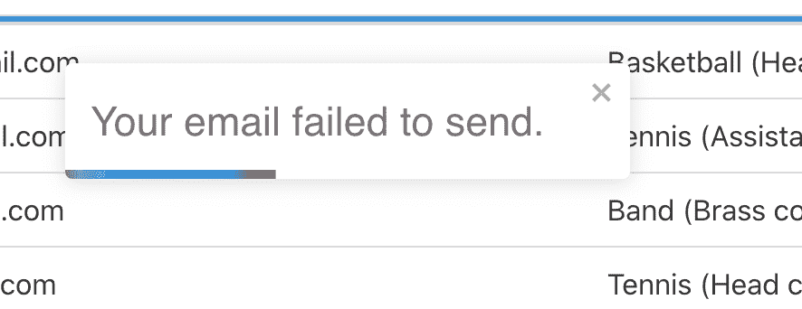
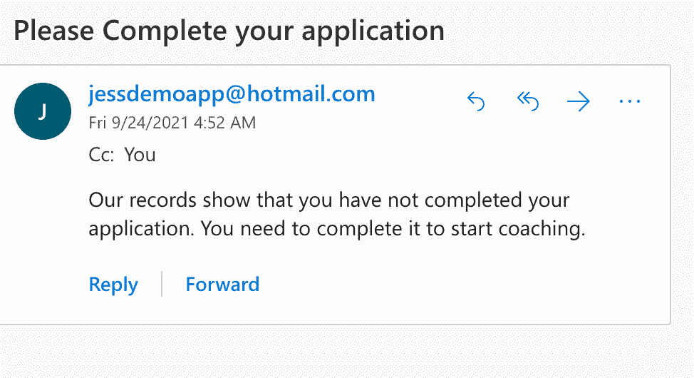

# MVC 架构——什么是模型视图控制器框架？

> 原文：<https://www.freecodecamp.org/news/mvc-architecture-what-is-a-model-view-controller-framework/>

模型-视图-控制器是一种流行的软件模式，用于将应用程序的逻辑分解成三个不同的组件。

在本文中，我将分解 MVC 模式背后的三个组件，提供一些历史，并向您展示如何在应用程序中使用它。

## 模型-视图-控制器模式的历史

MVC 模式是由计算机科学家 Trygve Mikkjel heyerdahreenskaug 在 1979 年首次提出的。他想就如何将复杂的用户应用程序分解成更小的可管理的组件提出一个解决方案。

MVC 模式最初是在编程语言 Small Talk 中使用的。该模式的原始名称之一是模型-视图-编辑器，但它被改为模型-视图-控制器。

在整个 20 世纪 80 年代和 90 年代初，MVC 模式主要用于桌面应用程序。但是到了 20 世纪 90 年代末，它在 web 应用程序中变得非常流行。

在今天的 web 应用程序中，MVC 模式是组织代码的一种流行的设计选择。

这里列出了一些使用 MVC 模式的流行的 web 框架。

*   Ruby on Rails
*   ASP.NET MVC
*   拉勒韦尔
*   有角的

## 模型-视图-控制器背后的三个组件是什么？

这是 MVC 模式的一个基本分类:

*   **模型**–负责应用程序背后的数据逻辑
*   **视图**–这是用户在应用程序中看到并与之交互的内容
*   **控制器**–它充当应用程序背后的大脑，并与模型和视图进行通信。

## MVC 模式在 web 应用程序中是如何工作的？

为了更好地理解 MVC 模式是如何工作的，最好在一个[演示应用程序](https://mvc-demo-app.netlify.app/)中向您展示。

这个 MERN (MongoDB，Express，React，Node)堆栈应用程序向一个虚构的办公室经理打招呼，并向他们展示一个最近聘用的高中教练的表格。



它还显示了哪些教练尚未完成他们的结核病测试、Covid 疫苗、新教练申请和背景调查。



办公室经理可以向那些丢失文件的教练发送提醒邮件。



### 模型组件

模型负责我们应用程序的数据逻辑。我使用 MongoDB 作为教练的数据库。

我首先必须定义将应用于数据库中每个教练的属性。每个教练会有一个`name`、`email`、`program`、`application`、`backgroundCheck`、`tbTest`和`covidTest`。

```
const coachSchema = new Schema({
    name: {
        type: String,
        trim: true,
        maxLength: 32,
        required: true
    },
    email: {
        type: String,
        trim: true,
        maxLength: 32,
        required: true,
        unique: true
    },
    program: {
        type: String,
        trim: true,
        maxLength: 32,
        required: true
    },
    application: {
        type: Boolean,
        required: true
    },
    backgroundCheck: {
        type: Boolean,
        required: true
    },
    tbTest: {
        type: Boolean,
        required: true
    },
    covidTest: {
        type: Boolean,
        required: true
    }
}, { timestamps: true })
```

`type:Boolean`代表`application`、`backgroundCheck`、`tbTest`和`covidTest`属性的真或假值。

如果教练将这四个属性中的任何一个标记为假，那么这意味着他们没有完成申请流程的这一部分。

我为我们的教练数据库创建了七个条目，这些信息存储在 MongoDB Atlas 中。

下面是一个数据库条目的例子。



控制器组件将与数据库通信，并获取必要的信息发送给视图组件。

### 视图组件

视图组件负责应用程序的所有可视化方面。我使用 React 向用户显示这些数据。

当应用程序首次加载时，您会看到屏幕上显示一条欢迎消息。



当您单击“查看仪表板”按钮时，它会将您带到教练表和缺少的文档列表。

视图没有直接与数据库通信，因为我们的控制器正在这样做。控制器将该信息提供给视图，以便它可以显示在页面上。


当视图进行 fetch 调用以从控制器获取数据时，代码如下所示:

```
await fetch('https://mvc-project-backend.herokuapp.com/coaches')
```

然后，我们使用`map()`方法遍历每个教练，并在表格中显示他们的姓名、电子邮件地址和程序。

```
 coachData.map(data => (
                        <tr key={data._id}>
                          <td>{data.name}</td>
                          <td>{data.email}</td>
                          <td>{data.program}</td>
                        </tr>
                      ))
```

对于缺失文档部分，我们从后端获取数据，以获得缺失申请、结核病测试、Covid 疫苗和背景调查的教练列表。

我们再次使用`map()`方法来显示每个类别的名称。


当点击`Send reminder email`按钮时，信息从 React 发送到后端。控制器负责发送电子邮件，并与视图沟通消息是否通过。

根据从控制器收到的信息，视图将向用户显示成功消息或失败消息。



### 控制器组件

控制器与模型和视图组件通信，并负责我们应用程序的所有逻辑。这部分代码是在 Node 中构建的。JS 和 Express。

控制器将从模型中获取教练的完整列表，并将该信息发送给视图。

控制器还负责通过模型进行过滤，并提供没有完成四个缺失文档类别的教练列表。

所有数据都被发送到查看器，以便向用户显示。

对于电子邮件功能，控制器负责在发送电子邮件之前检查以确保发送者的电子邮件是有效的。

我在这里使用 Nodemailer 发送电子邮件。

```
 transporter.sendMail(mailOptions, (err) => {
        if (err) {
            console.log(`Applications: There was an error sending the message: ${err}`)
            res.json({ status: 'Email failure' })
        } else {
            console.log(`Applications Success: Email was sent`)
            res.json({ status: "Email sent" });
        }
    })
```

如果电子邮件发送成功，用户会收到通知，电子邮件会显示在演示电子邮件帐户中。



如果在发送消息时出现错误，那么控制器将把该信息发送给视图，以便可以向用户显示错误消息。

## 结论

模型-视图-控制器是一种流行的软件模式，用于将应用程序的逻辑分解成三个不同的组件。

虽然 MVC 模式最初用于桌面应用程序，但在 20 世纪 90 年代后期，它开始流行用于 web 应用程序。

模型负责应用程序背后的数据逻辑。

视图是用户在应用程序中看到并与之交互的东西。

控制器充当应用程序背后的大脑，并与模型和视图进行通信。

使用 MVC 模式的 Web 框架包括，Ruby on Rails，ASP.NET MVC，Laravel 和 Angular。