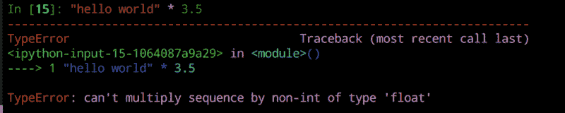

# 我给新开发人员的最佳建议:来自(大部分)自学成才的软件工程师的建议

> 原文：<https://www.freecodecamp.org/news/my-best-tips-for-new-developers-advice-from-a-mostly-self-taught-software-engineer-9cb2f6238177/>

作者:阿里·斯皮特尔

# 我给新开发人员的最佳建议:来自(大部分)自学成才的软件工程师的建议


我从博客读者那里得到的最常见的问题是“你对新程序员有什么建议？”所以，我想是时候写下我的想法了。

我将在未来写下我的完整故事，但我在大学里上过两门计算机科学课。然后，不久后我得到了一份软件工程实习。我开始做网页开发工作。最初，我在后端工作，然后最终在前端工作。在最初的几堂计算机科学课中，我的大学绝对没有教授 web 开发，所以我自学。

我不认为我的故事是独特的。所有的程序员在某种程度上都是自学的，无论他们是完全自学还是拥有计算机科学硕士学位。一路走来，每个人都自学了 RegEx 之类的东西。事实上，自学可能是作为开发人员最重要的技能之一。

除了我自己的经验之外，我还教人们编程，这是我的主要工作，也是我志愿服务的组织的工作。所以本文也借鉴了这一经验。

所以，这里是我的入门建议。

### 我给新程序员的建议

#### 1.有你的理由，并记住它

如果你想开始编程，就必须有一个理由。这个原因可能是你喜欢写代码，或者你想有一个更赚钱的职业。可能你正在做大量的 Excel 工作，你想让它更有效率。

记录下原因。编程很难，你有时会感到沮丧。记住这个理由并坚持下去是很重要的。你可以在你的电脑上贴一张便条，或者在你的主屏幕上贴一张便条。或者(像我一样)用干擦记号笔写在你的镜子上。

#### 2.建立坚实的基础

这可能是一个不太常见的建议，但我认为它真的很有帮助。在你开始写代码之前，如果你已经有一段时间没看数学了，我想重温一下代数 1 中的概念。编程是建立在代数 1 数学之上的，就像函数和变量一样。在编程之外理解这些概念，在未来会超级有价值。推荐[可汗学院的](https://www.khanacademy.org/math/algebra/)代数 1 课程！

```
let x = 1; // conceptually the same as algebraic variables!
```

```
function add (x, y) { // the same as algebraic functions!  return x + y}
```

#### 3.找到一个社区

当你开始写代码时，找一个社区来支持你会很有帮助。这个社区将是有价值的，因为其他人将和你在同一个地方。他们可以提供帮助他们的资源和鼓励。

我建议找一个你所在地区的聚会作为这里的首要解决方案。即使是小城市也倾向于在附近有一个群体。如果没有，我建议 [dev.to](https://dev.to/) 和 CodeNewbie 社区作为两个很好的选择。CodeNewbie 有一个每周的 Twitter 聊天，一个 Slack 组，还有播客可以听。Dev.to 有一堆博客文章和一个# discuss 标签，你可以在那里发表你的问题。

#### 4.把问题分解成小问题

编程最重要的部分之一就是把一个大问题分解成越来越小的部分，直到这些部分可以解决。如果你正看着一个空白的文本编辑器不知道从哪里开始，这可能是因为你没有足够地分解问题！

#### 5.伪代码

与前一点相关，很多时候，甚至在尝试编写代码之前，用简单的语言详细写下您要做的事情是有益的。这个过程被称为伪代码，它可以采取你想要的任何形式。首先在纸上慢慢地解决问题也是有帮助的。你思考甚至写下你要采取的解决问题的步骤。

```
// if the user has more than ten points//     display "winner" on the page// else//     keep playing
```

#### 6.拥抱学习的循环

如果你把学习编程作为第二职业，特别是如果你已经离开教室一段时间，学习如何学习将是你过程中的一个重要部分。有很多起伏，这是非常自然的！出发前，我会做好坐过山车的准备。

#### 7.从免费资源开始

学习如何编码有无数的资源。有些是免费的，有些是付费的。我会从[免费资源](https://zen-of-programming.com/favorite-free-resources)开始。先确定自己喜欢写代码。之后，你可以考虑转向付费资源甚至训练营。

#### 8.找到你的位置

编程中有很多世界，所以试着找到一个你热爱的世界，并专注于它。不要试图去学习 8 种编程语言，前端和后端，编译和解释语言，所有的文本编辑器，开发者工具等等，找几样你真正感兴趣的东西，并擅长它们。

#### 9.擅长模式识别

识别代码中的模式是你能拥有的最重要的技能之一。当人们谈论写“干”代码(即不要重复自己)时，他们是在谈论减少代码中的模式。我推荐模式识别游戏集——你甚至可以在纽约时报的网站上每天在线玩游戏。

```
// not DRY codelet reversedString = string.split("").reverse().join("")let reversedString2 = string2.split("").reverse().join("")
```

```
// cleaner code
```

```
const reverse = string => string.split("").reverse().join("")let reversedString = reverse(string)let reversedString2 = reverse(string2)
```

#### 10.早点养成好习惯

如果你早点养成这个习惯，将来编写干净的代码会更容易。坏习惯很难改掉。这里是我写更干净代码的建议。如果你正在做 web 开发，在你的代码上运行 [HTML](https://validator.w3.org/) 和 [CSS](https://jigsaw.w3.org/css-validator/) 验证器可以告诉你到底要修复什么！

```
// Not great
```

```
function avg (a) {  let s = a.reduce((x, y) => x + y)  return s / a.length}
```

```
// Much better!
```

```
function sumArray(array) {  return array.reduce((number, currentSum) => number + currentSum)}function averageArray(array) {  return sumArray(array) / array.length}
```

#### 11.确定你的学习风格

每个人的学习方式不同。无论你是视觉型、听觉型还是动觉型学习者，你的学习方式都与他人不同。确定你如何学得最好，并依靠适合这种风格的资源。例如，我从阅读文档及其代码示例中学到的最多。在教程中我很容易失去注意力。

#### 12.挣扎，但不要太多

学习的时候稍微挣扎一下真的很重要。你想自己解决问题，利用现有的资源找到答案。也就是说，在一个问题上纠结太久是无益的，会让人失去动力。几个小时后，向某人寻求帮助！

#### 13.坦然面对失败

编程很难，找到正确的答案不会立竿见影。我编程旅程中最关键的时刻之一是[没能写出一个数独解算器](https://dev.to/aspittel/how-i-finally-wrote-a-sudoku-solver-177g)。要适应不能马上得到所有东西并看到那些错误消息是很有挑战性的。但这是编程的一个重要部分。

#### 14.喜欢你的错误信息

错误信息非常有用！当你开始的时候，红色的错误信息可能会很可怕！迈出的一大步是通读这些信息，理解它们，然后用它们来解决问题。事实上，你会发现一个程序无声的失败比一个有用的错误信息更令人讨厌。



Python Error Message

#### 15.有些编程语言比其他语言更容易

首先学习哪种编程语言没有正确的答案。有些会更容易捡起来。我最喜欢的三种语言是 Python、Ruby 和 JavaScript。我喜欢它们，因为它们背后有一个庞大的社区，有更直接的语法，并且是解释型的，所以你不需要经历一个编译过程。

#### 16.你不需要知道所有的事情

完全了解编程是不可能的。没有人知道每一种编程语言，每一种方法，每一个库和框架，或者每一个问题的完美解决方案。不要担心学习所有的东西，只要专注于你所知道的并扩展它。

#### 17.关注深度胜于广度

深入学习一件事胜过对许多事情一知半解，尤其是在开始的时候。这些深入的知识将会延续下去，并使下一步的学习变得更加容易。戴上眼罩，这样你就不会放弃你正在学习的东西，转向新的东西。

#### 18.首先关注基本面

编程的基础是无价的。无论你最终从事什么样的编程工作，你都会用到它们。在继续学习每个人都在谈论的那个令人敬畏的库之前，专注于拥有关于循环、条件、函数、数据类型和(在大多数语言中)面向对象编程的扎实知识。

一旦你真正掌握了基础知识，学习这个库就会容易得多。它们也会从一种语言传到另一种语言，所以你只需要真正学习一次。之后就是语法了！

#### 19.善于解决问题

解题是编程的基础！在这方面做得更好至关重要。解谜语，在纸上写代码，分解问题，真的可以帮助解决问题。

我有时在新开发人员身上看到的一点是，他们把编程当作一个研究问题，而不是一个解决问题的项目。如果他们在谷歌上搜索得足够好，他们就会有解决方案。是的，Google 和 Stack Overflow 非常有用，但有时也要依靠自己。在研究某样东西之前，用几种不同的方法去尝试它。或者，研究问题的一小部分，而不是问题本身——即“将字符串转换成数组 JavaScript”而不是“反转字符串 JavaScript”

#### 20.擅长研究

要学习的最重要的事情之一是如何找到你的问题的好答案，或者学习你的语言或库的新特性。使用谷歌很重要，加入社区和订阅资源也很重要。我平时用的 Google 模板是“问题语言/框架/库”，尽量少用词，不加填充。所以，“排序数组 JavaScript”，“旋转元素 CSS”，或者“创建路由器 Vue。”

#### 21.建立你喜欢的项目

当你学习的时候，你会建立各种项目来练习(和展示)你的技能。选择你感兴趣的项目想法——你更有可能完成它们，并想把工作投入其中。相关:完成那些项目。几个真正好的完工项目比一堆半成品更令人印象深刻！

#### 22.只和自己比较

有很多人在学习编程。不要拿你的进步和别人相比。取而代之的是，将自己与之前的你进行比较，关注自己的成长。

#### 23.做一堆代码挑战

进行快速代码挑战真的有助于巩固基础。它们非常适合解决问题和练习面试。如果你想让别人来解答，我每天都会在推特上贴一个，标签是[#编码难题](https://twitter.com/hashtag/CodingPuzzle?src=hash)！

```
"""Find the element in an array that only occurs oncefrom https://www.hackerrank.com/challenges/ctci-lonely-integer""" from collections import Counter
```

```
def lonely_integer(a):    a_counter = Counter(a)    for l, count in a_counter.items():        if count == 1:            return l
```

#### 24.庆祝你的胜利

学习编程可能是一个非常困难的过程，所以当你完成了一些事情，即使很小，也要庆祝一下！我在 [Google Keep](https://keep.google.com/) 中记录我的胜利，因此，如果我有一天过得不好，我可以回到这些胜利并记住它们。

#### 25.编程很牛逼

编程真的很酷，因为你可以构建东西。我总是想起桑迪·梅斯的这句话:

> 我们这些写软件的人非常幸运。构建软件是一种无罪恶感的快乐，因为我们可以用我们的创造力来完成工作。我们安排了我们的生活，两者兼得；我们可以享受编写代码的纯粹行为，确信我们编写的代码是有用的。我们生产重要的东西。我们是现代手工艺者，建造构成当今现实的结构，不亚于砌砖工或造桥工，我们有理由为自己的成就感到自豪。

> 所有程序员都有这一点，从最热情的新手到明显疲惫的长者，无论是在最轻量级的互联网初创公司工作还是在最保守的老牌企业工作。我们想尽最大努力。我们希望我们的工作有意义。我们想一路玩得开心。

> ***三迪梅斯***

### 保持联系！

如果你喜欢这篇文章，它的出处还有很多！我每周都会发一份简讯,上面有我最喜欢的链接和我那周写的东西。你也可以[在 Twitter 上关注我](https://twitter.com/ASpittel)来查看我发布的帖子！

*最初发表于[zen-of-programming.com](https://zen-of-programming.com/start-programming)。*