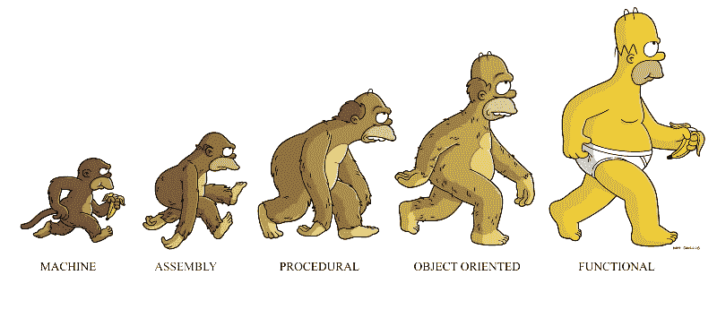
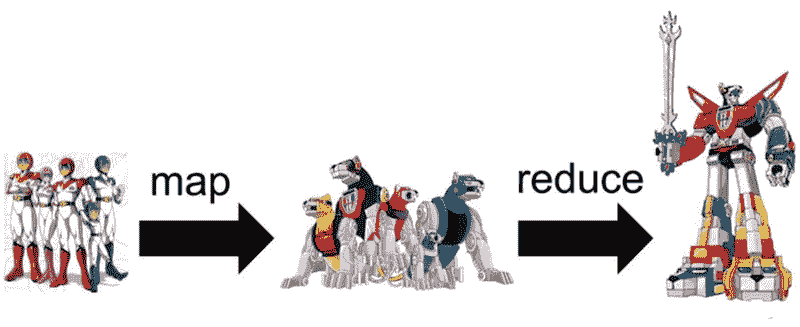
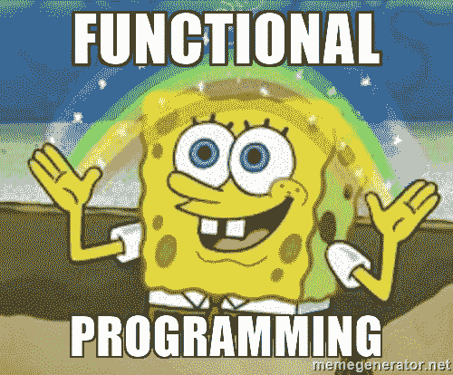

# 我最喜欢的 Kotlin 函数式编程的例子

> 原文：<https://www.freecodecamp.org/news/my-favorite-examples-of-functional-programming-in-kotlin-e69217b39112/>

作者:马尔钦·莫斯卡拉

Kotlin 的一大优点是它支持函数式编程。让我们来看看和讨论一些用 Kotlin 编写的简单但富有表现力的函数。



### 收集处理

Kotlin 为集合处理提供了一些最好的支持。它很有表现力，支持很多功能。看一个例子，假设我们为一所大学做一个系统。我们需要找到值得奖学金的最优秀的学生。我们有以下`Student`型号:

```
class Student(
    val name: String,
    val surname: String,
    val passing: Boolean,
    val averageGrade: Double
)
```

现在，我们可以进行以下处理，以获得符合所有标准的前 10 名学生的列表:

```
students.filter { it.passing && it.averageGrade > 4.0 } // 1
    .sortedBy { it.averageGrade } // 2
    .take(10) // 3
    .sortedWith(compareBy({ it.surname }, { it.name })) // 4
```

1.  我们只招收及格且平均绩点高于 4.0 的学生。
2.  我们按平均分排序。
3.  我们取前 10 名学生。
4.  我们按字母数字对学生进行分类。比较器首先比较姓氏，如果相等，则比较姓名。

如果我们需要让学生保持和以前一样的顺序，而不是字母数字顺序，会怎么样？我们可以做的是使用索引来保持顺序:

```
students.filter { it.passing && it.averageGrade > 4.0 }
    .withIndex() // 1
    .sortedBy { (i, s) -> s.averageGrade } // 2
    .take(10)
    .sortedBy { (i, s) -> i } // 3
    .map { (i, s) -> s } // 4
```

1.  我们给每个元素添加当前索引。
2.  我们需要在使用前[析构](https://kotlinlang.org/docs/reference/multi-declarations.html)值和索引。
3.  我们按指数排序。
4.  我们删除索引，只保留学生。

由此可见，Kotlin 中的集合处理是多么简单和直观。



### Powerset

如果你在大学里学过代数，那么你可能还记得什么是幂集。对于任何集合，它的幂集是它的所有子集的集合，包括这个集合和空集。例如，如果我们有以下集合:

`{1,2,3}`

它的功能集如下:

`{{}, {1}, {2}, {3}, {1,2}, {1,3}, {2,3}, {1,2,3}}`

这样的函数在代数中非常有用。怎么才能实现呢？

如果你想挑战自己，那么现在就停下来，先试着自己解决。

让我们从简单的观察开始分析。如果我们取集合中的任何一个元素(比如 1)，那么幂集将包含相同数量的包含这些元素`({1}, {1,2}, {1,3}, {1,2,3})`和不包含这些元素`({}, {2}, {3}, {2,3})`的集合。

注意第二个是一个`powerset({2,3})`，第一个是一个每个集合加 1 的`powerset({2,3})`。因此，我们可以通过获取第一个元素来计算幂集，计算所有其他元素的幂集，并返回结果和第一个元素添加到每个集合的结果之和:

```
fun <T> powerset(set: Set<T>): Set<Set<T>> {
   val first = set.first()
   val powersetOfRest = powerset(set.drop(1))
   return powersetOfRest.map { it + first } + powersetOfRest
}
```

上述声明将无法正常工作。空集的问题是:`first`会在集合为空时抛出一个错误。这里，定义附带了一个解:powerset({}) = {{}}。当我们修复它时，我们将准备好我们的算法:

```
fun <T> powerset(set: Set<T>): Set<Set<T>> =
    if (set.isEmpty()) setOf(emptySet())
    else {
       val powersetOfRest = powerset(set.drop(1))
       powersetOfRest + powersetOfRest.map { it + set.first() }
    }
```


让我们看看它是如何工作的。假设我们需要计算`powerset({1,2,3})`。算法会这样计算:

`powerset({1,2,3}) = powerset({2,3}) + powerset({2,3}).map { it + 1 }`

`powerset({2,3}) = powerset({3}) + powerset({3}).map { it + 2}`

`powerset({3}) = powerset({}) + powerset({}).map { it + 3}`

`powerset({}) = {{}}`

`powerset({3}) = {{}, {3}}`

`powerset({2,3}) = {{}, {3}} + {{2}, {2, 3}} = {{}, {2}, {3}, {2, 3}}`

`powerset({1,2,3}) = {{}, {2}, {3}, {2, 3}} + {{1}, {1, 2}, {1, 3}, {1, 2, 3}} = {{}, {1}, {2}, {3}, {1,2}, {1,3}, {2,3}, {1,2,3}}`

可以改进上述功能。我们可以使用`let`函数使符号更短、更紧凑:

```
fun <T> powerset(set: Set<T>): Set<Set<T>> =
    if (set.isEmpty()) setOf(emptySet())
    else powerset(set.drop(1))
           .let { it+ it.map { it + set.first() }
```

我们也可以将这个函数定义为对`Collection`的扩展函数，这样我们就可以像使用`Set` ( `setOf(1,2,3).powerset()`而不是`powerset(setOf(1,2,3))`)的方法一样使用这个函数:

```
fun <T> Collection<T>.powerset(): Set<Set<T>> =
    if (isEmpty()) setOf(emptySet())
    else drop(1)
           .powerset()
           .let { it+ it.map { it + first() }
```

一个大的改进是使`powerset`尾部递归。在上面的实现中，`powerset`的状态随着每次迭代(循环调用)而增长，因为前一次迭代的状态需要保存在内存中。

相反，我们可以使用命令式循环或`tailrec`修饰符。我们将使用第二个选项来保持函数的可读性。`tailrec`修饰符只允许在最后一条语句中进行一次递归调用。这就是我们如何改变我们的功能以有效利用它:

```
fun <T> Collection<T>.powerset(): Set<Set<T>> = 
    powerset(this, setOf(emptySet()))

private tailrec fun <T> powerset(left: Collection<T>, acc: Set<Set<T>>): Set<Set<T>> =
    if (left.isEmpty()) acc
    else powerset(left.drop(1), acc + acc.map { it + left.first() })
```

上面的实现是[KotlinDiscreteMathToolkit](https://github.com/MarcinMoskala/KotlinDiscreteMathToolkit)库的一部分，该库定义了离散数学中使用的许多其他函数。

### 快速分类

我最喜欢的例子来了。我们将看到如何使用函数式编程风格和工具来简化一个困难的问题，并使其可读性更高。

我们将实现[快速排序](https://en.wikipedia.org/wiki/Quicksort)算法。算法很简单:我们选择某个元素(pivot ),然后将所有其他元素分布到列表中，元素比 pivot 大或小。然后我们递归排序这些子数组。最后，我们添加较小元素的排序列表、透视和较大元素的排序列表。为了简化，我们将第一个元素作为支点。下面是完整的实现:

```
fun <T : Comparable<T>> List<T>.quickSort(): List<T> = 
    if(size < 2) this
    else {
        val pivot = first()
        val (smaller, greater) = drop(1).partition { it <= pivot}
        smaller.quickSort() + pivot + greater.quickSort()
    }
// Usage
listOf(2,5,1).quickSort() // [1,2,5]
```

看起来很棒，不是吗？这就是函数式编程的美妙之处。



这种函数的第一个关注点是它的执行时间。它根本没有针对性能进行优化。相反，它短小精悍，可读性很强。

如果您需要一个高度优化的函数，那么您可以使用 Java 标准库中的一个。它基于不同的算法，取决于某些条件，而且它的实际实现写得很幼稚。效率应该会高很多。但是具体是多少呢？我们来比较一下这两个功能。让我们用随机元素对几个不同的数组进行排序，并比较执行时间。以下是我为此使用的代码:

```
val r = Random()
listOf(100_000, 1_000_000, 10_000_000)
    .asSequence()
    .map { (1..it).map { r.nextInt(1000000000) } }
    .forEach { list: List<Int> ->
        println("Java stdlib sorting of ${list.size} elements took ${measureTimeMillis { list.sorted() }}")
        println("quickSort sorting of ${list.size} elements took ${measureTimeMillis { list.quickSort() }}")
    }
```

在我的机器上，我得到了以下结果:

对 100000 个元素进行 Java stdlib 排序用了 83
对 100000 个元素进行快速排序用了 163
对 1000000 个元素进行 Java stdlib 排序用了 558
对 1000000 个元素进行快速排序用了 859
对 10000000 个元素进行 Java stdlib 排序用了 6182
对 10000000 个元素进行快速排序用了 12133 `对

我们可以看到，`quickSort` 功能一般要慢 2 倍。即使对于大型列表也是如此。它具有相同的可扩展性。在正常情况下，差值通常在 0.1ms 和 0.2ms 之间。请注意，这要简单得多，可读性也更强。这解释了为什么在某些情况下，我们可以使用一个不太优化的函数，但可读性和简单。

如果你对科特林感兴趣，可以去看看[科特林学院](https://blog.kotlin-academy.com/)。这是一个伟大的出版物和社区，专门为科特林。

我还在我的推特上发布了很多资源。要提到我，请使用 [@marcinmoskala](https://twitter.com/marcinmoskala) 。如果你需要我的帮助，请记住[我愿意接受咨询](https://medium.com/@marcinmoskala/ive-just-opened-up-for-online-consultations-640349aaba55)。