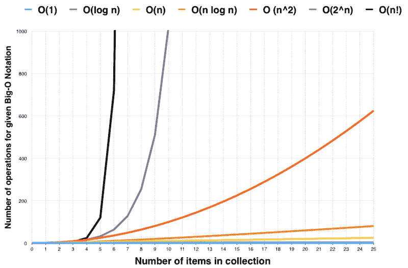

# 大 O 符号初学者指南

> 原文：<https://www.freecodecamp.org/news/my-first-foray-into-technology-c5b6e83fe8f1/>

费斯图斯·杨加尼

# 大 O 符号初学者指南



大 O 符号是一种表示算法执行需要多长时间的方法。它使软件工程师能够确定解决问题的不同方法的效率。

以下是大 O 符号中一些常见的时间复杂性类型。

*   O(1) -恒定时间复杂度
*   O(n) -线性时间复杂度
*   O(log n) -对数时间复杂度
*   O(n^2) -二次时间复杂度

希望在这篇文章结束时，你能够理解大 O 符号的基础。

#### O(1) —常数时间

常数时间算法将总是花费相同的时间来执行。这些算法的执行时间与输入的大小无关。O(1)时间的一个好例子是访问一个带有数组索引的值。

```
var arr = [ 1,2,3,4,5];
```

```
arr[2]; // => 3
```

其他例子包括:对数组的 push()和 pop()操作。

#### O(n) -线性时间复杂度

如果执行算法的时间与输入大小 *n* 成正比，则该算法具有线性时间复杂度。因此，运行算法所需的时间将随着输入 *n* 的增加而成比例增加。

一个很好的例子是在一堆 CD 中找到一张 CD 或阅读一本书，其中 n 是页数。

O(n)中的例子是使用线性搜索:

```
//if we used for loop to print out the values of the arrays
```

```
for (var i = 0; i &lt; array.length; i++) {  console.log(array[i]);}
```

```
var arr1 = [orange, apple, banana, lemon]; //=> 4 steps
```

```
var arr2 = [apple, htc,samsung, sony, motorola]; //=> 5 steps
```

#### O(log n) -对数时间复杂度

如果运行算法所需的时间与输入大小 *n* 的对数成比例，则该算法具有对数时间复杂度。二分搜索法就是一个例子，它经常被用来搜索数据集:

```
//Binary search implementationvar doSearch = function(array, targetValue) {    var minIndex = 0;    var maxIndex = array.length - 1;    var currentIndex;    var currentElement;        while (minIndex <= maxIndex) {        currentIndex = (minIndex + maxIndex) / 2 | 0;        currentElement = array[currentIndex];        if (currentElement < targetValue) {            minIndex = currentIndex + 1;        } else if (currentElement > targetValue) {            maxIndex = currentIndex - 1;        } else {            return currentIndex;        }    }    return -1;  //If the index of the element is not found.};
```

```
var numbers = [11, 13, 15, 17, 19, 21, 23, 25, 27, 29, 31, 33];
```

```
doSearch(numbers, 23) //=>; 6
```

对数时间复杂度的其他示例包括:

```
Example 1;
```

```
for (var i = 1; i < n; i = i * 2)  console.log(i);}
```

```
Example 2;
```

```
for (i = n; i >= 1; i = i/2) console.log(i);}
```

#### O(n^2) -二次时间复杂度

如果一个算法的执行时间与输入大小的平方成正比，则该算法具有二次时间复杂度。一个很好的例子是检查一副牌中是否有重复的牌。

你会在涉及嵌套迭代的算法中遇到二次时间复杂度，比如循环的嵌套*。*事实上，更深的嵌套循环会导致 *O(n^3)、O(n^4)等。*

```
for(var i = 0; i < length; i++) {     //has O(n) time complexity    for(var j = 0; j < length; j++) { //has O(n^2) time complexity      // More loops?    }}
```

二次时间复杂度的其他例子包括冒泡排序、选择排序和插入排序。

本文只是触及了大 O 符号的皮毛。如果你想了解更多关于 Big O 符号的知识，我推荐你看看 [Big-O 备忘单](http://bigocheatsheet.com/)。