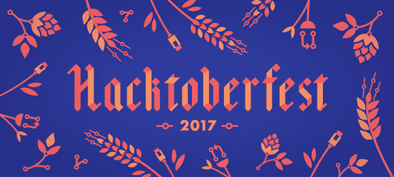
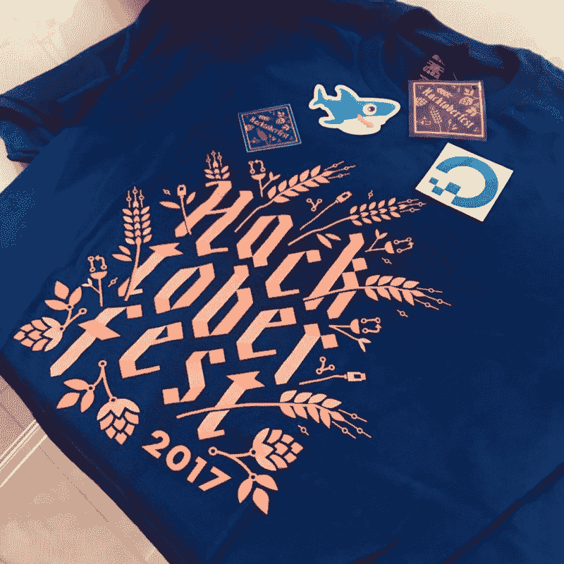
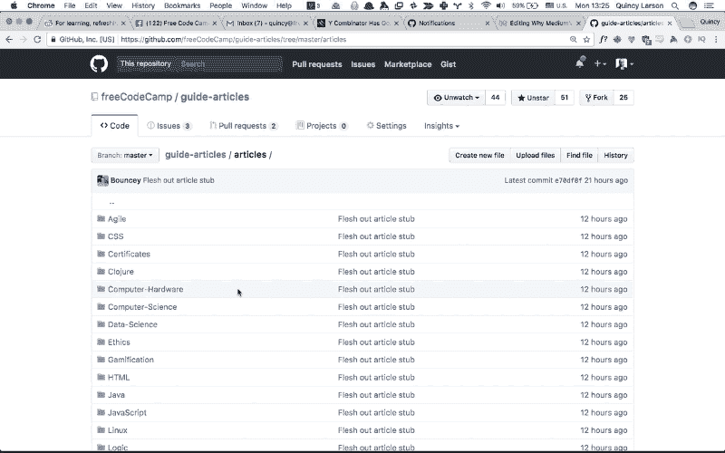
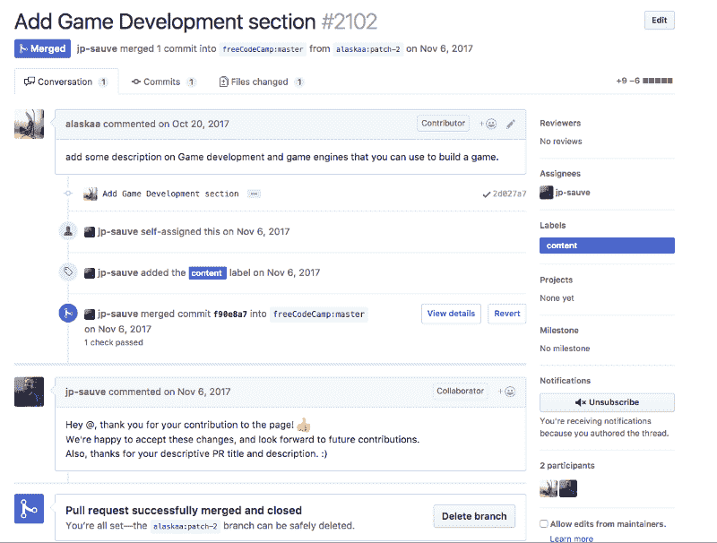

# 我的第一个 hack toberfest——作为第一个计时器为开源做贡献的经历

> 原文：<https://www.freecodecamp.org/news/my-first-hacktoberfest-experiences-of-contributing-to-open-source-as-a-first-timer-b538f7c129dc/>

作者:西比尔·瑟尔

# 我的第一个 hack toberfest——作为第一个计时器为开源做贡献的经历



为开源和项目做贡献似乎是一个令人生畏的过程。你最喜欢的搜索引擎会返回大量关于指南和知识库的结果。但是很多时候，你的搜索并没有得到你想要的结果，即使你读了很多博客文章，你仍然不知道如何为开源做贡献。某些项目的负面声誉和苛刻的潜在影响也不会有所帮助，甚至可能使问题进一步复杂化。

我自己去过那里。我翻遍网页寻找可以贡献的伟大的开源库，却发现我不知道如何开始。

沮丧和有点失望，我开始关注其他项目。

但当我看到一名同事笔记本电脑上的 Hacktoberfest 贴纸时，一切都变了。我很好奇——这是另一个黑客马拉松的残余吗？

Hacktoberfest 结果非常不同。

### 那么什么是黑客啤酒节呢？

提示:它与啤酒、黑客或啤酒节(实际上在九月举行，咄！).

Hacktoberfest 是一个为期一个月的庆祝开源的活动，从 10 月 1 日持续到 10 月 31 日。它由 DigitalOcean 与 GitHub 合作发起。在 10 月份，我们鼓励您向 GitHub 上您最喜欢的存储库提交内容和请求。如果你总共做了四件，你就有资格得到一件这样的时髦 t 恤！



This beauty of a T-Shirt is what you receive after completing Hacktoberfest (Credit: @mahsinger on Twitter)

### 标签，标签，标签

Hacktoberfest 被证明是一个进入开源的好月份。GitHub 充满了标签为 *Hacktoberfest* 的问题，需要你的帮助。有足够多的项目可供选择——从文档到 Python 再到 RUST。在此期间，我学会了如何通过*标签*在 GitHub 上搜索问题，以及如何找到好的问题来投稿。

对于像我这样没有任何经验的人来说，像*只对第一次来说*、*容易*或*好的首发*这样的标签证明是我的朋友。也有一些好的网站旨在使发现这些问题的过程更容易。例如，[up-for-grabs.net](http://up-for-grabs.net/)或[代码分流](https://www.codetriage.com/)——可能还有更多。

去注册其中的几个或检查他们的问题！

### 学习如何做出贡献

当我试图做出我的第一份贡献时，我意识到我最大的未知不是如何添加链接到 markdown 或者设计一个页面。但是如何使用 git 和命令行做出一个*好的* pull 请求。

我发现 egghead.io 上的 Kent C. Dodds 的免费指南很有帮助，并记下了我在跟随过程中执行的命令行命令。

这些说明可以概括为这样简单的内容:

```
//First you need to find a repository you want to contribute to and fork it! 
```

```
// Then you have to clone the forked repo git clone git@github.com:yourusername/contributing-repo.git
```

```
// Change your directory to the new repo you cloned cd contributing-repo
```

```
// Set the upstream repository to the original repository (not the one you just cloned) git remote add upstream git@github.com:the-owners-username/contributing-repo.git
```

```
// Update any changes git fetch upstream
```

```
// Set our master branch to same as upstream branchgit branch --set-upstream-to=upstream/master master
```

```
// Create your own new branch for your pull requestgit checkout -b pr/my-new-cool-contribution
```

```
// Make any changes in your favourite text editor and save
```

```
//check status (should show the modified files)git status
```

```
// look at changes and reassess workgit diff
```

```
// add any changes to your staging area ( . for all files)git add 
```

```
// Commit all changes and add a message for the maintainer of the repogit commit -m "I added this cool text to your guide repository"
```

```
// Push to source repo and create pull requestgit push origin pr/my-new-cool-contribution
```

这真的帮助我理解了拉式请求的目的以及做出贡献的过程。[这篇博文](https://medium.com/@mscccc/jr-developers-1-pull-requests-you-39a11c3bdd94)还帮助我理解了描述性是你最好的武器——这样你可以获得支持，并表明拉取请求是否仍在进行中。不久之后，我又做了一次练习，但为了收到一件 t 恤，我需要提高我的比赛水平，并找到另外两个问题。

### 天作之合——贡献给免费代码营指南

有一天我打开了 Medium，看到 Quincy Larson 提供了一个关于人们如何方便地向 freeCodeCamp guides 库贡献内容的完整指南。跨开发、产品、设计和数据科学的共享知识来源。为这个库做贡献不仅受到高度鼓励，而且非常容易。你可以在你的浏览器中做出贡献。

找到一个主题并不困难，因为指南库涵盖了从可访问性到 HTML 到游戏开发的所有内容。

最让我感兴趣的是 freeCodeCamp 是如何让像我这样的新人做出有意义的贡献的。与他人分享知识。

您还学习了如何提出拉动式请求、合并您的贡献以及遵守标准和贡献指南。这个过程没有那么可怕。这对初学者来说是完美的。事实上，正是这种简化，freeCodeCamp 成功地制作了一个 gif 来总结这个过程:



Credit: freeCodeCamp — Contributing to the freeCodeCamp guides repository

经过一番考虑，我决定在不同的 Linux 发行版上做一点贡献。写一个全新的游戏开发部分来完成我的四个拉请求。作为我论文项目的一部分，我在夏天做了一个游戏。写游戏开发和工具似乎是与他人分享我新获得的知识的好方法。

在他们的 [Contributing.md 指南](https://github.com/freeCodeCamp/guides/blob/master/CONTRIBUTING.md)中，freeCodeCamp 给出了很多细节和确保你的文章简洁的方法。我做了所有的研究，用资源做了备份，并通过[海明威应用](http://www.hemingwayapp.com/)发布了它。主动语态和短句为胜！

当它被合并时，我提出了我的拉取请求，欣喜若狂。令人鼓舞的反馈也是 freeCodeCamp 社区的一大亮点。



Pull Request for the Game Development section I wrote for freeCodeCamp guides

### 我们能从中学到什么？

我建议你把自己从假设中解放出来，你需要在第一次就贡献出完美和全面的代码。你的第一个贡献不一定是开创性的(或者准确地说是代码)。

项目维护人员知道，如果他们已经将这个问题标记为*首次使用*或类似的问题，这可能是你的第一个开源贡献。你的贡献可以是任何事情，比如纠正一个拼写错误，添加一些超链接或一个小的学习项目。从小处着手，熟悉流程。

许多项目维护者认为他们的问题对初学者来说是友好的，他们也很乐意回答你的问题并提供支持。所以，如果你有不明白的地方，不要羞于要求澄清。

当从美国远道运来的 Hacktoberfest T 恤终于在 12 月中旬到达时，我感觉圣诞节提前到来了。把它拿在手中让我意识到我已经帮助创造和扩展了一些重要的东西。这种感觉我相信很多定期为开源做贡献的人都会经历。穿着它总是提醒我分享我的知识，今年我也将尝试做出更多的代码，毕竟我不再是第一次了！