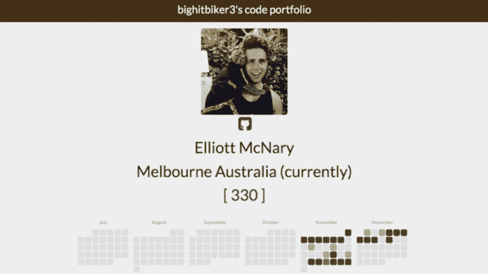
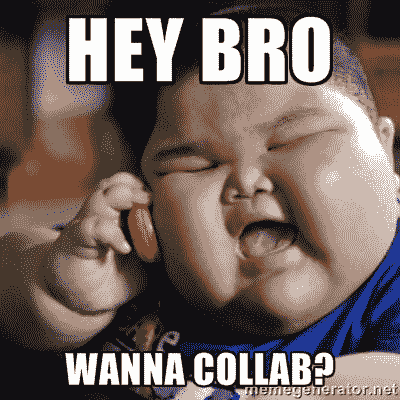
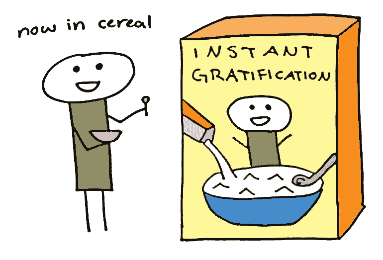
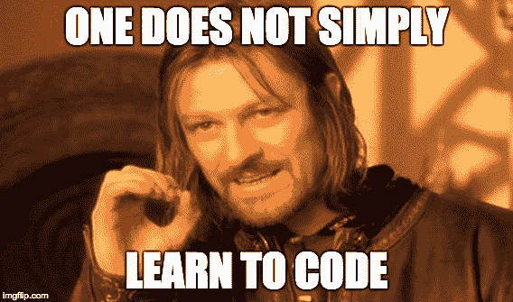
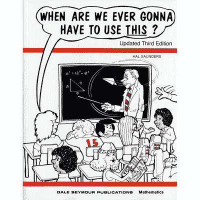

# 我在自由代码营的第一个月

> 原文：<https://www.freecodecamp.org/news/my-first-month-at-freecodecamp-781c591357f1/>

埃利奥特·麦克纳利

# 我在自由代码营的第一个月

我想开发一个应用程序，帮助艺术家赚更多的钱。

我很清楚自己想要建造什么。所以我开始找人帮我建造它。我在寻找一个技术合伙人。

但是经过短暂的搜索，我意识到大多数会编码的人都有自己的想法。他们想要建立自己的梦想。他们为什么要帮我建我的呢？

我读到过 Yipit 的创始人 David Sinsky 是如何在 8 周内学会编码的基础知识的，这样他就可以构建他最小可行的产品。这启发了我。8 周！因此，我在谷歌上搜索了几个小时，试图看看这个旅程将花费我多长时间，给定我的想法的范围。

我的发现令人沮丧。学习编写足够好的代码来构建我自己的足够复杂的产品可能需要数千个小时。

#### 好吧，我也可以开始了

尽管我最终获得了金融学位(圣地亚哥大学 2012 届)，但我一直对技术更感兴趣。但我从来不认为自己聪明到可以学习编码。首先，我不太擅长数学。

回想起来，我只是抓住几个宝贵的借口不放。因为，在现实中，编码并没有给我所希望的即时满足感——至少在最初的几个小时里没有。

我对学习编码的期望反映了我学习如何使用数字音频工作站制作音乐的方法。十六岁的时候下载了 FL Studio。我打开看了几个小时，还是想不通。所以我删了。

最后，大概六年后，我下载了 Ableton，然后说— *Elliott。坐下来学学这个。你想做音乐，那就投入时间。*

我照做了。大约 30-40 小时后，我对工作流程有了足够的了解，可以开始做一些非常糟糕的节拍了！

编码对我来说也是一样。我试着学了两个小时的代码。我想不通，我再也没有回来。

#### 现在，回到我第一个月的旅程

第一站:寻找资源，阅读关于学习哪种语言的文章。下一站:鬼混 CodeAcademy 和 Code4Startup。

然后我偶然看到昆西·拉森如何学习编码的故事。他对任何有抱负的程序员来说都是真正的激励。我强烈建议你阅读他的故事。

无论如何，昆西和其他志同道合的程序员团队建立了一个名为[自由代码营](http://www.freecodecamp.com)的社区。你学习非常难的课程。然后——经过大约 1000 个小时的学习——你可以为有需要的非营利组织开发应用程序。

我最喜欢自由代码营的部分是它不拐弯抹角。他们不会给我甜言蜜语，比如:

> 两周学会编写 Ruby on Rails 代码！只有 300 美元！

不。自由代码营对我来说是真实的。他们说:

> 嘿，你需要花很长时间来学习，但是我们会一直帮助你。

我喜欢那样。

我在 11 月 2 日开始了自由代码营，它很快成为了一种困扰。我开始在上班前 5:30 起床，这样我可以花几个小时编码。我一下班回家，就又开始努力学习课程了。

我上瘾了。

#### 跳进篝火中

过了路点后不久，我进入了所谓的篝火堆。当我第一次遇到这些算法脚本练习时，它们令人望而生畏。我立刻产生了一种焦虑，担心自己做不到这一点。我觉得自己已经力不从心了。

但我冷静下来了。我记得这并不容易。我记得对于每一场大火，都有无数可行的答案。这一切都很好——我告诉自己——如果我坚持下去，我最终会找到一个。

我努力学习，用 JavaScript 方法和数据结构的知识武装自己，这样我可以更容易地完成篝火晚会。当我完成第一次篝火晚会时，我欣喜若狂。(从技术上讲，这是第二次篝火晚会——第一次篝火晚会只是涉及到更改一个布尔值。)感觉我刚刚解决了世界饥饿什么的。

当我试图找出一个解决方案时，我感到非常沮丧。这让解决问题变得更加甜蜜。

就在那时，我发现了我喜欢编程的原因:**我喜欢奋斗。我喜欢推动自己。我喜欢知道*是*的解决方案。我只需要找到它。**

在那些在聊天室里闲逛的了不起的人的帮助下，我开始在篝火中漫游。快速喊出 [@qualitymanifest](https://gitter.im/qualitymanifest) 和[@ allanarmstrong](https://gitter.im/allanarmstrong)——当我需要帮助的时候，你似乎总是在那里。

总的来说，我对学习编码的主要不满是不知道我所学的东西是否真的有用。

#### 滑下一些滑索

Ziplines 是小型前端项目，例如使用 HTML、CSS 和 JavaScript 构建计算器、投资组合页面或番茄定时器。

这个投资组合对我来说相当简单。它主要是 HTML 和 CSS，这是我理解的。

但是当我做番茄定时器练习时，我又吓坏了。我陷入了绝望的深渊。我不知道我该如何完成这件事。我差点就放弃了。但是我不能。我告诉过太多人我正在学习编码。

所以我开始全力以赴，开始谷歌搜索。我用 Codecademy 和其他资源来补充我的学习。我终于开始计时了，我清楚地记得当我想出如何让它从 1:00 变到 0:59 的时候。

我几乎和 2015 年海鹰队在 NFC 锦标赛中击败包装工队时一样兴奋。上半场 0 比 16。我们回来了，又要去看超级碗了。

从那时起，我意识到我可以做到这一点。我只是需要去工作。

我工作过。我即将完成我的前端项目。我不知道我是否学得很快，这是一般水平，还是我比正常人花的时间长。我真的不在乎。我已经尽可能快了。

#### 我在学习和挑战自己，这很棒

在这一点上，我的艺术家原创产品的想法现在已经退居二线了。学习编程已经成为我的主要精力。一旦我熟练了，我就能造出我想要的任何东西。在那之前，请回到自由代码营及其有用的社区！

我对自由代码营团队所做的一切感激不尽。很高兴看到人们在没有数百万风险投资资金或数十亿美元快速盈利梦想的情况下建造一些东西。

参与到真正改变教育工作方式的事情中去是很棒的。昆西和他的团队正在做一些惊人的事情。

在这一点上，我意识到我听起来像一个痴迷于贾斯汀比伯的 14 岁小孩。但是这个社区给予我和所有营员的支持和知识绝对令人震惊。

你可以学习建造这些东西。一个多月前，我没有任何编码经验。现在，我正在使用 API 来构建我从未想象过自己在一百万年后也能构建的东西。

如果你正在尝试学习编码，请加入免费的代码营。

如果你有时间，[看看我在 CodePen](http://codepen.io/bighitbiker3/) 上的滑索项目。

这只是开始。我对未来无比兴奋。