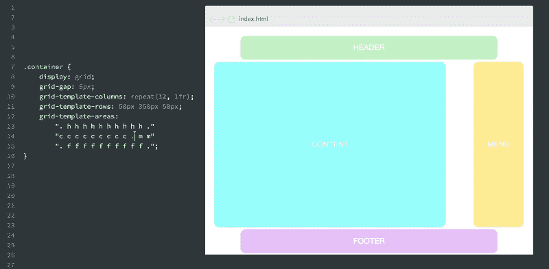

# 我的朋友约翰在 CSS 网格中犯了一个错误。不要像约翰那样，而是做这个。

> 原文：<https://www.freecodecamp.org/news/my-friend-john-made-a-mistake-in-css-grid-dont-be-like-john-do-this-instead-91649f480da1/>

两年过去了，约翰没有工作。

约翰是个聪明的 20 多岁的小伙子。好吧，他有工作——但不是他喜欢的工作。它太单调了，而且不够有创意。他白天的工作只会让他厌烦透了。

### 求职

对约翰来说，学习编码似乎并不难。他自学了编程，并开始寻找机会离开这份无聊的工作——终于。

经过一个月徒劳的求职，他接到了莎伦的电话。

莎伦是硅谷一家人工智能初创公司 youknowho Inc .的招聘人员。

约翰满怀热情地完成了整个招聘过程。猜猜最有趣的是什么？

莎伦打来的电话。

她问了几个关于他背景的问题，约翰迫不及待地与她分享他无聊、单调的典型工作日。

他试图告诉自己，是否得到这份工作并不重要。至少，这是他在电话结束时嘀咕的话。他说:“我只是想分享我对目前工作的真实感受，T2。”。

几周过去了，当他找到一份初级前端开发人员的工作时，感觉就像做梦一样。

这就是故事开始的地方。

### 约翰会见了哈利德和 CSS 网格

卡里德不是 DJ。

如果他是，那么他混合的都是干净的代码，而不是歌曲。

如果你想毁了一个美好的会后派对，那就让 Khalid 做你的 DJ。你只会得到一片混乱。

不管怎样，Khalid 并不喜欢唱歌，但当你在硅谷一家欣欣向荣的初创公司担任技术主管时，谁还需要热爱音乐呢？

作为技术主管，Khalid 负责整个开发团队。这不仅仅意味着处理技术问题，还意味着他必须与不同背景的人打交道。

这是一件非常困难的事情。但是 Khalid 不仅仅是一个优秀的技术领导者。他和开发团队的关系无可挑剔。

这两个人几乎立刻就聊了起来，这并不奇怪。谁会不爱约翰呢？

他灿烂的笑容足以照亮一条隧道。他总是微笑着。谁会这么做！

### 回到办公室

每个人都准备好工作了。

约翰端着一杯咖啡进来了。这是早上，办公室刚刚开始嗡嗡作响。

周一早上好，嗯？

“那么，约翰很高兴你加入开发团队。我想知道你今天是否准备好接受一项新任务？”哈利德问道

“嘿，老板。我生来就准备好了！”

那是约翰给你的。他生来就准备好了——确实如此。快乐的家伙。

“嗯，我需要你为我们的新产品建立一个新的登录页面。我们希望用 CSS 网格来编写它。听说过吗？”

“哦，是的，我有，”约翰很快地说。

### 学习 CSS 网格

约翰不知道 CSS 网格是什么。

他答应的唯一原因是他不想在 Khalid 面前显得愚蠢。

他在 Medium 上搜索，发现了很棒的 CSS 网格文章。他尽情地阅读，然后开始设计版面。

### 约翰建造的布局

约翰对 Bootstrap 很有经验。

他非常熟悉 12 列网格的概念。因此，对于 CSS 网格，他做的第一件事是建立一个 12 列的网格，如下所示:

```
grid-template-columns: repeat(12, 1fr) 
```

“哈哈，那很容易，”他心想。

事实上，John 在学习 CSS 网格时为他从事的每一个附带项目都这样做了。

John 喜欢使用 CSS 网格，他认为这很有趣。

他犯了一些错误，有些东西没有像他预期的那样工作，但是他能够很快修复这些问题。

他知道如何用谷歌搜索东西。在这个时代，每个人都应该。

### 与哈利德的会面

“我现在让它工作了，老板。”

哈利德见到约翰很兴奋。他们聊了聊他构建布局的经验，Khalid 接着看了看代码。

好吧，每个用 CSS 网格构建的布局几乎都是从网格定义开始的。所以，那是卡里德首先寻找的地方。

“哦，伙计。这里有些不对劲。”

### 为什么要创建 12 列？

哈利德开始了他的演讲…

12 列网格在今天的网页设计中很流行。但是 CSS 网格背后的想法是创建您需要的列数，而不会因为您不真正需要的列而增加布局。

CSS 网格布局迫使你以一种不同于我们 20 多年来所做的方式来思考 CSS 布局。

这是一个游戏规则的改变者，一个包含了很多遗忘的改变者。

“一个更简洁的方法是创建 2 或 3 个你需要的列，然后继续设计，”Khalid 说。

“重新定义媒体查询中的列数也没有坏处。使其成为响应式设计的完美之选。”

### 教训

使用 CSS 网格布局，您不会被限制在一定数量的行或列上。

您也不必每次都创建 12 列。如果不需要 12 列，就不要创建它们。CSS 网格不是另一个基于网格的 CSS 框架。

你自由了。

正如 Harald Borgen 所指出的，如果你想尝试在列之间留空白，你可以创建 12 列。



除此之外，创建您真正需要的列数，然后继续设计。

### 使用 CSS 网格布局向前移动网站

我读了一篇[回答](https://www.quora.com/Why-does-Apple-keep-getting-rid-of-things-instead-of-adding-them/answer/Brett-Bilbrey?share=baaad454&srid=tLgv)为什么苹果总是去掉一些东西，而不是增加它们。

在那里，我学到了这个:

> “支持遗产并不总是最好的答案。放弃一些东西有助于行业采用更新、更好的格式。”

同样的，选择学习和使用 CSS 网格也推动了网络的发展。它有助于行业接受更新更好的格式。它帮助我们作为一个社区成长。一个我们如此热爱并希望发展的社区。

像卡里德一样。如果可以的话，开始使用 CSS 网格。

在可能的情况下，投资一个体面的 CSS 网格教育。你将帮助推动网络向前发展。

### 想成为职业选手吗？

下载我的免费 CSS Grid 小抄，还能免费获得两门优质互动 Flexbox 课程！


[Get the Free CSS Grid Cheat sheet + Two Quality Flexbox Courses for free!](http://eepurl.com/dcNiP1)

[现在就拿](http://eepurl.com/dcNiP1)？