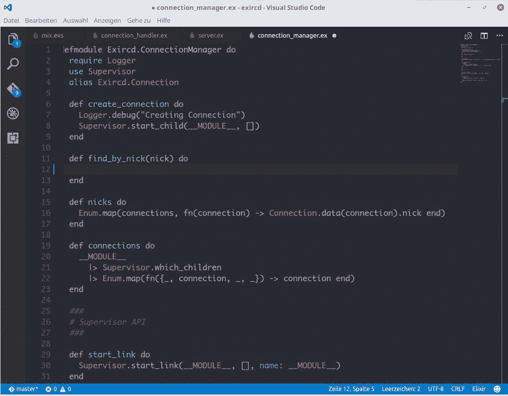

# 我的“灵丹妙药”简介:学习另一种编程语言如何让你成为更好的开发人员

> 原文：<https://www.freecodecamp.org/news/my-intro-to-elixir-how-learning-another-programming-language-can-make-you-a-better-developer-d967e568191c/>

尼古拉斯·安东内尔

# 我的“灵丹妙药”简介:学习另一种编程语言如何让你成为更好的开发人员


[Karen Roe](https://www.flickr.com/photos/karen_roe/ "Go to Karen Roe's photostream"): [https://www.flickr.com/photos/karen_roe/7375634372](https://www.flickr.com/photos/karen_roe/7375634372)

今年早些时候，我在华沙参加了 ElixirConf EU。这实际上是我第一次参加编程会议。我的同事正在做一个关于仙丹和凤凰的报告，叫做“凤凰和明天的世界”。

现在，我的背景是 JavaScript，但我的公司痴迷于仙丹。尝了一口 kool-aid 公司的产品，看看它能做什么，我已经完全改变了。

JavaScript 将永远是我的第一语言，在我心中占有特殊的位置。我仍然在使用、学习和参与充满活力和不断发展的 JavaScript 和 React 社区。

尽管我已经熟悉了用于工作的 Elixir，但我已经认识到学习另一种编程语言的巨大价值。

学习一门新的口语也是类似的经历。你被挤出了你的舒适区。必须以另一种方式理解和推理，甚至从另一个角度。

此外，您通常必须从基本原则开始重建，这反过来会带来打破先入为主的假设和限制的额外好处。

这是一件健康的事情，最终我们应该是语言、库和框架不可知论者。

我们的工作实际上不是写代码，当然也不是写代码的特定“语言”。

而是为我们的公司、客户和顾客解决问题。

在解决问题时，拥有其他语言、框架和编码范式可以增加你以更好的方式解决问题的机会。此外，它使你成为一个更全面的程序员和有价值的团队成员。

#### 进一步探索长生不老药

Elixir 是一种相对较新的元编程语言，由 Jose Valim 创建，于 2012 年推出。

“元”的部分不仅仅是我试图成为“时髦”，“发生”和“打倒酷孩子”。它为长生不老药的定义提供了额外的信息。

为了解释更多关于 Elixir 的内容，我想我必须先介绍一下 Erlang。这是因为 Elixir 构建在 Erlang 之上(因此是“元”部分)。它运行在 Erlang 虚拟机上，称为 BEAM 是因为我必须通过 [DuckDuckGo](https://www.freecodecamp.org/news/my-intro-to-elixir-how-learning-another-programming-language-can-make-you-a-better-developer-d967e568191c/undefined) 才能找到它。

Erlang 是由乔·阿姆斯特朗、罗伯特·维尔丁和迈克·威廉姆斯在 20 世纪 80 年代中期为爱立信工作时创建的

爱立信在电信领域工作。他们面临的问题是如何制作健壮、容错和异步的软件——这样呼叫就不会丢失！

肩负着这个使命，这些工程师创造了 Erlang。丹麦工程师阿涅尔·克拉鲁普·尔朗 经常被引用为同名人……尽管它也是一个非常方便的选择

回到灵丹妙药。作为一门函数式语言，保持一切有序、有组织和可读是非常好的。

这个函数执行特定的任务。这个模块执行这组功能。双方都不需要知道对方在做什么。这种模块化的设计模式使得保持一个干净的代码库更加容易。

它实际上被认为是一种多范例语言，因为它是功能性的、并发的、分布式的和面向过程的。很酷的故事——但是这到底意味着什么呢？

*   **函数式编程**使用没有隐藏值进出的函数(理想情况下是“纯函数”,输入和输出都明确声明)来构建程序。目标是从代码中移除副作用或意外的输出。
*   **并发**让一个程序同时执行多个计算。它不一定要等一件事结束了才开始另一件事。这被称为“阻塞”,因为下一项的执行被阻止运行，直到前一项完成。
*   **分布式**描述了信息是如何交换的。在分布式系统中，问题被分解成更小的任务。这些都是通过交换消息来完成的。由于这些消息可以通过机器/网络相互交流，所以它是分布式的。
*   **面向过程的**也反映了问题如何被分解成更小的任务或过程，并且旨在将数据结构与和它们交互的过程分开。想要这样做的原因是它允许程序员更有把握地得到他们期望的结果。

这是长生不老药的样子:



[https://marketplace.visualstudio.com/items?itemName=mjmcloug.vscode-elixir](https://marketplace.visualstudio.com/items?itemName=mjmcloug.vscode-elixir)

整洁、可读性强——请注意以下模式:

```
defmodule <Module_name> do

 def <something> do

  <the things to do>
  |> {you can use the pipe operator (|>) to parse..}
  |> {the result from a function..}
  |> {as the fist argument to the next function..}
  |> {creating a 'pipeline' with a final output..} 
  |> {of the entire cross function calls!}

 end

end
```

#### 但是所有额外的语法在哪里呢？

嗯，作为一种新的语言，它有后发优势。这种语言借鉴了其他语言的一些优点。如前所述，它构建在 Erlang 之上，并且实际上是兼容的——这意味着您可以在 Elixir 代码中使用 Erlang 语法。

它还利用了 Ruby 简洁的语法和代码结构——它的创建者来自 Ruby 背景。

#### 凤凰

Phoenix 是 Chris McCord 为 Elixir 构建的一个 web 框架。您可以将此视为启动项目的一种方式。它是模块化的(感谢长生不老药)。它也非常快(多亏了 Erlang ),最终非常强大。

您可以将它用作数据库和前端之间的 API 层。您还可以轻松使用 Phoenix 附带的 HTML 和 CSS 模板。你可以用 Brunch JS 把这些部分注入到你的网站/app 中。

或者，您也可以使用 Ember 或 React 这样的前端框架来做同样的事情，使其成为“两全其美”的方法。

这是我的同事 Ley 在 ElixirConf EU 的演讲，我之前提到过。它非常值得一看，因为它着眼于 Phoenix 在下一个通过< 3G 设备访问互联网的十亿用户中可能扮演的角色:

所以如果你感兴趣，为什么不喝一口长生不老药呢？我想你可能会上瘾。

尽管在任何情况下，尝一口新鲜的东西。走出你的编程舒适区，挑战自己，探索另一种语言、视角和思维方式。最坏的情况会是什么...？


[https://gfycat.com/gifs/detail/fewalarmingcaiman](https://gfycat.com/gifs/detail/fewalarmingcaiman)