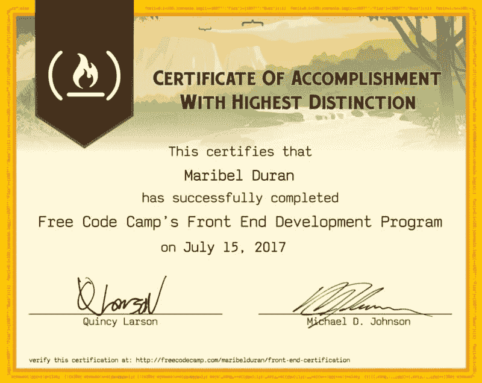
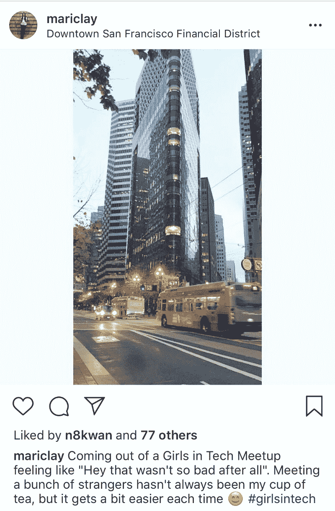
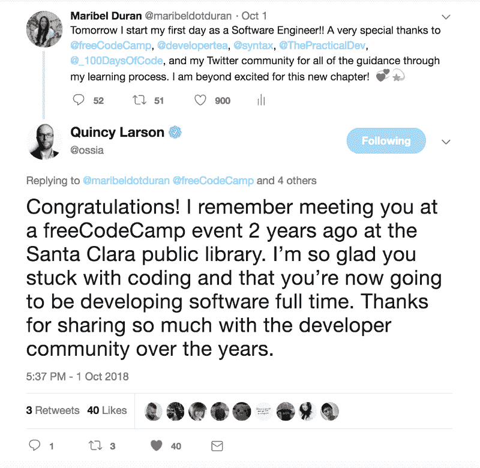
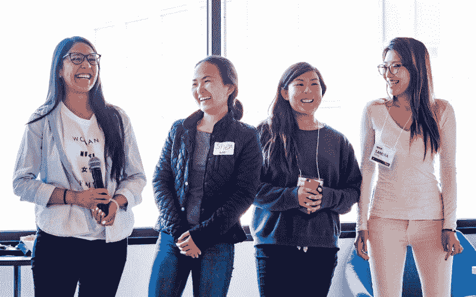
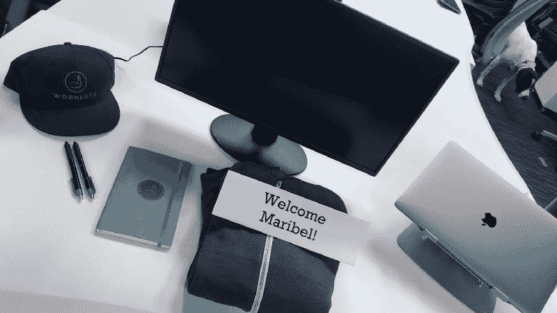
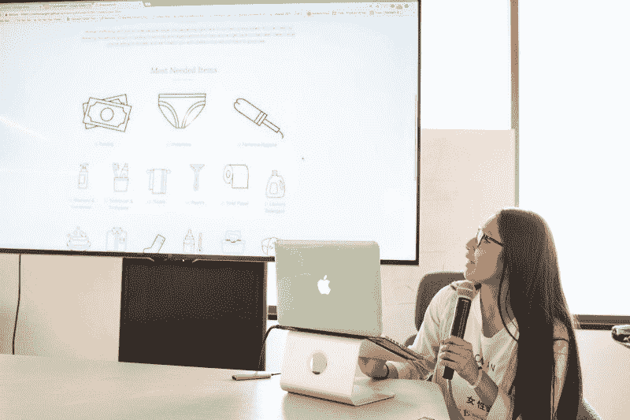

# 我从第一代大学毕业生到软件工程师的旅程

> 原文：<https://www.freecodecamp.org/news/my-journey-to-becoming-a-software-engineer-4ae301fc02b/>

> “如果你真的相信你正在做的事情，就努力工作，不要把任何事情放在心上，如果有什么阻碍了一条路，就去找另一条。永不言弃。”——劳里·诺塔罗

我正在分享我的旅程，讲述我是如何了解软件开发的来龙去脉，以及我是如何最终获得我的第一个软件工程师角色的——以便其他走在类似道路上的人会保持动力，继续他们的旅程。我希望给其他人力量，让他们永远不要放弃自己的希望和梦想。

我的进步缓慢而稳定，因为我也在改善我生活中的其他部分，这些部分帮助我成为一个更好的人，并最终成为一个更好的开发人员。现在，我是一名软件工程师，从事一项帮助人们生活的产品，我开始和一个了不起的团队一起工作。每天醒来都知道我可以做我喜欢的事情，这漫长的旅程是值得的。

我将要讲述的资源帮助我在拥有一份全职工作、疯狂的随叫随到时间、一段关系、家庭、朋友、志愿者以及一些挫折的同时，朝着我的目标前进。真心希望这篇帖子能给你的旅途带来价值！

### **我的背景**

> “不要埋葬你的失败。让他们激励你。”—未知

我是第一代大学毕业生，也是我兄弟姐妹中年龄最大的。

我的父母在他们十几岁的时候移民到了美国，从那以后一直是田间工人。我们不确定为什么大学很重要，但我们知道它很重要，所以我申请了大学，却不知道我应该准备什么。

我第一次发现编程是在我读本科的时候。我用了两年的时间探索工科，才申报了计算机科学与工程(CSE)专业。我们的 CSE 课程非常理论化，向我们介绍了算法、计算机设计/系统和理论。然而，由于之前没有代码方面的经验，我感到迷茫，不理解这些概念的价值。感觉好像这个程序是面向那些已经知道如何编码的人的。

我们完成了项目，但我没有把新知识完全应用到解决现实世界的问题或培养实用技能上。随着项目变得更具挑战性，当我陷入困境时，我没有勇气寻求帮助。似乎我的大多数同学都知道他们在做什么，并且已经想好了，所以我不好意思伸手。

我没有意识到的一件关键事情是实习的重要性。相反，我会在学校放假的时候回家，和妈妈一起在地里干活，帮助支付大学费用。尽管如此，我还是通过了考试并获得了 CSE 学位。

当我毕业并开始申请软件工程师职位时，我意识到我还没有准备好。我没有家人或朋友可以对面试过程提供任何见解。他们都没有接受过高等教育，也没有参加过专业工作面试。那些天，我不知道去哪里找资源来帮助我准备技术面试。我不知道面试本身也是学习过程的一部分。

我最终选择了一条不同的职业道路，所以我成为一名开发人员的旅程被搁置了。

### 进入软件开发的动机

> “当你发现你的使命时，你会感觉到它的需求。它会让你充满热情和强烈的渴望去努力。”克莱门特·斯通

2015 年，我感觉自己真的很失落，在职业生涯中没有目标感。我想把我改善和赋予人们生活的使命与我的职业道路结合起来。我也想成为我所支持的产品的直接影响者和决策者。在我担任技术支持工程师的角色和公司中，我认为这是不可能的。我没有得到足够的项目机会来加强我的软件开发技能。

有一天，我终于明白了。我想构建改善和激励生活的应用程序。我怎样才能做到这一点？我一直都有答案。我想成为一名软件开发员，这是我在大学时的初衷，这次我不会放弃。

两年的技术支持工程师工作并不足以让我获得软件工程师职位的面试机会。每个公司都希望至少有一年的软件开发专业经验。从那时起，我开始研究在哪里可以找到成为软件开发人员所需的经验或教育。我可以回到学校拿到硕士学位，但是现在计算机科学学位并不是获得开发人员工作的必要条件。人们建议在边上开始建设项目。好极了。但是我应该用什么语言编写程序呢？我应该想出一个新的好主意吗？幸运的是我找到了 freeCodeCamp。

### 通过 freeCodeCamp 工作

[freeCodeCamp](https://www.freecodecamp.org/) 是一个*的免费自定进度课程*，在这里你可以学习 web 开发，并通过在空闲时间构建项目来获得技能。这个课程最让我兴奋的是，它帮助我把时间集中在建设上，而不是担心要建设什么。另外，如果你在这个项目上进展顺利，你可以为非营利组织建立项目！

我没有完成课程，但已经足够构建许多前端和后端项目，从而增加了我的投资组合。成为 freeCodeCamp 的一员也是加入一个了不起的社区的大门，它帮助我找到了其他外部资源，使我获得了我的第一个软件工程师角色。

### 参加聚会

我在旅程的早期就开始参加聚会。Meetups 帮助我学习新的东西，结识其他试图改变职业道路的人，并建立关系网。这些是我加入的一些团体:[编写 SF 代码的女性](https://www.meetup.com/Women-Who-Code-SF/)，[科技行业的女孩](https://www.meetup.com/GITSANFRAN/)，[写/说/编写 SF 代码](https://www.meetup.com/WriteSpeakCode-SFBay/)，[女孩极客晚宴——硅谷/ SF 湾区，](https://www.meetup.com/Girl-Geek-Dinners-Silicon-Valley-SF-Bay-Area/)和[你所在城市附近的自由代码营团体](https://www.meetup.com/topics/freecodecamp/)。

参加聚会总是让我感觉不舒服，因为我不确定自己是否能和人交谈。但是一旦我到了那里，我学到了很多，分享了技巧和资源，通常会留下灵感！即使参加了这么多聚会，我还是会在参加之前感到紧张。

通过 meetups，我还结识了框架、课程和平台的创建者，他们对我的生活产生了积极的影响，成为了我的灵感。

一些聚会是激励性的，而另一些则更具技术性。聚会让我保持动力，因为我没有任何开发人员的朋友。我遇到很多女性也试图进入软件开发，这是我的支持社区开始的地方。

说到支持性社区…

### 建立一个相互支持的社区

学习编码时会感到很孤独，所以有人理解你的经历并支持你真的很有帮助。我不能总是参加聚会，所以有一个在线社区非常方便。

我决定使用 Twitter 作为我与其他开发人员和有抱负的开发人员交流的主要方式。我已经能够分享学习资源、我的奋斗、成就以及其他任何可能对我所在领域的其他人有益的东西。因为我关注开发人员，所以我的 twitter feed 主要由技术新闻、文章、资源和任何其他技术内容组成。

通过我的 twitter 社区，我能够收到所需的反馈，以帮助说服自己，我具备成为一名开发人员的条件。当我在编码之旅中陷入困境或感到迷失时，我能够得到导师的帮助。这方面的人真的很想帮忙！

So much support from my online community and influencers

### 收听工程播客

我开始在上班的路上听工程播客，我可以告诉你这是我遵循的最好的建议。你可以向已经在这个行业工作多年的开发者学习，他们乐于教授和分享他们的想法和经验。

有人说过工程播客很干货，但不是我一直在听的那些！这些开发人员有趣、有爱心、聪明、兴奋。

我在采访中多次被问及是否听播客。这是一个很好的方式来展示我对这个领域有多么积极和热情。

以下是我最喜欢的几个开发者播客:

*   [开发者茶](https://spec.fm/podcasts/developer-tea)
*   [语法](https://syntax.fm/)
*   [前端欢乐时光](https://frontendhappyhour.com/)
*   [JavaScript Jabber](https://devchat.tv/js-jabber/)

### 参加黑客马拉松

Presenting our project

参加我的第一次黑客马拉松帮助我在短时间内体验了作为一名开发人员是怎么回事，并增强了我的信心。以下是我第一次在活动中体验到的一些事情:

*   与设计师合作
*   使用 Git 与团队协作
*   在快节奏的开发环境中工作
*   呈现给设计师和开发人员的观众

所有这些都是我作为软件工程师日常使用的技能！

参加黑客马拉松也帮助我认识了有共同兴趣的人。我参加黑客马拉松的目的是团结女性用科技解决全球挑战。我遇到了其他人，他们也热衷于解决像家庭暴力和人口贩卖这样的全球性问题。

> “通过超越自己的问题和照顾他人，你获得了内心的力量、自信、勇气和更大的平静感。”—达赖喇嘛

尽管我们在黑客马拉松上没有完全实现我们的项目，但后来我花了额外的努力来完成这个应用程序，并把它添加到我的简历中。面试官喜欢我参加黑客马拉松，并问我在这次经历中学到了什么。在一次面试中，一个有趣的问题被问到，“如果你可以使用我们的数据，你会在黑客马拉松上建立什么类型的项目？”我的回答是，“建立一个平台，帮助年轻学生找到最有利于他们职业道路的大学”。

如果你想从你的第一次黑客马拉松中了解更多的期望和其他好处，你可以在这里阅读我的经历。

### 为开源项目做贡献

我相信为开源做贡献最终让我有了“我已经准备好做一名开发者”的想法。它还帮助我找到了一个我热爱的真实世界的项目，并最终帮助我获得了面试机会。

为开源做贡献是非常令人生畏的，所以我一直推掉它。当我终于鼓起勇气想出如何开始投稿时，Hacktoberfest 来的正是时候。Hacktoberfest 是 10 月份的一个月挑战，在那里你有机会提交 5 个拉请求并赢得所有奖品，同时提高对开源的认识并不断学习。

这一挑战促使我寻找聚会，帮助我找到有助于当地社区的项目。我找到了一个我真正热爱的项目。这个项目在每次电话和现场采访中都会被提起。每个面试官都问我这个项目，我的贡献，以及我们如何作为一个团队工作。

如果你想了解更多为开源做贡献时获得的技能和价值，你可以在这里阅读我的经历[。](https://medium.freecodecamp.org/hacktoberfest-my-gateway-to-open-source-f44c8778b022)

### 在线展示

在网上，我有机会分享我正在学习和工作的东西。它还帮助我表达了我感兴趣的东西，我成为软件开发人员的使命，以及我是谁。以下是我所涵盖的内容的清单，以证明我尽可能地在网上分享了:

*   查看所有社交媒体账户。最后，我创建了一个新的 Twitter 账户，专门用来分享与软件和个人发展相关的东西。
*   更新了我的 LinkedIn 个人资料(包括让我姐姐给我拍一张头像照片)。
*   将我的 CodePen 项目转移到 GitHub。
*   写了一些关于我的软件开发之旅的经验的帖子。
*   反复更新我的个人作品集网站的设计和内容。(当我学会了一个新的 CSS 技巧或者完成了一个项目，我更新了我的网站)

最重要的是，购买我自己的[域名](http://www.maribelduran.com)并投入使用真的帮助我在网上立足。我强烈推荐这个。公司会看到你有能力建立自己的域名。我还建议让你的网站安全、移动响应和高性能。我写了关于[我如何用盖茨比](https://medium.freecodecamp.org/how-i-made-my-portfolio-website-blazing-fast-with-gatsby-82ccddc2f671)让我的投资组合网站飞速发展。

### 阅读工程博客帖子

我开始养成在早上和任何有空闲时间的地方阅读工程博客和文章的习惯。无论是等火车还是在商店排队。它教会我如何通过简单的阅读来交流技术观点。

以下是我喜欢的几个工程博客社区:

*   [freeCodeCamp 的媒体出版物](https://medium.freecodecamp.org/)
*   [开发到](https://dev.to/)
*   Twitter(再说一次，我关注的人会分享别人的博客)

在采访中，当被问及我如何跟上软件开发的新闻时，我也能够提出这个问题。

### 写博客文章

我已经写了几篇关于我成为一名开发人员的旅程的博文，以及最近的一篇技术博文。

看到别人经历的事情是一种激励。如果不是那些分享他们故事的了不起的人，我肯定不会继续我的旅程。

与他人分享你的经历、观点和价值观，因为你永远不知道你会如何影响他人的生活。

### 值得一提的其他技术资源

以下是其他有益的教程和编码挑战的列表，建议您仔细阅读。

这些资源大部分都是免费的，或者可以在假日大减价时买到:

*   完成手表和代码的[实用 Javascript 课程](https://watchandcode.com/p/practical-javascript)
*   完成了[100 daysofcodeallection](https://www.100daysofcode.com/)
    这里写了我的经历
*   阅读[雄辩的 Javascript](https://eloquentjavascript.net/)
*   完成 Udemy 的 [ES6 Javascript:完整的开发人员指南](https://www.udemy.com/javascript-es6-tutorial/)课程
*   阅读[学习之路 React](https://leanpub.com/the-road-to-learn-react)
    直到我掌握了 JavaScript 基础知识，我才开始学习前端框架
*   完成了 MongoDB 大学的 M101JS: [MongoDB for Node.js 开发者课程](https://university.mongodb.com/courses/M101JS/about)
    7 周课程
*   完成 Udemy 的[编码面试训练营:算法+数据结构](https://www.udemy.com/coding-interview-bootcamp-algorithms-and-data-structure/)课程
*   将我的 FCC 后端项目部署到 Heroku，并花时间编写描述性的自述文件。这不是一个要求，但我知道这将是一个很好的学习机会。在面试过程中，部署应用程序肯定会被问到。
*   参加了 [Hacktoberfest](https://hacktoberfest.digitalocean.com/) 。
    这个挑战帮助我在 GitHub 上找到开源项目和公开问题，我可以很容易地投入其中。
*   通过阅读[算法来生存](http://algorithmstoliveby.com/)

### 一些挫折。后退一步，前进两步

> “山越陡，越难爬，从终点线看风景就越好。”——宝拉·阿巴杜

在我每周 7 天、每天 24 小时待命的几周里，我没有太多时间写代码，因为除了工作 45 个小时之外，我还要接深夜电话。这夺走了许多宝贵的睡眠和时间。这很有压力，但也是继续努力的动力。

有几个星期，我可以花 20 个小时编码。有些地方只花了大约 5 个小时，我甚至几个星期都没有编码。不管遇到什么挫折，都没关系。我可以回到我的项目中继续工作。如果我在路上，我总是通过阅读技术博客或书籍来保持一个开发者的心态。

在我的生活中还有其他个人挑战，我不得不从项目工作中退出很长一段时间，但通过我的每月目标和意图，我提醒自己我的使命并继续前进。

长途跋涉确实考验了我的耐心，但我知道每个月都有进步总比没有好。

### 采访

面试比预期的要容易，但我相信这主要是因为我多年来通过不同的社交媒体流分享我的学习和工作，建立了我的在线存在。GitHub、Twitter、LinkedIn、Medium 和我的个人投资组合网站是我最好的朋友。

大多数联系我的招聘人员都来自 LinkedIn。帮助我获得关注的一个关键举措是将我的标题添加到“前端工程师”中，因为这是我认为我已经准备好的，尽管我在目前的职位上没有这个头衔。

我确实认为拥有 CSE 学位有助于我获得初步面试。然而，面试过程取决于你做过的项目以及你是否能很好地沟通。当然，我建议获得这个领域的学位，但是拥有学位并不能让你得到工作。我是吃了苦头才知道的。

你必须表现出你的奉献精神，在真正推动你的项目上工作，并在这个领域有动力。

大多数联系我的招聘人员(无论是内部人员还是第三方)都来自那些有着我所关心的使命的公司。我没有花时间和那些我不重视其使命或产品的公司交谈。我对所有的招聘人员都很诚实，告诉他们我在寻找什么，我能提供什么。

我面试了不同的职位:软件工程师、全栈工程师、前端工程师、前端开发人员和专业服务工程师。

有时候，我很想接受面试，在一些非常棒的公司中担任配角，但我必须保持真实的自我，继续面试我真正想要的角色。当我不断收到“没有足够的开发经验”的拒绝时，这很难。

我有一些与 freeCodeCamp 项目非常相似的带回家测试，我个人非常喜欢它们，因为它让我展示了我的创造力和对文档细节的关注。

以下是一些有趣的问题，它们在我的大部分采访中被提出

*   谈谈你目前的前端体验？
*   你能从目前的支持岗位为你正在面试的职位带来哪些技能？
*   你在 xx 项目中有什么贡献？你和你的团队是如何决定使用的工具和框架的？
*   你能描述一下你的开发工作流程吗？
    提示——这里有一个关于工作流的精彩片段:[我们的工作流——设计、开发、Git 和部署](https://syntax.fm/show/051/our-workflows-design-development-git-and-deployment)

我开始喜欢面试，因为它能让我真正了解公司需要什么样的技能。当面试官问我“你有什么问题要问我”时，我真的很认真。这是一个与在这些公司工作的工程师交谈的机会。这是一个很好的时间来挖掘他们的大脑，感受全职工程师是如何工作的，他们是如何思考的，以及他们使用什么类型的工具。还有一些我没有意识到的话题，比如“可访问性”，我知道这些是我应该开始学习的话题。

那 3 个月的面试并不容易，但我忠于我的使命，这绝对值得。

### 得到我的第一份理想工作

> "当你想要某样东西时，整个宇宙都会帮你实现它."——保罗·柯艾略

现在，我开始从事 [Worklete](https://worklete.com/) 的工作，这是一款帮助员工保持健康、快乐和无伤害的神奇产品。每天走进办公室，为一个对人们的生活产生积极影响的产品而工作，同时周围都是善良和激励人心的人，这是一件令人愉快的事情。

我与产品团队有着密切的沟通，从第一天开始，我就能够做出决定，承担任务，并提出新的想法。我开始在技术栈的两边工作，并且享受我所做的一切。

我一直在学习和使用我在本文中提到的所有资源来帮助我完成任务，并为我的公司带来价值。

### 下一步是什么

> "只要我们致力于让不可思议的事情发生，这些事情是可以做到的."—萨德古鲁

我将继续开发改善人们生活的产品。

我将继续阅读和撰写技术文章，听播客，为开源做贡献，参加聚会，并与他人分享我的经验。我想继续成为一名更好的开发人员和个人，这样我就可以继续对我周围的人产生积极的影响。

我最大的目标之一是帮助建立一个社区和环境，让每个女孩都有机会选择自己热爱的职业。

当你改善了自己，别人也会想做同样的事情。我想提供指导和支持，帮助他人实现他们的全部潜力。

### 对他人的主要建议

> “每一个伟大的梦想都始于一个梦想家。永远记住，你有力量、耐心和激情去摘星改变世界。”——哈丽雅特·塔布曼

几年前，当我刚从大学毕业开始面试软件工程工作时，我放弃了。幸运的是，我找到了回来的路，再高兴不过了。不管花了你多长时间，只要你知道你为什么在里面，就不要放弃。你可能有不同的理由想要进入软件开发，这完全没问题。

这个领域的美妙之处在于，任何人都有机会成为一名开发人员，只要他们有决心、投入和耐心。

相信自己，享受过程:)

### 谢谢你

再次特别感谢 [@freeCodeCamp](https://twitter.com/freeCodeCamp) 、 [@developertea](https://twitter.com/DeveloperTea) 、 [@syntax](https://twitter.com/Syntax) 、 [@ThePracticalDev](https://twitter.com/ThePracticalDev) 、 [@_100DaysOfCode](https://twitter.com/_100DaysOfCode) ，以及我的 Twitter 社区在我的学习过程中给予的所有指导。

在我的编码之旅中，我遇到了很多善良的人，对未来充满期待。

> 如果你喜欢这篇文章，请点击？所以其他人会在这里看到它。

> 让我们在推特上成为朋友吧。快乐编码:)