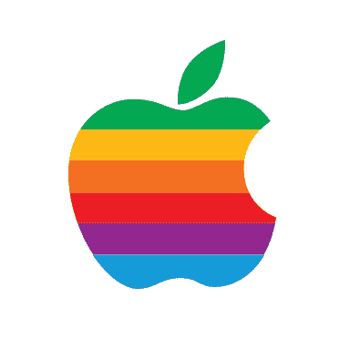

# 我从软件工程到产品管理的道路

> 原文：<https://www.freecodecamp.org/news/my-path-from-software-engineering-to-product-management-3ea8c5ca36e7/>

莎莉·哈里森

# 我从软件工程到产品管理的道路

#### 以及一些关于如何自己做的建议

Photo by [Burst](https://unsplash.com/photos/aoN3HWLbhdI?utm_source=unsplash&utm_medium=referral&utm_content=creditCopyText) on [Unsplash](https://unsplash.com/search/photos/fork-in-the-road?utm_source=unsplash&utm_medium=referral&utm_content=creditCopyText)

经常有人问我如何转向产品管理。软件工程师、项目经理、产品营销经理、数据科学家、QA 人员……我想知道他们是否知道[他们想要什么](https://productcoalition.com/5-reasons-not-to-be-a-pm-2b6e57bc8aba)。

我是这样经历的。

#### 一见钟情计划

我 12 岁时，父亲给家里买了一台电脑。它附带了一个基本的编程手册，我直接进入了每个人的第一个程序——Hello World！然后继续复制“对不起！”的代码游戏从手册中，找到并修复一堆错误。

作为一个孩子，我总是喜欢做拼图，编程就像解谜一样，让计算机做我想做的事情。我立刻就被吸引住了，并决定我要主修计算机科学。是的，在 12 点。

我回过头来看，有点惊讶。如此果断…如此听从我的直觉…为什么我不能一直这样做？？我一生中只经历过几次这样的清晰。另一个是转向 PM。但是我要往前跳。

#### 苹果第一轮

大学毕业后，我在约翰·斯卡利时代的苹果公司找到了一份软件工程师的梦想工作。我在艾伦·欧朋海默手下研究苹果网络路由器，他写了一本关于苹果网络堆栈的书。

我几乎是团队中唯一的女工程师。帮我安装电话的人问我是否在“支持”艾伦。我过了几分钟才意识到他以为我是艾伦的新管理员。但是，我又跑题了…

第一轮我在苹果工作了 8.5 年(第二轮我们留到以后再说)。我有四任首席执行官。在约翰·斯卡利之后，有迈克尔·斯宾德勒，吉尔·阿梅里奥，然后是史蒂夫·乔布斯的回归。

史蒂夫回来后，他裁掉了大部分员工，取消了许多项目，包括我正在做的那个项目。虽然我没有拿到遣散费，但在当时，我们都认为这是更好的选择(我们知道什么？).

我继续在苹果工作了几年，开发了第一个苹果钥匙链和第一个互联网 API 套件(低音炮)。iMac 发布了。我在 WWDC 演讲了三次。从大多数意义上来说，我是成功的，包括我自己。

#### 全面质量管理

苹果当时没有产品管理(现在也是如此)。有一个人员非常少的产品营销团队，他们假设编写“市场需求文档”(MRD)。但如果我曾经见过一个，那是在我们写完工程规范并增加了大约 0 的价值之后。

幸运的是，我生来就是一个基本原则思想家。西蒙·西内克可能还在上小学，但我已经开始思考为什么了。我需要找出下一步该做的正确的事情，但没有人来指导我，这让我想到了一种叫做 TQM 的东西。

我听说有一个 TQM 顾问在苹果公司和其他团队一起工作。我让他来教路由团队。

正如我所学到的，TQM 基本上是设计思维，但仅仅专注于技术。老实说，其中有些元素是超越设计思维的(抱歉，IDEO)。特别是，关注让整个团队对顾客产生共鸣，而不仅仅是设计师。

所以我去拜访客户，通过换位思考来了解产品。回到 1995 年。这让我想到了我的第一个产品创意——Apple/IP 网关。这是一个巨大的成功，直到 IP 接管了大多数现有的网络，AppleTalk 被弃用。

如果没有顾客的共鸣，这一切就不会发生。尤其是因为这是一个 B2B 产品。我们的客户没有“要求”它。我刚刚亲眼看到了他们遇到的问题，通过 AppleTalk 建立 IP 隧道会有所帮助。

#### 直接责任人(DRI)

在路由工作结束后，我加入了 Cyberdog 团队，该团队正在开发一套互联网应用程序。FTP、Telnet、Gopher、SMTP 和 HTML……我猜你们中的许多人需要查找其中的一些。。我们和一个大约 25 人的团队一起完成了这一切，我是工程经理之一。

在我们第一次发行后，我被任命为赛博狗的“DRI”。这个概念是苹果独有的，这也是为什么苹果仍然没有产品管理可言的原因。DRI 通常是工程经理，包括产品所有权和管理创造产品的工程团队。

如果团队相当小，这是一个很好的工作。我喜欢它。除了一些小细节，我仍然需要写代码。

我很喜欢写代码，不要误解我。但这需要我完全集中注意力，这在快节奏的环境中并不总是可能的。我更喜欢接下来的工作。

我有时候很暴躁。我记得当我试图找出一个超级棘手的 bug 时，我的主要测试人员来到我家门口的感觉。我要用尽全力才能不大喊“别管我，我在工作！”。事后看来，这真是很好的数据？。

总而言之，我是一个不错的程序员。比起从头开始，更擅长迭代别人的代码。但我是一个伟大的 DRI。我喜欢做出艰难的优先排序决定。我喜欢用户研究。我喜欢推动团队前进，消除模糊。我甚至喜欢写说明书。

#### 微软程序管理

作为 Subwoofer(有史以来第一个互联网 API 套件)的 DRI，有一天我去了微软，看看我们是否想与他们的 Mac Internet Explorer 团队共享一些代码。

我在他们的一个会议室坐下，进来一个自称是项目经理的人。我在想“呃…我能和技术人员谈谈吗？开发经理在哪里？”

但事实证明，他是技术型的，懂业务。有意思，我想…这个角色到底是什么？

给那些没有在微软工作过的人补充说明。项目管理就是产品管理。当其他科技公司将产品营销和产品管理作为一个人时，这一学科就开始了。微软是第一个将它们分开的公司。第一个有人完全专注于我们应该建立什么，为什么，以及一点点如何。他们称之为“项目管理”。

2001 年，我接到一个朋友的电话，他曾经和我一起在苹果工作，他的公司(WebTV)已经被微软收购。“莎莉，”他说，“我们这里需要项目经理，我想到了你。”

他比我先知道我是首相。尽管我们都在苹果度过了职业生涯的大部分时光，但苹果并不存在这些东西。

我加入了这个团队(留下了一吨苹果股票，哎呦……)。此后不久，我的朋友去了谷歌。但我从学科的角度找到了自己的使命，并且从未回头。

#### 最后的想法和一些建议

我的故事是一个内心深处是首相的人的故事，她找到了自己的方式。所以我的第一个问题是:

> 你内心是首相吗？

仔细想想你为什么想成为一名项目经理。如果你还没有开始做，就很难理解这个角色是什么，所以你怎么知道呢？你为什么会被它吸引？读一些我的其他博客。你确定吗？

> 你已经在做这份工作了吗？没有标题？

如果你现在从事工程、项目、程序或设计工作，而你没有项目经理，那么谁在做项目经理的工作呢？这项工作——定义产品，推动事情向前发展，成为做出艰难决定的催化剂——必须完成。被某人。

如果是你，而且这是你工作中最喜欢的部分，那么这是一个好迹象，表明这是一个适合你的角色。这也是你如何在面试中推销自己。

> 在你所在的地方试试。

如果你真的有项目经理，问问他们你是否能在某些方面提供帮助。大多数项目经理会抓住这个机会，因为他们被工作压得喘不过气来。是的，你必须在日常工作之外做这件事。抱歉。‍♀️.

如果可能的话，我建议你在目前的组织中做出改变。你已经了解了产品和技术，这是一个巨大的帮助。

让你的项目经理知道你有兴趣。找出他们在找什么。就如何实践所需技能或证明自己拥有这些技能征求意见。

> 去上课。

接受一些培训。有很多产品管理的课程你可以去上。我不打算推荐任何特定的一个。四处打听。课程最主要的帮助是让你接触到这个角色，并给你一些词汇。向招聘经理展示你足够关心并投入时间和精力。这也会扩大你的人际网络。

说到网络……我认为没什么用的是“网络”。我的意思是参加社交活动、聚会或会议。如果你培养他们，你在那里开始的关系可能在几年后对你有帮助。但他们不会很快有所帮助。

> 利用你的关系网。

我确实认为你现有的网络能有所帮助。这就是我如何获得我的第一个项目经理的角色，甚至没有真正打算。有人认为你是一个很好的选择，这是获得任何工作的最佳途径，包括项目经理。所以，让你现有的网络知道你想做出改变。不，我不知道建立良好关系网的捷径？。

#### 我真诚地希望你找到成为首相的方法，并像我一样热爱它。祝你好运！