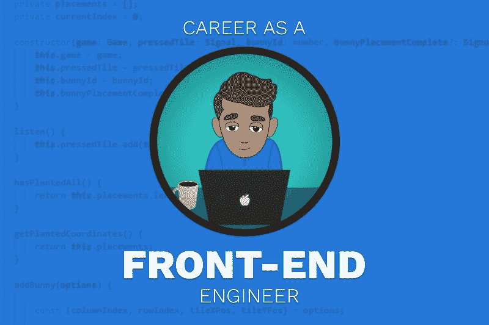
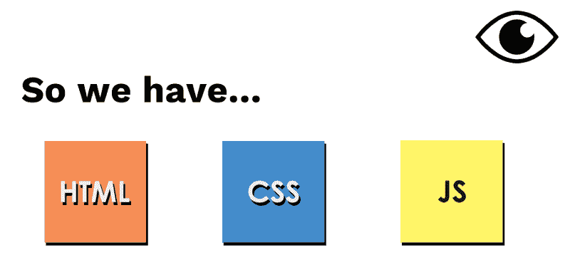

# 我的角色是一名前端网络工程师。

> 原文：<https://www.freecodecamp.org/news/my-role-as-a-front-end-web-engineer-explained-948d0f1ceac1/>

肖恩·迈克尔·斯通

# 我的角色是一名前端网络工程师。

嗨，我叫肖恩·斯通。我是一名来自英国伦敦的高级前端 web 工程师。我在金融科技行业工作，热爱我的工作。在这篇文章中，我想解释一下我的角色。对于任何想从事 web 开发的人来说，你可能会发现这很有用。

我将涵盖:我们做什么，我们如何管理我们的工作，职业道路，语言和我们使用的工具。最后，我将提供如何打入软件行业的建议。别担心，**我不会卖任何东西**——一些我希望在我开始时就有的建议。？

> 前端 web 工程师负责实现用户在 web 应用程序中看到并与之交互的可视元素。

### **我们构建 UI** ？

我们专注于为我们的网站或 web 应用程序的用户构建 UI(用户界面)。我们考虑几件事:

1.  易访问性:我们设计的应用程序常常被网络所忽视，是为了迎合有某种残疾的用户。这可能是一些认知障碍或灵活性有限。例如，有些人在可点击区域如单选按钮或复选框上苦苦挣扎。
2.  美学:我们的 UI 元素的风格，比如按钮、字体和间距。最近，我们实施了一个设计系统，加强我们产品的一致性。关于设计系统的更多信息可以在[这里](https://www.designbetter.co/design-systems-handbook)找到。
3.  **性能:**我们必须考虑应用程序的性能，以保持快速的页面速度。这包括减少网络请求，使用压缩等方法优化图像和 SVG 文件。你加载注册页面越快，用户注册的机会就越大。我们使用谷歌的[灯塔](https://developers.google.com/web/tools/lighthouse)进行基准测试并收集有趣的指标。
4.  **安全:**至高无上。代码中的小错误会导致私人信息被泄露，而且有人渴望得到这些信息。当然，这是一个巨大的话题。查看 Mozilla 的[信息安全基础知识](https://developer.mozilla.org/en-US/docs/Web/Security/Information_Security_Basics):
5.  代码质量:我们使用代码评审来检查彼此的工作。我们需要至少两个批准之前，任何事情都可以进行到我们的现场申请。我们使用整个前端都必须遵循的编码标准。 [Github](https://github.com/) 允许我们这样做，甚至更多。

### 工作管理？

我们遵循软件开发的敏捷原则，就像大多数公司一样。这是计划我们未来两周工作的一种方式(冲刺)。在这个过程中，我们会改进这两周的门票。

我们所有剩余的工作都存储在所谓的积压工作中。积压的工作被我们将来要做的工作填满了。

有了路线图，我们就有了明确的方向。为了做到这一点，我们使用了一个由 Atlassian 开发的名为[吉拉](https://www.atlassian.com/software/jira)的项目管理工具。

#### **仪式**？

1.  **冲刺计划**让团队在冲刺阶段取得成功。会议涉及到处理积压的工作，并对接下来两周要完成的工作进行优先排序。团队必须评估每个故事，看看我们需要付出多少努力。基于所涉及的工作，我们可以测量容量(相对于可用的开发资源可以完成多少)。
2.  **每日脱口秀**是与你的团队进行一次非常简短的会面，解释:你昨天做了什么，我今天在做什么，有什么事情阻止我做我的工作吗？(阻挡)。这让每个人都了解情况。保持简短。曾几何时，一个单口相声为我撑了一个小时…？
3.  **冲刺复习**发生在冲刺的最后。我们向其他利益相关者(产品团队的成员，我们系统的用户)展示我们成功实现的目标。我们通过演示我们一直在做的工作来做到这一点。这让他们相信我们在进步。
4.  回顾是一种反思什么进行得好，什么不顺利的方式。这就带来了问题。我们从这些问题中创造行动。行动是启动一个过程的事情，在这个过程中我们可以阻止消极的事情再次发生。顺利的事情让我们明白是什么让我们工作得更好。

### 职业道路↗️

公司有自己的职业道路。作为软件工程师，一个非常常见的发展模式如下。

**请注意:**这是我自己的观点，基于我自己的经历。术语“工程师”和“开发人员”可以互换使用。

1.  初级开发人员几乎没有经验。他们需要由团队中更资深的成员来指导他们的工作。他们通常会问很多问题，但可以学到很多东西，并且会非常积极地这样做。他们的工资是入门级的。
2.  中级开发人员有一定的经验。他们可以独立完成某些任务。但仍然需要不时向资深会员寻求指导。他们可以帮助初级成员，也可以为高级成员提供好的想法。
3.  高级开发人员可以在没有指导的情况下从头到尾交付产品。他们带领其他人也这样做，并遵循良好的实践。他们有足够的经验知道什么时候会出错，以及如何避免这些问题。

但是到了高三就这样了吗？不，不应该。有两条路可以走。

4a。**技术负责人/首席开发人员/架构师**将被授予团队中的核心/更高级别的开发人员，他们提供了坚实的技术愿景并得到了同行的尊重。较少涉及代码，更多地涉及所使用的语言和库的基础、开发过程和基础设施。

4b。**团队领导/团队经理**现在更加关注团队成员。他们的福利、职业发展，并与每个团队成员进行一对一的交流，以确保他们快乐，同时也能实现预期目标。更多的会议将导致更少的开发时间。管理技能是必需的，这不是一件容易的事。

在此基础上，你可以转向一个更具管理性的角色。工程经理就是一个例子。此人管理多个技术领导/团队领导。再比如首席技术官。

公司通常会根据你的工作经验来评定你的能力水平。对我来说，这是一个谬论。我曾经和那些被贴上资历较浅、但知识丰富、身体强壮的新手共事过。应该从表面上看候选人。

### 要学的语言？

1.  HTML 是一种标记语言，网页的结构。
2.  CSS 是描述网页表现的语言，处理颜色、布局、间距等等。
3.  JavaScript 是网络语言。它是一种客户端语言，增强了用户在网页上的交互性。

投入大量时间掌握这三种语言。我有一个简单的例子来说明他们是如何在这个代码栏中一起工作的。周围有戏！

**请注意:**此示例仅为演示目的而简化。

*查看我的笔杆子[这里](https://codepen.io/smks/pen/QVLLNg)*

如果你愿意，用你选择的公司名称创建你自己的版本，并发表在评论中。

### 要用的工具？️

1.  使用 [Git](https://git-scm.com) 来管理你的代码版本。它允许团队协作处理文件，而不会造成工作损失。
2.  使用集成开发环境(IDE)编写代码。这是一个类似记事本的软件，但是有更多的附加功能。它可以提供如何编写代码的建议，并对文本进行颜色编码，以便更容易理解。

### 建议？

首先要做的是创建一个 Github 账户。就像 Behance for Designers 一样，这将是一个展示你所写代码的地方。这将为我们(雇主)提供工作依据。当我离开大学的时候，我在寻找一个机会去建造一些东西，即使是免费的。我知道从长远来看这对我有好处。

#### 找自由职业？

我的第一个自由职业项目是为一家大公司做的。他们希望我构建的应用程序很容易引用 2-3K 的话。我做这件事是为了几百英镑。对他们来说，这完全是一种欺骗，但这在我第一份工作的面试中很有帮助，这是肯定的。

#### 证明你的作品存在？

每当我查看简历时，通常如果它说你上过 Udemy 的课程，仅此而已，那么这是不够的。我想看看你工作的证明。对于你参与的每一个项目，即使是个人项目或为家庭成员，这也是可以写进简历的。这些声称的体验应该有真实的证据支持，不管是视频演示的链接还是真实页面的链接。

#### 第一份工作？太好了！？

现在你正在收集一些作品。你打动了一家小公司，开始了你的第一份工作。你就大三了，周围的人有**很多**免费教你。根据我的经验，向你的同龄人学习是最好的学习方式，当然也更便宜。大多数在线课程在开始时会有所帮助，并且可以有节制地学习。你应该能够通过真实的商业经验来提升你的技能。

#### 证明自己？

表现出你对工作的热情，你想主动改善事情。你得到的每份工作都有好的和不好的品质。试着找出如何改进不好的地方，把好的东西带到未来的冒险中。在一份新的工作中——如果可能的话——教给他们你以前学到的好的东西，并尝试解决新的不好的东西。如果你觉得你不再学习了，那就改变环境让你学习。你的技能应该始终与行业相关，否则，你就会落后。这很可悲，但却是事实。

#### 推销自己？

总是找借口添加到你的 LinkedIn。解释你在工作中做了什么(角色和职责)。在你忘记之前，把它像日记一样记录下来。加一张专业的照片和一个强有力的总结。这是我目前拥有的。它已经进化了很多年。

到目前为止，我已经有 7 年多的构建 web 应用程序的经验。我在汽车、金融、在线游戏领域工作过，接触过为各种公司构建和维护定制的 web 应用程序，这些公司涉及:汽车维修、数字娱乐、工业气体、零售和宽带比较服务。我的一些主要兴趣包括撰写小说和非小说，构建和集成 API，自动化重复任务，用 Haxe，Unity 或 JavaScript/HTML5 canvas 构建移动游戏和动画。

除了阅读大量的技术书籍，我还编写了自己的名为《用 Node.js 实现自动化》的书籍。我阅读了 Sitepoint、CSSTricks、Egghead、PHPArchitect 和 Smashing 等平台上的文章。我参加 PHP London 之类的会议，关注脸书和谷歌的开发者渠道。我总是乐于接受新的方法，并寻找任何可以应用到我自己工作中的技巧和诀窍——我也可以与我的同事分享。

### 这是一个快节奏的行业？？

前端世界发展速度非常快。库/框架似乎总是年年涌现。你会看到很多角色需要 React(由脸书创造)、Angular(由谷歌员工创造)或 Vue(由一个叫尤雨溪的聪明人创造)的经验。还有很多，但我现在不会细说。

试着去了解这些图书馆，因为它们非常受欢迎。我在工作中使用 React，并投入了大量时间来熟练使用它。这些库和框架是位于 JavaScript 语言之上的一层。先成为 JavaScript 专业人士。

### 造东西？？

激励自己在业余时间做一个项目。多年来，我对个人游戏开发项目非常感兴趣。在这个过程中你会学到很多东西。有一天，我在工作中偶然想到，“如果有一个像战舰一样的游戏，但用兔子来代替，这不是一个好主意吗？”*我知道没错……奇怪的想法有*。

所以我找到了一个艺术家，告诉他我想要什么，然后开始做概念验证。为了玩，你放置五只兔子和五个陷阱，然后坐下来看。我不会破坏惊喜的。游戏[这里](http://bunnytrap.opencanvas.co.uk/)。

暂时就这样了。如果你想要更多的建议，请随时联系我！感谢阅读，祝你好运！如果你愿意，请鼓掌。？

祝你一切顺利，肖恩·迈克尔·斯通。✌️