# 我在开源社区的六年

> 原文：<https://www.freecodecamp.org/news/my-six-years-in-open-community/>

**Original Article:** [During the six years in the open community, I did what I liked and was good at, altruistic but self-serving](https://chinese.freecodecamp.org/news/my-six-years-in-open-community/) by [Miyaliu](https://chinese.freecodecamp.org/news/author/miyaliu/)
**Translated by:** [Alan Luo](https://twitter.com/iLtcDev)

大家好，我是来自[免费代码营](http://freecodecamp.org/)社区的刘玉玉()。

freeCodeCamp.org 是世界上最大的开源非营利性编程教育社区。它也是一个开源项目，比 GitHub 上的任何其他存储库都有更多的明星。

在这篇文章中，我将分享我如何在 2015 年加入 freeCodeCamp 社区。

我是一个在农村长大的普通人，毕业于一所普通的二线大学，文科专业毫无竞争力，从传统行业转行。而且我从来没有在任何一家著名的中国公司工作过(BAT 我们在中国叫它们:百度，阿里巴巴，腾讯)。

如果你和我一样平凡，想知道自己是否能设法做点什么，那么我希望我的故事能给你一些鼓励。

在过去的六年里，有太多的故事值得一写，但这里有一些对我来说最有意义的故事:

## 目录

*   [谁应该阅读这篇文章](#whoshouldreadthisarticle)
*   [一点背景](#abitofbackground)
    *   [关于本文的话题](#aboutthetopicofthisarticle)
*   “你是陈美雅吗？”
*   [自我意识的觉醒](#theawakeningofselfawareness)
*   [“在深圳，**找几个朋友一起过节真的很重要**](#inshenzhenitisreallyimportanttofindafewfriendsandspendtheholidaystogether)
*   [气泡](#bubble)
*   [“科豆学校是离我们最近的开源社区”](#kedouschoolistheclosestopensourcecommunitytous)
*   我生来是为了什么？
    *   [边做边学](#learningbydoing)
    *   [接纳自己](#acceptyourself)
    *   [这个世界真好](#thisworldisprettygood)

## 谁应该阅读这篇文章

如果您:

*   想探索成为更好的自己，同时给世界带来美好的改变，或者
*   想要了解开放社区和开放协作对人们的影响，或者
*   喜欢有温暖的人和故事

我相信你会找到有用的东西。

## 一点背景知识

前几天[中国开源大会](https://www.bagevent.com/event/7685233) (COSCon'21)圆满结束后，我和组织成都活动的朋友们彻夜未眠，进行了一次深入的回顾。

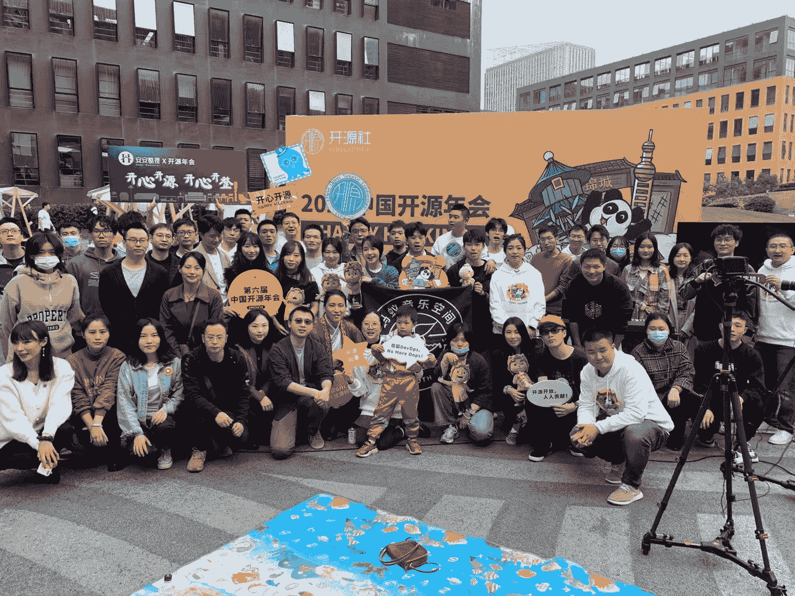

2021 China Open Source Conference Chengdu Scene

第二天，我进行了自我检讨，并在微信时刻发帖:

> 现在我想的最多，说的最多，最触动我的事情，还是和几年前我第一天进入这个领域的时候一样。所以我觉得很释然，很平静。初衷弥足珍贵，我们互相鼓励。

其实我的初衷很简单——希望自己能对别人产生好的影响，同时也希望自己能很容易被那些有着或大或小的纯粹梦想，充满能量和闪光点的人所感动。

我相信所有能传递善意的内容都值得推荐，所以我在各种场合讲过很多朋友或陌生人的故事。

这次借着为[开元社](https://kaiyuanshe.cn/)的“开源故事集”写稿的机会，我第一次回顾和记录了自己的故事，并公开分享。

### 关于本文的主题

社区(社区)——有人翻译为“社区团体(社群)."这个词可能会让人想起“社区经济(社群经济)”或者类似的话。我觉得有点功利，所以一直不喜欢。

最近，我一直在读《人群:流行思维研究》这本书，书中谈到了“群体心理学”我只是尽量不被纳入任何群体，希望在自己能力范围内活得更自由潇洒一点，少一些标签。

也有朋友把它翻译成“社区(共同体)”并结合人类学、社会学、经济学进行研究。我觉得很有意思，但是我还没做过那么多研究，所以不用这个词。

另外，虽然这篇文章提交到了“开源故事集”，但是我不想使用“开源社区(开源社区)".这是因为，其实我对“开源”这个词的感受，并没有那些从学生时代和工作初期就接触到它的朋友们那么深刻。

我的“社区”启蒙不是来自“开源”。此外，我认为“开放源代码社区”包含在“开放社区”中，特指围绕软件和硬件技术构建的“开放社区”。

我们开始吧！

## “你是陈美雅吗？”

第一个故事是所有故事的序幕，所以我会回溯相当远。

我来自四川的一个农村。

高中之前，我是家乡的尖子生。我的大部分人生自信都是在那个时候培养出来的。

后来进了县城最好的高中最好的班。因为种种原因，我的考试成绩越来越差。幸运的是，我在信心被完全消磨掉之前就毕业了。

由于年龄和地域的限制，在填写大学申请时，我和很多同学一样，对未来想做什么一无所知。所以我的大学和专业并不令人满意。

第一学期，在一个一两百人的文学大课堂上，我想炫耀一下，问了老师一个关于《平凡的世界》这本书的问题。

老师没有回答问题而是马上换了个话题，让其他同学读书中的文章，就像我们高中时一样。

我坐了下来，感觉很尴尬。我以为这和我想象中的大学氛围很不一样。我以为师生会畅所欲言，探讨世界的真相。我能从这所大学获得什么？

于是，下课后，走在阳光明媚的林间小道上，我决定逃课，自学。

从那时起，甚至在电子公司和建筑管理公司工作的几年里，我都在思考和探索我应该做什么，我适合做什么，我将来真正快乐的事情是什么。

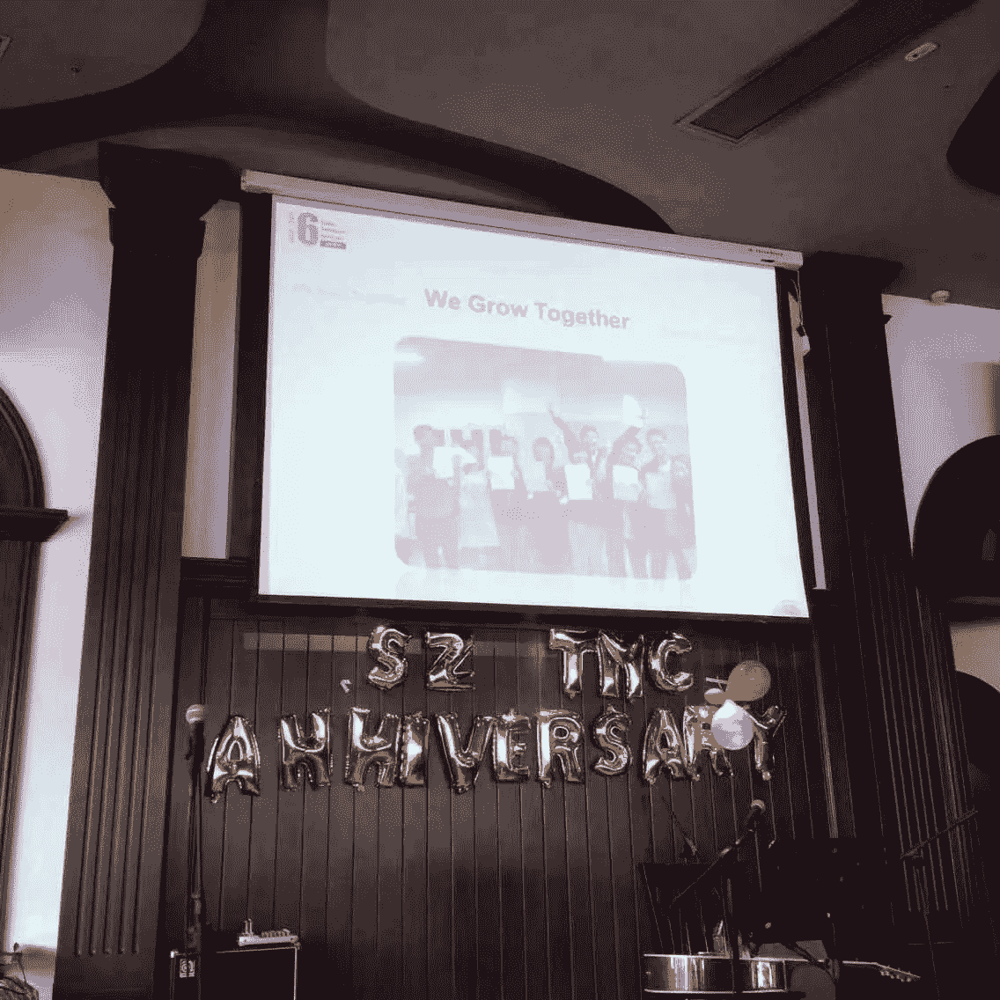

The 6th Anniversary Celebration of Suzhou Toastmasters Club

2015 年 5 月，我偶然参加了 Toastmasters 国际演讲协会的活动。

那是我第一次来到这个开放的社区。当我第一次遇到一些互联网行业的创业者时，我被他们的活力所感染，认为如果我能成为他们中的一员，我会激动不已。

7 月份，偶然遇到一个特殊的公交司机。

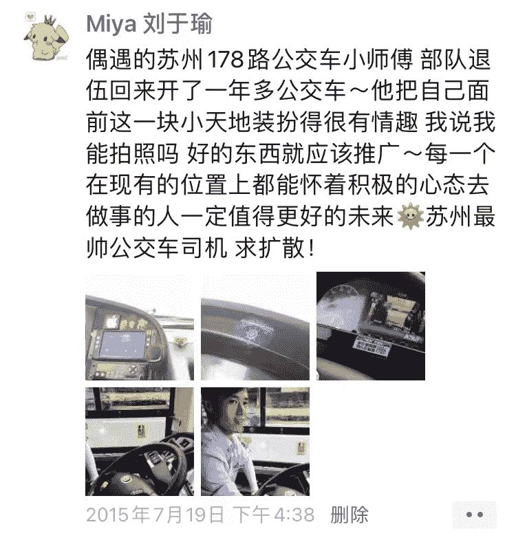

I shared his story in WeChat Moment

这张图是这么说的:我遇到一个年轻的苏州 178 路公交车司机，他是部队退伍的，开公交车已经一年了。他把他面前的小地方装饰得非常有趣。我问他我能不能拍照，因为好东西要分享。每一个能积极面对目前职位的人，都值得拥有更好的未来。🌞他是苏州最帅的公交车司机。让我们传播他的故事吧！

我认为像公交车司机、保安、农民工等等这样的人可能永远没有机会参加像演讲会这样的活动。尽管如此，他们也有感人的故事可以分享，他们也渴望更好的工作和生活。

我突然意识到，我是想把普通人的好故事传播出去，还是想给普通人创造一个展示自己的舞台。

于是我跑到公交总站，花了一个下午等 178 路公交车，找到司机，告诉他我以后可能会组织一些活动，邀请他。我们交换了微信 id。

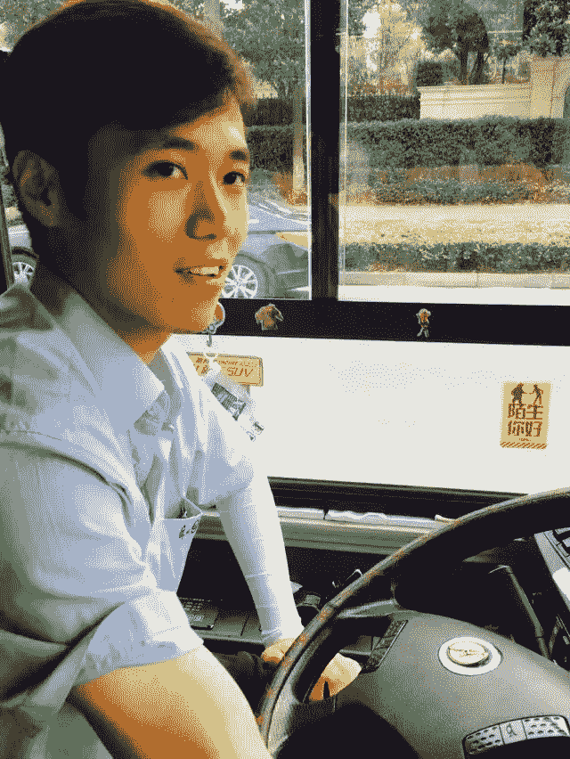

The bus driver, who is handsome and likes to laugh

后来，我和我的朋友试图围绕“阅读、演讲和交朋友”建立一个社区我们邀请他分享他的故事。他还向社区捐赠了一些书籍。

很快，他告诉我，他开始开“苏州十佳模范公交车”

我在 2015 年底苏州首届跨年演讲晚会的舞台上讲过这个故事:**苏州有一万多辆公交车，但是只有 10 辆模型车。**我们相识大约两年后，他转行到博世汽车公司从事项目管理。

写这篇文章的时候，我又联系了他，他说他现在过得很好。

我忍不住哭了。哈哈，已经六年了，我还是那么情绪化...

一天晚上，很晚了，我坐在公共汽车站等车。一辆汽车驶过车站，停了下来。司机从乘客车门探出头来。是司机！

> -你是陈美雅吗？
> 
> -是的，但你不应该停在这里，对不对？
> 
> -我已经下班了。你需要搭车吗？
> 
> -当然！

这个场景我很少跟人说。后来，每当我想起他探出头来用简单的微笑和我们之间的对话来迎接我，我就感到温暖和感动。

作为公交车司机和乘客，在刷卡或插入硬币时，除了眼神交流，我们不会有任何交流。

但是在社区里，当我们去掉职业身份，只是作为两个人平等的表达和交流，就可以成为朋友。

就像我邀请一个三年不见的老朋友吃饭一样。他就是 80 多岁的孙教授。我即将离开我呆了十年的苏州，回到成都。

他说:

> 我喜欢人与人之间淡淡的关系，就像陈美雅突然邀请我去吃饭一样。我感到很高兴。这是一种发自内心的感觉，像珍珠一样珍贵。它提醒我们，这个世界上除了坏事还有好事。所以我来参加晚宴，随它去吧。

**我很喜欢这种不刻意修饰的纯情。所以我明白，我在社团的状态是最满足最幸福的。**

## 自我意识的觉醒

我的第一堂电脑课来自我的体育老师。我知道这听起来像个笑话，但事实如此。

初中毕业的那个夏天，他在一个小小的培训室里，面对一台沉重而神秘的台式电脑，教我如何使用 Word、Excel、百度。他可能还教了我一些别的东西，但我记不清了。

课间休息时，我迫不及待地想玩马里奥或采蘑菇或其他小游戏。他在玩“红色警报”

我对高中的计算机课几乎没有记忆。计算机老师那时候经常有意想不到的差事，所以理科老师经常来看着我们。

但我记得我大一的时候有了第一个 QQ 账号(一个聊天 app)，渐渐不再管 UC(另一个比较老的聊天 app)。

在大学，他们“好心”没有给我这样的文科生布置高数。即使是计算机课，我们也只是学了最简单的 Visual FoxPro。毕业后，我再也没听过这两个字。

VFP 对我来说很直率，我第一次写程序的经历对我来说很有趣。

经常听到理工科学生讨论挑战高等数学和 C 编程语言考试。我羡慕他们有机会学习如此令人兴奋的东西。

大二的时候，我决定报名参加全国计算机等级考试:二级 C 语言程序设计。

我从图书馆借了一本教材自学，发现 C 对我来说很抽象。然后我在网上搜索了往年的试题和今年的题的预测。

我做题，对比答案，觉得自己能通过考试。是的，我像学习其他文学科目一样学习 C 语言。

当时学校在考试前就在电脑上放了培训课。由于经常逃课，我只去参加了一次培训，以了解考试的基本程序。

终于在考试那天，我很快的做完了题，运行代码通过了测试，然后放心的提交了代码。

但是因为我没有参加考前培训，提交代码的方式不对，没有拿到证书。我再也没有参加过考试。

2012 年开始用微信，但离互联网还很远。我跟随我的前辈学习做那些我认为没什么价值的工作，并适应职场中不同的东西。

同时，我也在思考生命的意义。我不愿意在一个封闭的圈子里扼杀我的激情，但我不知道我应该去哪里。我甚至不知道互联网、企业家精神、技术和如此多的动态事物正在城市的另一边发生。

他们当时离我只有半个小时的车程，却是完全不同的世界。

然而，我总是渴望未来。连我的微信 ID 都是你好 MrT。t 代表明天。而且我今天还在用。

它提到了牛奶咖啡(中国的一个流行乐队)的一首歌，名为“你好，明天”。

这首歌很好的再现了我大部分青春时期的心境，现在听到它，依然能感受到:

> 当我走在相反的方向/蜷缩在楼梯的角落，我寻找勇气/哭泣时肩膀明显颤抖/我问自己，我在哪里？
> 
> 在每一次哭泣之后，我会微笑着向前跑/失去并找到一些东西，因为我会一直走下去/到明天，你好。即使声音很小/但它让我意识到勇气的意义。

2016 年，我当时的创业伙伴向我介绍了 freeCodeCamp。

我很惊讶社区能有这样的能量。感谢我的前搭档。

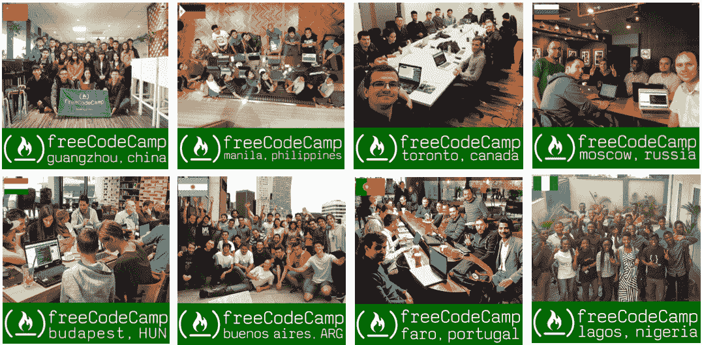

freeCodeCamp students from all over the world organize local tech events

结果，我连续两个晚上致力于课程挑战，并取得了 160 多分。那是我第一次觉得我的代码可能会成为一个产品。

用我们熟悉的一句话来说——这为我打开了一扇新世界的大门:

我开始了解微信是一个什么样的产品，也开始了解其他产品，而不仅仅是一个普通用户。

我通过互联网连接了一个更大的世界，逐渐接触了开源、教育、公益、社会创新、社会企业。我也开始接触不同国家热衷于这些领域的人们。

我渐渐明白了这个世界的规则，学会了接纳别人和自己，也看到了自己未来的很多可能性。

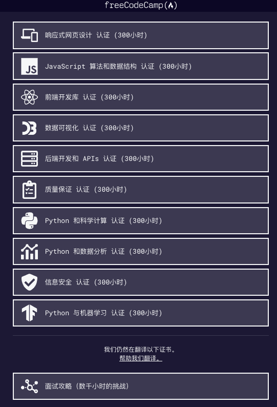

freeCodeCamp Chinese Site: https://chinese.freecodecamp.org/

记得 2019 年初，当我与中国 freeCodeCamp 网站的早期贡献者洛阳胡同行时，我谈到了一个观点:**在这个复杂多变的世界里，人们最难得的是自我意识的觉醒。**

当时回过头来看，惊讶于 2015 年开始逐渐拥抱互联网。如果没有这种改变，我会在封闭的圈子里呆多久？

我这几年的觉醒比过去二十年都深刻！

但是...

*   当我初中毕业，刚刚开始使用电脑的时候，如果有人告诉我，我面前的机器不仅可以打字、点击鼠标、采蘑菇，还可以做许多其他事情——而且百度不是整个互联网——

*   当我在大学第一次对编程感兴趣时，如果有像 freeCodeCamp 这样的学习资源和开源社区

*   在我工作的最初几年，当我试图寻找生命的意义时，如果我能理解这个时代有许多普通的，充满激情的年轻人正在为被公众忽视的领域做出贡献——这与名利无关，他们只是希望让这个世界变得更好，并获得一些内心的平静——

...这些觉醒会来得更早吗？

或者说，有多少孩子和年轻人和我一样渴望改变，却因为各种制约而无从下手？我能为他们做些什么？

> 教育是一棵树摇动一棵树，一朵云促进一朵云，一个灵魂唤醒另一个灵魂。-未知来源

我曾经读过这样一句话，“我们上大学是为了那些没有上过大学的人”我觉得是真的。

因此，我决定这是我想做好的领域:公众教育。我想将我多年来获得的知识和见解转化为教育资源，并将其传递给社区中有需要的人，以便他们能够为自己的生活带来良好的变化。在坚持和明确“初心”中，我的生活变得更加平静和清晰。

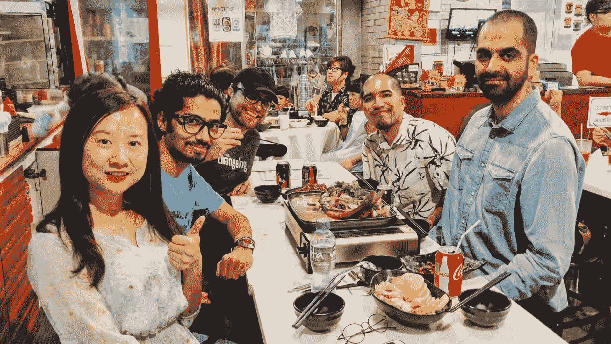

Some members of the freeCodeCamp team worked together in Hong Kong for a week in 2019, from left to right: Miya, Mrugesh, Quincy, Kris, Ahmad

还有，2019 年，我正式加入 freeCodeCamp 团队，与贡献者合作。

我喜欢在正式场合介绍自己是 freeCodeCamp 贡献者或 freeCodeCamp 华人社区大使。

事实上，freeCodeCamp 团队是一个扁平化的组织。没有下属的概念，谁也没有头衔。

昆西通常会介绍自己是 freeCodeCamp 的老师，必要的时候会说自己是创始人。

关于我的头衔，我告诉昆西，我需要一个头衔来和中国的其他人合作。

我们不喜欢“负责人(负责人)，“这就有点老套了。所以他建议用“大使”这个词大使)”反而。我知道 TEDx 等社区里也有类似“大使”的名字，所以就接受了。

## “在深圳，**找几个朋友一起过节**真的很重要。”

2021 年 9 月，我录制了一个[视频](https://www.bilibili.com/video/BV1WR4y1H7tj?spm_id_from=333.999.0.0)宣传中国开源大会，我又提到了这个故事。

自 2016 年以来，我经常打电话和来自各个城市的朋友聊天，包括成都、广州、西安、深圳、天津、郑州等。

大部分是程序员，想在所在城市组织 freeCodeCamp 线下技术活动，帮助大家学习编程，认识志同道合的朋友。很多时候我们聊了一两个小时。

我也介绍他们认识，帮助他们互相了解。我在 2016 年社区年度总结中写道:

> 在我看来，这些人就像散落在世界各个角落的珍珠。我能感受到他们独特的美。
> 
> 然而，我没有想到，作为陈美雅修女，我帮助收集它们，相互吸引，并把它们连接成一串闪闪发光的项链。这是我这辈子做过的为数不多的觉得特别有价值的事情。
> 
> 2017 年，我会努力做一个更好的陈美雅姐姐。

然后，我碰巧看到多愁善感的游条(油条)在他的瞬间贴了一篇文章，和我一样敏感，眼泪瞬间就来了。

文章解释了为什么他要继续带领一群人运营 freeCodeCamp 深圳社区，即使是在他刚退学转做前端开发不到一年的时候。他团队的老板寄予厚望，工作超级忙:

> 我周围的每个人，包括我自己，都面临着或许是人生中最具挑战性的阶段:
> 
> 20 岁的时候，我们一个人来到这个城市。而深圳高得离谱的房租导致几乎所有人都住在小于 10 平方米(107.64 平方英尺)的房间里，或者住在离公司一小时路程的区域。
> 
> 生活很艰难，每个人都开始一个人做所有的事情。外向的人可能更好，内向的人总是处境不好。
> 
> 我经常说 freeCodeCamp 深圳社区想做一个线下知识分享平台，其实是不准确的。
> 
> 通过线下活动找几个朋友一起过节真的很重要。

> 有时候，朋友的对话让我觉得很遗憾。
> 
> 我记得有一天晚上，一个朋友喝醉了，对我说:“你知道吗？我不再有家了。”
> 
> 我不知道。如果他没有提起，我永远也不会知道。我看到了他眼中的那种孤独。
> 
> 我知道他需要有人帮他，但是深圳那么大。谁会在乎一个平时不说话的人？
> 
> 有一天，freeCodeCamp 的一个朋友吃完饭留下来，带我回家。我猜他想和我说话。那天晚上我们聊到很晚。
> 
> 他和我谈论他的工作、他的爱情和他的社交恐惧。在我家昏暗的灯光下，我能感受到他眼中深深的关切。
> 
> 就是这样！如果一个不善于表达自己感情的人得不到表达的机会，他怎么向别人暴露自己的想法？

我确实理解这种感觉！我曾经一个人去苏州找工作。没有同伴。想买衣服都不知道去哪里逛。

在那个年纪，“孤独”可能是我们最亲密的朋友。那是我第一次知道 freeCodeCamp 对这些人有这样的意义。如果每个城市都有这么温馨的社区就好了。

优条的文章提醒了我:**我们需要见面，需要面对面的聊天，需要用心的感受和倾听**。

就像罗翔教授(中国著名法学家)最近描述的费奥多尔·陀思妥耶夫斯基的《卡拉马佐夫兄弟》中的观点:

> 爱一个具体的人，而不是一个抽象的人。

从此，我不再喜欢站在舞台的聚光灯下。我更喜欢在台下听别人讲故事，鼓励大家分享，为他们鼓掌。

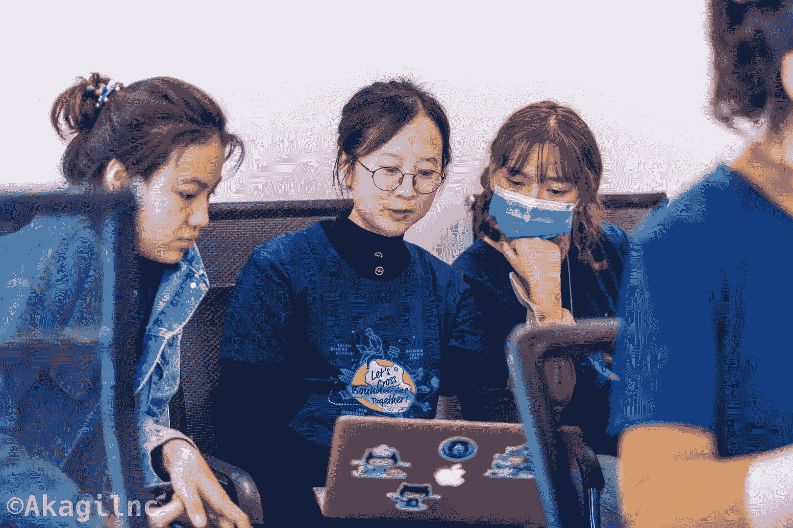

2020 中国开源大会期间，我和两位志愿者交流了关于社区的概念。

最近和一个朋友聊天。他说最感动的是有朋友告诉他“参加你们组织的社团活动，解除了我的抑郁。”

是的，**社区对人们的影响远比我们想象的重要**。我很高兴有朋友和我有同样的发现，并继续通过^_^社区传递温暖和善意

在今年中国开源大会的第二天结束时，一个女孩对我说:

“我观察你一天了，发现你可以用不同的人能理解的不同方式来解释‘开源’这个词。也就是你可以结合他们自己的经历，让他们明白——‘哦，原来这是开源。’

你还鼓励大家分享。在这里没有人会觉得这个活动与他们有任何关系。我喜欢你的温暖。"

我说:“谢谢你这么直白的表达对我的认可。‘温暖’这个词就是我想表达的！”

其实我明白“觉得活动与我无关，觉得格格不入”是什么感觉。

转行互联网行业之前，我在一家国际项目管理公司做项目助理。

后来，我也开始从事合同管理和业务开发工作。那时，我工作非常努力，总经理、我的上级、同事和客户都非常欣赏我。

有一次，总经理迈克尔去参加一个大型会议，特意让我的老板杰西通知我和他一起去。

让我参加这次活动的目的是让我获得见识。

那天早上，我穿着我唯一的一套正装，笨拙地踩着高跟鞋，跟着杰西走进了酒店里一个宽敞豪华的会议室。

这是我第一次参加如此盛大的活动，我很兴奋。

我正在想我该坐在哪里，这时杰西告诉我，“他们只给我们安排了两个座位。你应该去找别的地方坐。”

结果我去了会议室角落，坐在员工休息区。我试着去听那些一两百个学术界和商业领域的人讨论我不理解的话题。我根本听不进去。尽管我穿得很好，但我觉得我甚至没有座位。

具有讽刺意味的是，尽管我穿得很好，我甚至没有一个座位，我也不适合那些成功人士。很快，我的脸就红了，我心里想:我讨厌这个地方，我要离开。

感谢迈克尔，他是一个非常体贴的老板。感谢我的老板杰西，她总是像大姐姐一样照顾我。

他们似乎注意到了我的尴尬，所以杰西走到我跟前说:“陈美雅，去坐在迈克尔旁边。我得回公司了。”

我对会上人们讨论的内容一点印象都没有。
但我记得迈克尔低着头，很温柔地对我说:“说实话，他们说的没有任何价值。你现在什么都不是，没有人会听你的。但是有一天，当你成为某个人的时候，你会在上面说话。别人会觉得你讲的东西很重要。”

我对他的话印象深刻。我只是点点头，暗暗想道:

> 如果有一天我真的成了大人物，我不在乎我坐在哪里，也不在乎有多少人听我说话。但我会注意角落里有没有一个女生因为与人群格格不入而显得尴尬。
> 
> 我会走过去，微笑着问她:“你叫什么名字？你对大家都在谈论的话题有什么想法吗？”

就像我愿意听一个容易被忽视的公交司机- **我相信每个人都有值得被倾听的故事。如果没有人给他们提供这样的舞台，我来。**

## 泡泡

在昆西的《AMA》中，我喜欢他对以下问题的回答。AMA 代表问我任何问题。

你打算如何教/教育你的孩子？你考虑过在家上学吗？

> 如果你有很多孩子，并且父母在家可以教你，在家上学是一个很好的选择。但是社会化和建立情商是很重要的，你可以在公立学校的经历中得到这一点。
> 
> 我从公立学校学到了很多东西。也有不足之处。但如果我只是去了私立学校，我就与现实绝缘了。我不想让我的孩子在泡沫中长大。

在泡沫中成长意味着什么？可能她所有的朋友都是家庭条件不错的小王子或者小公主。她没有机会遇到一个交不起学费，午饭时间只能在角落里吃包子的人。她会觉得这个世界上的每个人都和她一样。他们都享有便利和丰富的生活资源和教育资源。

但是这个世界的现实并不是这样。当她长大后，她能承受现实的冲击吗？

现在，试着想想。有没有哪些瞬间让你觉得泡沫破了？

我来分享一些:

2018 年 12 月，昆西告诉我，尼日利亚农村的一个年轻人正在用一部旧的诺基亚手机学习编程，因为他买不起电脑。

后来，他成为了一名 Android 工程师，与哈佛和麻省理工的人一起远程工作。其实世界上很多人都是这样学习编程的。

那时候我刚买了第二台 MacBook。

2019 年 5 月，在杭州参加了 [ChangemakerXchange 亚洲峰会](https://changemakerxchange.org/)。主办方每年都会从近千名报名者中挑选 20 人参加这项活动。这些参与者都是非常善良的年轻人，关心这个世界。

在一次讨论中，一个在缅甸经营非营利组织的泰国人问我们是如何学习英语的。两名来自新加坡的参与者和一名来自北京的女孩说，他们从小学三年级开始就有英语课。我说，在四川，初中就开始学了。我以为那家伙会说他是从高中或者大学开始学英语的。尽管如此，他告诉我们一年前他第一次在难民营里学英语。

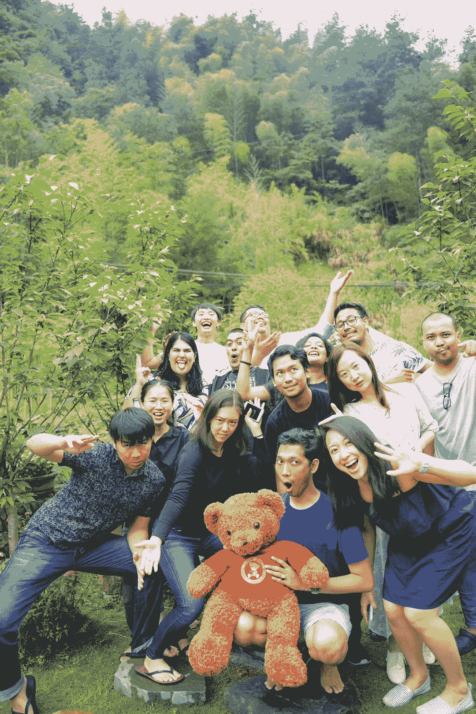

Participants of the 2019 ChangemakerXchange Asia Summit and the beloved bear

2019 年 6 月，我和我的团队在香港工作。每天晚上，我们都会在晚饭后去维多利亚港散步，探索这座城市。

一天晚上，我回到酒店，打开空调，打开脸书，看到一条新闻:一对难民父女在试图游到美国时溺水身亡。孩子才一岁。她的母亲站在岸边，看着她，但无能为力。

还有，2019 年，我看了一篇克豆学校创始人的文章:
根据斯坦福农村教育行动计划(REAP)的统计，中国贫困地区 63%的农村学生没有进过高中，更不用说大学了。

根据中国国家统计局的统计，近 1000 万 16-18 岁的儿童成为新生代农民工，占农民工群体的 3%。

我曾经是一个留守儿童。5 月，我回老家看望一位初中老师。他告诉我，快 20 年过去了，家乡的孩子大多还是留守儿童。

2021 年 9 月，我坐在路边等一个老朋友一起吃火锅。一个外卖快递员把车停在我面前，看起来有些担心和无奈。

我问他交货跟不上，劝他不要着急。他可以打电话给顾客解释。客户应该理解。

他说已经过了截止日期，客户取消了 50 多杯奶茶的订单。平台罚了他 500 多元。

尽管我平时不喝奶茶，我还是从他那里买了两杯，和他聊了起来。

小伙子 18 岁，刚高中辍学。他为了爱情，从大连老家来到成都。

那段时间他在找各种工作，被骗了钱。
现在正在找下一份工作，担心以后结不了婚，很焦虑。

所以我向他推荐了 freeCodeCamp，让他学习编程。我加了他的微信 ID，把网址发给了他。

他说很棒，而且听说过编程，想学！
他要出发的时候，我告诉他，他的人生才刚刚开始，安全最重要。不要学坏的东西。学一技之长。如果不能坚持，可以回老家。

那天晚上回家的路上，我想:我们当初的状态可没这么好。18 岁的时候，我好像很着急想看看自己以后的生活会是什么样子。在这个城市，这么多年轻的快递员从我们身边匆匆而过，他们有机会停下来谈谈自己的焦虑吗？

当我看到和听到这些事情时，我总是感到悲伤和无助:这个世界上有许多人需要帮助。我可以听一部分人的，支持一部分人的，但我帮不了所有人。

在文章[伊诺:我们看到的往往是片面的事实](https://mp.weixin.qq.com/s/1mmgOjWHIBmJtFOHxqwonQ)中，李一诺(李一诺 [ETUSchool](https://www.etuschool.org/) 创始人、前比尔及梅林达盖茨基金会北京代表处首席代表)写道:

> 我们听到的是谁的声音？我觉得是会说话的人的声音。然而，许多社会问题往往是由那些不能畅所欲言的人造成的。

幸运的是，在世界的这么多角落，我们有这么多善良的朋友，他们愿意倾听那些没有机会说话的人的声音，然后致力于照顾难民、农民工、孤寡老人和留守儿童...

在讨论我的工作重心时，昆西曾问我:你是想只帮助四川成都的人，还是全世界的人？

我同意昆西所说的:

> freeCodeCamp 将大规模地帮助人们。我们的资源是有限的，我们想一点点地帮助许多人，而不是许多人。

其实一个真正渴望改变的人，只需要我们一点点的帮助和引导。他们将遵循变革之路。有时候，他们还会转身去引导别人。

我喜欢这篇文章:[我如何通过#100DaysofCode 挑战](https://www.freecodecamp.org/news/how-i-became-a-programmer-with-the-100daysofcode-challenge-19b01f17bca1/)成为一名程序员。主角出生在尼日利亚东部的一个农村，那里资源匮乏，常年没有电，人们也没有网络。她的母亲知道农村女孩的唯一出路是接受教育，所以她努力接受高等教育。

毕业后，她在一家公司做客服代表。公司重组，她决定学编程。因为付不起学费，她发现可以在 freeCodeCamp 免费学习。

后来，她成为一名开发人员，改善了自己的工作和生活，创办了一家社会企业 GreyAfricaHub，帮助其他年轻人学习编程，降低国家的失业率。

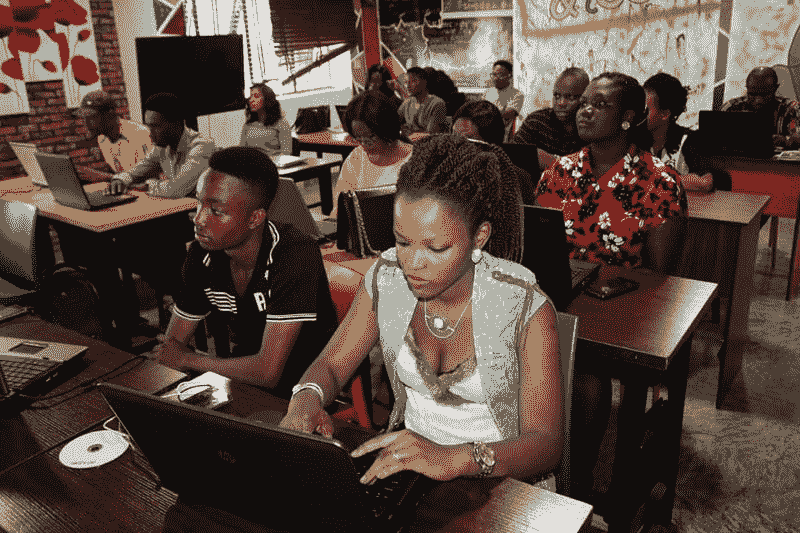

GreyAfricaHub provides free web design training courses for local young people

在 freeCodeCamp 社区有很多这样的学生故事。
例如，大学校园的一名保安[通过自学编程](https://www.freecodecamp.org/news/from-self-taught-coder-to-professional-backend-developer-my-long-winding-road-d8f7c428b637/)转行成为后端开发人员，为家人创造了更好的生活，并创办了编程社区开源周末，帮助更多的人。

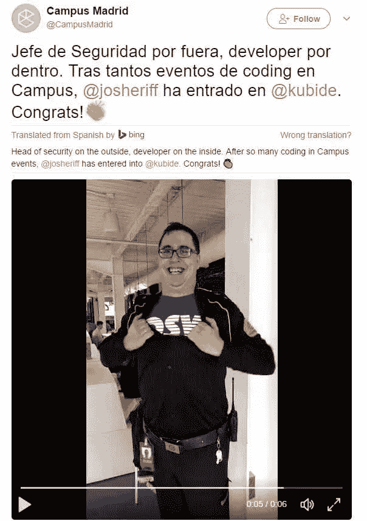

The social media account of the Madrid campus sent a message to congratulate the security guard for his successful career change

当我们想要帮助一个大型社区时，聪明地工作比努力工作更重要。

我们可以做很多有意义的事情。写一篇文章，录制一个视频教程，在论坛上回答一个问题，在 GitHub 上提交一个问题或拉请求，与一个志愿贡献者聊天，与合作伙伴讨论活动，向一个大学老师介绍我们正在做的事情...

如何才能在所有说不完的细节中，把每一件事都排好优先顺序，做当下最正确的事？社区领袖需要培养的就是这种能力。

而且如果我们继续做正确的事，会有越来越多的人支持我们，路会越走越宽。

感谢华东师范大学王伟先生邀请我们参加[首届中国开源教育研讨会(SOSEC)](https://mp.weixin.qq.com/s/Epgz0GeiAbDlDXgkh8Sw9w) 。

我们很荣幸成为来自基层社区的唯一代表，与来自全国十几所大学、科研院所、国内外大型公司的人士交流，受益匪浅。

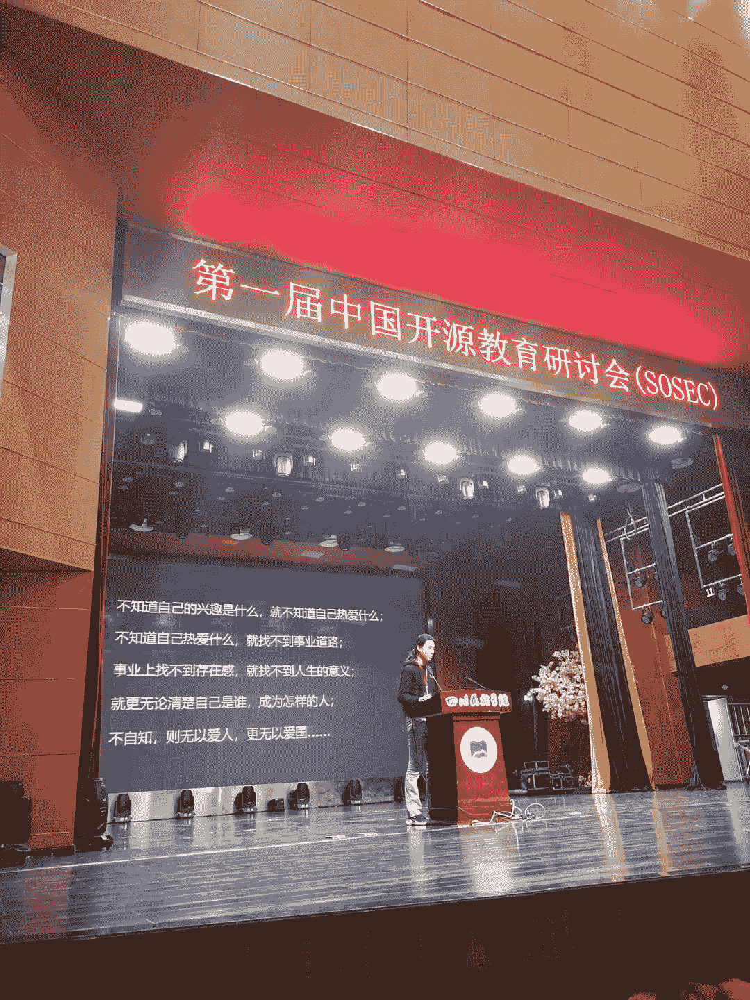

Shui Ge (水歌), who has led the freeCodeCamp Chengdu community since 2018, was sharing at the meeting how open communities could help young people to grow

I was introducing freeCodeCamp at the conference

会议在康定的四川民族学院举行。我很高兴在会上看到许多学生，因为我一直希望我的分享可以激励年轻人。一些朋友告诉我一件我说过他们最喜欢的事:

> 给世界带来美好的改变，不是一个人做很多，而是每个人做一点点。

席间，华东师范大学周校长引用了在演讲中的话:

> 除了家庭、学校和社会教育之外，开放社区是年轻人自我教育的空间。

周校长说，高校应该合作为年轻人提供这样的空间。感谢大家的认可！

## “科豆学校是离我们最近的开源社区”

在今年开源大会的公开环节，有人跟我说，听我讲了“开源”之后，作为一个不在这个领域的人，感觉每个人心里都有自己对“开源社区”的理解。我说那是对的。我只想分享一个故事。

2019 年，[银杏基金会](http://www.ginkgofoundation.org/)的朋友应给我介绍了校长[欧阳燕琴(欧阳艳琴](https://mp.weixin.qq.com/s/lJdIcgGGHYWcTs_IU6oA6g)、克斗学校创始人、支教老师[陈一帅(陈一帅)](https://chinese.freecodecamp.org/news/explore-programming-education-for-high-school-students-with-limited-resources/)。他们正在使用 freeCodeCamp 的编程课程。

我看了很多关于这所为 16-18 岁农民工子女或城市边缘青年开办的公益学校的信息，并关注了它的发展。

该校致力于“促进教育公平”，类似于 freeCodeCamp。老师和同学的善良和活力深深打动了我。

尤其是北京交通大学电信学院副教授陈一帅。他非常随和。他自愿在学校教编程。他和朋友一起探索全人教育下资源有限的高中生前端编程教育项目。

后来认识了几个不同大学的老师，比如王伟老师(王伟)来自华东师范大学和曾政老师(曾铮)来自北京信息科技大学。

这些老师有两个共同点。一是他们致力于帮助学生成长。另一个是他们都认可 freeCodeCamp 的价值。

有时候我会想，我是不是应该把这些老师联系起来，让他们互相认识，就像我联系年轻人一样？

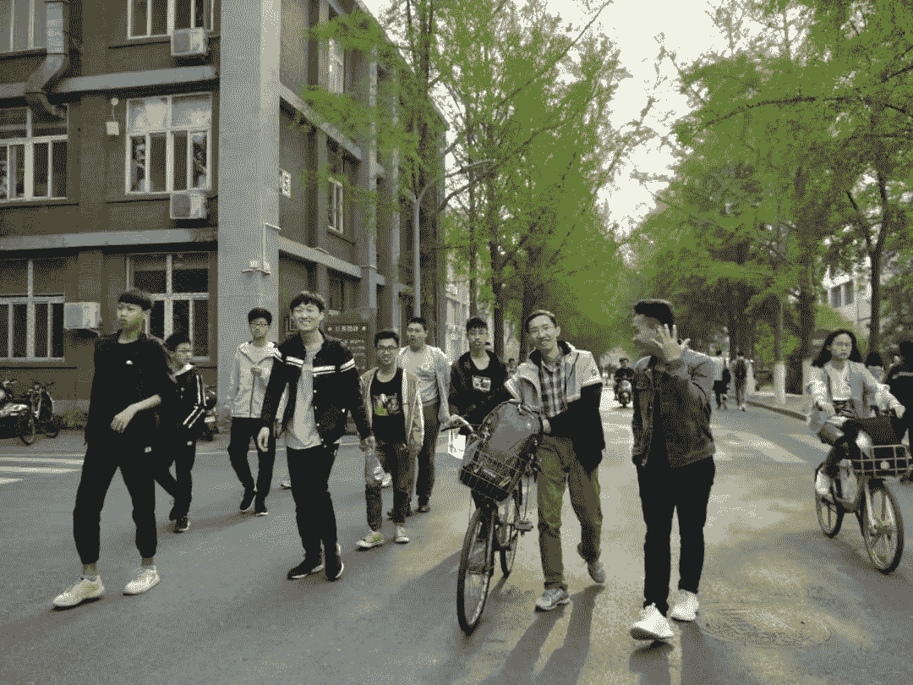

Chen Yishuai (陈一帅), a volunteer teacher in the programming class of the Kedou School, and his students

今年 10 月，我推荐了[严俊(俊雁来自科豆学校的](https://chinese.freecodecamp.org/news/how-i-learn-to-code-within-online-and-offline-open-source-community/)和[埃里克](https://chinese.freecodecamp.org/news/how-i-learn-to-code-within-online-and-offline-open-source-community-and-share-what-i-learn/)在[学生开源会议](https://sosconf.org/)上做演讲。

这个活动类似于成都社区组织的中国开源大会。然而，它是世界上第一个完全由学生组织的开源技术峰会。主要目的是指导和鼓励学生，让他们学会如何理解、参与和贡献开源。

然后，在中国开源大会的第一个晚上，我和朱睿杰聊天(朱芮捷)，学生开源大会的首席组织者，电子科技大学的一名学生。他告诉我，他觉得科斗学校的演讲者比他在大学里认识的大多数学生都要好。

之前，我从老师、学生、媒体、家长和雇主那里读到了很多关于科豆学校学生的积极反馈。但这是我第一次从一个杰出的同龄人那里听到如此高的反馈！

那是整个 COSCon 最开心的时刻。我感到非常兴奋和惊喜。我想和更多的人分享克豆学校的故事。

当然，瑞杰善于发现身边人的优点，并直白地表达认同，这本身也是难能可贵的。

要知道，科豆学校是为传统教育体制下被认为是“学习懒虫”的孩子开设的，他们中的一些人已经被老师抛弃，被学校开除。

**感谢科豆学校，让我们看到了教育的另一种可能。**

当我把瑞杰的反馈转发给欧阳时，她说:“陈美雅，谢谢你，虽然我从未见过你，但我从你那里感受到了如此多的温暖和支持。”哈哈，温暖是相互的。

这是上面两位学生的演讲(中文)。随意阅读:[利用线上和线下开源社区，从未有机会学习的年轻人成为编程学习者](https://mp.weixin.qq.com/s/H1NZvWVUO_Isz6omrTj3fA)。

在会前的一次采访中，两位学生说:

> 我认为科豆学校是离我们最近的开源社区。在学校里，有的学生会学编程，有的会学设计，有的会学其他专业。线下，同学们一起学习，一起讨论，互相帮助。
> 
> 每周六，学生们还会开一个讨论会。每个同学都会分享自己这一周学到了什么，遇到了什么问题，有什么感受。学校里有一块板子，上面写着三个字，`<Love />, <Study />, <Together />`。我想这就是科豆学校开源社区带给我们的体验吧。

我喜欢和这类年轻、好奇的学生交流，当他们谈论他们喜欢的事情时，他们会说得很好。

记得在中国开源大会的公开环节，Eric(龙则灵)，电子科技大学大一学生，兴致勃勃的给大家分享了他用 Rust 写的微服务框架 Hive。甚至当主持人直接告诉他“该停了”的时候，也没能阻止他说话。

我的小伙伴 Charles 是电子科技大学的大一学生，他非常渴望在学校的 Linux 用户群中分享他的经验。

我问他在社团做什么，他的大眼睛闪烁不定，他说:“我大一，现在在读书。”哈哈，好可爱。

而他们的学长锐捷给我们介绍了学生开源大会和 Linux 用户群帮助学生成长的意义，一如既往的稳定，鼓舞人心。

肖进(金霄)来自四川大学，讲述了他是如何从一个相当内向的人，变成活跃在社团里，积极配合学生社团里的每一个人。

同时准备了“猜开源 Logo 游戏”，营造轻松愉悦的氛围。

自从我在 2015 年遇到那位公交车司机以来，我经常被充满活力的年轻人所感动——他们永远年轻，他们的眼里永远有星星。

**到了这个阶段，我开始怀疑，除了“教育公益”，我还喜欢什么，擅长什么？我还有能力做什么？我认为是“青少年发展”。**

如上所述，在探索和发现生命意义的整个过程中，我基本上是一点一点地引导自己走过混沌。那时候，我希望有人能给我一些指导。现在，也许我可以给其他人一些指导。

感谢这个伟大的时代，青年朋友有很多渠道和机会与社会各领域的人交流和学习。当然，加入一个开放的社区是一个很好的方法。在社区里，不管你想做什么，只要你分享出来，就会有人响应。

我们已经在与关注不同阶段(从小学到初中、高中和大学)青少年发展的个人和组织合作，计划一些美好的行动。
这一切都需要长期投资，不能操之过急。我们会花很多年来做这件事。

## 我生来是为了什么？

最近，我和一位音乐家朋友聊天，试图“让音乐更贴近生活”我对他说:“你生来就是为了‘音乐为善’。”"

然后我想:我生来是为了什么？

这是本文的最后一个故事，我们终于到了这个终极问题。

振振有词地写了几千字之后，就卡在这里了。

我不知道怎么写下来，所以我翻了翻书，翻了翻知乎(知乎，中国版的 Quora)，想了想...三个小时后，我突然明白了:想这个问题，真的很花时间(笑脸)。

我知道很多年轻朋友都是带着这个问题来到社区的，那我就说说我现在想到的几个关键点。

### 做中学

2015 年，在一个创业者朋友的办公室里，我看到了维珍创始人的留言:

> 如果有人给你一个绝佳的机会，但你不确定你能做到，那就答应吧——然后学习如何去做！——理查德·布兰森

我站在那堵墙边，看了很久。然后我就把这句话记在心里，用同样的方法去实践。这和我们 freeCodeCamp 社区倡导的学习理念类似——边做边学。

如果我们总是感到困惑，那可能是因为我们做得还不够。

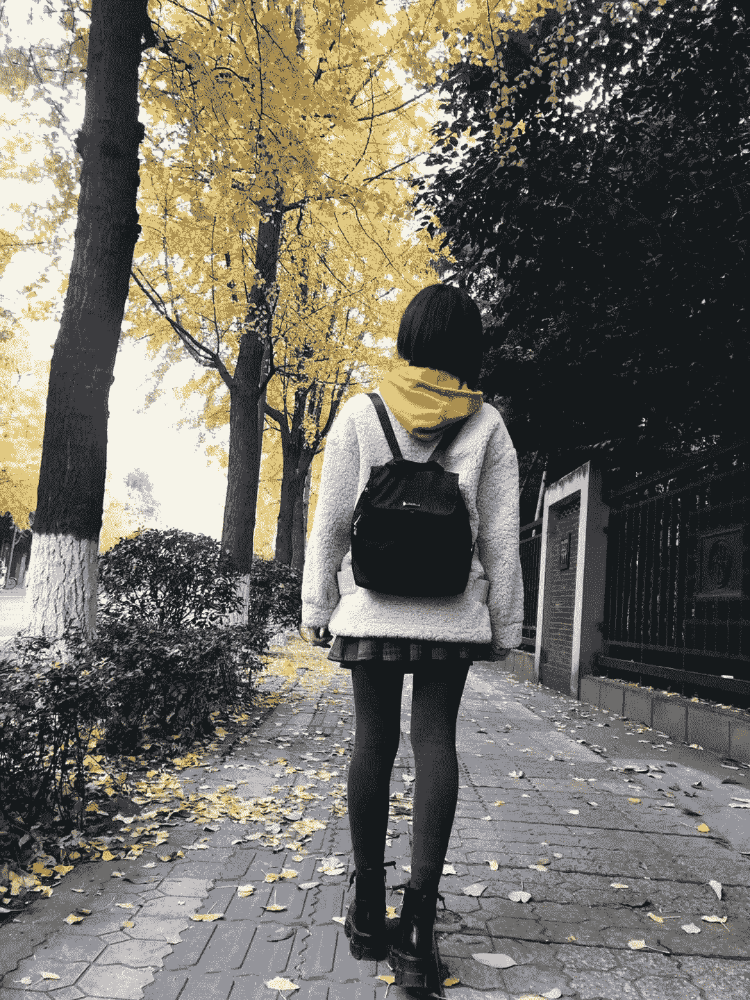

我喜欢这张我自己的照片。这让我感到平静。2019 年在成都拍的，我给它取名“芳华(芳 华)”，还是漂亮的年纪。

### 接受自己

2019 年，在为期五天的 ChangemakerXchange 峰会结束前的分享会上，我说:

> 我在这次活动中最大的收获是接受了自己——我不必那么优秀，我不必那么与众不同，我没有高学历，我动手能力弱，我不会玩乐高，我不会跳舞，我内向。我不会很快就能和每个人聊天...
> 
> 在工作中，我会和很多人聊天，帮助很多人，尽量包容别人，表现得好像自己什么都会。
> 
> 感谢这次活动的经历。原来“承认自己做不到”并没有那么可怕。我第一次真正接受了自己。

ChangemakerXchange 的官方介绍是“全球首屈一指的社区平台，面向欧洲、非洲、亚洲等 80 个国家的 600 多名年轻社会企业家”。

在我看来，就是帮助大家放松，疗伤。这个活动是我参加过的最好的活动。

互相交换方糖临别赠言时，我收到的两件东西是:

> ——你是我见过最可爱的人，你教会了我做自己，在脆弱中找到勇气。
> 
> ——你是本次峰会最杰出的成员，你像盛开的鲜花一样美丽。

接受自己是人生的必修课。

### 这个世界很美好

2019 年看到[这篇文章](https://mp.weixin.qq.com/s/Qr4dBwO77nUcj44ituMWQw)讲了一个发生在美国底特律的故事:

一位 86 岁的老爷爷退休那天，公交车司机、乘客、家人、朋友、同事在他乘坐了 60 年的公交车上为他举行了一场温馨惊喜的“退休仪式”。

对于一些司机来说，他们和老爷爷不仅仅是典型的司机和乘客的关系，而是成为了一生的朋友。

一个男孩跟这个爷爷坐了十几年的公交车，从他打工的另一个城市回来最后一次跟他坐 530 路公交车。

他们带着这位祖父不同年龄的照片登上了公共汽车，从 20 岁、30 岁、40 岁到 86 岁...在这辆公交车上，老爷爷仿佛看到了自己的一生。

我当时在微信时刻写道:

> 我越来越觉得这个世界挺好的，不需要所谓的“改变世界的人”，没有人能改变世界。
> 
> 我们需要改变的是我们自己。当我们更习惯真诚自然地表达对他人的爱和感激时，我们就向更美好的世界迈进了一步。
> 
> 这个动作很简单，但看起来很复杂。
> 
> 愿我们都温柔地对待这个世界，也被这个世界温柔地对待。

**嗯，这个世界挺好的。我们不用担心我们会改变什么，只要放松，去体验，去感受。**

现在，故事结束了。

所以，我不会去思考“我是为了什么而生”这个深奥的问题我曾经和一个好朋友讨论过人生没有意义——早睡早起，天气好的时候出去晒晒太阳，上班路上看看花，轰轰烈烈的度过每一天......感受它，探索它——这就是意义所在。

哦，对了，前两天在路上看到一只胖乎乎的小狗开心的蹦起来，好可爱。第二天又碰到了，忍不住笑了。

科豆学校的一名学生形容他的编程志愿者老师陈一帅是“一条活泼善良的鱼。”我喜欢这个描述。我觉得它充满了灵性。想出这么美的句子的一定是个很棒的学生和很棒的老师。

我也希望我有那样的地位。

我的名字里有两个鱼，就是鱼的意思。而我是双鱼座，也包含鱼。我也喜欢吃鱼。所以我和鱼关系很好；)

做好事，不要问你的未来，就像史蒂夫·乔布斯说的:

> 你无法把向前看的点点滴滴串联起来；你只能回头看才能把它们联系起来。所以你必须相信这些点在你的未来会以某种方式连接起来。

或许，当我们老了，回首这一生，把点点滴滴串联起来，就能很好的回答我们为什么要活在这一世。

感谢阅读。