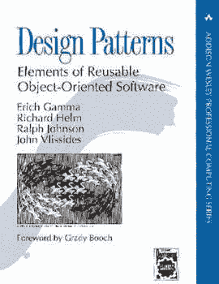
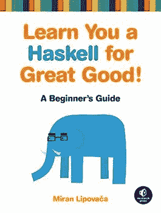
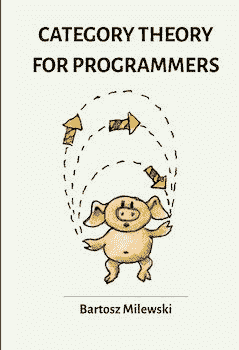
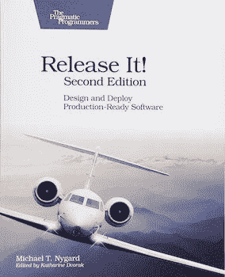
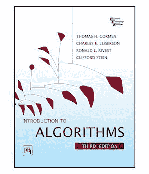
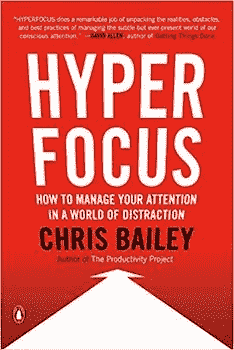
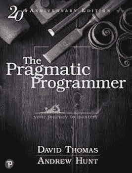
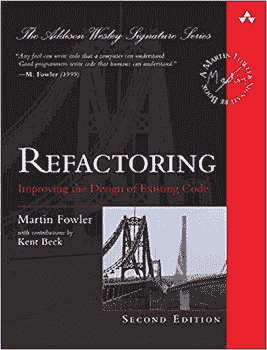

# 我的软件工程书架上有什么

> 原文：<https://www.freecodecamp.org/news/my-software-engineering-bookshelf/>

保持更新和不断改进是软件工程师工作的一部分。

在互联网上有很多学习新事物的方式，比如 MOOCs、教程和文章。然而，有时实体书是最好的选择，尤其是当它是一种“参考”，提供将持续多年的知识。我们可以把它放在我们的书架上，每当我们觉得有必要的时候就去翻阅它。

这是我放在软件工程书架上的参考书清单。我希望它能成为每个寻找有趣读物的人的灵感来源！？

## 我书架上有什么

### 设计模式:可重用面向对象软件的元素

这是经典。

在本书中，所谓的“四人帮”展示了驱动面向对象世界几十年的 23 种设计模式。从那以后，新的模式被创造出来，但是书中的模式被认为是所有其他模式的基础。

这不是一个容易的阅读，但你应该看看它只是为了了解在哪里可以找到你需要的每一个场合。把它放在你的桌子上，当你正在做某件事情，并且感觉到“我正在做的事情听起来很熟悉”的时候，浏览一下它。您可能会发现，您正在尝试实现本书中已经描述过的设计模式。

### 干净的代码:敏捷软件工艺手册

很多年前我读过这本书，但从那以后它就一直伴随着我。

这是产生干净、可读的代码和避免代码味道的最佳实践的一个很好的来源。这本书主要关注 Java/OOP，但是许多建议可以应用于每一种语言或编程范式。

编写可维护和可读的代码并不是一件奢侈的事情——这是每个优秀的软件工程师都应该向往的事情。这本书将为你提供实现这一目标的知识。

鲍勃叔叔有时有点极端，我不同意他提出的所有技术。我的建议是:读一读，只带你觉得对的东西。无论如何，**是一本值得一读的书**。

### 学你一个哈斯克尔的伟大好处！:初学者指南

这是一本关于 Haskell 编程语言的书，那为什么还要买下来留作参考呢？我的理由是:

*   这是一本关于函数式编程等不太容易的主题的非常好的易读的书
*   它为您提供了函数式思维的基础，而不仅仅是 Haskell 语法
*   Haskell 是一种非常优雅的语言，我喜欢它

这是向我介绍函数式编程的书。现在我主要用 Scala 编程，但是在学习了 Haskell 的基础知识之后，过渡变得容易多了。

函数式编程并不容易，但会开阔你的思维。它可以是非常理论化的，**使用 Haskell 将其付诸实践将会有很大帮助**。

书中还有非常好看的图纸，你没有借口不翻看。？

### 程序员的范畴理论

这本书涵盖了**范畴理论**，这是函数式编程范例的基础。

对于非数学家来说，这个主题相当复杂，但是作者已经尽了很大努力让开发者能够理解。我承认我读它有些困难，但是我想再看一遍。

这本书并不要求成为一个伟大的函数式程序员。如果你喜欢挑战，想更深入地了解函数式编程的理论基础，请阅读它。

### 设计数据密集型应用程序:可靠、可伸缩和可维护系统背后的重要思想

这是我最喜欢的，也许是因为我喜欢分布式系统！:-D

在本书中，Martin Kleppmann 描述了分布式系统的各个方面，从序列化到一致性模型和一致性，贯穿了各种数据库引擎。他还探讨了数据驱动应用程序的新趋势。

在基于云原生微服务的应用世界中，了解分布式系统的各个方面是非常重要的。这本书提供的知识并不局限于特定的技术，而且**将会对你在软件工程**的整个职业生涯有价值。

### 释放它！:设计和部署生产就绪软件

我现在正在读这本。

一旦我们的软件投入生产，我们就完成了吗？不，那只是开始！

这本书强调了在软件投入生产并不得不面对真实用户后可能会出现的问题。它描述了可能破坏我们软件稳定性的反模式，以及解决这些问题的方法。

我最喜欢这本书的一点是，每一章都以取自现实生活的例子开头。然后作者分析了软件在生产中失败的原因。我认为从具体的例子中学习是一种非常有效的方法。

### 算法简介

这本书我能说什么呢？买下来放在你的桌子上。

如果你是一名软件工程师，你很有可能必须学习数据结构和算法。处理复杂性或选择正确的数据结构并不总是容易的。

当疑惑出现时，打开这本书，你会发现你需要什么。

对大多数人(包括我)来说，这是一本非常难读的书。我通常只是在那个时候阅读我需要知道的东西，并把书放在我的桌子上。

### 超聚焦:如何在注意力分散的世界里管理你的注意力

这不是一本技术书，但它是在《更好地改变了我的生活》中的一套读物。

作为软件工程师，我们的工作包括用大脑解决问题。为了有效地完成这项任务，**我们需要能够完全专注于我们正在解决的问题**。

在这里，你可以找到很多建议和技巧来最大化你专注于一项任务的时间。作者还讨论了当你需要更有创造力的时候，让你的思想开小差的重要性。

掌握如何运用你的注意力不仅能提高你的工作表现，还能改善你生活的方方面面。

## 我会在书架上放些什么

### 务实的程序员

这是软件开发领域最著名的书籍之一。

本书中提出的建议和技术更好地影响了许多开发人员和工程师的职业生涯。这本书于 1999 年出版，但现在作为新的和更新的 20 周年纪念版。

你不能错过这个。:-)

### 重构:改进现有代码的设计

总是交付高质量的代码是很难的。截止日期、紧急情况、糟糕的一天都会影响你的工作质量。

这就是重构如此重要的原因。如果我们第一次不能提供质量，我们可以在以后为了更好的可维护性来改进它。Martin Fowler(我在软件开发领域的偶像之一)描述了有效重构的最佳技术。

我的书架上总会有空间放那些帮助我写出更好代码的书。

## 结论

这是我列出的关于软件工程的必读书目。它绝不是这一领域“重要”书籍的全面列表，我相信在未来的岁月里我会添加越来越多的书籍。

希望我给了你一些关于你应该读的下一本书的好建议。？

再见！？