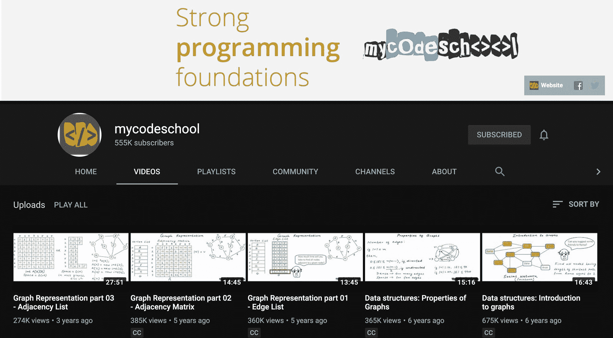
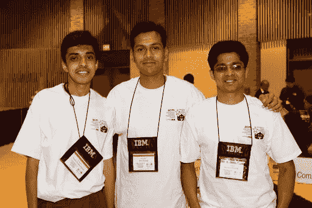
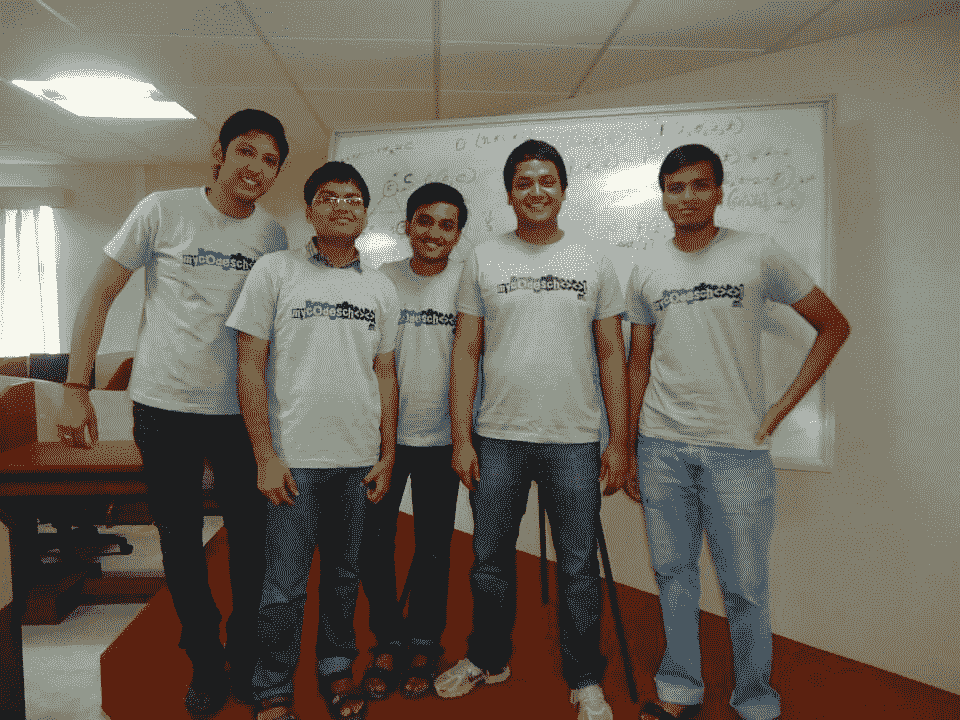
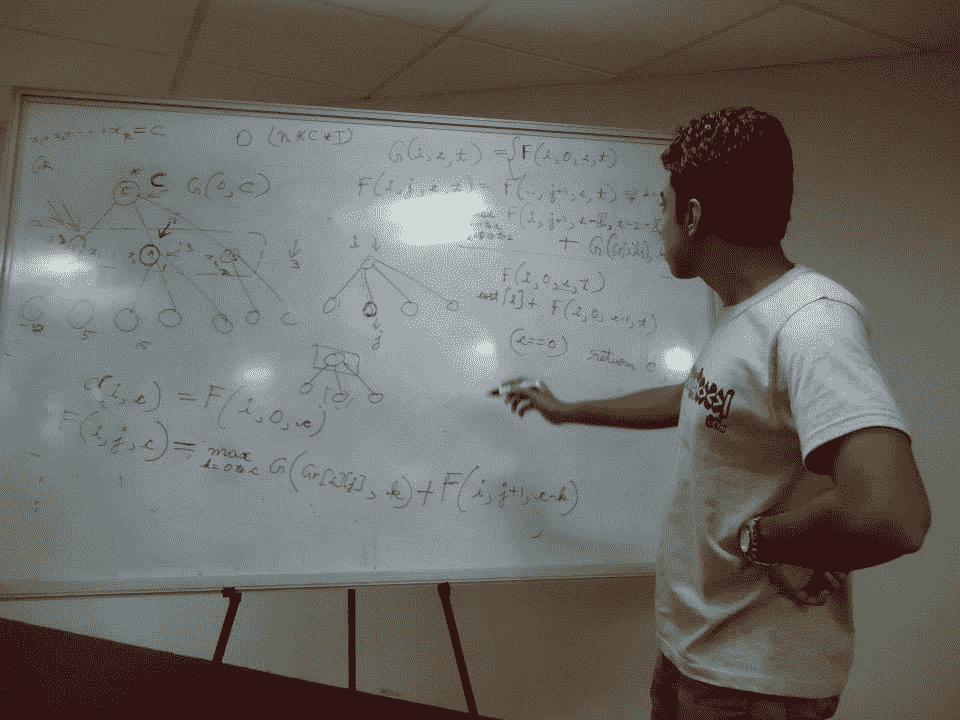
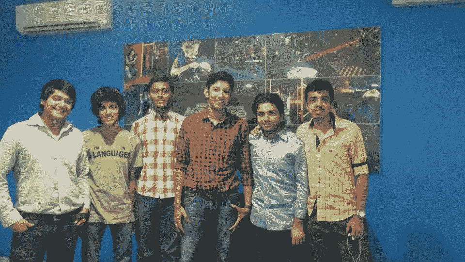
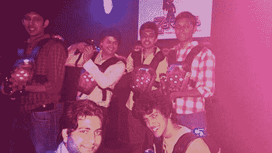
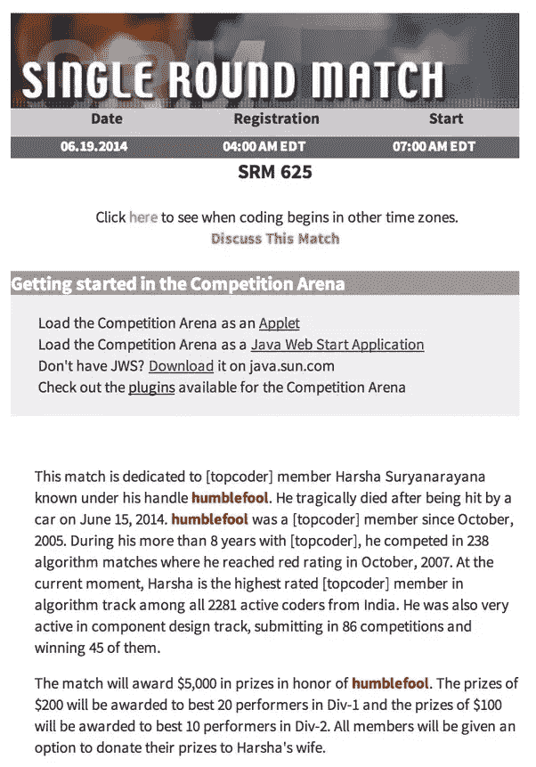

# 我的学校的故事:悲剧、胜利和两个永远改变了程序员教育的朋友

> 原文：<https://www.freecodecamp.org/news/mycodeschool-youtube-channel-history/>

我第一次开始学习编码是在 2012 年。YouTube 上有一个频道，我所有的朋友都用来学习算法和数据结构:MyCodeSchool。

在观看 MyCodeSchool 的几分钟内，你可以立即看出:

1.  这些开发人员对计算机科学充满热情。和
2.  他们非常擅长教授它。

当时，我是一名 31 岁的教师，正试图获得我的第一份工作，成为一名软件工程师。和大多数人一样，我看了视频。我做了笔记。最终我走上了我的快乐之路。

几年后，我才注意到我的学校已经停止发布视频了。我发现了悲剧的原因。

MyCodeSchool's YouTube channel, which – aside from a single video published in 2016, went dark nearly 6 years ago.

我挖掘得越多，就越意识到这个故事有多重要。现在我要分享这个故事。

我也将与你们分享一些以前从未公开的照片和我的学校早期的见解。

每个开发人员都应该了解这两位老师之间友谊的故事，以及他们是如何在短时间内风靡编程世界的。

这个故事很悲伤。但也很鼓舞人心。我很荣幸能把它传递给你。

以下是 Harsha 和 Animesh 如何利用数十年的计算机科学智慧，让全世界数百万学生轻松使用它。

## 手卡在罐子里的猴子

阿尼密什·阎娜是个很少上课的平庸学生。他是“最后一个冷板凳”，只能通过学校考试，因为当他的教授点名时，他的朋友会替他打掩护。

但是 Animesh 热爱编程。他很擅长这个。在课外，他沉浸在算法、数据结构和系统设计的世界中。

事实上，Animesh 变得如此优秀，以至于他一毕业就能在微软找到一份梦寐以求的软件工程师的工作。

我与 Animesh 进行了长时间的交谈，并坦率地告诉了我他对印度高等教育的看法:“我们每年都有大量计算机科学工程师毕业，但其中只有 15%到 20%能够在 IT 支持的服务行业就业。他们中只有 3%的人可以在 IT 产品公司就业，这需要对数据结构和算法等计算机科学概念有更深入的理解。”

“按照目前的计算机科学教育标准，我们更多地是在数量上迎合行业，而不是在质量上。”

正如命运安排的那样，解决 Animesh 发现的这个“质量问题”将成为他生活的中心焦点。

但是他没有意识到这一点，直到近 5 年后，在经历了微软的运动。他擅长他的工作，但这不是他的职业。这是社会对他的期望。这不是他自己想要的。

“首先，我试图通过取得好成绩和找到一份好工作让父亲高兴。然后，我试图通过在一周内修复 20 个软件错误来让我的经理高兴。我厌倦了寻求认同，厌倦了不与内在自我相连。我想，如果我告诉人们我在微软工作，他们会把我当回事。但除此之外，我的身份是什么？”

阿尼密什把他的困境比作一只猴子伸手到罐子里去抓花生。为了把手抽出来，他不得不放开一些花生。但是猴子的本能阻止他这样做，所以他只是呆在那里，卡住了。(没错，这是一种现实生活中用来诱捕猴子的方法。)

“在生活中，我们经常表现得像猴子一样。即使它让我们感到痛苦，我们也坚持把它当作一种资金来源。”

但是为微软工作确实给他带来了声望，并使他在他的大家庭中出名。他的许多在计算机科学项目中苦苦挣扎的朋友和亲戚向他寻求指导。他们希望为自己复制 Animesh 的成功。阿尼密什尽力帮助他们。

“我发现他们中的大多数人没有良好的基础，他们缺乏我称之为计算机科学中的核心技能——编程。”

他通过汗学院的数学视频看到了萨尔曼·可汗的成就，并认为他可以为编程和计算机科学做些类似的事情。

“我的方法是用一个好的脚本让复杂的计算机科学概念变得容易理解。我会花数周时间思考如何以最好的方式简化和解释一个算法。”

2012 年，他在 YouTube 上发布了他的第一次 15 分钟演讲。

“听到自己的声音，我感到很尴尬。但是我妻子鼓励我，所以我还是发表了。令人惊讶的是，当时没有多少人用通俗易懂的语言教授计算机科学。我的视频很快在类似“时间复杂度”的查询中排名第一。我感到很受鼓舞，于是又创作了一些视频。”

到 2012 年年中，他已经发布了几个视频，其他程序员也开始寻求合作。但是 Animesh 特别关注一个程序员——他的老朋友和 IIIT 阿拉哈巴德大学的毕业生 Harsha Suryanarayana。

## 卑微的傻瓜

哈莎不是普通的失业计算机科学毕业生。他是一个传奇的有竞争力的程序员。他不仅在校园里很有名，在国际上也很有名。

Harsha Suryanarayana

以下是 Harsha 的一些成就:

*   他在 ICSE 大学的三门考试中都获得了满分。
*   他代表印度参加了 ACM 的国际大学生编程竞赛。
*   他在 Top Coder 上获得了“red”排名，是整个竞争性编程平台上排名最高的印度程序员。
*   他是有史以来第一个有资格获得谷歌代码堵塞的印度人。

哈沙的名声如此之大，以至于他的朋友们都称他为“哈沙大人”

但是哈沙自己更喜欢用一个不那么响亮的名字:“汉布尔福尔”

Harsha (left) at ACM ICPC World finals

Animesh 这样评价 Harsha:“我也尝试过竞争性编程，我的评分还不到他的一半。我记得我写了一封电子邮件，告诉他我的学校，以为他会忙得没有时间回复。”

但是哈莎第二天打电话给他。他对我的学校充满了想法。

Harsha 没有像 Animesh 那样在大型软件公司找到工作，而是一直忙于为计算机科学学生举办编程训练营。Harsha 邀请 Animesh 来帮助他教一个。

“他的新兵训练营没有得到我期望的那种回应。他说得很快，可能认为一些概念和细节太琐碎，不值得解释。尽管他是最好的人，但许多学生没有参与，觉得自己太笨，不敢提问。哈沙也感觉到了，但不知道如何打破障碍，改变他的参照系。他需要降低自己的假设，与班上的每个人都融洽相处。”

这就是 Animesh 看到的机会。他对计算机科学的了解还不到哈沙的一半。但他擅长分解概念并解释它们。他怀疑他们能使自己成为一支强大的队伍。他很快就有机会验证这个假设。

微软印度开发中心希望 Harsha 和 Animesh 帮助培训和培训他们的新员工。Harsha 创造了编码挑战，Animesh 专注于演示。他们想方设法将体验游戏化，增加幽默，并让学生们以团队的方式工作。

Animesh (second from right) with participants from one of his bootcamps

他们的训练营得到了参与者的起立鼓掌和高分，微软希望雇佣他们进行更多的培训。这是对 Harsha 和 Animesh 基于团队的教学方法的极大肯定。但是他们把目光放在了比企业培训更重要的事情上。

第二年，他们教授竞争性编程。他们一起教了一个冬季编码训练营。

Harsha teaching at the winter coding camp in 2013

他们一起经历了一个创业加速器，并创办了一个网站，[mycodeschool.com](http://www.mycodeschool.com/)。他们甚至雇佣了一组实习生。

From Left to Right: Animesh, interns Ashwin, Vishal, Lokesh, and Shashank, and Harsha

“我们讨论了很多哲学，以及如何只追逐金钱不是生活的最佳方式。我们创业的方式相当悠闲。我们并不太关心融资或快速增长。我们只想享受我们正在做的任何事情。”

The MyCodeSchool team playing laser tag

## 在文艺复兴结束之前，你永远不会意识到你正在经历它

“我记得。那是 2014 年 6 月 15 日。我收到了微软的电子邮件，邀请我们为他们举办另一次训练营。我想和哈莎讨论一下，所以那天晚上我给他打了电话。他没有接电话。我叫了他几次，但没有回应。我想，他会像往常一样很快回电话的。”

第二天早上，Animesh 接到一个朋友的电话，让他查看当地新闻。

Harsha 和他的妻子 Neha 在晚上过马路时，一辆汽车撞上了他们。Neha 住在医院里，最终会从伤病中恢复过来。但哈莎不会。医生一到就宣布他死亡。他只有 32 岁。

“什么？你确定是我们的哈莎？”阿尼密什回忆道。“我简直不敢相信。但是这个消息是真的。我崩溃了。”

在竞争激烈的编程社区中，悲伤立即爆发。

Top Coder 专门为他举办了一场比赛。

TopCoder dedicated a match to Harsha's memory. At the time, Harsha was the highest-rated TopCoder member in the algorithm track in all of India.

阿尼密什在谈到他的朋友时说:“哈沙选择去天堂，因为上帝需要一个天才程序员。”

## 我毕业后的生活

阿尼密什回忆了他生活的那段时期。“接下来的几个月非常艰难。我试图继续，但感到孤独、悲伤、不知所措。”

Animesh 决定他需要改变一下节奏。他的妻子在印度的谷歌工作，能够在内部转移到美国。“我想，为什么不呢。这可能是一个好的改变。硅谷是一个非常令人兴奋的地方，我一直想去体验一下。”

几个月后，Animesh 就收到了脸书等科技巨头的邀请。如今，他是谷歌搜索团队的一名工程师，从事谷歌和 YouTube 搜索引擎算法的研究。

他坐在餐桌旁，家人围着他，用阿尼密斯语告诉我:“我现在是两个可爱孩子的父亲，生活很美好。但是，有一种力量一直在我内心制造冲突。每天，我都会在收件箱里收到一些电子邮件，感谢我的学校，并问我为什么不再创作视频。”

“我不知道该说什么。我想回去教书，但是太难了。我想花很多时间在我的孩子身上，除非我辞掉我的固定工作，全职做这件事，否则不可能回去。这种力量每天都在增长。也许它会让我再次重拾对教学的热情。我还不知道。”

然后 Animesh 的思绪回到 Harsha，他回忆起他们的一次谈话。“我是一个典型的企业家，请他考虑扩大规模，这样我们就能接触到更多人。他说了一些有趣的事情。也许我们可以激励一些人去教书，他们可以激励更多的人去教书，这样链条就会增长。我们需要太多有积极性的老师，无论如何也不能只有我们。就像是一根蜡烛，可以点亮更多的蜡烛。有什么东西激励了我们两个，给了我们光明。我们不是第一个，也不会是最后一个。我们只是这个链条中的中间环节。”

## 我的学校精神在自由代码营社区中永存

我经常在想，如果 Harsha 还和我们在一起，如果他和 Animesh 还在尝试教授编程和计算机科学的新方法，会发生什么。

有一点是肯定的:我们将记住 Harsha 和 Animesh 的工作，他们一起度过的时光，以及由此产生的开创性课程。

我代表许多老师说，他们的工作激励了我，如果没有这些先驱的远见，像 freeCodeCamp 这样的社区就不会存在。

Animesh 已经允许我在 freeCodeCamp 的 YouTube 频道上发布一些 MyCodeSchool 的最佳算法和数据结构解释的选集。从 12 月份开始，我们将发布几门源自 MyCodeSchool 的计算机科学课程档案的完整课程。

我很荣幸能够将这两位传奇老师的教学带给有志于开发的新观众。

最后，我想分享我和他交谈时提到的一件趣闻:

一个学生意识到了哈沙的天才，问他为什么选择花所有的时间去教别人。

哈莎想了一会儿，说道:“我一直喜欢失败者胜利的故事。我只想成为其中一个故事的一部分。”