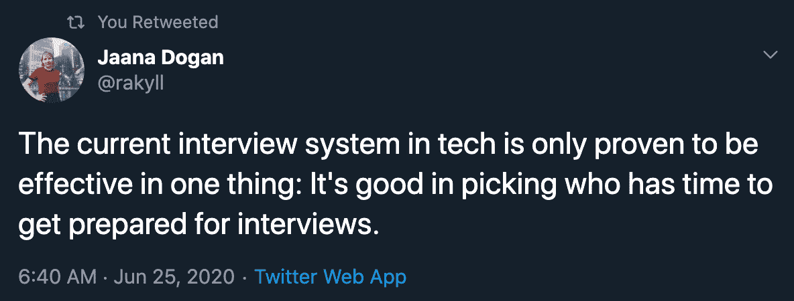
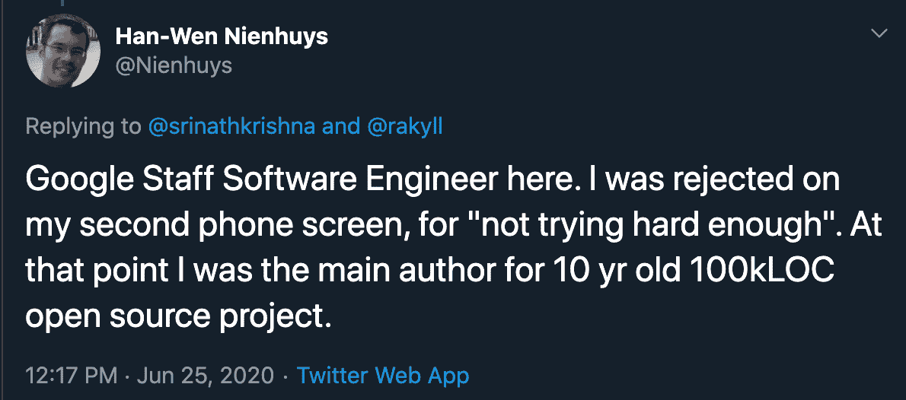

# 打破神话的竞争性编程——你不需要学习它

> 原文：<https://www.freecodecamp.org/news/mythbusting-competitive-programming/>

既然我的文章标题引起了你的注意，那么让我来深入谈谈我对竞争性编程的看法。

## 什么是竞争性编程？

竞争性编程是一项运动。你必须用快速的、消耗最少内存的代码来解决问题，并且通常*实际上是不可读的。*

它在大学生和那些试图进入大公司的人中非常受欢迎，主要是因为它有助于他们进入那些公司。不幸的是，数以百万计的人被雇佣是因为一些他们在工作中永远不会用到的知识。

## 这个系统坏了

这是另一个来自 [Hen-Wen](https://twitter.com/Nienhuys/status/1276044242855624704) 的例子:

我能想到的例子数不胜数。

家酿软件的创造者——几乎每个运行 macOS 的人都使用的软件包管理器？被拒。WhatsApp 的创始人？被脸书和推特拒绝。

这里发生了什么？这些人不够资格在这些跨国公司工作吗？

不，答案是这些人可以开发有用的工具，写出代码质量一流的优秀软件，但他们可能无法(重新)发明一种算法，在 30 分钟的时限内反转一棵二叉树。

一些最好的代码不是在 30 分钟内写出来的。即使在今天使用的 Linux 内核中编写的一些最好的算法也不是由 Linus 在 30 分钟内编写的。一些最好的 ui，比如 Stripe，并不是在 30 分钟内设计出来的。

那么，如何让某个随机公司的某个随机 HR 在 30 分钟内决定你的价值呢？

这就是公司判断你“可行性”的方式——看你能否解决一个与你过去可能做过或未来可能会做的任何工作完全无关的玩具问题。

### 这个能修好吗？

我不知道。我可以尽情抱怨和大喊大叫，但我真的不知道公司如何快速准确地评估一个申请工作的人。

如果你想快速，你会失去很多像上面提到的那些好的候选人。如果你不想失去任何优秀的候选人，面试可能会持续太长时间——超过公司的承受能力。

## 竞技编程！==真实世界编程

对公司来说，面试更像是一场考试，你必须记住和学习那些在得到工作后不会用到的东西。

你认为你可能需要学习 Dijkstra 的算法才能在谷歌地图上工作，但说真的，你认为谷歌会把他们的核心产品之一交给公司的新人吗？你认为你不会从你的同龄人那里得到任何帮助吗？

你可能会致力于产品的界面，或者分布式系统，而不是谷歌的 cor 算法。这意味着你所有的“竞争性编程”知识都没有用。

你会发现竞争性编程在现实世界中几乎没有用处。没有运行在微软生产服务器上的算法是用不可读的代码编写的，没有简短和无意义的变量名，没有文档记录，优化只是为了速度而不是可读性或维护。

缩小和性能的提高是后来才出现的，很多时候是使用自动化工具。很有可能，如果你是一个有竞争力的程序员，你已经养成了写难看代码的坏习惯。

任何人都可以为机器写代码。问题是，你能为人类写代码吗？

## 但是还有希望

参加这样的面试，并希望你能解决你准备了 3-5 个月的玩具问题，学习 DSA 和竞争性编程是一种方法。

还有另一种方法——它将与更少的公司和人员一起工作，但你会喜欢它，并在这个过程中学习许多现实世界的东西。你也将比那些只为学习“竞争性编码”而学习的人更有用。

建造一些东西。任何事。然后在此基础上建立更多。拥有强大的投资组合。拥有一整套对公司有用的技能。掌握技术堆栈——拥有它。有项目，博客，经验来证明你就是你简历中的样子。建立联系，与人交往，征求他们的建议。

在很多地方，竞争性编码并不是通过面试的唯一途径——有各种各样的人在经营各种各样的公司。一个同意我观点的人，并且正在经营一家公司，不会仅仅根据他们的“竞争”知识来雇人。

你的工作可以带你去你想象不到的地方。最简单的方法就是永远随大流。但是没有什么好事是容易的，至少如果你有足够的野心。将适量的雄心和勇气结合在一起可以创造奇迹。

这个世界需要伟大的程序员来进步，来推动人类前进，而不是那些能被雇佣的人。

## 不要混淆 DSA 和竞争性编程

我最初并不想写这个部分，但是我知道太多人会对此感到困惑。DSA -数据结构和算法是不同的东西。堆，映射，数组，向量，链表。等等，所有这些在现实世界的编程中也非常有用。

有趣的是，你也可以随着经验发展这种理解。我从未通过 50 小时的 DSA 课程明确地了解过“heap”。如果你正在学习编程，你也不需要非常非常深刻的理解。

当你想学习计算机科学，而不是编程时，需要深度 DSA。理解区别，计算机科学是理论——编程是实践。

意识到存在的事物、存在的算法和存在的数据结构。你不需要全部学习或记忆。当我可以从同事和互联网上获得一些帮助时，记忆或学习一些很少使用的东西对我来说听起来非常愚蠢。

## 我的故事

我不是一个有竞争力的程序员，可能是我大学里唯一一个从未在 T2 学院接触过有竞争力的编程的计算机科学本科生。

为什么？因为 4-5 年前试过，很讨厌。为什么？因为我可以看到自己每天花 3-5 个小时去解决那些对我毫无益处的问题。我对下一个问题略知一二，但这足以产生影响吗？这足以让你鹤立鸡群吗？

我做了什么好事？感觉我在已经解决的问题上浪费时间。可能每个人都不一样，但是当我看到其他人使用我编写的东西时，我很高兴(那时我刚开始是一名 web 开发人员)。

我只是不能忍受浪费时间去学一些我在现实世界中永远用不到的东西。我曾经参加过谷歌的代码大赛和脸书的黑客杯。但很快我就感到厌倦和沮丧，因为找不到更好的词来形容它，而且再也没有真正回去过。找工作或实习对我来说不重要，从来都不重要。

我在校园里参加过一次谷歌面试。他们有一个简历入围轮作为第一轮，不像所有其他公司的第一轮，等等，竞争编码轮。7 年的网络开发和系统经验就这样白白浪费了。

反正对于 Google 来说，我是唯一一个 GPA 7.5 入围的人(印度最高 GPA 是 10)。其余 10-15 人都在 8.5 或 9 以上。

我没有再次通过竞争轮，但这让我知道，仅凭你的简历就有可能进入谷歌这样的公司的第一轮。因此，在这方面努力是很重要的。

## 结论

TL；DR——你不需要学习竞争性编码就能在生活中获得成功。你需要学习你非常喜欢的东西，以至于你掌握了它，并且你在你的领域里是不可战胜的。仅此而已。

有看法和意见？在 [Twitter](https://twitter.com/mehulmpt) 和 [Instagram](https://instagram.com/mehulmpt) 上与我联系，让我们交谈！