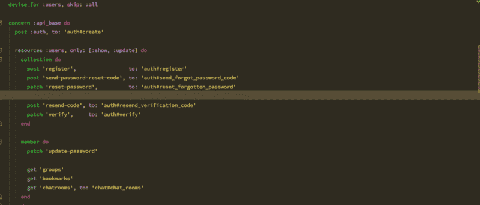

# 如何优化查询来解决 Rails 中常见的可伸缩性瓶颈

> 原文：<https://www.freecodecamp.org/news/n-1-queries-batch-loading-active-model-serializers-in-rails-72662d7736f1/>

乌萨马·阿什拉夫

# 如何优化查询来解决 Rails 中常见的可伸缩性瓶颈

#### N+1 问题的(完美)解决方案



n+1 查询问题是最常见的可伸缩性瓶颈之一。它包括从数据库中获取资源列表，其中包含其他相关资源。这意味着我们可能必须单独查询相关的资源。因此，如果您有一个 n 个父对象的列表，*将不得不执行另外 n 个查询来获取相关的资源*。让我们试着摆脱这个 O(n)难题。

如果你熟悉 Rails、[主动模型序列化器](https://github.com/rails-api/active_model_serializers)，并且已经对我们的问题有了很好的想法，那么也许你可以在这里直接进入代码[。](https://gist.github.com/UsamaAshraf/95b0c8d0d64ee193148342a931c0a423)

#### 具体的例子

假设您正在 GET 端点获取一个由 **Post** 对象组成的数组。您还想加载帖子的各自作者，在每个帖子对象中嵌入一个**作者**对象。这里有一个简单的方法:

```
class PostsController < ApplicationController    def index        posts = Post.all              render json: posts    endend
```

```
class Post  belongs_to :author, class_name: 'User'end
```

```
class PostSerializer < ActiveModel::Serializer    attributes :id, :title, :details
```

```
 belongs_to :author end
```

对于正在呈现的 n 个 **Post** 对象中的每一个，将运行一个查询来获取相应的**用户**对象。因此，我们将总共运行 n+1 个查询。这是灾难性的。下面是如何通过急切加载**用户**对象来修复这个问题:

```
class PostsController < ApplicationController    def index        # Runs a SQL join with the users table.    posts = Post.includes(:author).all              render json: posts    endend
```

#### 当简单连接不可能时

到目前为止，退伍军人绝对没有什么新鲜事。

但是让我们把这个复杂化。让我们假设这个网站的用户和帖子不在同一个 RDMS。相反，用户是存储在 MongoDB 中的文档(不管出于什么原因)。我们如何修改我们的 **Post** 序列化程序，以最佳方式获取用户？这将回到起点:

```
class PostSerializer < ActiveModel::Serializer    attributes :id, :title, :details, :author
```

```
 # Will run n Mongo queries for n posts being rendered.  def author    User.find(object.author_id)  endend
```

```
# This is now a Mongoid document, not an ActiveRecord model.class User    include Mongoid::Document    include Mongoid::Timestamps    # ...end
```

我们的用户现在驻留在 Mongo 数据库中的困境可以用调用第三方 HTTP 服务来获取用户或将用户存储在完全不同的 RDMS 中来代替。我们的基本问题仍然是，没有办法将用户数据存储与 posts 表“连接”起来，并在单个查询中获得我们想要的响应。

当然，我们可以做得更好。我们可以通过两个查询获取完整的响应:

*   获取所有没有**作者**属性的文章(1 个 SQL 查询)。
*   通过运行一个 where-in 查询来获取所有相应的作者，其中用户 id 是从帖子数组中提取的(1 个 Mongo 查询，带有一个 in 子句)。

```
posts      = Post.allauthor_ids = posts.pluck(:author_id)authors    = User.where(:_id.in => author_ids)
```

```
# Somehow pass the author objects to the post serializer and# map them to the correct post objects. Can't imagine what # exactly that would look like, but probably not pretty.render json: posts, pass_some_parameter_maybe: authors
```

#### 输入批处理加载器

所以我们原来的优化问题已经简化为“我们如何使这个代码可读和可维护”。[宇宙](https://www.universe.com/about)的伙计们拿出了一个绝对的宝石(太明显了？). [Batch Loader](https://github.com/exAspArk/batch-loader) 最近对我帮助很大。

`gem 'batch-loader'`

`bundle install`

```
class PostSerializer < ActiveModel::Serializer    attributes :id, :title, :details, :author
```

```
 def author    object.get_author_lazily  endend
```

```
class Post  def get_author_lazily    # The current post object is added to the batch here,    # which is eventually processed when the block executes.       BatchLoader.for(self).batch do |posts, batch_loader| 
```

```
 author_ids = posts.pluck(:author_id)        User.where(:_id.in => author_ids).each do |user|        post = posts.detect { |p| p.author_id == user._id.to_s }        #'Assign' the user object to the right post.        batch_loader.call(post, user)            end        end    endend
```

如果您熟悉 JavaScript 承诺，可以将`get_author_lazily`方法看作是返回一个承诺，稍后对其进行评估。这是一个不错的类比，我认为既然`BatchLoader` 使用了[惰性 Ruby 对象](https://ruby-doc.org/core-2.4.1/Enumerable.html#method-i-lazy)。默认情况下，`BatchLoader`缓存加载的值，因此为了保持响应是最新的，您应该将它添加到您的`config/application.rb`:

```
config.middleware.use BatchLoader::Middleware
```

就是这样！我们已经解决了 n+1 查询问题的高级版本，同时保持了代码的整洁，并以正确的方式使用了主动模型序列化器。

#### 对嵌套资源使用 AMS

但有一个问题。如果你有一个**用户**序列化器(主动模型序列化器也可以和 Mongoid 一起工作)，那么*将不会被*调用到延迟加载的**作者**对象，不像以前那样。为了解决这个问题，我们可以使用一个 Ruby 块并在将 **author** 对象“分配”到帖子之前序列化它们。

```
class PostSerializer < ActiveModel::Serializer    attributes :id, :title, :details, :author
```

```
 def author    object.get_author_lazily do |author|      # Serialize the author after it has been loaded.           ActiveModelSerializers::SerializableResource                             .new(author)                             .as_json[:user]    end  endend
```

```
class Post  def get_author_lazily    # The current post object is added to the batch here,    # which is eventually processed when the block executes.       BatchLoader.for(self).batch do |posts, batch_loader|
```

```
 author_ids = posts.pluck(:author_id)      User.where(:_id.in => author_ids).each do |user|        modified_user = block_given? ? yield(user) : user        post = posts.detect { |p| p.author_id == user._id.to_s }          # 'Assign' the user object to the right post.        batch_loader.call(post, modified_user)            end        end    endend
```

这是全部代码。尽情享受吧！