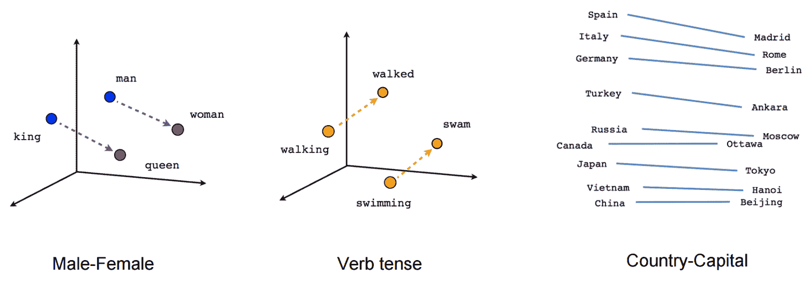
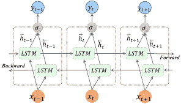
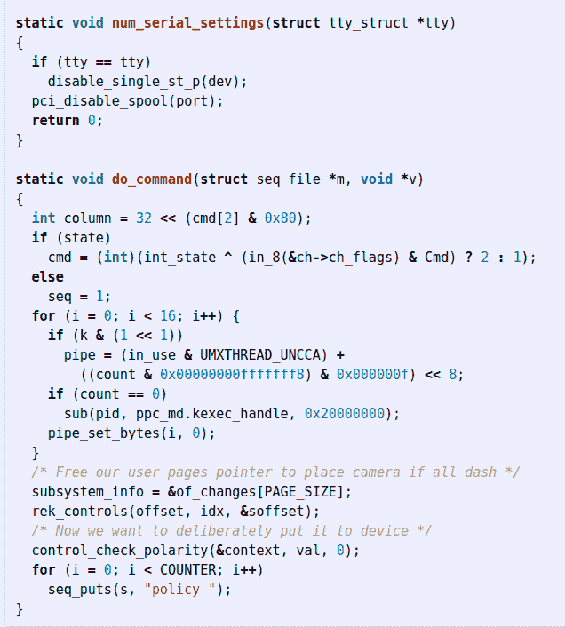

# 2020 年每个开发人员需要了解的自然语言处理

> 原文：<https://www.freecodecamp.org/news/natural-language-processing-basics-for-developers/>

开发人员总是不得不与文本打交道。那么为什么突然感觉每个人都在整天谈论 NLP、GPT 和伯特呢？

在这篇文章中，我想给你一个关于自然语言处理和机器学习领域正在发生的事情的高度概述，为什么人们如此兴奋，以及这对我们作为开发者意味着什么。

## 一点背景知识

对了，我是塔尔。在成为后端开发人员之前，我是一名厨师，后来不知何故，我开始为初创公司和银行做自然语言处理(NLP)。现在，我经营自己的 NLP 工具公司。

下面我要分享的是我作为一名开发人员、数据科学家，以及今天作为一名首席执行官与其他做 NLP 的公司一起工作时所学到的东西。

要理解今天的 NLP，你需要了解它以前是什么。而现在和以前的分界线是深度学习。所以我们先从深度学习之前的事情说起，然后再谈深度学习改变了什么。

在 NLP 的深度学习阶段，还有另一个重大转变，我们称之为语言建模。

尽管如此，如果没有深度学习实际上是什么的高层次观点，这没有任何意义。因此，我们将快速解释深度学习的基础知识，然后进入今天，已经发生的事情，以及即将发生的事情。

## 语言难在哪里

这里有一些东西需要思考:什么有四个字母，从来没有五个字母，但有时有九个字母。

那不是问题，是陈述。

单词“What”有四个字母，w-h-a-t。大多数人都会被它绊倒，因为:

1.  当我们看到一个以单词“What”开头的句子时，我们认为它是一个疑问句
2.  句尾的句号改变了大部分单词的意思
3.  我们直到最后才看到那个时期。

语言最难的部分之一是，当我们人类使用它时，我们会以某种不可思议的方式做出许多推论。这对计算机来说更难。让我解释一下。

### 推理

谷歌研究总监彼得·诺维格(Peter Norvig)在 1987 年写下了他的博士学位。它被称为[文本理解的统一推理理论](https://www2.eecs.berkeley.edu/Pubs/TechRpts/1987/CSD-87-339.pdf)。他的整篇论文基本上是关于什么是推理，为什么推理很难，以及如何实现推理。

他以一个伟大的观察开始了这篇论文:

> 人们非常善于解读文本和做出推论。当文本不够详细时，他们通常不会注意到，他们不得不做出推论来解决歧义，或者获得对文本更全面的理解。

作为人类，我们习惯于做出这样的推断，比如(错误地)推断我的例句中的 *What* 表示一个问题。

人类真的很擅长做推论。然而，计算机在这方面很糟糕。让我再举一个诺维格论文中的例子。

### 渔夫常

> 在离中国海岸不远的一个岛上建起的一个贫穷的渔村里，一个名叫张利的小男孩和他寡居的母亲住在一起。每天，小常都勇敢地带着网出发，希望能从海里抓几条鱼...

对你来说，很明显有一片海环绕着这个岛，形成了中国的海岸，村民们用它来捕鱼。

但是文本中没有提到这些信息。去吧，重读一遍。一旦你确信它不存在，想想这个:你怎么能指望计算机从文本中找出这些事实？简而言之，这就是 NLP 的难点所在。

## 深度学习改变了什么

2000 年代中期，当我作为一名开发人员步入成年时，“机器学习”和“大数据”成了流行词汇。我们开发人员熟悉并喜爱的系统，如 Elasticsearch 和 Google，应运而生。

想想谷歌的搜索界面。它所要做的就是接受用户的文本输入，并推断出用户想要什么。谷歌做得越好，他们赚的钱就越多。

谷歌的工作有很多艰难之处，但我想重点谈谈其中的两个。

首先，就计算机而言,“单词”只是一个符号，没有任何意义。

第二，一个单词是不够的——有时用户的意图要用一个完整的短语来表达，而用一种容易理解的方式来处理这个问题是很困难的。

举个例子，让我们在谷歌上搜索特蕾莎修女的母亲

谷歌不得不推断“特蕾莎修女”是一个单一的实体，是一个特定的人，她有一个“母亲”，这是一个与她有关的人。这意味着他们需要将用户的查询作为一个整体来处理，并找出每个单词和短语的正确含义。

你将如何着手做那件事？在深度学习之前不是不可能，但这是只有博士才能做到的事情。但是今天它非常简单，所以让我们看看有什么变化。

### 意义

2013 年，谷歌的一个团队发布了 Word2Vec 算法。前提基本上是:

*   我们需要一种方法来联想单词的意思
*   电脑不擅长处理像文字这样的符号
*   但是他们非常擅长处理数字
*   可以用一堆数字来表示一个词的意思吗？

Word2Vec 是一种算法，它计算出单词的含义，并以一串数字的形式向计算机表示它们。

更正式的说法是“一串数字”是一个*向量*(word 2 中的 Vec**Vec**)。当你把“一堆数字”想成“向量”时，你可以使用各种数学功夫让向量做你想做的事情。

Word2Vec 的重大技术突破是它给出了一个特定的“功夫形”，即一种算法，以有效和可用的方式捕捉单词的含义。

另一个同样重要的突破是演示在当时令人兴奋。

例如，你可以加减这些向量，因为它们是数学上的东西，结果会很直观。比如“国王-男人+女人=王后”

Words represented as vectors. These demos made Word2Vec compelling for a large audience

### 蜜蜂

Word2Vec 为研究单个单词的含义铺平了道路，但深度学习又改变了我们研究语言的方式。深度学习给了我们方便的 API 来处理任意长的序列，如短语、句子和段落。

在深度学习之前，当开发人员想要在上下文中分析单词时，他们会编写函数来分析之前的单词、之前的单词、接下来的单词等等。

他们可能会为每个单词编写多种功能，如“下一个单词是否以大写字母开头”和“在这个单词前两个单词是动词吗”。

这不仅是一个费力且难以维护的过程，而且对性能有着惊人的影响。

Chris Manning 有一个视频(我找不到了)，他在视频中指出，深度学习之前的解析器的主要性能障碍是将所有功能(这些功能的结果)加载到 CPU 缓存中。它们太多了，以至于你从来没有缓存命中。

那么深度学习改变了什么？它不再需要手动描述和编程序列中单词之间的交互。

取而代之的是，我们现在有一些 API，它们将一系列单词(或向量)作为输入，并返回一个已经按照我们想要的方式处理过的序列。

我们不得不编写 1000 个函数并为每个单词存储一百万列来分析一些文本的日子已经一去不复返了。今天，一个序列进入，一个序列带着我们想要的东西出来。

但是这是怎么发生的呢？我们需要几段关于深度学习的内容来理解。

## 3 分钟深度学习

为了让计算机更容易了解数据，我们需要用一种计算机容易分析的方式来表示数据。

Word2Vec 是朝着这个方向迈出的一大步，因为它让我们从单词的符号表示变成了向量表示，即计算机可以进行数学运算的一组数字。

深度学习模型只是我们对输入向量进行的数学运算的流水线。最酷的部分是我们在管道中前进和后退。

为了让深度学习模型学习，我们将输入放在管道的开始，并运行它直到结束。该模型将完成一些数学运算并计算出一个结果。

然后我们倒退，我们将模型的结果与真实情况进行比较，并计算出模型错误程度的分数(称为损失)。深度学习的学习部分是利用优化算法，使损失尽可能小。

那么，我们的渠道中有什么变化来优化分数呢？假设我们有一个输入 X，我们的管道是“X 乘以 *a* ，然后加上 *b”。*在优化过程的每一步，我们都会修改 *a* 和 *b* 来降低损失，从而获得更好的预测。

事情是这样的，我们会有成千上万甚至上百万个*a’*和*b’s*，我们可以做比乘法和加法更好的事情。我们称这些 *a 的*和 *b 的* 参数，它们越多，我们的模型就越“有表现力”，它就越能学习。

A deep learning "pipeline" showing how a sequence is processed from both left to right and right to left

现在，如果你问自己如何找到最佳的管道或模型，我有好消息告诉你。机器学习是一个非常开放的领域，大多数最先进的模型都是开源的，只需几行代码就可以运行。

听起来很神奇，对吧？那么有什么问题呢？

## 标记数据是深度学习的隐性成本

深度学习模型通过查看带有一些标签的例子来学习，这些标签表明我们希望它们预测什么。

如果我们想制作一个模型来预测产品评论的情绪，我们需要通过向它显示评论和人类给它的情绪分数来训练模型。

问题是深度学习模型需要大量标记的数据，而且这些数据必须是好的。模型的表达能力越强，参数越多，训练所需的标记数据就越多。

这是一个如此大的问题，以至于我个人从一名数据科学家转变为一家[文本注释工具](https://www.lighttag.io/)公司的创始人。

特别是在 NLP 中(与视觉相反)，做注释的人需要是领域专家，他们很贵，而且不认为注释是他们喜欢做的事情。

我们为他们提供工具，在内部有效地标记他们的数据。虽然我们服务于一个利基市场，但外包注释的市场甚至更大，估计每年花费数十亿美元。

也就是说，被标记的数据是一个瓶颈，一个成本中心，而且往往是深度学习的进入壁垒。减少这一障碍，降低 NLP 深度学习的人力成本，是最近一直在进行的事情，也是我们接下来要讨论的内容。

## 2018 年至 2020 年的 NLP

我正在训练我儿子上厕所。我们现在的情况是，当他有了第一名时，他可以给我们发信号，而我们的计划是，一旦他掌握了第一名，他就能够将这种掌握转移到第二名。我认为这将是更容易，更干净，如厕训练他在这个顺序。

NLP 过去两年的主要趋势就像我儿子的便壶训练，我们可以在一个简单的任务上训练模型，并将知识转移到一个更高级的任务上。

但就像我之前说的，获得标记数据是昂贵的，所以我们不想在我们不关心的任务上训练模型，因为我们仍然需要为注释付费。

如果我告诉你，我们可以在一些任务上预先训练我们的模型，在这些任务上我们可以免费获得无限的标记数据，会怎么样？

### 语言建模

你知道有些人是如何亲密到可以完成对方的句子吗？他们能做到这一点是因为他们非常了解这个人和这门语言。

事实上，他们对另一个人的想法和说话方式有一个心理模型。

如果我们有一个用于 NLP 的深度学习模型，它已经知道人们如何说话和写作，并可以为他们完成他们的句子，那么学习一些特定的语言任务就会容易得多，比如找出评论的观点。

从感知人们如何说话开始的深度学习模型将能够在学习新任务时使用这些知识。就像我儿子掌握了第一后会更擅长第二。

我们如何得到一个模型来学习人们如何说话和写作？很简单，我们取一些文本，然后让模型预测下一个单词是什么。

这项任务被称为“语言建模”，做好这项工作需要具备许多你不会想到的能力，比如理解语法、计数和跟踪相距很远的单词之间的关系。

让我对 NLP 真正感到兴奋的一篇博文是 Andrej Karpathy(现任特斯拉人工智能负责人)在 2015 年写的“递归神经网络的不合理有效性”。

在这篇文章中，Karpathy 建立了一个 Linux 源代码的语言模型。他从 Linux 的 github 中取出所有代码，让模型看几个单词，然后让它预测下一个单词。

当他拿走那个模型，并在循环中使用它来生成新文本时，我惊讶得目瞪口呆。他让模型预测下一个字母，然后一次又一次地反馈给模型。该模型输出如下所示的代码:

Code generated by a language model in 2015\. Notice the indentation and use of comments

虽然上面的代码没有编译或做任何有用的事情，但它确实表明了语言模型可以学习很多关于语言如何使用的知识。这不仅仅是一个噱头——你见过的一些人工智能驱动的代码完成工具就是这样工作的。

### 类固醇语言建模

从 2015 年到今天，NLP 已经将语言建模的想法发挥到了极致。

2018 年，[发表了一篇论文](https://arxiv.org/abs/1801.06146)，展示了如何在给定数量的标记数据下，持续使用预训练的语言模型来大幅提高模型的性能。

不久之后，NLP 领域出现了大量新的预训练模型，一个比一个好。你可能听说过伯特、XLNet、GPT 1、2 和 3 等型号。

所有这些模型都遵循语言建模的基本概念，每个模型都有一些技术上的变化。但它们的真正意义来自两个因素。

首先，他们在越来越大的数据集上被训练成越来越大的模型。2018 年问世的 BERT，[花费了 6800 美元](https://syncedreview.com/2019/06/27/the-staggering-cost-of-training-sota-ai-models/#:~:text=Google%20BERT%20%E2%80%94%20estimated%20total%20training,11%20natural%20language%20processing%20tasks.)进行训练，而尚未公开发行的 GPT3 花费了 1200 万美元进行训练。

第二，这些预先训练好的模型作为开源软件向公众发布(GPT3 没有发布，这是一个例外)。这些预先训练好的模型大部分已经公开发布，并包装在方便的开源库后面，如 [Huggingface 的变形金刚](https://huggingface.co/transformers/)。

对于那些只想使用最新的自然语言处理技术，并在不标注大量数据的情况下获得结果的开发人员来说，这些模型的开放性和可用性改变了我们的工作方式。

## 接下来会发生什么？

流传最广的 NLP 演示之一是 GPT3 从自由文本生成 React 代码。

[https://www.youtube.com/embed/RyiWFbSdk78?feature=oembed](https://www.youtube.com/embed/RyiWFbSdk78?feature=oembed)

GPT3 Generating React Code

这是否意味着我们中的一些人将很快失业？这些新的 NLP 模型还能自动化掉什么，会有什么新的东西因为它们而产生？

我不知道，NLP 的历史是 60 年来对突破和局限的错误预测。

当我作为一名数据科学家工作时，我经常与我们的非技术业务利益相关者分享我的工作成果——那些资助我工资的人。

作为一名大三学生，我经常分享技术上令人兴奋的结果，但我的利益相关者不在乎。如果他们看到一个愚蠢的错误，他们会认为这个模型是愚蠢的，不可用的。

我们称这些错误为“咆哮者”,因为它们让我们的利益相关者对我们咆哮。

Google Translate giving a Howler

对于公司和在公司工作的开发人员来说，这些新的 NLP 模型的价值取决于企业是否能够信任该模型来做所需的事情。

令人惊讶的是，GPT3 可以创建 React 代码，但您会信任它来生成您的支付网关，甚至生成安全的登录表单吗？

我认为 NLP 的进步使它更容易被人们和公司使用，更容易使用，也更便宜。

但是 NLP 不是免费的午餐，也不是万灵药。你仍然需要努力制定你的任务，为 NLP 获得[标记的数据，并检查你的模型是否在做你想要它做的事情。](https://www.lighttag.io/how-to-label-data/)

## 如何了解更多

如果你已经走了这么远，我很荣幸，你一定对 NLP 和深度学习很好奇。

尽管这篇帖子都是关于深度学习和 NLP 的，但我认为之前的方法是值得了解的。通常情况下，它们比更现代的方法更容易使用，并完成工作。

即使他们不这样做，就像我儿子接受如厕训练一样，我认为从简单的开始更容易。因此，本着这种精神，我想分享一些我最喜欢的资源。

*   丹·茹拉夫斯基的前五章和[詹姆斯·马丁的演讲和语言处理](https://web.stanford.edu/~jurafsky/slp3/)是对经典方法的精彩介绍。
*   Scikit-Learn 的文本分析教程提供了大量练习，可以让你快速获得胜利，并感受基本自然语言处理的机制
*   我认为开发人员在文本方面面临的一半 NLP 问题都可以用正则表达式来解决。如果你还不是一个正则表达式忍者， [RegexOne](https://regexone.com/) 是一个令人惊叹的教程。
*   [深度学习的自然语言处理](https://web.stanford.edu/class/archive/cs/cs224n/cs224n.1194/)是严谨、彻底和动手的，是一种令人惊叹的方式来感受我们在这里讨论的高级主题。这是一项巨大的时间投资，但非常值得。

感谢阅读！你可以查看我的公司 [LightTag](https://www.freecodecamp.org/news/p/3c94d59f-9169-42ef-b4fd-4d2feb9e51dd/lighttag.io) 并在 [twitter](https://twitter.com/thetalperry) 上关注我。

## 链接

*   彼得·诺威格的 D 是一个段落
*   原文 [Word2Vec 学术论文](https://arxiv.org/abs/1301.3781)
*   [文本分类通用语言模型微调](https://arxiv.org/abs/1801.06146)
*   [BERT:用于语言理解的深度双向转换器的预训练](https://arxiv.org/abs/1810.04805)
*   [拥抱变形金刚](https://huggingface.co/transformers/)
*   [训练 SOTA 人工智能模型的惊人成本](https://syncedreview.com/2019/06/27/the-staggering-cost-of-training-sota-ai-models/#:~:text=Google%20BERT%20%E2%80%94%20estimated%20total%20training,11%20natural%20language%20processing%20tasks.)
*   [概括机器翻译的历史](http://www.hutchinsweb.me.uk/Nutshell-2005.pdf)
*   [如何标注数据](https://www.lighttag.io/how-to-label-data/)