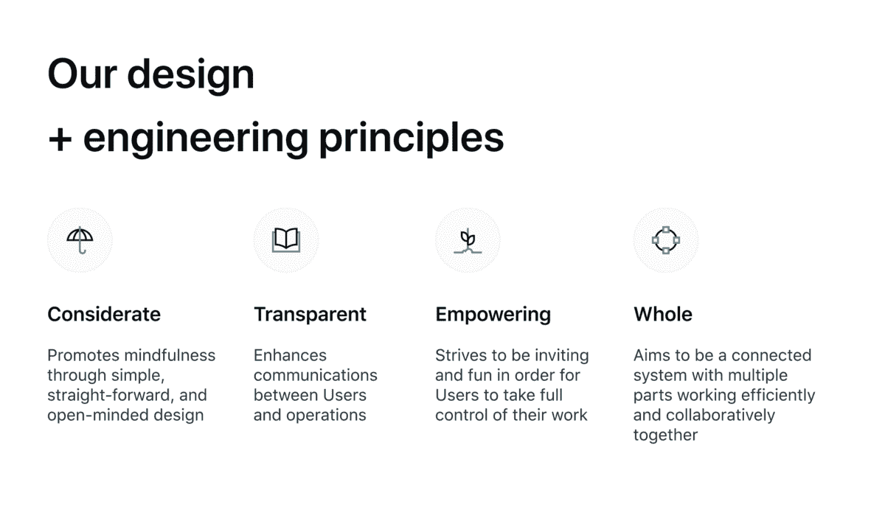
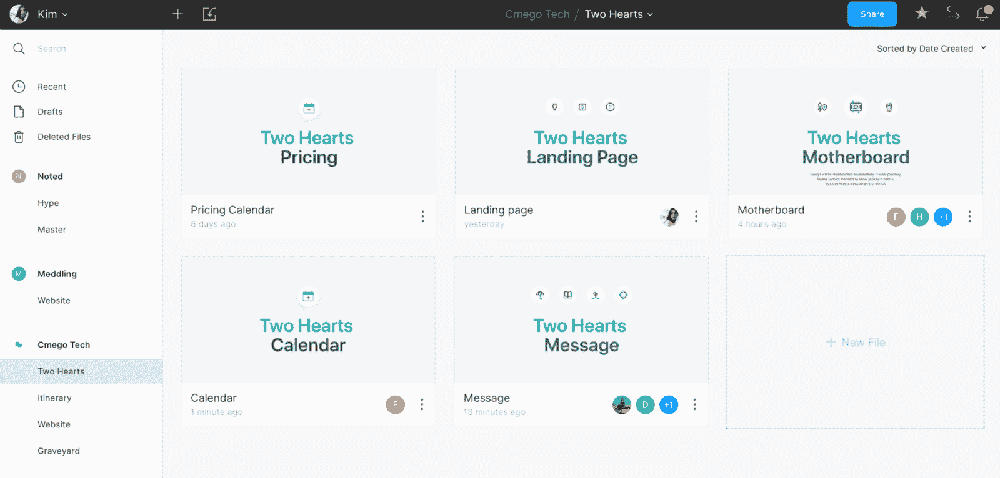

# 作为一名自学成才的设计师，我在产品桌前导航。

> 原文：<https://www.freecodecamp.org/news/navigating-my-seat-at-the-product-table-as-a-self-taught-designer/>

**两年前，我从医学转投** [**重新设计 Instagram**](https://medium.com/free-code-camp/i-wanted-to-see-how-far-i-could-push-myself-creatively-so-i-redesigned-instagram-1ff99f28fa8b) **。**

三个月后，我把能装进我的随身行李和两个搬家箱子里的东西打包，飞往西贡，成为克里斯蒂娜的第二个产品设计师。快进到今天，我现在是他们的产品主管。

我仍然记得我工作中的第一个任务:为我们导游的新头盔制作颜色样本。这听起来可能是一个简单的壮举，但在尝试了数百种颜色组合并了解了一些颜色理论后，我对结果感到非常自豪。

随着 Christina 的团队成员从 100 人增加到 450 多人，遍布越南各地，我的职责也随之增加。从导游头盔到重新设计该公司的旗舰通讯应用程序，再到推出该应用程序供世界各地的 Airbnb 主机使用，这是一次疯狂(但有趣)的经历。

当我期待着下一次回美国的旅程时，我想通过分享我作为一个对产品设计和技术一无所知的人一路上所学到的东西来反思我的经历。

让我们明确一点——我仍然觉得自己一无所知。我只是知道*比前一天少了一点点什么都没有*。

* * *

## 招聘时要相信自己的直觉。

如果你、你的团队和你的文化都是同一个调子——你**会**知道候选人是否合适。根据经验，在评估候选人的技能后，我的首要问题是:

> *“这个人怎么让我* ***觉得*** *？”*

我参加任何面试的目的都是为了更好地了解候选人，而不仅仅是他们简历上的内容，以及他们和我一起来到这个房间的动机是什么。如果我离开面试时比进去时感到更加困惑和矛盾，这可能是一个好迹象，表明这个候选人不是我要找的人。如果我离开房间时感到充满活力和兴奋，她/他很可能是一个守护者。

雇佣一个你愿意与之共事的人，最重要的是，相信你的直觉。

## 在表达你的价值观时要始终如一。

从创建线框到领导一个开发团队，我知道尽早建立我们的设计和工程原则是很重要的。它有助于指导我们做出产品决策，检查开发过程中的权衡，并使我们团结成一个更强大的团队。

*Our team’s north star ?*

我们测试原则的一个例子是，当我的首席技术官修复了一个漏洞，却让它在几分钟内给我们的用户发送了数百条推送通知。

我向我的 CTO 建议，他应该写一个帖子来体谅我们的用户，承担责任，并解释发生了什么，以便我们的用户可以通过我们的即时透明感同身受。这也将是我们的初级工程师可以学习的领导方式。他做到了。

他的帖子没有受到任何反对，而是获得了赞和心眼表情符号。我们的原则不仅成为我们作为一个团队进行沟通和开发产品的模式，而且还为我们与用户建立信任关系开辟了道路。

> 不言而喻，领导者最好是通过他们的行动来领导，而不仅仅是通过他们所说的话。

现在无论何时出现 bug(不说它经常发生)，[我们的用户对它更加宽容和理解](https://en.wikipedia.org/wiki/Desensitization_%28psychology%29)。不仅如此，我们团队中的其他工程师也开始以他为榜样，对自己的失误负责。

## 不要低估 1:1 会议的力量，因为它们非常非常重要。

无论你是一名设计师还是一家公司的首席执行官，一对一会议将永远是与你的团队建立个人联系的面包和黄油。我和我的工程师每周召开 1:1 会议，对我们的产品状态和未决特性进行质量保证。对我的工程师来说，这可能只是例行的产品质量保证。对我来说，这是一个完美的机会窗口，让我从个人层面了解他们，解决他们可能存在的问题，并提供见解，帮助他们在工作中找到更多价值。

如果你在寻找导师或职业发展，我建议安排与你的团队领导一对一的会面。首先，它显示了主动性。第二，你可能会惊讶于你得到的反馈和支持。在联系之前，确保你明白你的会议目标是什么。是为了了解你在自己的岗位上表现如何？是要求额外的远程日吗？在弄清楚你的目标是什么之后，**确保传达它**。这将有助于给你的团队领导充足的时间来准备和保持会议的重点。

## 创建一个过程很好，但是保持灵活性更好。

创建流程，但**计划中断**。这可能意味着两件事之一。第一，你创建的过程没有按预期运行。第二，您创建的过程是有效的，但是它最终在不断发展的开发过程中被丢弃了。对于处于[高速增长阶段](https://hackernoon.com/navigating-the-stages-of-hyper-growth-6201d65eaaa8)的初创公司来说尤其如此，那时你会有许多跨职能团队一起工作来生产和发布产品。当这种情况发生时，你必须能够快速转换，采用新的[心智模型](https://fs.blog/mental-models/)，同时推进整体产品愿景。

因此，与其寻找一个常青的过程，不如让你的实现和迭代过程变得常青。

## 菲格玛是国王。

这篇文章不是由 Figma 赞助的，但是我认为这是一个很好的机会，让我给这个了不起的团队(和产品)一个大声喊出来。在 Figma 之前，我们在 Christina 的设计团队使用 Sketch 进行设计，Zeplin 用于交付，而 Abstract 用于版本控制。有很多工具，但我们已经找到了适合我们的流程。Figma 的设计和协作方法引起了我的兴趣，我决定亲自测试一下这个工具。

有了 Figma，设计到开发人员的交接几乎瞬间完成。除了速度和效率，我们还节省了大量资金，因为不必使用多个软件来维护我们的设计系统、版本控制和移交。从那以后，我们整个产品团队都转而使用 Figma，从此我们再也没有回头。

Thanks Figma ✌?

## “工作政治将永远是一件事，但这并不意味着你必须成为其中的一部分。”

在一次午餐谈话中，我告诉首席运营官我不想接受晋升为产品总监的理由后，他对我说了这句话。

由于我之前的角色是产品设计师/所有者，我能够影响商业决策，解决问题，并专注于在幕后开发产品，不受政治影响。然而，当他对我说这句话时，我意识到这与情况或环境无关，而是我选择如何应对(或不应对)。

更重要的是，他让我意识到，我的新角色只会让我更好地粉碎任何办公室政治(用我的杀手休息脸)，强化我们的核心价值观，并进一步保护我们共同建立的积极和授权的文化。

## 尽早开始建立你的个人资本。

简而言之，人物角色是目标受众或个人的代表。研究表明，初次见面时，人们大约需要 3 秒钟来形成对你的印象。有时甚至在你开口说话之前。现在，从你每天可能与同事、客户和商业伙伴进行的所有微观互动的角度来考虑这个问题。再加上即兴的垃圾信息、随机的走廊交流、办公桌旁的拜访、会议和公司活动——现在你已经给了每一个你接触过的人无数秒钟来形成他们对你的看法。

你想成为什么样的团队成员？你希望人们认为你是什么样的领导？你想因为什么而出名？在你加入任何团队或公司之前，请回答这些问题——否则别人会替你回答。

> 如果你想被认为是一个有能力、可靠、自信的人——展现你的能力，抓住每一个机会。

一旦你建立了你的角色资本，当你与利益相关者沟通、影响关键决策、与跨职能团队合作时，它将成为你最有价值的资产之一。

## 冒名顶替综合症从未真正消失，但它变得更容易了。

加入克里斯蒂娜公司几个月后，我和我的首席技术官进行了一次坦诚的交流。我告诉他我觉得自己像个骗子。我告诉他，我觉得到目前为止我所取得的一切都归功于运气。我从未接受过任何正规的设计教育，这也没什么帮助。我害怕有一天我会被揭穿是个骗子。我坦率地说出了我的个人评估，老实说，终于大声说出来了，感觉真好。

他接下来说的话让我震惊:

> 他告诉我他也有同样的感觉。

我不敢相信，我能想到的只有…真的吗？这让我意识到，这种所谓的冒名顶替综合症是完全正常的，它可能发生在任何人身上，无论年龄、性别和经历如何。如果有的话，这只能说明你是一个谦虚的人，对自己有很高的期望。

那次交流已经过去几年了，从那以后，我越来越不觉得自己是个骗子。如果你感到不安全，和你信任的人分享。这会有助于减轻一些负担和负罪感。

我要补充的一点是，只要你出现，投入工作，并致力于不断学习，随着时间的推移，事情只会变得更容易。

记住，你已经赢得了你的席位。你现在唯一需要说服的人是你自己。

### “对你最苛刻的批评家永远是你自己。不要忽视那个批评家，但是不要给它过多的关注。
——[迈克尔·伊恩·布莱克](https://www.brainyquote.com/quotes/michael_ian_black_494912)