# 用贝塞尔曲线拉长

> 原文：<https://www.freecodecamp.org/news/nerding-out-with-bezier-curves-6e3c0bc48e2f/>

纳什·韦尔

# 用贝塞尔曲线拉长

在过去的几天里，我一直在尝试编写自己的小 JavaScript 动画库。我知道我知道没有人真正关心一个新的动画库，但嘿，关键是，在这个过程中，我偶然发现了贝塞尔曲线。我花了几个小时进行研究，试图理解它们，在此期间我看到了这篇新文章——“贝塞尔曲线背后的数学直觉”，这也是这篇文章的灵感来源。这是数学，似乎是针对聪明的人，所以我有一个艰难的时间来包装我的脑袋周围的概念。但是，幸运的是，最终我做到了，这让我学到了一些关于贝塞尔曲线的很酷的新东西，我很高兴与你分享。

#### 你将会学到什么

我将从介绍曲线开始，它们是什么，为什么它们很酷，它们的数学表示。不过，不要担心数学，老实说，我有点不擅长数学，所以我必须想办法向自己解释，我相信这些方法也会对你有用:)。

接下来，我们将移动到贝塞尔曲线。它们是什么，以及它们的不同之处。他们的数学公式。

最后，我们将用 JavaScript 和 SVG 构建自己的小贝塞尔曲线绘制引擎。多酷啊。

### 曲线

我不需要在这里给出曲线的正式定义，对吗？所有这些线都是曲线，看看它们

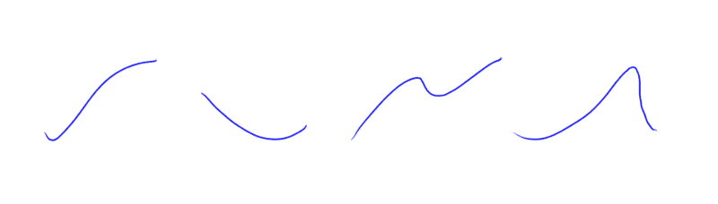

Curves, curves all curves

曲线很可爱，它们可以代表很多东西。例如，下面的曲线显示了一段时间内我的 Twitter 关注者的数量。

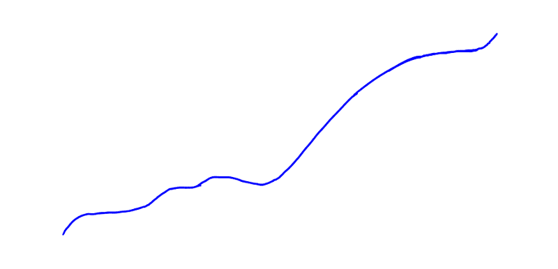

好吧，好吧，这看起来像一个随机涂鸦线。让我补充一些背景。

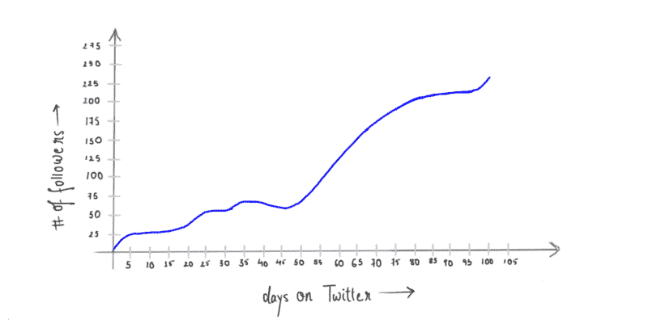

Excuse my handwriting

它现在应该能更好地说明它代表了什么。横轴是我加入 Twitter 以来的天数，纵轴是我获得的关注者数量。

我在 Twitter 上的第一天，我有 0 个追随者，然后慢慢增加，我失去了一些，增加了一些，然后在后半段，你可以看到我增加了一些新的追随者。这不是我们能从这条曲线中解读出的唯一信息。我还可以找出我在任何一天的追随者的确切数量。这只是画两条线的问题。

比方说，我想知道我在第 60 天有多少追随者。

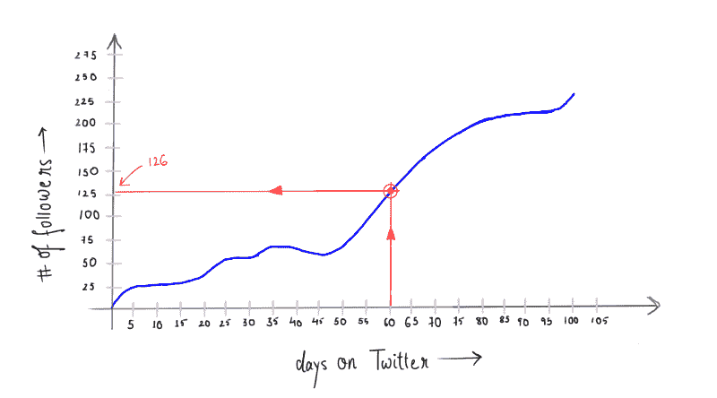

我从横轴上的 *60* 画一条垂直线，然后从这条线与曲线的交点画一条水平线。这条水平线与纵轴(带有追随者数量的轴)相交于一点。纵轴上该点的值给出了我在第 60 天拥有的追随者的确切数量，即 126。

现在，两条红线相交的地方就是所谓的**点**。在二维图上，就像我们的 Twitter followers 图，一个点由两个值唯一标识，它的横坐标( *x* 和纵坐标( *y* )。因此，只需写出 *(x，y)* 来表示一个点。在我们的例子中，两条红线相交的红点可以写成 *(60，126)。*

**(60 = x/横坐标，126 = y/纵坐标)**

好了，对于点是什么，你已经知道了。先说曲线，哪个*其实*是很多这样的点的**集合不是吗？**

你得到一组数据，比如第 0 天 0 个追随者，第 1 天 50 个追随者，第 10 天 76 个追随者...第 100 天 500 追随者…等等。您将这些数据转换成点(0，0) (1，50) … (10，76)…(100，500)...你在图上画出点，把它们连在一起，就有了一条曲线。

所以，对于一条曲线，你需要点，对于点，你需要相应的 x 和 y 值。所以，现在在这里密切注意，一条曲线可以用一个能为我们吐出 x 和或 y 值的东西来唯一表示。这个“某物”就是我们在数学中所说的*函数。*

数学中有很多标准函数。考虑*正弦*函数。

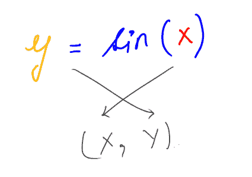

在像这样的函数中，x 的选择是我们的。我们给它一个 *x* ，它给我们一个 *y* 。我们一起形成一个点(x，y)。我们给它另一个 x，它给我们另一个 y，以此类推，我们最终得到一个点的集合，我们绘制它们，得到一个独特的形状。

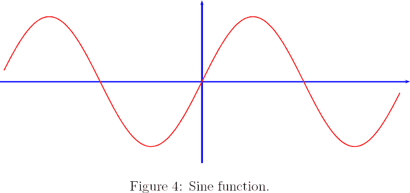

Source: [http://forum.kerbalspaceprogram.com/index.php?/topic/69707-sine-graphs-and-orbital-paths/](http://forum.kerbalspaceprogram.com/index.php?/topic/69707-sine-graphs-and-orbital-paths/)

功能也可以用*参数形式*表示。在参数形式中，我们不需要像前面例子中的(x)那样提供点坐标的一部分。相反，我们提供一个参数/变量，通常写为 *t* ，对于每一个 *t* ，我们都得到 *x* 和 *y* 坐标，简而言之，我们提供一个 *t* 我们得到一个点。

当我们谈论贝塞尔曲线背后的数学时，你会想知道什么是参数形式。

### 贝塞尔曲线

贝塞尔曲线是非常特殊的曲线。他们背后的数学和思想让我震惊，你也应该准备好被震惊。

既然你正在读这篇文章，我假设你是一个设计师或开发人员，并且以前处理过 Bezier 曲线，尤其是三次 Bezier 曲线，我们将马上讨论什么是三次 Bezier 曲线。现在这些曲线被用在各种地方，创建矢量图形，动画路径，[动画缓和曲线](http://cubic-bezier.com/) e.t.c 只是因为它们是如此的**容易控制**。你不需要知道很多数学知识，一点都不需要，就可以随心所欲地弯曲这些曲线。想想看，如果贝塞尔曲线不存在，人们必须为曲线想出独特的数学函数，比如说画像字体这样的矢量图形，这当然是一场噩梦。

#### 数学？

好了，该做点数学了。我将从贝塞尔曲线的一般公式开始，乍一看这很令人生畏，但我们会想办法通过的。

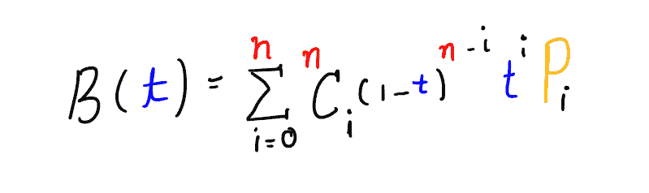

General formula for Bezier curve of degree n

“哇哦！哇哦！哇哦！爱因斯坦！”。嘿，等等，别轻点。很简单，你看，我弄得这么多彩？。

让我们开始分解这个公式。你可以跳过你已经知道的部分。

#### B(t)

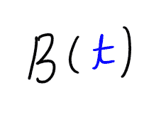

因为这是一条 T2 曲线。正如前面关于曲线的参数形式的文章中提到的， *t* 是一个参数。你插上 *t* ，出来 *x* 和 *y* ，一个点。我们很快就会看到上面的等式是如何工作的。这里值得一提的是，对于贝塞尔曲线， *t* 的值应该在 0 和 1 之间，包括 0 和 1。

#### Σ / Sigma

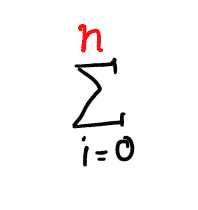

这个符号，σ，在数学上叫做求和算子。它的工作方式是这样的，这个符号的右边是一个包含变量 I 的表达式，I 只能保存整数值。在符号的顶部和底部，我们写下 I 的极限，对于 I 的每个值，右边的表达式被求值并加到总数中，直到 I 达到 n。

这里有一些例子。

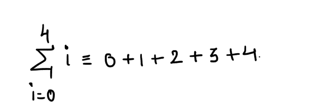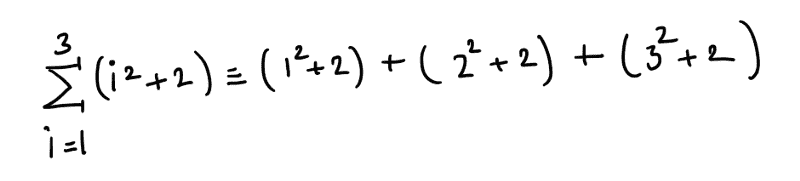

只是用较短的符号来表示较长的东西。

好的，看起来西格玛没问题了。

#### 美国国家癌症研究所

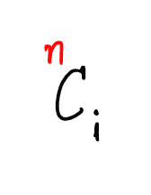

这里的这个 *C* ，是来自排列和 **C** 组合的 C。让我们上一堂即兴组合课，好吗？现在，在公式中，这部分就是所谓的二项式系数。nCi 的读法是这样的，n *选择* i .也就是说给定 n 个物品在多少种方式中你可以从中选择 I 个物品(n 总是大于等于 I)。好吧，这可能没有太大的意义，考虑这个例子:我有三个项目一个圆形，一个正方形和一个三角形。因此在这里，n = 3。有多少种方法可以从 3 个项目中选择 2 个(i = 2)。用数学语言来说就是 3C2 ( 3 选 2)。答案是 3。

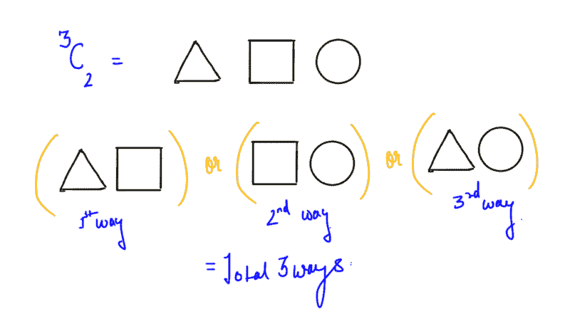

同样的，

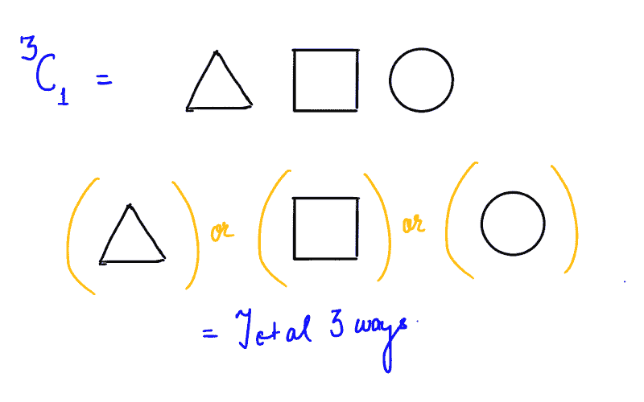

而当 I 为 0 时，只有一种方法可以从 n，1 中选择 0 项，也就是根本不选。

不是画草图，对一个给定的组合表达式算出答案，而是有这个一般化的公式。

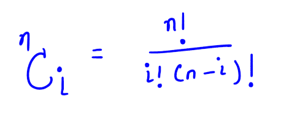

#### P sub i

这是重要的一点。在贝塞尔曲线的一般公式中有 t，I 和 n。我们还没有真正触及 n 是什么。n 就是所谓的贝塞尔曲线的次数。n 决定了贝塞尔曲线是线性的，二次的，三次的还是其他的。

您看，如果您以前使用过钢笔工具，您可以在两个不同的位置单击以创建两个不同的点，然后使用手柄控制两点之间形成的曲线。贝塞尔曲线总是有至少两个锚点，其余的是用于控制曲线形状的控制点。此外，你所谓的手柄只是由一条线连接到一个锚点的控制点，它们只是为了提供一个更好的心理模型。因此，当您调整手柄时，实际上您只是在更改控制点的坐标。

A cubic Bezier curve

让我们抛开所有的附属品，专注于核心。

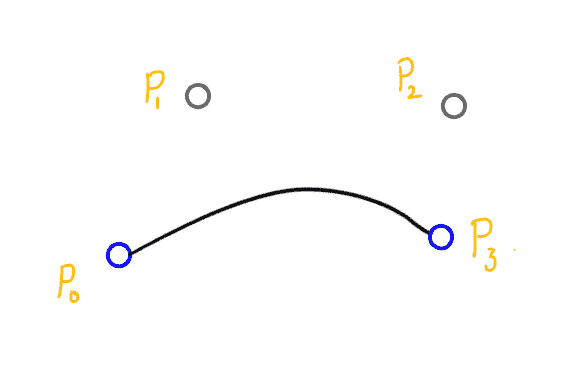

Cubic Bezier curve

你在上图中看到的曲线是一条*三次贝塞尔曲线，*或者换句话说，上面显示的贝塞尔曲线的次数是 3，或者在贝塞尔曲线的一般公式中，你插入 n = 3。

n = 1 给你一个线性贝塞尔曲线，有两个锚点 P0 和 P1，没有控制点，所以它本质上是一条直线。

n = 2 给出一条二次贝塞尔曲线，带有两个锚点 P0 和 P2 以及一个控制点 P1

类似地，n = 3 给出了一条三次贝塞尔曲线，它具有两个锚点 P0 和 P3 以及两个控制点 P1 和 P2。n 越高，可以画出越复杂的形状。

现在，我们将从一般方程中形成三次贝塞尔曲线的方程，包括在一般公式中代入 n = 3。我们将得到的方程将在变量 *t* 中，如前所述，这个变量的值在 0 和 1 之间变化。此外，对于方程，我们将需要 4 个 pi(读:小便眼)P0，P1，P2 和 P3。这些点的选择取决于我们，毕竟当我们绘制矢量图形时，比如说使用钢笔工具，我们选择锚点和控制点的位置，不是吗？更改后，我们的三次贝塞尔曲线方程看起来像这样。

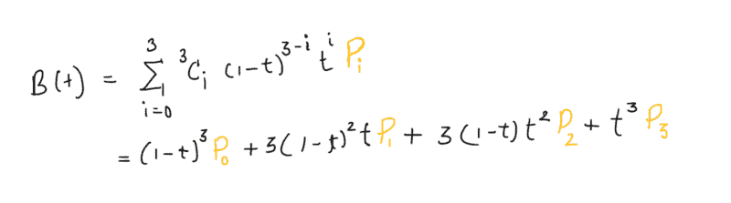

Expanded equation for a Cubic Bezier curve

这里我们用了一点简洁的方法，实际上每个点(P)都有两个坐标 x 和 y，当把 t 传递给一般方程时，我们应该得到一个也有 x 和 y 坐标的点。因此，我们可以将上面的等式写成

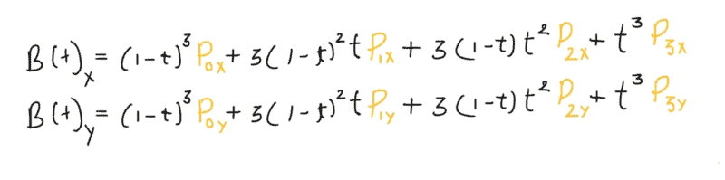

Expanded equation for Cubic Bezier curve

你将会见证这些方程的一些特别之处。

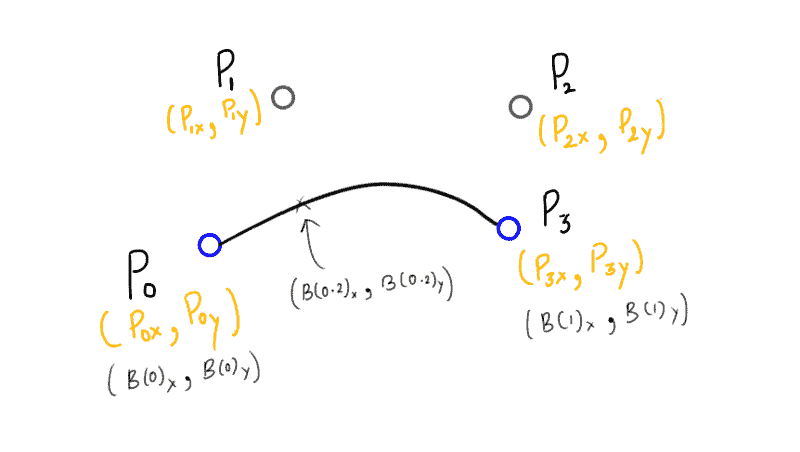

概括地说，上述等式是带有参数 *t* 的贝塞尔曲线的参数形式，该参数可以保存在 0 和 1 之间变化的值。曲线是点的集合。你传递给 B 的每一个独特的 *t* 都给出了一个独特的点，这个点构成了整个贝塞尔曲线。

方程的神奇之处在于，当 t = 0 时，B(0) = P0，当 t = 1 时，B(1) = P3，因此，t，0 和 1 的极值给出了曲线的最极值点，这些点当然就是锚点。这不仅仅适用于三次贝塞尔曲线，适用于 n 次 B(0) = P0，B(1) = Pn 的曲线。

对于 0 到 1 之间的任何其他值(例如上图中的 t = 0.2)，你会得到一个点来构建曲线。

因为整个方程取决于 Pis(小便眼)的位置，所以改变它们的位置会改变曲线的形状。这就是贝塞尔曲线的工作原理。

现在我们知道了贝塞尔曲线背后的数学原理，让我们把这些知识派上用场。

我创建了一个简单的 JavaScript 程序来渲染一条三次贝塞尔曲线，没有 UI 来与之交互，因为我不想让逻辑在所有的 UI 代码中消失，也因为我很懒。但这不代表你不能与之互动:)。

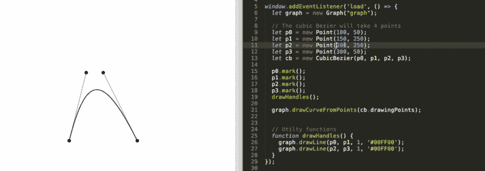

这是不是有点太多了？我们从定义什么是曲线开始，然后我们转移到点以及它们是如何构成曲线的。然后我们继续学习贝塞尔曲线，理解数学，找到构成贝塞尔曲线的点。我希望你学到了一些东西，离开这篇文章时比你开始阅读时更聪明。

小型定制三次贝塞尔引擎的代码可以在这个 [GitHub repo](https://github.com/nashvail/BezierCurveGenerator) 中找到。

**更新:**生成器现在可以生成任何阶数的贝塞尔曲线，而不仅仅是三次贝塞尔曲线:)。

#### 想要更多吗？我定期在 nashvail.me 的[博客上发表文章。](https://nashvail.me)那里见，祝你愉快！

