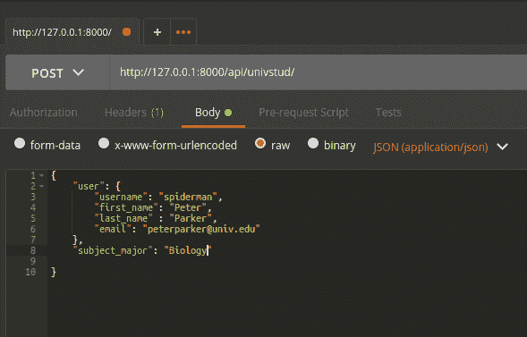
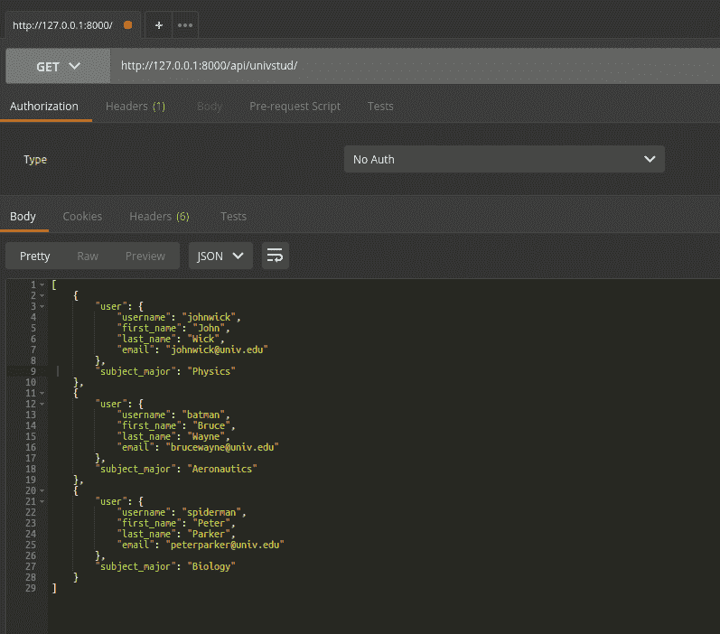

# Django Rest 框架中一对一字段的序列化程序中的嵌套关系

> 原文：<https://www.freecodecamp.org/news/nested-relationships-in-serializers-for-onetoone-fields-in-django-rest-framework-bdb4720d81e6/>

Django Rest 框架( [DRF](http://www.django-rest-framework.org/) )是围绕 Django 有效编写的框架之一，有助于为应用程序后端构建 REST APIs。

我在我的一个个人项目中使用它，偶然发现了这个挑战“序列化一个通过[一对一字段](https://docs.djangoproject.com/en/1.11/ref/models/fields/#django.db.models.OneToOneField)引用另一个模型的模型。”

“我使用的是来自`[django.contrib.auth.models](https://docs.djangoproject.com/en/2.0/ref/contrib/auth/)`的**用户**模型。我想写一个 API 来创建和更新一个用户对象，通过一个 API 来更新我的模型的属性。解决方案是在序列化中使用 DRF 的**嵌套关系**。

在继续之前，我假设您对 Python、virtualenv、pip、Django 和 DRF 有相当的工作知识。如果没有，请学习更多内容，如果您在序列化中遇到嵌套关系，请随时回来。

我在这里考虑的例子是一个大学生模型，通过 OneToOne 字段引用 T2 用户模型。我的目标是用一个 API 来创建和获取用户详细信息，如姓名、用户名、电子邮件以及学生属性，如科目专业。

这是我的`**models.py**`的样子:

```
from django.db import models
from django.contrib.auth.models import User

class UnivStudent(models.Model):
    """
    A class based model for storing the records of a university student
    Note: A OneToOne relation is established for each student with User model.
    """
    user = models.OneToOneField(User)
    subject_major = models.CharField(name="subject_major", max_length=60)
```

接下来，上述模型的序列化程序确定要操作的属性。如果你观察下面，我有两个序列化类，`**UserSerializer**` 和`StudentSerializer`。这是我们的兴趣点。

我在这里声明了一个`user`属性，它是一个序列化器字段。那个`user`属性将主要保存对`UserSerializer`类的整个引用。在`StudentSerializer`的**字段**中，我们只看到了`user`和`subject_major`。这允许我们输入学生(或用户)属性以及 subject_major。

创建一个由学生条目引用的用户条目。我们覆盖了`StudentSerializer`的创建方法，首先创建一个`user`对象，然后用它来创建`student`对象。

`**serializer.py**` 如下所示:

```
from rest_framework import serializers, status
from models import *

class UserSerializer(serializers.ModelSerializer):
    class Meta:
        model = User
        fields = ('username', 'first_name', 'last_name', 'email')

class StudentSerializer(serializers.ModelSerializer):
    """
    A student serializer to return the student details
    """
    user = UserSerializer(required=True)

    class Meta:
        model = UnivStudent
        fields = ('user', 'subject_major',)

    def create(self, validated_data):
        """
        Overriding the default create method of the Model serializer.
        :param validated_data: data containing all the details of student
        :return: returns a successfully created student record
        """
        user_data = validated_data.pop('user')
        user = UserSerializer.create(UserSerializer(), validated_data=user_data)
        student, created = UnivStudent.objects.update_or_create(user=user,
                            subject_major=validated_data.pop('subject_major'))
        return student
```

如果你已经熟悉 Django 的[基于类的视图](https://docs.djangoproject.com/en/1.11/topics/class-based-views/)，那么`**views.py**`应该非常简单。我们将使用序列化程序来验证和创建模型对象:

```
from serializers import *
from models import *
from rest_framework.views import APIView
from rest_framework.response import Response
from rest_framework import status

class StudentRecordView(APIView):
    """
    A class based view for creating and fetching student records
    """
    def get(self, format=None):
        """
        Get all the student records
        :param format: Format of the student records to return to
        :return: Returns a list of student records
        """
        students = UnivStudent.objects.all()
        serializer = StudentSerializer(students, many=True)
        return Response(serializer.data)

    def post(self, request):
        """
        Create a student record
        :param format: Format of the student records to return to
        :param request: Request object for creating student
        :return: Returns a student record
        """
        serializer = StudentSerializer(data=request.data)
        if serializer.is_valid(raise_exception=ValueError):
            serializer.create(validated_data=request.data)
            return Response(serializer.data, status=status.HTTP_201_CREATED)
        return Response(serializer.error_messages,
                        status=status.HTTP_400_BAD_REQUEST)
```

为了达到大学生的`post`和`get`要求，我加入了`/univstud/` `url` 。

```
from django.conf.urls import patterns, include, url
from django.contrib import admin
from rest_framework import routers
from rest_framework.urlpatterns import format_suffix_patterns
from OneToOne import views

admin.autodiscover()
router = routers.DefaultRouter()

urlpatterns = patterns('',
    url(r'^admin/', include(admin.site.urls)),
    url(r'^api-auth/', include('rest_framework.urls',
                               namespace='rest_framework')),
)

urlpatterns += format_suffix_patterns([
    # API to map the student record
    url(r'^api/univstud/

`**POST**`请求调用看起来像这样:



post call for /univstud/

`**Get**`请求调用看起来像这样:



get call for /univstud/

仅此而已！:)

因此，嵌套关系在`**StudentSerializer**`上启用，以引用`user`。

完整的代码在我的 gitlab 库中。

### 参考资料:

1.  [http://www.django-rest-framework.org/api-guide/relations/](http://www.django-rest-framework.org/api-guide/relations/),
        views.StudentRecordView.as_view(),
        name='students_list'),
])
```

`**POST**`请求调用看起来像这样:


post call for /univstud/

`**Get**`请求调用看起来像这样:


get call for /univstud/

仅此而已！:)

因此，嵌套关系在`**StudentSerializer**`上启用，以引用`user`。

完整的代码在我的 gitlab 库中。

### 参考资料:

1.  [http://www.django-rest-framework.org/api-guide/relations/](http://www.django-rest-framework.org/api-guide/relations/)