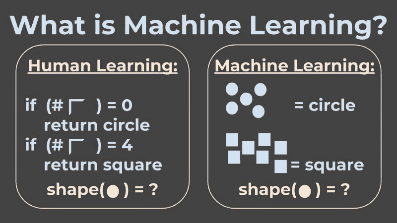
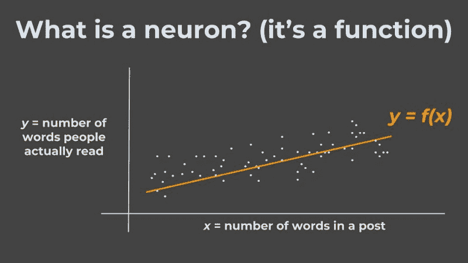
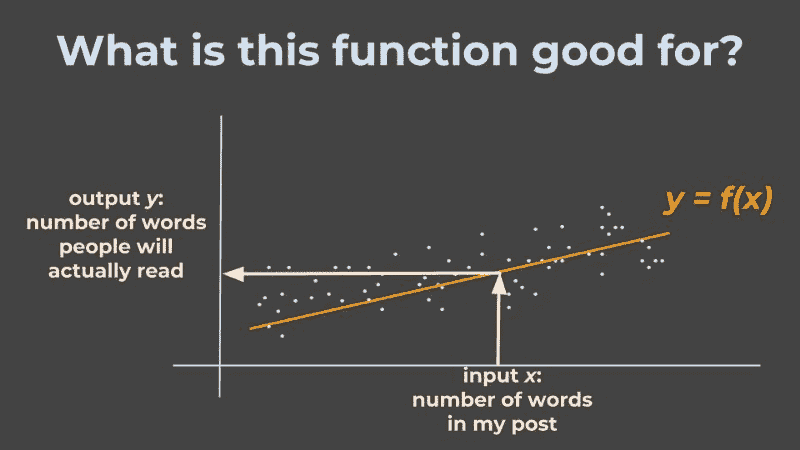
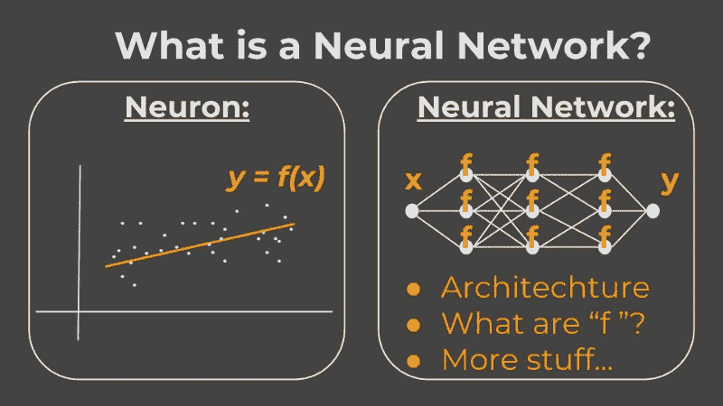

# 假人的神经网络:这一迷人领域的快速介绍

> 原文：<https://www.freecodecamp.org/news/neural-networks-for-dummies-a-quick-intro-to-this-fascinating-field-795b1705104a/>

你有没有想过所有人都在谈论，却不敢问的神经网络是什么？好了，不用再害怕了！在这篇文章结束时，你将能够走进任何一个会议，用你新学到的流行词汇让餐桌上的人眼花缭乱！

如果你在过去几年里打开过你的浏览器，你一定已经看过“神经网络”这个表达几百次了。

在这篇短文中，我会给你一些关于领域和事物本身的背景知识。你不会在接下来的 5 分钟内成为该领域的世界专家，但你会度过不平凡的入职阶段。你还会学到一些流行语，在餐桌上给家人留下深刻印象，尤其是如果你按照最后的阅读清单来做的话。

### 什么是机器学习？

要理解神经网络，我们首先需要理解机器学习。而要理解机器学习，先说人类的学习，或者说“经典编程”。

在经典编程中，我，开发人员，需要理解我试图解决的问题的各个方面，并且准确地知道所有的规则是什么，以便得到解决方案。

例如，假设我想让我的程序知道正方形和圆形的区别。那么一个处理方法就是写一个可以*检测*拐角的程序，然后应用到*统计*拐角。如果我的程序看到 *4 个*角，那么这个形状就是一个正方形，如果它看到*没有*角，那么这个形状就是一个圆形。

还有机器学习？非常笼统地说，机器学习=从例子中学习。

在机器学习中，当面临区分圆和正方形的完全相同的问题时，我们会设计一个*学习系统*，它会将形状及其类别(正方形或圆)的许多*示例*作为输入。我们希望机器能够自己学习区分它们的属性。

然后，我的朋友们，一旦机器学习了所有这些属性，我可以给它一个圆形或正方形的新图像，*一个它在*之前没有见过的图像，它将有希望正确地对它进行分类。

### 什么是神经元？

在神经网络的上下文中，神经元是一个花哨的名字，聪明的人在他们过于花哨而无法说出*功能*时使用。在数学和计算机科学的上下文中，*函数*是一个奇特的名字，指的是接受一些输入，应用一些逻辑，然后输出结果。

更确切地说，一个神经元可以被认为是一个学习单元。

因此，我们需要理解**在机器学习的背景下，什么是学习单元**。然后我们还会了解神经网络最基本的**构建模块**，也就是神经元。

举例来说，假设我正在试图理解一篇博客文章的字数和人们实际阅读这篇博客文章的字数之间的关系。记住——我们在机器学习领域，我们从例子中学习。

所以我收集了许多博客帖子中字数的例子，用 *x* 表示，人们在那些帖子中实际阅读了多少字， *y* ，我想象它们之间存在某种关系，用 *f* 表示。

然而，诀窍是，我只需要告诉机器(程序)**排序**我期望看到的关系是什么(例如一条直线)，机器就会理解它需要画的实际线。

我在这里得到了什么？

下次我想写一篇包含 *x* 个单词的博客文章时，机器可以应用它找到的关系 *f* ，并告诉我我可以期望人们实际阅读多少单词， *y* 。

### 所以，神经网络是…

好吧，如果神经元是一个函数，那么神经网络就是一个函数的网络！这意味着我们有许多(许多许多)这样的功能，例如**学习单元**，它们所有的输入和输出都是相互交织的，并且它们相互馈送。

作为这个网络的设计者，我的工作是回答一些问题:

*   我如何对**输入**和**输出**建模？(例如，如果输入是一些文本，我可以用字母建模吗？[数字](https://www.nltk.org/api/nltk.tokenize.html)？[矢量](https://en.wikipedia.org/wiki/Word2vec)？….)
*   每个神经元中的**功能**有哪些？(它们是线性的吗？[指数](https://towardsdatascience.com/activation-functions-neural-networks-1cbd9f8d91d6)？…)
*   网络的**架构**是什么？(即哪个函数的输出就是哪个函数的输入？)
*   我可以用哪些****的流行语来形容我的网络？****

****一旦我回答了这些问题，我就可以向网络“展示”许多(许多许多)正确输入和输出的例子，希望当我向它“展示”一个它从未见过的新输入例子时，它会知道给出正确的输出。****

****这个学习过程是如何工作的超出了这篇文章的范围，但是要了解更多，你可以[观看这个](https://www.youtube.com/watch?v=ov_RkIJptwE)。你也可以去这个酷毙了的[神经网络游乐场](https://playground.tensorflow.org/)去更好地了解这意味着什么。****

********

### ****神经网络——永无止境的故事****

****随着这一领域的迅速发展，大量新的(和高质量的！)每分钟都有内容出来，任何人都不可能跟上。(OMG 你认为会有一天人类可以建立一个能够跟踪人类在人工智能领域进展的人工智能吗？？)****

****进入这个领域，首先要知道的是没有人知道一切。所以，在你所在的地方感到舒适，并保持好奇:)****

****因此，我希望我在这篇文章中的最后一句话是参考一些我个人最喜欢的学习资源:****

*   ****Gal Yona -我在这个领域最喜欢的博客作者之一。她的帖子范围从[核心技术解释](https://towardsdatascience.com/do-gans-really-model-the-true-data-distribution-or-are-they-just-cleverly-fooling-us-d08df69f25eb)到[半哲学评论](https://towardsdatascience.com/the-tale-of-1001-black-boxes-62d12b5886aa)。****
*   ****Siraj Raval -一个[的 YouTube](https://www.youtube.com/channel/UCWN3xxRkmTPmbKwht9FuE5A)，有大量的视频，从[理论解释](https://www.youtube.com/watch?v=xRJCOz3AfYY)到[实践教程](https://www.youtube.com/watch?v=pY9EwZ02sXU)，都非常有趣！****
*   ****克里斯托弗·奥拉赫(Christopher Olah)——一位充满激情和洞察力的研究人员，维护着一个视觉上引人入胜的博客，从[的基本概念](http://colah.github.io/posts/2015-09-Visual-Information/)到[的深度探索](https://distill.pub/2017/feature-visualization/)都有帖子。****
*   ****[走向数据科学](https://towardsdatascience.com/)是该领域最大的媒体出版物，我喜欢它的原因是编辑是优秀的策展人。每当你有几分钟/几个小时空闲的时候，就去他们的主页开始探索**的一切**，从[实用工具](https://towardsdatascience.com/exploring-the-census-income-dataset-using-bubble-plot-cfa1b366313b)到[深层算法内容](https://towardsdatascience.com/https-medium-com-talperetz24-mastering-the-new-generation-of-gradient-boosting-db04062a7ea2)。****