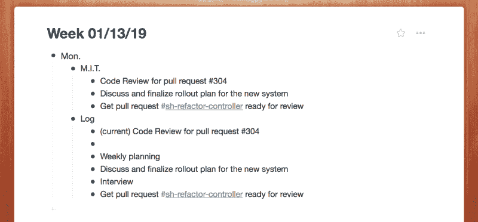
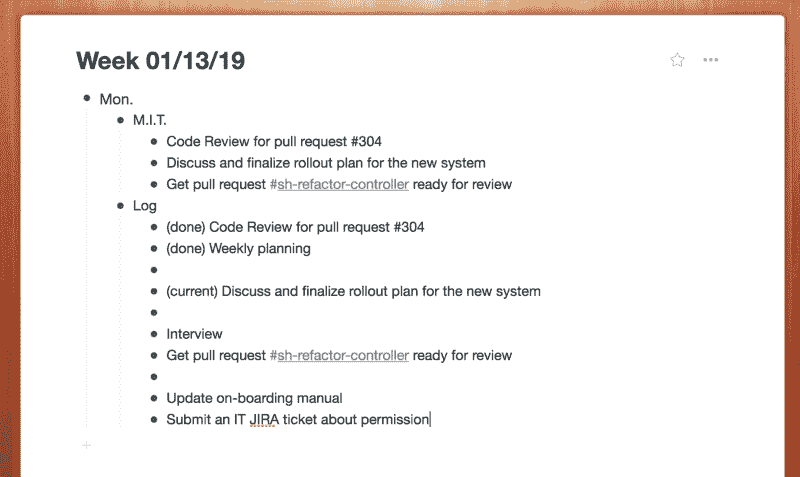
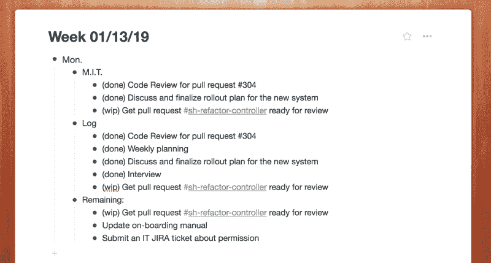
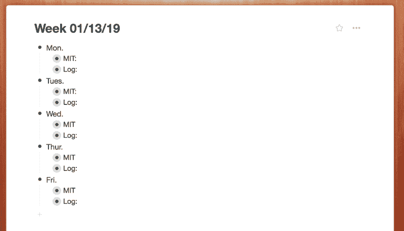

# 再也不要在工作中感到不知所措:如何使用麻省理工学院的技术

> 原文：<https://www.freecodecamp.org/news/never-feel-overwhelmed-at-work-again-how-to-use-the-m-i-t-technique-70d132aad0cc/>

作者:黄思慧

# 再也不要在工作中感到不知所措:如何使用麻省理工学院的技术

你曾经在工作一天后感到筋疲力尽吗？在忙碌的一天结束时，你不记得你是如何度过时间的。你只知道明天还有更多事要做。你疲惫不堪，不知所措，甚至有点沮丧——待办事项总是排在外面——尤然。

你可能想回顾一下你的一天，看看如何更有效率。但是漫长的一天让你的头如此疼痛，你所能做的就是拖着自己回家，倒在沙发上，直到上床睡觉。第二天，同样的故事重复发生，这是一个永无止境的循环。

这就是我过去几个月的生活。随着我角色的演变，编码不再是我的唯一职责。我的日子通常由面试、各种会议、代码评审、临时讨论和编码组成。通常，在一天结束的时候，**我觉得自己很失败，因为我没有在项目上取得我想要的进展**。我所能想到的就是所有剩下的需要完成的工作，这可能会令人沮丧，因为我似乎从来没有能够做到待办事项列表的底部。

这困扰了我很久。我客观地知道我比以前更加努力了。经过一天的努力工作，我应该感到有成就感和自豪。

#### 麻省理工技术如何帮助我

在我发现麻省理工学院的技巧后，事情发生了变化:这是一种让我全天保持专注和高效的强大方法。

> 最重要的任务(MIT)是将产生最重要结果的关键任务。每天，列出两三个 M.I.T .的清单，集中精力尽快完成。把这个清单和你的一般任务清单分开。- [个人 MBA](https://personalmba.com/most-important-tasks/)

下面是我如何在日常工作中运用它。我到办公室后，早上第一件事，就是打开我的笔记 app(我用的是 [Workflowy](https://workflowy.com/invite/537942ef.lnx) )。首先，我开始一天的新部分，写下两到三个我想集中精力完成的最重要的任务。然后，我在日志部分按计划完成的顺序列出任务，包括 M.I.T .和非 M.I.T .的。然后我检查我一天的时间表，为 M.I.T.s .计划时间块。我会尽可能快地完成它们。

最后，在真正开始工作之前，我告诉自己**只要我完成了最重要的任务，这就是富有成效的一天，我应该感到自豪。完成这些任务是我一天成功的定义。**

下面是我的笔记的一个示例:

随着时间的推移，新的任务接踵而至。根据它们的紧急性和重要性，我将它们添加到日志部分。这是它在中午的样子:

我今天的 M.I.T .是灵活多变的。如果我需要换一个新的麻省理工学院，甚至决定不做它，把它挪到另一天，这完全没问题。

在一天结束的时候，我会更新所有任务的进度，尤其是 M.I.T.s，并为明天留个便条。

这是一天结束时的样子:

能够看到你完成的所有任务，以及在一天辛苦工作后你是如何度过时间的，感觉棒极了。(我还创建了一个谷歌日历事件来记录我在完成一项任务后是如何度过时间的。)

#### 这种方法有三大好处。

1.  在一天开始时列出 M.I.T.s .为一天定下基调。麻省理工学院的名单是我生活的支柱。它让我保持专注和冷静。无论我要参加多少会议，或者有多少临时任务出现，我都会回到我的工作清单上，提醒自己这些是我一天的重点。如果有重要的事情出现，我会用我的麻省理工清单来评估它们，并相应地更新清单。
2.  在一天结束时回顾我的日志是一个反思今天过得如何并找出需要改进的地方的机会。除此之外，这是一个庆祝我完成所有任务并为我的努力感到自豪的时刻。软件开发是一场马拉松，而不是短跑。重要的是，我们要定期承认我们已经完成的伟大工作，并庆祝我们一路上取得的小小成功。在使用这个技巧之前，我经常感到不知所措和沮丧，因为我太专注于最终目标和所有剩余的工作，而没有承认我取得的进步。**这个技巧帮助我享受旅程的每一步。**
3.  记录下我一天是如何度过的，可以让我更容易制定周计划和月计划。在每个周末，我可以看到我是如何度过时间的，以及它是否符合我的优先事项。

我还可以在其他领域提高工作效率，实现更好的工作生活平衡，同时完成更多工作。当我发现一些有趣的东西时，我会探索和试验不同的技术，并在我的个人博客上分享。如果您感兴趣并且不想错过，请订阅！

我今年的职业规划是成长为一名技术主管。我对未来的学习感到兴奋，并愿意以一种残酷诚实的方式与你分享这段旅程。我将在我的[个人博客](https://www.sihui.io)(非中型)上分享我每周的学习。

在接下来的几个月里，我将专注于以下领域的发展，因此您可以期待看到与这些领域相关的学习成果:

*   着眼于项目的大局，而不是近期的实施细节；
*   在领导项目和编码之间平衡我的努力；
*   长期生产力的工作生活平衡；
*   软件开发中人的一面:确保每个和我一起的人都享受这一过程，并感到充实和受鼓舞。

*原载于[www . sihui . io](https://www.sihui.io/overwhelmed-at-work/)2019 . 1 . 24。*