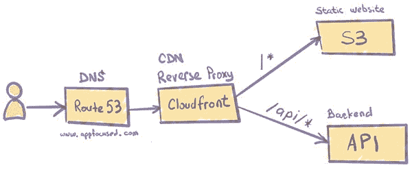
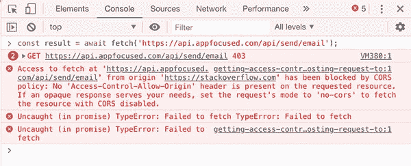
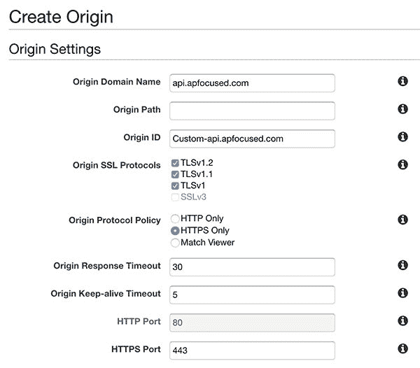
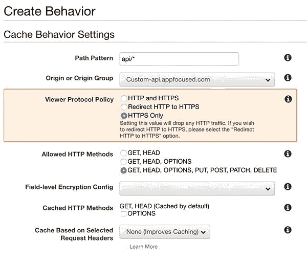

# 为什么您应该(几乎)不再使用 API 的绝对路径

> 原文：<https://www.freecodecamp.org/news/never-use-an-absolute-path-for-your-apis-again-9ee9199563be/>

维塔利·康德拉蒂耶夫

# 为什么您应该(几乎)不再使用 API 的绝对路径


[man wearing gray T-shirt standing on forest](https://unsplash.com/photos/J3JMyXWQHXU) by Caleb Jones on Unsplash.

web apps 架构的最新进展表明，分离的前端为开发和运营提供了更大的灵活性。它

*   让您在一端工作而不依赖另一端
*   允许您单独构建和部署
*   便于在每一端使用不同的工具



Decoupled front-end architecture

### 问题是

当开发一个应用程序时，考虑到这个架构，前端需要通过 API 与后端通信，通常是 [REST](https://developer.mozilla.org/en-US/docs/Glossary/REST) 。通常，后端服务器的 URL/端口不同于前端服务器的 URL/端口，给定单独的部署路径。在本例中，前端应用程序的 URL 是`https://www.appfocused.com`，发送联系电子邮件的其余端点由`[https://api.appfocused.com](https://api.appfocused.com.)` [提供。](https://api.appfocused.com.)

从前端应用程序到后端服务器的 HTTP 请求将失败，因为它违反了[同源策略](https://developer.mozilla.org/en-US/docs/Web/Security/Same-origin_policy)。在 Chrome 的控制台中，它看起来像这样:



CORS error

出于安全原因，浏览器会限制不是来自同一来源的请求。这可以防止攻击者将代码注入我们的应用程序并窃取我们的敏感信息。浏览器在跨源请求上附加一个`[origin](https://developer.mozilla.org/en-US/docs/Web/HTTP/Headers/Origin)`头，让服务器知道潜在的威胁。然后，服务器有权通过提供特定的响应头来允许或拒绝这些来源，这些响应头由浏览器解析。

有两种方法可以解决这个小问题:

*   在客户端硬编码绝对 API URLs，在服务器端配置 CORS 头
*   在客户端使用相对 API URLs，并使用反向代理方法

在这篇文章中，我将讨论为什么 CORS 头文件的前一种方法应该被认为是生产就绪代码的反模式。我还将讨论如何在各种设置上配置反向代理方法:

*   本地开发服务器
*   web 服务器/应用服务器
*   无服务器(CloudFront/S3/λ)

### 基本原理

CORS 头场景听起来实现起来没那么困难，事实也确实如此。然而，有几个问题需要考虑，这使得我在几乎任何情况下都支持**反向代理方法**。

首先也是最重要的，后端可能不属于您，并且可能无法对 CORS 头文件进行更改。

如果您足够幸运，能够控制后端**并且**能够配置 CORS 报头，那么您将需要维护一个访问 API 服务器的多个 web 客户端的白名单，以便为它们提供访问权限。当然，通配符也是一个选项，但是通过将`access-control-allow-origin`设置为`*`来将所有来源列入白名单是不合理的，除非它是一个公共服务器。

在开发过程中，另一个常见的模式是在`localhost:$port`运行我们的 UI 应用程序。但是将 localhost 列入白名单以方便 API 调用是一种反模式，出于安全原因应该避免。

最后，但同样重要的是，我喜欢我的构建符合**一次构建，多次部署**的原则。这是**连续交货**的基本原则之一。二进制文件——在我们的例子中，是 web 客户机的静态文件——只构建一次。后续的部署、测试和发布不应该试图再次构建二进制工件。相反，应该重用已经构建好的二进制文件。

实际上，在我们的客户端代码中硬编码的绝对 URL，比如`https://api.appfocused.com/email/send`，将阻止我们拥有一个工件，因为在开发环境中，我希望我的 web 客户端点击，比如说，`https://api-dev.appfocused.com/email/send`。

> 不要在你的客户端代码中硬编码一个绝对的 API URL。

这对我来说是一个强大的咒语，帮助我克服了路上的一些挑战。

### 解决办法

相对 URL `/email/send`可以在客户端一劳永逸地解决它，使得一次构建，多次部署成为可能。代理的工作是进一步编排请求。它还处理浏览器施加的限制。在这种情况下，代理服务器处理我们的请求、响应，并进行必要的修改以促进跨源通信。

#### webpack-dev-server 的反向代理

当您在本地机器上开发时，您希望您的 API 得到与其他环境相同的待遇。Webpack 可以配置为代理请求。“webpack.config.js”的一个示例是:

```
module.exports = {
  //...
  devServer: {
    proxy: {
      '/api': 'http://localhost:9000'
    }
  }
};
```

从客户端到相对路径`/api/users`的请求现在将代理到`http://localhost:9000/api/users`的请求。如果您想配置 URL 重写场景或添加安全协议，请查看 W [ebpack 文档](https://webpack.js.org/configuration/dev-server/#devserver-proxy)。

该代理也可以配置为基于 Webpack 的项目，如 [create-react-app](https://facebook.github.io/create-react-app/docs/proxying-api-requests-in-development#docsNav) 或 [Gatsby](https://www.gatsbyjs.org/docs/api-proxy/) 。

#### 使用 NGINX 的反向代理

[NGINX](https://www.nginx.com/) 是生产环境架构中的常见组件。它具有许多高级负载平衡、安全性和加速特性，这些特性是大多数专业应用程序所缺乏的。使用 NGINX 作为反向代理使您能够将这些特性添加到任何应用程序中。

NGINX 上最简单的反向代理配置如下所示，在“/etc/nginx/conf.d/app.conf”中

```
server {
  listen 80;
  listen [::]:80;

  server_name appfocused.com;

  location /api {
      proxy_pass http://api.appfocused.com/;
  }
}
```

`proxy_pass`指令使这个配置成为一个反向代理。它指定所有匹配位置块的请求——在本例中是,`/api`路径——应该被转发到`http://api.appfocused.com`,我们的后端正在那里运行。

查看[完整文档](https://docs.nginx.com/nginx/admin-guide/web-server/reverse-proxy/)了解更多详细情况。

#### 无服务器反向代理

我们将着眼于 AWS 平台的无服务器场景。在我之前的一篇文章中，我解释了我们如何使用[无服务器架构来托管我们的网站](https://www.appfocused.com/blog/static-site-with-aws-cloud-front-gatsby/)。AWS CloudFront 在其中扮演了一个关键角色，充当 CDN，并在边缘为我们存储在 S3 上的静态文件提供安全性。

我们必须集成到这个设置中的第一个 API 是联系人表单。实施概要如下:

> *当客户端向`https://www.appfocused.com/api/send/email`发送请求时，请求需要被路由到`https://api.appfocused.com/api/send/email`，在那里我们的后端 API 以 Lambda 函数的形式被部署。*

原来 CloudFront 支持多台原点服务器。它使用路径模式来确定将请求转发到哪个源服务器。多个独立的服务器，甚至不在 AWS 内部的系统，都可以在一个主机名下“拥有”一个或多个路径。其中一个是默认的，拥有所有未明确配置的路径。

这个概念非常类似于 NGINX 或 Apache 中的反向代理。但是请求路由是由 CloudFront 完成的，CloudFront 连接到适当的后端，发送请求，并返回(可能缓存)响应。它不重定向请求，因此消费者的 URL 地址永远不会改变。

### CloudFront 配置示例

使用主站点的主机名，例如`www.appfocused.com`，作为原点。将站点的域名配置为 CloudFront 中的备用域名。

接下来，添加第二个起点，目的地是可以到达 WP 部署的主机名。使用与`/blog*`匹配的[路径模式](http://docs.aws.amazon.com/AmazonCloudFront/latest/DeveloperGuide/distribution-web-values-specify.html#DownloadDistValuesPathPattern)创建一个行为，并使用第二个原点。

我们现有的 CloudFront 发行版被设置为指向由《了不起的盖茨比》生成的静态 S3 桶内容。记住**而不是**在创建与 S3 集成的新发行版时使用 AWS 的自动建议。手动输入[网站端点](https://github.com/awsdocs/amazon-s3-developer-guide/blob/master/doc_source/WebsiteEndpoints.md)类似此格式`[http://appfocused.s3-website.eu-west-1.amazonaws.com](http://appfocused.s3-website.eu-west-1.amazonaws.com).)` [。](http://appfocused.s3-website.eu-west-1.amazonaws.com).)

接下来，我们将添加第二个源来服务来自 API Gateway 的 REST 请求。从“原点”选项卡中选择“创建原点”。输入域名，并将原始路径留空。确保为“原产地协议政策”选择“仅 HTTPS”。



Cloudfront: create origin

接下来转到“行为”标签，并点击“创建行为”来配置路径。



Cloudfront: create behavior

对于“路径模式”，我们将使用`api/*`。这将捕捉任何以`/api`开头的请求，比如`[https://www.appfocused.com/api/send/email](https://www.appfocused.com/api/send/email)`。

在“原点”下拉列表中，选择我们刚刚创建的原点。这将确保请求被路由到`[https://api.appfocused.com/api/send/email](https://api.appfocused.com/api/send/email)`。

对于“观众协议政策”，选择“仅 HTTPS”。

对于“允许的 HTTP 方法”，选择“获取、头、选项、上传、发布、修补、删除”。

对于“基于所选请求头的缓存”，选择“白名单”并添加所需的头。这可以防止主机标头被传递到原点。

对于“对象缓存”，选择“使用原始缓存头”。

对于“转发 Cookies”，选择“全部”。

对于“自动压缩对象”，选择“是”。这将 gzip 响应。

默认情况下，CloudFront 很少将头转发给源。您可以配置它来转发您需要的内容，但是您转发的每个报头都会**降低**您的缓存命中率。就我个人而言，我正在经历“推荐者”、“接受”、“内容类型”和“授权”。

不过，对于 AWS 上的无服务器代理，有一些注意事项。CloudFront 不会剥离路径。

如果一个请求被发送到`https://www.appfocused.com/api/*`，它将被路由到前缀为`/api`的`[https://api.appfocused.com](https://api.appfocused.comwith)` [，而不是站点的根。](https://api.appfocused.comwith)

如果您没有后端 API，或者由于某些原因，这些 API 无法更改，那么这可能会成为一个问题。如果是这样的话， [Lambda@Edge](https://docs.aws.amazon.com/AmazonCloudFront/latest/DeveloperGuide/lambda-at-the-edge.html) 就来救援了。该服务允许您在处理请求时动态地重写路径。要配置 Lambda@Edge，请转到 CloudFront 行为项目并选择“Lambda 函数关联”。

### 结论

通过跨环境实施反向代理，我们实现了:

*   **安全的客户端-服务器通信**
    您的后端服务器的身份仍然未知。这在 DDoS 攻击的情况下很有用
*   **构建一次，部署许多**
    ,它们带有 API 的相对路径，您可以构建一次，并将同一个工件部署到多个环境
*   **同源**
    不需要在服务器上配置 CORS 报头

我个人的建议是:不要再硬编码 API 的绝对路径，除非是原型。多花一点时间来配置一个反向代理层，使它正确。

这篇文章最初发表在我公司的博客上。我们在 Appfocused 的使命是通过利用我们丰富的经验、对现代用户界面趋势的了解、最佳实践和代码工艺，帮助公司在 web 上实现[卓越的用户体验。](https://www.appfocused.com)