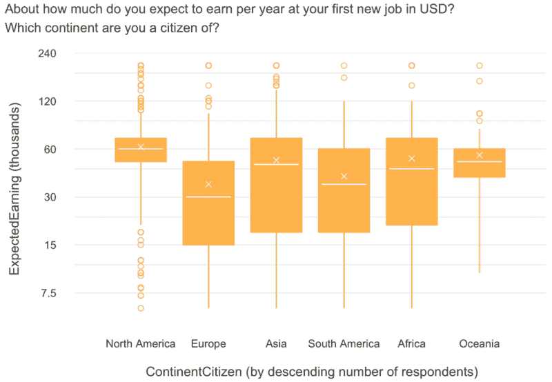
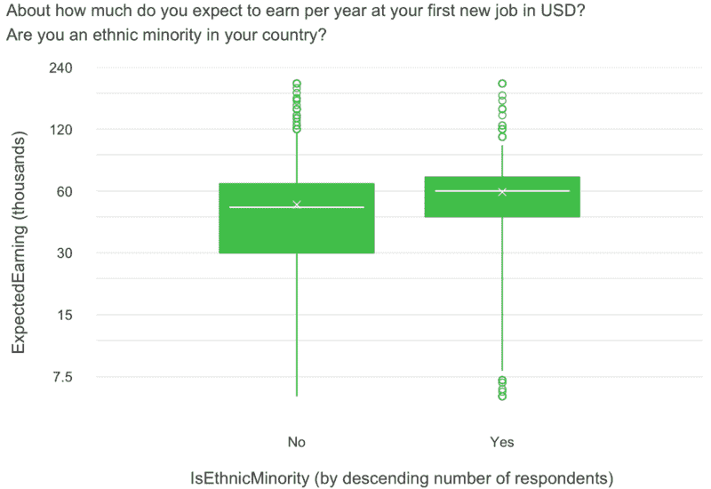
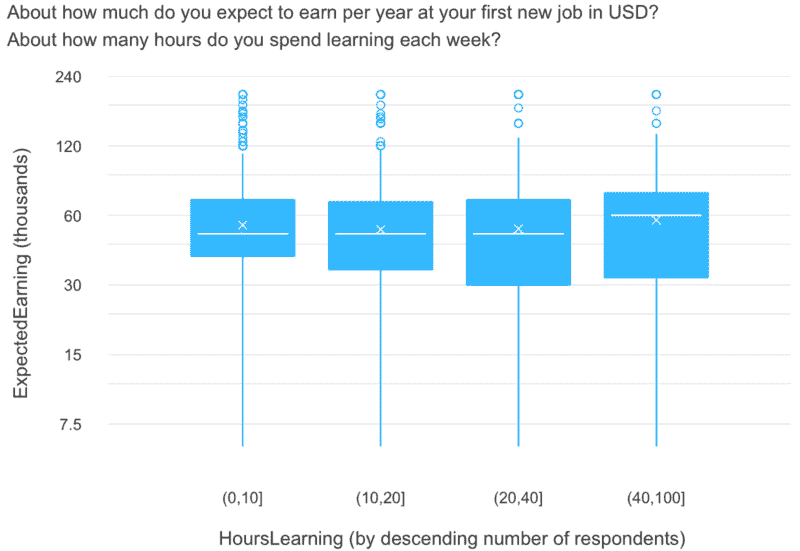
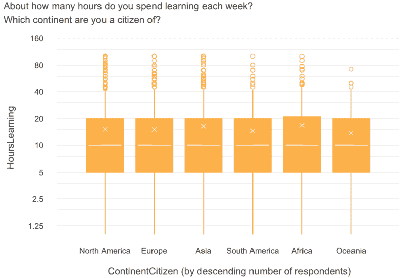
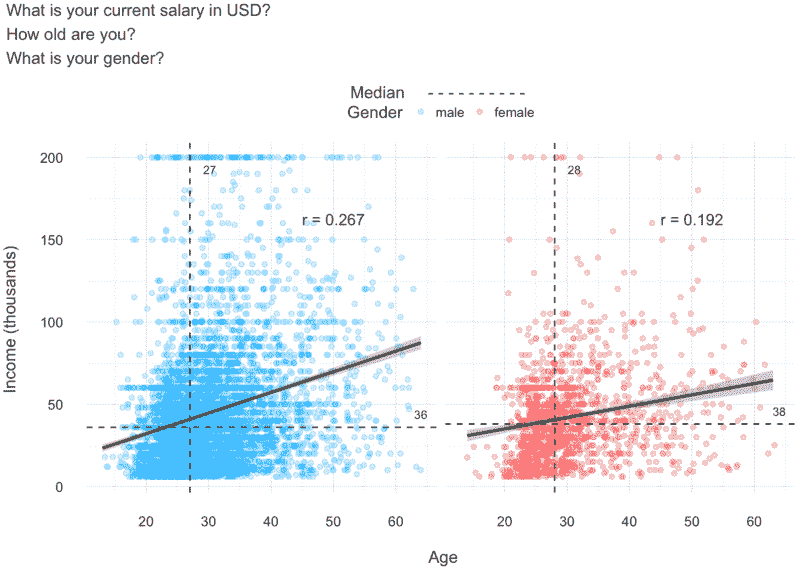
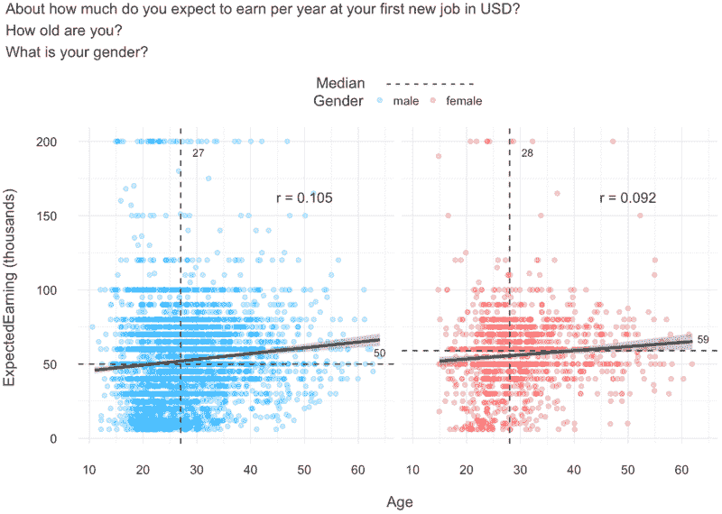
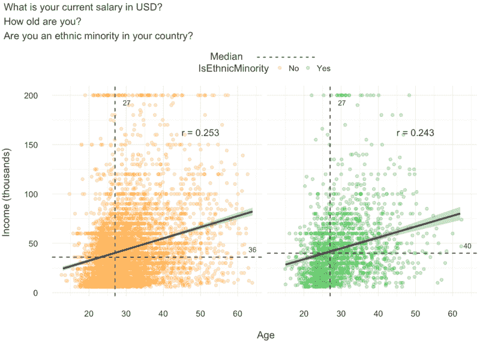
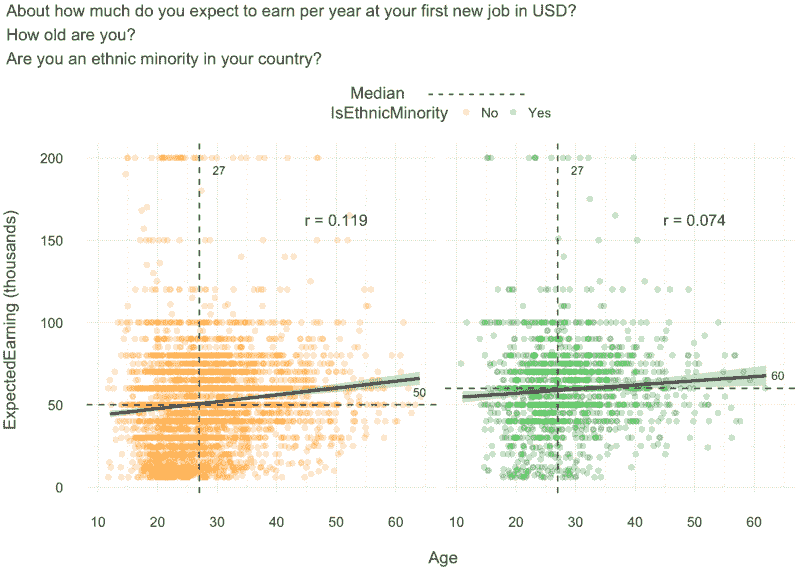

# 新程序员:工资和学习时间如何因人口统计学而异

> 原文：<https://www.freecodecamp.org/news/new-coders-how-salary-and-time-spent-learning-vary-by-demographic-359ef1ed0da8/>

大卫·文丘里

# 新程序员:工资和学习时间如何因人口统计学而异

#### 自由代码营询问了 15000 人他们是谁，以及他们是如何学习编码的。我按照性别、大陆和是否是少数民族来区分他们，然后探究他们的差异。

Image by [**me**](http://davidventuri.com/)**.**

超过 15000 人响应了[自由代码营的 2016 年新程序员调查](https://medium.freecodecamp.com/we-asked-15-000-people-who-they-are-and-how-theyre-learning-to-code-4104e29b2781#.jlsxxy4si)，授予像我这样的研究人员(*！对人们如何学习编码的前所未有的一瞥。整个数据集在 [Kaggle](https://www.kaggle.com/freecodecamp/2016-new-coder-survey-) 上发布。*

### 以下是不同性别、种族和大洲的新程序员在工资、年龄和学习时间上的差异。

参与调查的 15，620 名新编码员的人口分布如下:

#### 性别

*   21%(2 840 人)是女性
*   78%(10 766 人)是男性

#### 少数民族对多数民族

*   24% (3，253 人)是他们国家的少数民族
*   **76% (10，392)** 不是

#### 各大洲的公民身份

### 预期的下一份薪水会因人口统计而异吗？

这是他们在宣传新的编码技能后的第一份薪水。期望的下一份薪水是自由代码营调查中的两个主要问题之一，其答案取决于编码资源的质量。

#### 编码后技能习得，北美人期望薪资最高，欧洲人期望最低。亚洲的预期是全面的。

第 25 百分位的北美人和第 75 百分位的欧洲人期望的一样:5 万美元。北美的平均预期是每年 6 万美元。

我想知道一些欧洲人是否忘记了从英镑、欧元或任何其他欧洲货币兑换成美元。

顺便说一下，下面是如何阅读这个图表(以及本文中的其他[方框图](http://www.physics.csbsju.edu/stats/box2.html)):“x”是平均值。水平线是中间值(也称为第 50 百分位)。盒子底部是第 25 个百分位数，盒子顶部是第 75 个百分位数。胡须的长度是盒子高度的 1.5 倍。圆圈是异常值。所有 y 轴都是对数刻度，以便更好地显示大量异常数据。

#### 女性实际上比男性期望更高的下一份薪水。

女性的期望值比男性的期望值高 9k 美元。第 25 百分位女性期望 14k 美元(！)比她的男性同伴多。女性新程序员似乎对工作场所不断变化的多样性前景持乐观态度。

#### 像性别一样，少数群体比多数群体期待更高的下一份薪水。

中位数的差距是 1 万美元。第一个四分位数的差距是 1.5 万美元。少数族裔似乎也对工作场所不断变化的多样性前景持乐观态度。

#### 不管你每周工作少于 10 小时还是多达 40 小时，期望的薪水都差不多。

那些每周工作 40 小时以上的人的平均预期工资比其他人高 3000 到 5000 美元，但这可能是随机造成的。15，000 多名受访者中只有 694 人花这么多时间学习。

因此，预期的下一份薪水因洲而异。性别和少数族裔的工资差距似乎呈现反向趋势。

不到 5%的新程序员每周花 40 多个小时学习。

这些受访者大多二十出头，拥有学士学位，这表明一些人正在放弃传统形式的高等教育(如硕士和专业学位)，并利用每周 40 多个小时学习代码。

顺便说一下，这是我自己的情况，我的个性化数据科学硕士学位是 T1。

随着对在线教育的质量和可负担性的认识的提高，我预计会有更多的人加入到更高的行列中来。

### 每周用于学习的时间是否因人口统计而异？

致力于学习的时间是另一个问题，其答案取决于编码资源的质量。

#### 学习编码所花的时间在各大洲都差不多。每周 10 小时的中位数是标准的。

#### 男女都一样。

(注意，对于跨性别人群，这种差异在统计学上并不显著。)

#### 多数民族和少数民族也是如此。

因此，与预期的下一份薪水不同，用于学习的时间不会因人口统计而有太大变化。每个人每周花 5 到 20 个小时学习。

#### 让我们更深入地了解工资差距。

对于**男性对女性**和**少数民族对少数民族**，两个分组散点图如下:

1.  当前薪资(**之前广告自己的新编码技能*)与年龄*
2.  *预期下一次薪资(**广告自己的新编码技能)* vs .年龄**

**每个变量都有一条标有相关性的最佳拟合线，以及代表每个轴变量中值的虚线。我删除了 65 岁以上的新编码员，因为他们是统计异常值。**

### **不同年龄段的工资**

#### **女性新程序员的当前工资中位数高于男性(高出 2000 美元)，但女性工资较高的人群主要是千禧一代。**

**请注意当前工资与年龄的相关性为 0.267 和 0.192。**

****

**男性新程序员的当前工资确实高于平均水平(15 万美元以上)，这与略高的平均值(未绘制)相对应。**

#### **就性别而言，当新程序员预测他们的下一份工资时，年龄和工资之间的上述关系并不成立。**

**相关性要低得多，都接近 0.1。我们再次看到中位数的巨大差距:女性 59k，男性 50k。这两个数字都高于男女目前的工资中位数。**

******

Photo via [KuniakiIGARASHI](https://www.flickr.com/photos/igaiga/8524166440/in/photolist-dZfzGU-dBG6fK-mavikK-dZ9LET-dBG7yK-dZ9PFK-dBMupE-dZfzLo-dZ9RUR-mavkDx-dAQVYu-dBG8M4-dBG5Qt-dZ9SCi-dfRvyL-maw2Za-dBG5Wc-dBG8Ec-dBMx5J-dBMxcY-dBMwXy-fwy6Vc-rtdj7S-re4gSB-rtdmmG-rvpEFE-rtdfs7-rvuWeM-rvp4kt-qyvqtw-dZ9Tcn-dBG6uX-mawZrJ-dC4z8C-kRyZsZ-dZ9Npa-dBY8CZ-dfRPuf-dZfvtq-dBG5zK-dfRMHK-dBG79V-dBMvY7-mavZxM-dZfwpE-dZfviC-dZfx9d-maw2ap-dZfwnf-dZ9PSR#undefined)** 

#### **少数族裔的当前薪资中值比多数族裔高 4k 美元。与性别不同的是，不同年龄之间的工资差距大致相等。**

**请注意当前工资与年龄的相关性为 0.253 和 0.243。**

****

**少数族裔确实拥有高于平均水平的 15 万美元+当前工资的比例，但这一次并不对应于更高的平均值(未绘制)。**

#### **对于少数民族的地位，比如性别，当新的程序员计划他们的下一份工资时，年龄和工资之间的关系就不存在了。**

**两者的相关性都很低，再次接近 0.1。预期的下一份薪水中位数的差距是惊人的:少数族裔是 6 万美元，多数族裔是 5 万美元。与性别一样，这两个数字都高于他们目前的薪资中值。**

**********

Photos via [Yvonne Perkins](https://www.flickr.com/photos/perkinsy/9537573288/in/photolist-fwNyfL-dBMuTu-mavjWa-dZfxz5-mawXAj-max12m-dBMuVd-dfRvWf-kRyigi-dBG5UV-dZfwJW-dBMwDd-dBY7QM-dBG874-dZ9Ric-dZfu75-maviov-dBMwjw-dZfv8Y-dBMwfm-dC4xFW-dfRN4K-dZ9MoD-dZfzm1-dBMwSU-dC4z2u-dZfynG-dBMxBw-dBMun7-dZftHJ-dBMv89-dBMwHQ-dAKsMH-dZfvB9-dZ9RBD-dZfvES-dBMvzj-dZfz1J-mawYim-dZ9QqX-maw34D-dZfvwA-kRyhGc-dZfy53-dfRMcx-dBG7ua-dBG7Va-dZ9TgD-dBY93c-mawZv1#undefined) and [Black Girls Code](http://precollegeblog.flatironschool.com/post/121194821475/black-girls-code-and-flatiron-school-partner-for)** 

**所以，就像预期的下一份薪水一样，女性新程序员比男性新程序员有更高的平均薪水。少数民族对多数民族也是如此。**

**然而，年长的女性没有年长的男性做得好，这是我在整个数据集中能找到的关于工资差距的唯一线索。**

**对于性别和少数民族身份来说，似乎年长的新程序员在过渡到宣传他们的新编码技能的工作时愿意接受减薪，而年轻的人则打算在职业生涯早期利用高薪来满足编码需求。**

### **我们学到了什么？**

**学习编程的时间在不同性别、不同种族和不同大洲都是不变的。大多数人每周花 5-20 个小时。**

**预期的下一份薪水(编码后技能获得)因洲而异。最低中值为 30k 美元(欧洲)，最高为 60k 美元(北美)。**

**年纪较大的新程序员似乎愿意在他们的新工作中接受减薪，他们在新工作中宣传自己的新编码技能，而年轻的新程序员则希望凭借他们受欢迎的技能获得可观的薪水来开始他们的职业生涯。**

**在 2016 年新编码器调查中，传统的性别和少数民族工资差距并不普遍。其实是反过来的。也许新的编码员并不能反映总体的工作人口，数据显示[和](http://www.pewresearch.org/fact-tank/2016/07/01/racial-gender-wage-gaps-persist-in-u-s-despite-some-progress/)两种工资差距在 2016 年仍然存在。**

**

Photo via [SHRCC](https://www.flickr.com/photos/shrcc/4535210853/in/photolist-7UL9bz-jXi8bu-drKeWS-EH6mXe-cCoTSN-8xcfPC-6aoYyA-nRkbdo-dVH1tJ-8p5VgK-cEZjtj-soV5rS-spfY1q-efBP6h-axL5Wm-aKypuc-7KmDRt-8mnyNH-4uCYto-RapM6-fNunxg-9cNj9r-cqeakC-oXqXpL-2uPztV-5hWNCu-9TV2wn-9TSDDG-iUMeZi-ouFdL9-brensu-4ETTCT-5QnPiV-5hPTqV-bCVbLW-ecDZDm-dVvEo9-8WqgrX-fiA5cJ-6H6ebv-axL639-a5v941-8zGdQ7-9cauL6-nM7B44-9cTmCG-3KBVk4-nNCjMj-f6UVnA-5FSSKq#undefined)** 

### **下一步是什么？**

**你是否预感到为什么少数民族地位和性别工资差距可能不适用于新的程序员？请分享任何相关(*或矛盾的东西！*)中的回复。**

**你可以在 Kaggle 上找到这一分析的更详细版本,在那里你可以找到支持本文推论的统计测试。**

**一定要看看我的其他作品，探索自由代码营的 2016 年新编码器调查:**

**[**开发数据科学家和工程师**](https://medium.com/@venturidb/developing-data-scientists-engineers-710f4ef5a773)
[*自由代码营询问了 15000 人他们是谁，以及他们是如何学习编码的。我隔离了那些专注于数据的人…*medium.com](https://medium.com/@venturidb/developing-data-scientists-engineers-710f4ef5a773)[**6 种最令人向往的编码工作(以及每种工作吸引的人的类型)**](https://medium.freecodecamp.com/the-6-most-desirable-coding-jobs-and-the-types-of-people-drawn-to-each-aebac45fd7f7)
[*自由代码营询问了 15，000 人他们是谁，以及他们如何学习编码。我根据他们的工作将他们分开…*medium.freecodecamp.com](https://medium.freecodecamp.com/the-6-most-desirable-coding-jobs-and-the-types-of-people-drawn-to-each-aebac45fd7f7)**

**如果您对本系列或生成它的 R 代码有任何问题或疑虑，请不要犹豫，请[让我知道](http://davidventuri.com/contact)。**

**[**大卫·文丘里(@venturidb) |推特**](https://twitter.com/venturidb)
[*大卫·文丘里的最新推文(@venturidb)。创建我自己的数据科学硕士学位。@昆士兰化学工程/经济…*twitter.com](https://twitter.com/venturidb)**