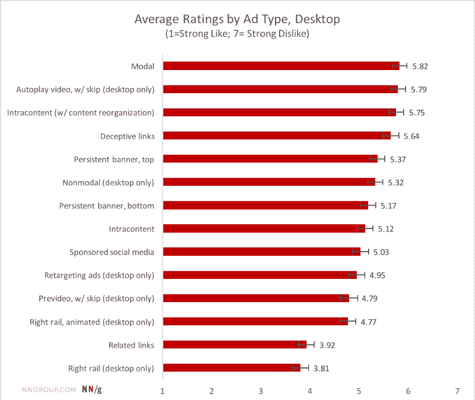
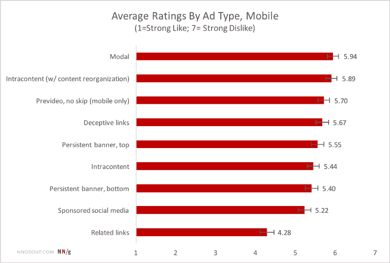
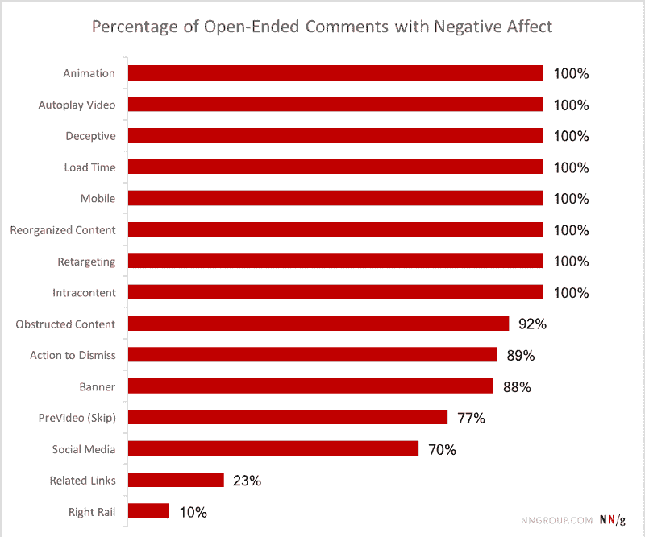
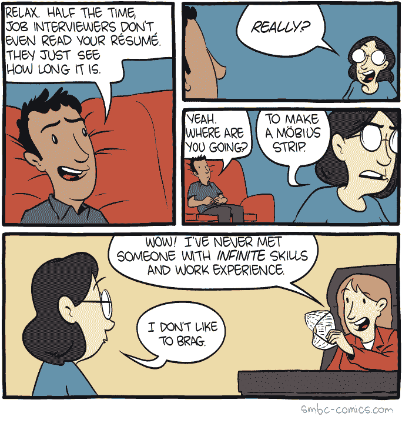
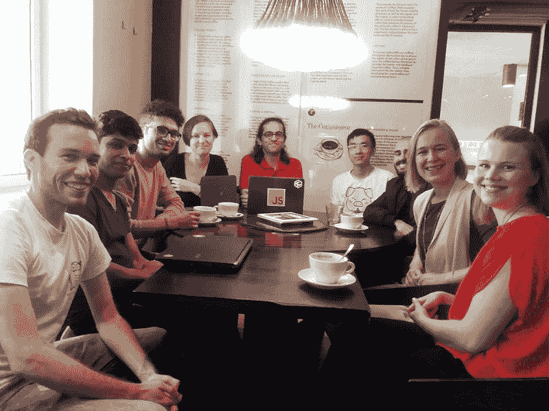

# 互联网用户最讨厌的广告类型的新数据

> 原文：<https://www.freecodecamp.org/news/new-data-on-the-types-of-ads-internet-users-hate-the-most-275a34f46af1/>

你知道当你滚动浏览一篇博客文章时的那种感觉，然后——砰！——弹出一个“注册订阅我们的时事通讯”模式？

这是网站最讨厌的广告类型。还有很多其他的广告反模式。

尼尔森集团调查了 452 名未从事 IT 或广告行业的美国人，并要求他们对各种类型的广告进行评分，从 1 到 7 分不等，表示他们有多不喜欢这些广告。

他们对桌面和移动广告都这样做。以下是他们对桌面广告类型的调查结果。(红条越长，越讨厌广告手法。)

以下是他们对移动广告类型的调查结果:

尼尔森还要求受访者列出他们认为广告中令人讨厌的东西。他们是这样说的:

如果你有一个网站，我建议你避免使用弹出模式来试图说服你的用户做一些事情。这可能对一些人有用，但是很明显大多数人对此很恼火。

以下是这项研究的一些其他收获:

1.  不要自动播放视频，尤其是没有声音的视频。这消耗了你的用户大量的带宽，并惹恼了人们。
2.  尽可能清楚地说明每个链接的目的地。当你的用户点击一个链接时，他们相信你不会浪费他们的时间。不要因为欺骗他们链接的位置而危及他们的信任。
3.  不要在页面顶部使用固定的横幅。允许用户滚动浏览他们不想再看的内容。
4.  不要使用“内容内”广告，这些广告会在页面加载或用户浏览内容时出现。人们讨厌他们正在阅读的段落被挤出视野。
5.  不要用动画广告。人们讨厌他们。
6.  任何在桌面上令人讨厌的广告类型在移动设备上会更加令人讨厌，在移动设备上，屏幕空间更加有限，点击关闭 X 更加困难，你必须滚动找到自动播放的视频并关闭它们。

如果你必须投放广告，尼尔森建议在你内容的右侧使用广告，或者在文章底部使用“相关链接”。这些是最不可能冒犯你的用户的。

友情提醒——[freeCodeCamp](https://www.freecodecamp.com)是完全无广告的，并且将一直如此！:)

你可以在这里阅读尼尔森的完整分析:( [10 分钟阅读](https://fcc.im/2qZ5YHP))

### 这里有三个值得你花时间的链接:

1.  这里有 435 门免费的在线编程和计算机科学课程，你可以在六月份开始学习
2.  使用 Node.js 和 Seneca 编写象棋微服务( [6 分钟读取](https://fcc.im/2qZlxPT))
3.  Try、Catch、Finally 和 Throw:JavaScript 中的错误处理( [6 分钟观察](https://fcc.im/2qYIena))

### 想到这一天:

> "一撮概率抵得上一磅也许."—詹姆斯·瑟伯

### 今日趣事:

网络漫画作者[周六早餐麦片](https://fcc.im/2r0zJ66)

### 今日学习小组:

赫尔辛基自由代码营

编码快乐！

–昆西·拉森，自由代码营的老师

如果你从这些邮件中获得了价值，请考虑[支持我们的非营利组织](http://bit.ly/donate-to-fcc)。