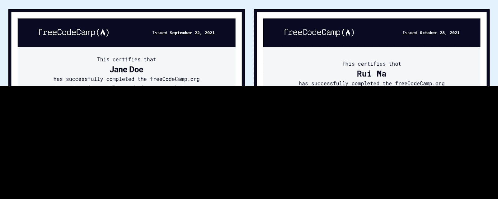
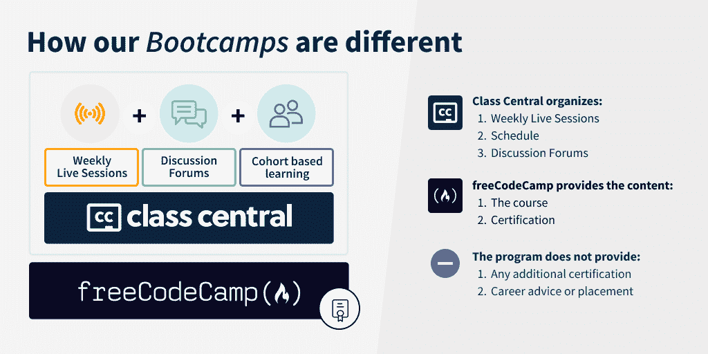

# 基于 freeCodeCamp 的新的免费训练营——通过每周直播学习 JavaScript 和 Web 开发

> 原文：<https://www.freecodecamp.org/news/new-free-bootcamps-based-on-freecodecamp-learn-javascript-webdev-with-weekly-live-streams/>

1 月 10 日，Class Central 将推出两个新的免费、远程、对所有人开放的训练营。

你将完成 freeCodeCamp 的 [JavaScript](https://www.freecodecamp.org/learn/javascript-algorithms-and-data-structures/) 或[响应式网页设计](https://www.freecodecamp.org/learn/responsive-web-design/)认证，每周都有直播流、项目和全球友好的学习小组。

## 基于 freeCodeCamp 课程的免费训练营

大家好，我是杰西！我以前是语言老师。后来，我决定进入科技行业。所以编写训练营吸引了我的注意力。他们答应马上教我如何编程和进入科技领域。但是它们非常贵。

所以相反，我自学进入这个领域。但我一直在考虑创建一个训练营，想知道我是否可以利用开放教育资源，将我对教学和技术的热情结合起来。三个月前，我对这个想法进行了测试。

我与 [Class Central](https://www.classcentral.com/) 合作推出了一个基于 freeCodeCamp 课程的免费 web 开发训练营。 **8000 名学员报名**！所以在一月份，我们又做了一次。这一次，我的朋友拉蒙将作为讲师加入我们，因此我们将启动两个训练营:

*   免费网页开发训练营:基于 freeCodeCamp 的[网页设计认证](https://www.freecodecamp.org/learn/responsive-web-design/)，由你真正领导的我们首次训练营的改进版。你将学习 HTML，CSS，以及可访问和响应的网页设计。它从 1 月 10 日开始。你可以在这里报名[。](https://www.classcentral.com/study-group/webdev-bootcamp-spring-2022)
*   **免费 JavaScript Bootcamp** :由开发者拉蒙·胡伊多布罗(Ramón Huidobro)领衔的全新 Bootcamp，基于 freeCodeCamp 的 [JavaScript 认证](https://www.freecodecamp.org/learn/javascript-algorithms-and-data-structures/)。您将学习 JavaScript、算法和数据结构，以及面向对象的编程。它从 1 月 10 日开始。你可以在这里报名[。](https://www.classcentral.com/study-group/js-bootcamp-spring-2022)

在这篇文章中，我将回顾一下基础知识，这样你就知道会发生什么了。以下是我们将要介绍的内容:

1.  训练营将如何运作
2.  你将在每个训练营学到什么
3.  我们是谁:认识你的导师
4.  典型的学习周是怎样的
5.  如何参加免费训练营

## 训练营将如何运作

我对昂贵的、剥削性的训练营非常恼火。许多学校做出了很大的承诺，但却提供质量可疑的课程，而且费用高达数万美元。

这就是 freeCodeCamp 的特别之处:它免费为自学者提供高质量的技术教育。

但是在线学习可能会很孤独。因此，付费训练营的某些方面对学习者来说是有价值的——最明显的是，共享的学习经验:有一个老师和同学让你保持动力、责任感，并朝着你的学习目标前进。

因此，我开始思考如何提供两个世界的最佳选择:完全免费的学习体验，但保留传统训练营的最佳方面。幸运的是，Class Central 一直致力于在免费在线课程之上增加一个社交层。所以我们是天造地设的一对！

不久之后，我们启动了我们的首届 webdev 训练营。到了一月份，我们又会重头来过，但会更大更好。新的训练营将包括:

*   **实时流**:每周与拉蒙或我本人进行实时流，我们将介绍课程材料并回答您的问题。
*   嘉宾会议(Guest session):每周一次的嘉宾会议，软件工程师、研究人员和其他在开发或相关领域工作的专业人士将谈论他们的技术。
*   项目组合(Project Portfolio):大多数时候，我们的一个直播流将致力于一个编码项目，以付诸实践并展示你的新技能。
*   **社区**:你不会一个人在学习。您将与世界各地的学习者一起完成课程，并通过专门的论坛相互支持。

训练营将持续 6 周，每周工作 10-20 小时。我们将从 1 月 10 日开始，如果你很勤奋，到 2 月底，你将全部完成并获得上述证书之一。

## 你将在每个训练营学到什么

训练营将基于 freeCodeCamp 的 [JavaScript 认证](https://www.freecodecamp.org/learn/javascript-algorithms-and-data-structures/)和 Responsive [网页设计认证](https://www.freecodecamp.org/learn/responsive-web-design/)。

在 **JavaScript 训练营**中，您将了解到:

*   编程基础:语法，变量，操作，循环，函数。
*   数据结构:数组，多维数组，数组方法，对象。
*   算法:搜索、排序、反转、合并、拼接、哈希。
*   面向对象编程:方法，构造函数，原型，继承。
*   函数式编程:术语，约束，映射，过滤。
*   项目:回文检查器，凯撒密码，电话号码验证器…

在 **webdev 训练营**中，您将了解到:

*   HTML 基础:语法，元素，图像，链接，列表，表单，按钮。
*   CSS:选择器，类，id，属性，字体，颜色，大小，位置。
*   易访问和响应的网页设计:面向所有人和所有设备的网站。
*   CSS 布局工具:用 CSS Flexbox 和 CSS grid 定位元素。
*   项目:个人投资组合网站，调查表，登陆页面…

## 我们是谁:认识你的导师

Ramón & myself, your bootcamp instructors

我的朋友拉蒙·胡伊多布罗将带领 **JavaScript 训练营**。Ramón 作为一名软件工程师已经工作了 10 多年。最近，他开始从事开发者关系方面的咨询工作，并成为 CodeSee 的开源主管。

他非常关注社区，这使他在许多会议上发言，并成为 Mozilla 技术发言人。总是乐于与您联系并向您学习，所以[请联系](https://twitter.com/hola_soy_milk)！

我将领导新的 **webdev 训练营**。我是一名自学成才的开发人员，致力于促进更平等的技术教育和有意义的技术工作。

我曾经和 FutureLearn 和 Mozilla 合作过。现在，当我不在技术推广部门工作时，我喜欢做一些奇怪的项目，比如这个 webdev bootcamp。我总是喜欢听你在学习或工作什么。来打个招呼吧！

## 典型的学习周是怎样的

解释训练营经历的最简单的方式可能是让你经历典型的一周:

*   周一第一课:周一，你会参加由拉蒙或我主持的现场直播。就当是上课吧。我们将学习本课的概念和挑战。在节目的最后，你将有机会提问。如果你不能做到，不要担心，所有的直播流将被记录。
*   星期二第一课:星期二，我们将继续学习课程。和往常一样，会议将以提问结束&。但是你也可以把你的问题带到讨论论坛，在那里你会得到同事、导师和指导者的支持。
*   周三项目:周三，当一周的课程以理论为主时，我们将继续学习课程。但是大多数时候，我们会去做项目:一个应用你所学概念和建立项目组合的机会。
*   **嘉宾会议**:每周一次，你将有机会参加现场直播，届时一位嘉宾将讲述作为一名开发人员的现实，或者与程序员日常工作相关的概念和工具。例如，在我们的首次训练营期间，芭芭拉·奥克利教授和软件工程师扎克·卡塞雷斯解释了[如何通过理解支撑学习的神经科学成为更好的程序员](https://youtu.be/XOIDnNA9N7c)。
*   长周末:从周五到周日，你将继续独立完成可能尚未完成的课程和项目。你的同伴、训练营导师和指导员将能够通过论坛提供帮助。当你完成所有工作后，你将可以享受一次受之无愧的休息，然后在下一周重新开始。

## 如何参加免费训练营

训练营已经开始报名了。记住:训练营是免费的，偏远的，对所有人开放！

*   [点击这里](https://www.classcentral.com/study-group/webdev-bootcamp-spring-2022)参加免费的网络开发训练营。
*   [在这里注册免费的 JavaScript 训练营](https://www.classcentral.com/study-group/js-bootcamp-spring-2022)。

一旦你注册，你就万事俱备了。训练营于 1 月 10 日开始。与此同时，享受年底的庆祝活动，并准备好在一月份开始工作。