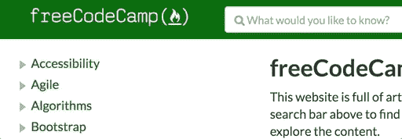
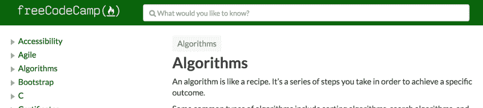
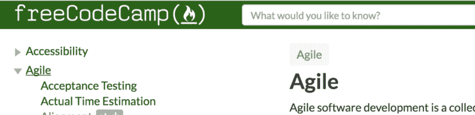
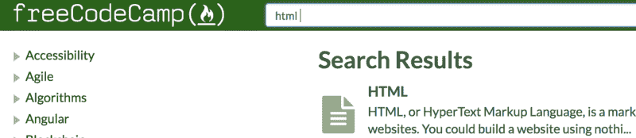
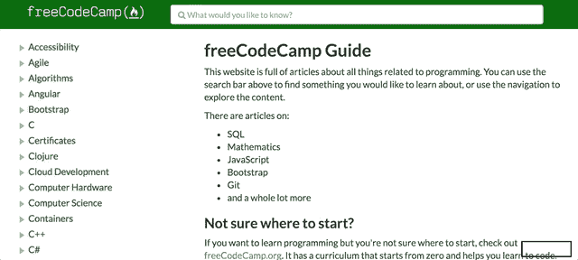

# 下一级可访问性:我使 freeCodeCamp 指南对残疾人可用的 5 种方法

> 原文：<https://www.freecodecamp.org/news/next-level-accessibility-freecodecamp-guide-7cbd6473eabd/>

作者斯科特·文克尔

# 下一级可访问性:我使 freeCodeCamp 指南对残疾人更有用的 5 种方法


Photo by [Nicole De Khors](https://burst.shopify.com/@ndekhors) on [Burst](https://burst.shopify.com/)

2017 年 Hacktoberfest 的大部分时间我都在[自由代码营](https://www.freecodecamp.org/)和一些很棒的人一起工作。我的重点是帮助将他们的[指南](https://guide.freecodecamp.org/)网站的可访问性提升到一个新的水平。

当我第一次看到这个网站时，我知道它对很多人来说是一个极好的资源，所以我接受了这个挑战，以确保它的可用性对每个人来说都是一流的！

在网站上工作也很有趣，因为它是用 [React](https://reactjs.org/) 构建的，所以这一路上带来了一些额外的编码挑战。

让我们一起来看看我发现的 5 个问题以及我是如何解决它们的！

### 可访问性改进#1:跳过导航链接不可用

我在网站上检查的第一件事就是是否有一个可用的跳转导航链接。对于只使用键盘或屏幕阅读器的用户来说，跳过导航链接是一个小而方便的功能。为什么？

#### 问题是

如果没有跳过导航链接，每次页面重新加载时，只使用键盘导航的人将需要`Tab`浏览侧边栏中的每个链接。因为有很多可用的链接，浏览这个部分会很麻烦。

#### 解决方案

实现一个跳转导航链接非常简单。它通常是 DOM(文档对象模型)中的第一项，单击时，键盘焦点被发送到包含页面主要内容的页面元素。

我添加的链接编码为:

```
<a className='skip-link sr-only sr-only-focusable' href='#main'>  Skip to main content</a>
```

`href`属性中的`#main`值将键盘焦点发送到具有`id="main"`属性的页面元素。

为了让这个页面元素获得键盘焦点，我需要向容器添加一个`tabindex`属性:

```
<main className='main' id='main' tabIndex='-1'>  { props.children() }</main>
```

添加`-1`的`tabindex`值允许一个不可聚焦的元素可编程地接收焦点，但是被排除在自然的 tab 键顺序之外。

#### 结果呢

有了跳过导航，使用键盘的人可以跳过重复的区域，如侧边导航区，轻松到达主要内容部分。



Animated GIF showcasing the skip to content link which is only visible on focus.

查看 PR (Pull Request)中的完整代码变更:[添加了跳过链接#4175](https://github.com/freeCodeCamp/guides/pull/4175) 。

### 可访问性改进#2:搜索字段缺少标签

我注意到搜索`input`字段少了一个`label`。每个表单有一个关联的`label``input`是成功用户体验的关键。为什么？

#### 问题是

当`input`字段缺少一个`label`时，屏幕阅读器无法准确描述该字段的预期用途。想象一个没有文本的链接；这个链接是做什么的？

#### 解决方案

这个相当简单。将一个`label`添加到一个`input`就是创建一个具有`for`属性的`label`元素，然后将它与一个具有`id`属性的`input`相关联。

为了不破坏当前网站的设计，我还添加了`srOnly`道具来隐藏`label`。

`label`编码为:

```
<ControlLabel htmlFor='searchInput' srOnly={ true }>  Search</ControlLabel>
```

然后对于现有的`input`控件，我简单的加了`id='searchInput'`道具。

#### 结果呢

现在，当屏幕阅读器用户导航到搜索字段时，他们将听到*“Search”*的`label`值，并对预期的内容有更多的了解。



Screenshot of the search control after the label was added; no visual changes!

查看 PR: [搜索输入 a11y 更新#4123](https://github.com/freeCodeCamp/guides/pull/4123) 中的完整代码更改。

### 可访问性改进#3:侧边栏角色调整

在检查 HTML 源代码时，我注意到一些侧边栏元素错误地使用了`role="presentation"`属性。我还注意到一些元素被标记为`div` s，而不是合适的语义标记。这需要一些调整。为什么？

#### 问题是

网站的这一部分存在两个问题:

1.  当您将`[role="presentation"](https://www.w3.org/TR/wai-aria-1.1/#presentation)`应用到一个元素上时，这将删除所有的语义含义。换句话说，当屏幕阅读器遇到该元素时，没有有意义的通知来通知用户该元素的用途。假设页面上有一个链接，但是它的文本与内容文本颜色相同，并且没有下划线。你怎么知道这是一个链接？
2.  这里的另一个问题是什么时候使用`div`元素来标记有意义的结构。如您所知，`div`元素没有语义含义，通常用于创建页面结构。在用它们代替原生语义元素的情况下，您需要应用适当的`role`属性来表达这种意思。

#### 解决方案

1.  对于每一个导航列表条目和链接，我只是简单地删除了`role`属性，以便让屏幕阅读器用户能够看到语义。
2.  对于生成`div`元素的动态组件，我应用了适当的`role`道具，包括`PanelGroup`组件的`role="list"`，以及`Panel`组件的任何实例的`role="listitem"`。

#### 结果呢

调整`role`道具后，屏幕阅读器用户在遇到这些元素时将听到清晰准确的公告，包括:

*   `Link`组件的实例将被声明为一个*“链接”*元素——非常重要，而且；
*   `PanelGroup`和`Panel`组成项将作为一个*“列表”*元素被宣布。因此，项目的总数也将被公布，给出了在未来的旅程中有多少项目可用的背景。



Screenshot of the sidebar after role attribute adjustments; no visual changes!

查看 PR: [侧导航 a11y 更新#4093](https://github.com/freeCodeCamp/guides/pull/4093) 中的完整代码更改。

### 可访问性改进#4:没有宣布搜索结果的可用性

作为一个视力正常的用户，我知道当搜索成功时，主内容区会改变它的内容来显示一个条目列表。但是一个盲人，屏幕阅读器用户呢？

#### 问题是

如果一个屏幕阅读器用户输入搜索文本并按下`Enter`，将不会显示任何成功搜索或任何结果。人们如何知道什么时候有可用的内容，以便继续前进并发现这些新内容？

#### 解决方案

为了公布当前的结果计数，我创建了一个新的可见隐藏的`aria-live`区域。当出现新的搜索结果时，该区域会填充新的内容。

使用带有一些额外属性的`div`标记该区域:

*   创建“实时”区域，并告诉屏幕阅读器等待其他进程完成后再宣布其内容。
*   `[aria-atomic="true"](https://www.w3.org/TR/wai-aria-1.1/#aria-atomic)`告诉屏幕阅读器朗读区域内的所有文本，而不仅仅是更改的文本。
*   `[role="status"](https://www.w3.org/TR/wai-aria-1.1/#status)`设置屏幕阅读器将实时内容解读为“建议”信息的预期。换句话说，这非常重要，但不是关键的(因为人们可以自己向前导航并发现内容。)

下面是最终的代码片段:

```
<div aria-atomic='true' aria-live='polite' className='sr-only' role='status'>  {`${results.length} result${results.length === 1 ? '' : 's'} found`}</div>
```

注意使用 [ES6 模板文字](https://developer.mozilla.org/en-US/docs/Web/JavaScript/Reference/Template_literals)来插入内容，以及执行三元条件语句来调整复数或单数状态。

#### 结果呢

现在有了主动屏幕阅读器，提交一个搜索词后，辅助技术会公布结果的数量:*“找到 20 个结果！”*



Screenshot of the search results after adding the live region; no visual changes!

请查看 PR: [搜索结果公告#5137](https://github.com/freeCodeCamp/guides/pull/5137) 中的完整代码更改。

### 可访问性改进#5:管理侧边栏链接焦点

我注意到当用键盘导航时，在点击链接加载页面内容后，焦点指示器会停留在当前项目上。这是一个问题。为什么？

#### 问题是

如果没有适当的焦点管理，只有键盘或屏幕阅读器的用户将不得不通过整个侧边栏导航来获得页面内容。不仅如此，也没有声音通知提醒用户在`click()`事件上发生了什么。

#### 解决方案

我最终采用的解决方案有点蹩脚。通常你会在内容容器上创建一个`ref`道具，然后将`ref`对象向上传递给生成侧栏链接元素的组件，然后在容器上设置`focus()`为`click()`。这不是一个可行的解决方案，因为该网站使用了一个叫 Gatsby 的东西，并且向`Link`组件传递对象存在一个[问题。我不是很确定这个问题，但它就是不合作。](https://github.com/freeCodeCamp/guides/issues/897#issuecomment-342404647)

为了绕过这个限制，我的解决方案是这样的:

1.  我给每个适当的侧边栏`Link`组件添加了一个`data-navitem="true"`属性。
2.  在`click()`事件中，`Article`组件加载所请求的内容，将`document.activeElement`设置为点击的链接元素。
3.  在`Article`组件的`componentWillMount()`方法中，我检查当前聚焦的元素(通过`document.activeElement)`的侧边栏链接)是否具有`data-navitem`属性。
4.  如果这个条件是`true`，将键盘焦点转移到`article`元素。

#### 结果呢

现在，当有人使用键盘激活侧边栏中的一个子导航链接时，键盘焦点转移到`article`内容容器。这也为屏幕阅读器用户提供了上下文，传达出在`click()`发生了一些事情。



Animated GIF showcasing focus management to the article on sidebar link click.

查看 PR: [NavItem focus #7818](https://github.com/freeCodeCamp/guides/pull/7818) 中的完整代码更改。

我们做到了！通过这些小小的调整， [freeCodeCamp Guide](https://guide.freecodecamp.org/) 网站的可访问性和可用性提高了不少！人们可以更轻松、更顺利地使用该网站。

这只是我解决几个问题的高层次概要，但是我知道还有更多事情要做。在 [freeCodeCamp 指南 repo](https://github.com/freeCodeCamp/guides) 上的每个人都非常友好，并渴望帮助回答我的新手问题，所以如果你想帮忙，请不要犹豫！

黑客快乐！？？？