# NextJS 和 HarperDB 教程——构建一个完整的生产力计时器应用程序

> 原文：<https://www.freecodecamp.org/news/nextjs-and-harperdb-tutorial-build-a-full-stack-app/>

构建全栈应用可能很困难。你必须考虑前端、API、数据库、认证——以及所有这些东西如何协同工作。

因此，在本文中，我将向您展示如何使用 NextJS 和 HarperDB 完成所有这些事情。

我们将构建一个包含 JSON Web Token 身份验证的全栈任务定时器应用程序，使用 HarperDB 的内置 API 获取数据，并使用 NextJS 呈现数据。我们还将利用 NextJS 的 API。

如果您想知道 HarperDB 是什么，它是一个数据库即服务，允许您使用 SQL 或 NoSQL 查询数据。HarperDB 还有一个内置的 API，让我们不必编写大量的后端代码。

这是我们将要建造的东西。

[下面是源代码](https://github.com/DoableDanny/NextJS-HarperDB-Task-Timer)(记得给它起个星星⭐).

## 内容

*   [设置](#setup)
*   [创建布局组件](#createalayoutcomponenttowrapeverypage)
*   [创建一些可重用的组件](#createsomereusablecomponents)
*   [创建注册页面](#createthesignuppage)
*   [如何注销用户](#howtologouttheuser)
*   [登录页面](#theloginpage)
*   [创建任务上下文](#createataskscontext)
*   [创建任务定时器页面](#createthetasktimerpage)
*   [创建添加/选择任务栏](#createtheaddselecttaskbar)
*   [创建统计页面](#thestatspage)

## 设置

### 1.用 TypeScript 安装 NextJS:

```
npx create-next-app@latest --ts 
```

然后会要求您输入项目名称。我称之为“任务计时器”。

然后，我们可以转到项目目录:

```
cd “task timer” 
```

### 2.安装和设置 TailwindCSS

我们将用[顺风](https://tailwindcss.com/)设计这个项目，所以让我们安装我们需要的一切。

通过 npm 安装 TailwindCSS 及其对等依赖项，然后运行 init 命令生成 tailwind.config.js 和 postcss.config.js:

```
npm install -D tailwindcss postcss autoprefixer
npx tailwindcss init -p 
```

在 tailwind.config.js 文件中添加所有 React 组件文件的路径:

```
module.exports = {
  content: [
    "./src/pages/**/*.{js,ts,jsx,tsx}",
    "./src/components/**/*.{js,ts,jsx,tsx}",
  ],
  theme: {
    extend: {},
  },
  plugins: [],
} 
```

接下来，在项目根目录下创建一个`src`文件夹，并将`styles`和`pages`文件夹拖到`src`中。在`styles/global.css`中，添加以下顺风指令以引入顺风类:

```
@tailwind base;
@tailwind components;
@tailwind utilities; 
```

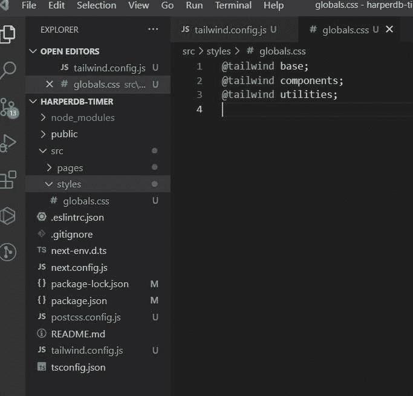

我们的 NextJS 项目现在已经设置好了，可以和 Tailwind 一起使用了。

让我们清空我们的`src/pages/index.tsx`页面，并添加以下内容:

```
import type { NextPage } from "next"

const Home: NextPage = () => {
  return (
    <div>
      <h1 className="text-red-500">Hello World</h1>
    </div>
  )
}

export default Home 
```

运行构建过程，并使用以下命令启动开发服务器:

```
npm run dev 
```

我们的服务器现在将在 [http://localhost:3000](http://localhost:3000) 上运行

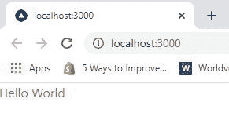

### 3.设置 HarperDB

首先，[用 HarperDB](https://studio.harperdb.io/) 创建一个帐户。

然后创建一个新的 HarperDB 云实例:


为了简单起见，选择云实例:


选择云提供商(我选择了 AWS):


命名云实例，并创建实例凭证:


HarperDB 有一个慷慨的免费层，我们可以用于这个项目，所以选择:


检查您的详细信息是否正确，然后创建实例。

创建实例需要几分钟时间，所以让我们开始为我们的应用程序制作 UI 吧！


## 创建一个布局组件来包装每一页

创建文件夹`src/components`。在这里，我们将创建可以在整个项目中重用的组件。

首先，让我们创建一个文件来保存将在我们的应用程序中使用的任何常量，比如站点标题。像这样的价值观保持单一的真实来源是很有帮助的，这样如果我们想改变它们，我们只需要在一个地方改变它们。

```
// src/constants/constants.ts

export const SITE_TITLE = "Super Simple Task Timer" 
```

现在让我们创建我们的导航栏:

```
// src/components/layout/Navbar.tsx

import Link from "next/link"
import { SITE_TITLE } from "../../constants/constants"

const Navbar = () => {
  return (
    <header className="flex justify-between items-center bg-green-600 text-white py-4 px-4">
      <h2 className="text-lg">
        <Link href="/">
          <a>{SITE_TITLE}</a>
        </Link>
      </h2>
      <nav>
        <ul className="flex">
          <NavLink href="/login">Login</NavLink>
          <NavLink href="/signup">Signup</NavLink>
        </ul>
      </nav>
    </header>
  )
}

interface NavLinkProps {
  href: string
  children: string
}

const NavLink: React.FC<NavLinkProps> = ({ href, children }) => {
  return (
    <li className="ml-8">
      <Link href={href}>
        <a>{children}</a>
      </Link>
    </li>
  )
}

export default Navbar 
```

创建页脚:

```
// src/components/layout/Footer.tsx

import { SITE_TITLE } from "../../constants/constants"

const Footer = () => {
  return (
    <footer className="bg-green-600 text-white text-center py-4">
      <p className="mb-1">{SITE_TITLE} &copy;</p>
      <p>Designed & developed by Danny Adams</p>
    </footer>
  )
}

export default Footer 
```

现在，我们可以创建布局组件来包装每个页面。在`<main>`标签上使用 flex-grow 可以确保页面内容占据页眉和页脚之间的所有可用空间。

```
// src/components/layout/Layout.tsx

import Navbar from "./Navbar"
import Footer from "./Footer"

const Layout: React.FC = ({ children }) => {
  return (
    <div className="min-h-screen flex flex-col">
      <Navbar />
      <main className="flex flex-col grow">{children}</main>
      <div className="mt-auto">
        <Footer />
      </div>
    </div>
  )
}

export default Layout 
```

然后，在`src/pages/_app.tsx`中，我们可以用`Layout`包装每个页面组件:

```
import "../styles/globals.css"
import type { AppProps } from "next/app"
import Layout from "../components/layout/Layout"

function MyApp({ Component, pageProps }: AppProps) {
  return (
    <Layout>
      <Component {...pageProps} />
    </Layout>
  )
}

export default MyApp 
```

我们走吧！现在每个页面都有一个导航栏，内容区占据了 100%的可用空间，页脚总是位于底部。

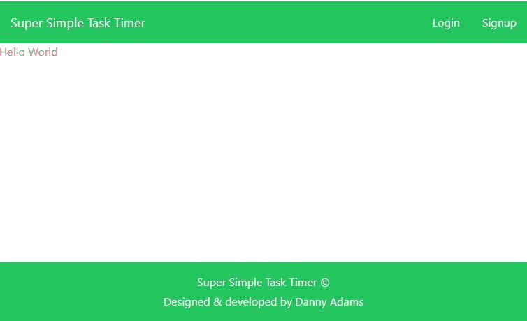

## 创建一些可重用的组件

我们现在将创建一些可以在整个项目中重用的基本组件。

创建按钮组件:

```
// src/components/Button.tsx

interface Props {
  children: React.ReactNode
  color: "primary" | "success" | "secondary" | "warning" | "danger"
  handleClick?: () => void
  type?: "button" | "submit"
  extraClasses?: string
}

const Button: React.FC<Props> = ({
  children,
  color,
  handleClick,
  type,
  extraClasses,
}) => {
  let colors: string
  switch (color) {
    case "primary":
      colors = "bg-blue-500 hover:bg-blue-600"
      break
    case "success":
      colors = "bg-green-500 hover:bg-green-600"
      break
    case "warning":
      colors = "bg-yellow-300 hover:bg-yellow-400 text-black"
      break
    case "secondary":
      colors = "bg-pink-500 hover:bg-pink-600"
      break
    default:
      colors = "bg-red-500 hover:bg-red-600"
  }
  const classes = `rounded text-white py-2 px-4 ${colors} ${extraClasses}`

  return (
    <button className={classes} onClick={handleClick} type={type}>
      {children}
    </button>
  )
}

export default Button 
```

创建一个链接组件，它使用 NextJS Link 在后台自动预取它链接到的页面——使页面快速加载:

```
// src/components/Link.tsx

import NextLink from "next/link"

interface Props {
  href: string
  children: React.ReactNode
}

const Link = ({ href, children }: Props) => {
  return (
    <NextLink href={href}>
      <a className="underline underline-offset-1 text-blue-700">{children}</a>
    </NextLink>
  )
}

export default Link 
```

让我们也创建一个`Alert`组件来显示警告消息，例如，如果用户输入了无效的表单数据，就会显示一条红色的错误消息:

```
// src/components/Alert.tsx

interface Props {
  children: React.ReactNode
  type: "success" | "warning" | "danger"
  key?: number
  extraClasses?: string
}
const Alert = ({ children, type, key, extraClasses }: Props) => {
  let color
  switch (type) {
    case "success":
      color = "bg-blue-500"
      break
    case "warning":
      color = "bg-yellow-300 text-yellow-800"
      break
    default:
      color = "bg-red-500"
  }
  const classes = `text-white text-center p-2 rounded mt-4 ${color} ${extraClasses}`

  return (
    <div key={key} className={classes}>
      {children}
    </div>
  )
}

export default Alert 
```

创建主页标题组件:

```
// src/components/PageHeading.tsx

interface Props {
  extraClasses: string
}

const PageHeading: React.FC<Props> = ({ children, extraClasses }) => {
  const classes = "text-4xl text-green-900 font-semibold " + extraClasses

  return <h1 className={classes}>{children}</h1>
}

export default PageHeading 
```

让我们还创建一个组件，以便在我们的登录和注册表单中重用，该组件包含一个标签和一个输入:

```
// src/components/Form.tsx

interface InputProps {
  inputType: "text" | "email" | "password"
  inputName: string
  handleChange: (e: React.ChangeEvent<HTMLInputElement>) => void
  value: string
}

interface LabelAndInputProps extends InputProps {
  label: string
}

export const LabelAndInput: React.FC<LabelAndInputProps> = ({
  label,
  inputType,
  inputName,
  handleChange,
  value,
}) => {
  return (
    <div className="flex flex-col mb-2">
      <label htmlFor="name">{label}</label>
      <Input
        inputType={inputType}
        inputName={inputName}
        handleChange={handleChange}
        value={value}
      />
    </div>
  )
}

export const Input: React.FC<InputProps> = ({
  inputType,
  inputName,
  handleChange,
  value,
}) => {
  return (
    <input
      className="px-3 py-2 border-gray-200 border-2 rounded"
      type={inputType}
      name={inputName}
      id={inputName}
      onChange={handleChange}
      value={value}
    />
  )
} 
```

## 创建注册页面

[这是注册页面的外观](https://next-js-harper-db-task-timer.vercel.app/signup)。

### 注册页面用户界面

首先，让我们在位置`src/components/signup-page/SignupForm.tsx`创建一个注册表单组件:

```
// src/components/signup-page/SignupForm.tsx

import { useState } from "react"
import { LabelAndInput } from "../Form"
import Button from "../Button"

const SignupForm = () => {
  const [username, setUsername] = useState("")
  const [password1, setPassword1] = useState("")
  const [password2, setPassword2] = useState("")

  return (
    <form className="w-full sm:w-96">
      <LabelAndInput
        label="Username"
        inputType="text"
        inputName="username"
        handleChange={e => setUsername(e.target.value)}
        value={username}
      />
      <LabelAndInput
        label="Password"
        inputType="password"
        inputName="password1"
        handleChange={e => setPassword1(e.target.value)}
        value={password1}
      />
      <LabelAndInput
        label="Confirm password"
        inputType="password"
        inputName="password2"
        handleChange={e => setPassword2(e.target.value)}
        value={password2}
      />
      <Button
        color="success"
        type="submit"
        extraClasses="w-full mt-3 py-3 font-semibold"
      >
        Create Account
      </Button>
    </form>
  )
}

export default SignupForm 
```

我们可以在`src/pages/signup.tsx`创建注册页面并导入上面的表单:

```
// src/pages/signup.tsx

import type { NextPage } from "next"
import SignupForm from "../components/signup-page/SignupForm"
import PageHeading from "../components/PageHeading"

const Signup: NextPage = () => {
  return (
    <div className="mx-auto mt-20">
      <PageHeading extraClasses="text-center mb-8">
        Create an account
      </PageHeading>
      <SignupForm />
    </div>
  )
}

export default Signup 
```

我们的注册页面 UI 现已完成:

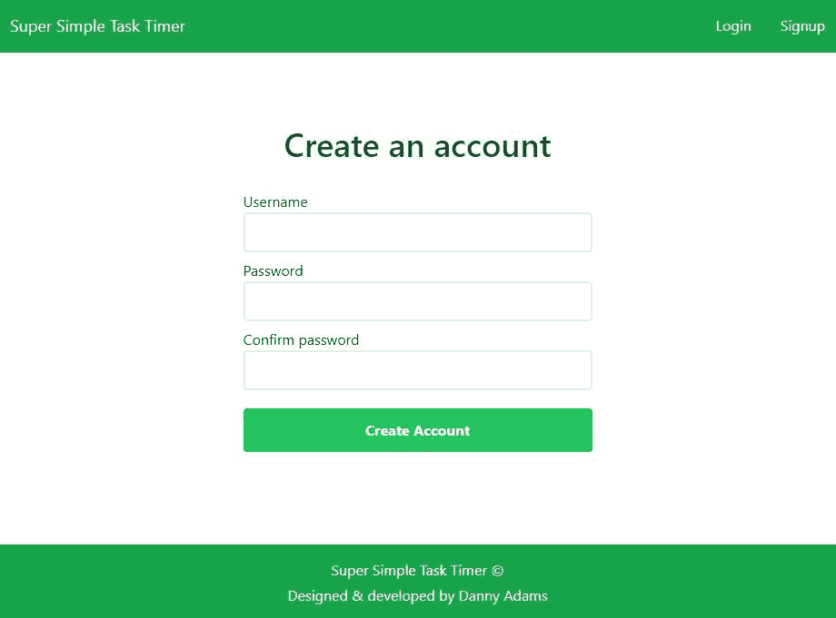

### 注册页面逻辑

回到我们的`SignupForm`组件，添加一个`handleSubmit`回调函数，在表单提交时调用:

```
// src/components/signup-page/SignupForm.tsx

<form className='w-full sm:w-96' onSubmit={handleSubmit}> 
```

在`handleSubmit`函数中，我们需要将表单数据发送到我们的 NextJS API。然后，我们的 API 会将这些数据转发给 HarperDB，以便在 HarperDB 数据库中创建一个新用户。

让我们先写我们的`handleSubmit`函数的开头:

```
// src/components/signup-page/SignupForm.tsx

// ...
import { postFormData } from "../../utils/postFormData"

const SignupForm = () => {
  // ...

  const handleSubmit = async (e: React.FormEvent) => {
    e.preventDefault();

    const formData = { username, password1, password2 };
    const { response, result } = await postFormData(formData, '/api/signup');

    console.log({ response, result });
  }; 
```

现在创建一个`src/utils`文件夹，并定义一个接受任何数据对象和 API 路由的实用函数，然后返回响应和结果:

```
// src/utils/postFormData.ts

export const postFormData = async (data: { [k: string]: any }, url: string) => {
  const requestOptions: RequestInit = {
    method: "POST",
    headers: {
      "Content-Type": "application/json",
    },
    body: JSON.stringify(data),
  }
  const response = await fetch(url, requestOptions)
  const result = await response.json()
  return { response, result }
} 
```

我们需要在`src/pages/api/signup`创建我们的第一个 API 路由。

但在此之前，我们将安装`next-connect`包，它允许我们用类似 expressJS 的语法编写 API，并在错误处理方面为我们节省一些时间:

```
npm install next-connect 
```

在`src/middleware/_defaultHandler.ts`创建一个文件，并添加以下内容:

```
// src/middleware/_defaultHandler.ts

import { NextApiRequest, NextApiResponse } from "next"
import nextConnect from "next-connect"

// This middleware function will run between every request and api handler
const handler = nextConnect<NextApiRequest, NextApiResponse>({
  onError: (err, req, res) => {
    res.status(501).json({ error: `Something went wrong! ${err.message}` })
  },
  onNoMatch: (req, res) => {
    res.status(405).json({ error: `Method ${req.method} Not Allowed` })
  },
})

export default handler 
```

上述中间件功能将与每个 API 请求一起运行，并处理任何请求错误。

我们现在可以在`src/pages/api/signup`创建我们的 API 路由。首先，让我们检查提交的表单数据中是否有错误，如果有，就向客户机发回一组错误消息:

```
// src/pages/api/signup

import type { NextApiRequest, NextApiResponse } from "next"
import handler from "../../middleware/_defaultHandler"

export default handler.post(
  async (req: NextApiRequest, res: NextApiResponse) => {
    const { username, password1, password2 } = req.body

    const errors: string[] = getFormErrors(username, password1, password2)
    if (errors.length > 0) {
      return res.status(400).json({ error: errors })
    }
  }
)

const getFormErrors = (
  username: string,
  password1: string,
  password2: string
) => {
  const errors: string[] = []
  if (!username || !password1 || !password2) {
    errors.push("All fields are required")
  }
  if (password1.length < 6) {
    errors.push("Password must be at least 6 characters")
  }
  if (password1 !== password2) {
    errors.push("Passwords do not match")
  }
  return errors
} 
```

现在，如果我们从前端发布一些不正确的表单数据，我们会将错误消息记录到控制台:

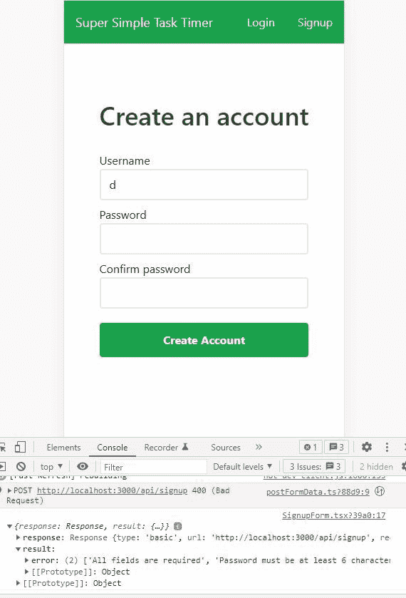

一旦我们知道表单数据是合法的，我们需要将它发送到 HarperDB API，这将为我们创建一个新用户。让我们写一个函数来做这件事。

首先，我们需要 HarperDB 实例 URL。如果您单击您的实例，然后转到“config ”,您将找到您的实例 URL，以及您的实例 API Auth 头——即您的“super_user”密码，该密码允许您向数据库发出任何请求——仅供您查看！

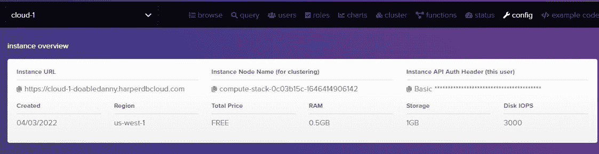

我们在前端和后端都需要实例 URL，所以让我们将它存储在常量文件中:

```
// src/constants/constants.ts

export const SITE_TITLE = "Super Simple Task Timer"
export const DB_URL = "Your_HDB_URL_Here" 
```

我们的密码必须保密，所以它永远不会出现在前端。我们的密码将作为环境变量加载到服务器中。将您的密码添加到项目根目录中的`.env.local`:

```
HARPERDB_PW=Basic yourpasswordgoeshere 
```

HarperDB 在“示例代码”选项卡中按类别列出了所有可以执行的操作:

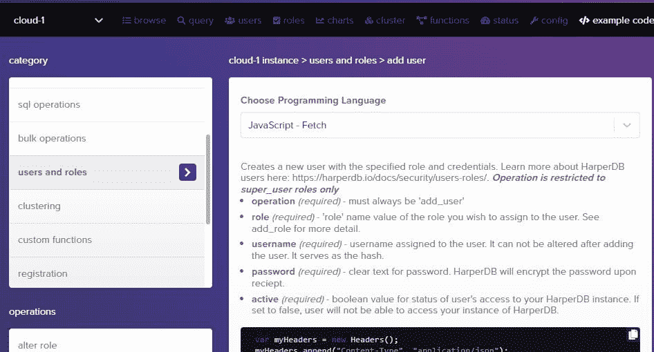

我们想要使用 HarperDB 的“add_user”操作，所以让我们创建自己的函数来实现这一点:

```
// src/utils/harperdb/createNewUser.ts

import { DB_URL } from "../../constants/constants"

// This function can only be ran on the backend as it requires a "super_user" password
export const harperCreateNewUser = async (
  username: string,
  password: string
) => {
  const DB_PW = process.env.HARPERDB_PW
  if (!DB_URL || !DB_PW) {
    console.log("Error: .env variables are undefined")
    throw "Internal server error"
  }
  const myHeaders = new Headers()
  myHeaders.append("Content-Type", "application/json")
  myHeaders.append("Authorization", DB_PW)
  const raw = JSON.stringify({
    operation: "add_user",
    role: "standard_user",
    username: username.toLowerCase(),
    password: password,
    active: true,
  })
  const requestOptions: RequestInit = {
    method: "POST",
    headers: myHeaders,
    body: raw,
    redirect: "follow",
  }

  const response = await fetch(DB_URL, requestOptions)
  const result = await response.json()
  return { response, result }
} 
```

请注意“角色”是如何成为“标准用户”的。如果我们给每个创建帐户的人一个“超级用户”角色，那么任何人都可以删除您的表并破坏我们的数据库！

现在让我们设置这个“标准用户”角色，并制作我们需要的表格。

创建一个名为“productivity_timer”的模式(模式是一组表)。在此模式中，创建一个名为“tasks”的表，该表具有 hash 属性(每个条目的唯一键)“id”:

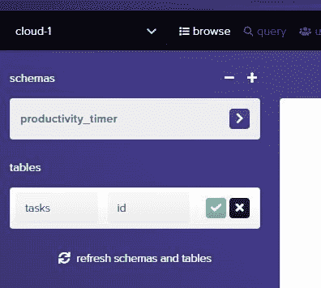

我们现在需要创建“standard_user”角色来限制我们的用户将拥有的访问权限。转到“角色”，创建一个名为“标准用户”的标准角色。然后将所有任务表访问权限更改为 true:

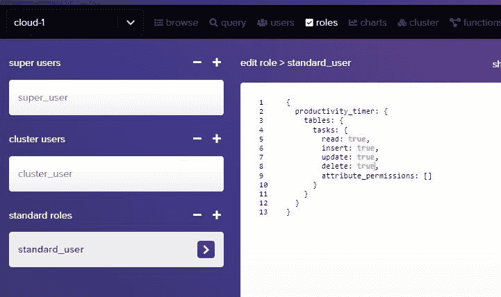

让我们也添加一些任务到我们的表中，稍后我们可以将它们提取到我们的应用程序中:

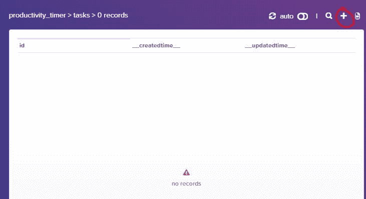

添加以下 JSON 来添加一些任务:

```
[
  { "username": "dan", "task_name": "make header", "time_in_seconds": 0 },
  { "username": "dan", "task_name": "make footer", "time_in_seconds": 0 },
  { "username": "sally", "task_name": "learn NextJS", "time_in_seconds": 0 }
] 
```

回到我们在`src/pages/api/signup`的 API 路径，我们现在可以添加代码在 HarperDB 中创建一个新用户:

```
// src/pages/api/signup

import type { NextApiRequest, NextApiResponse } from "next"
import handler from "../../middleware/_defaultHandler"
import { harperCreateNewUser } from "../../utils/harperdb/createNewUser"

export default handler.post(
  async (req: NextApiRequest, res: NextApiResponse) => {
    const { username, password1, password2 } = req.body

    const errors: string[] = getFormErrors(username, password1, password2)
    if (errors.length > 0) {
      return res.status(400).json({ error: errors })
    }

    // Create new user with HarperDB, and send back result
    try {
      const { response, result } = await harperCreateNewUser(
        username,
        password1
      )
      return res.status(response.status).json(result)
    } catch (err) {
      return res.status(500).json({ error: err })
    }
  }
) 
```

为了测试创建一个新用户，您现在需要用“ctrl + c”来停止 dev 服务器，然后用`npm run dev`重新启动。环境变量。

转到注册页面，填写表格，然后提交。呜哇！我们已经创造了我们的第一个用户！

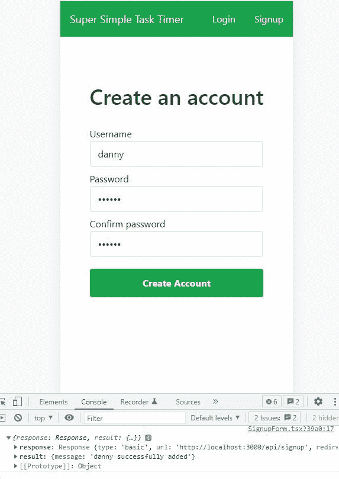

如果我们查看 HarperDB 上的 users 表，我们会看到新用户已成功添加:

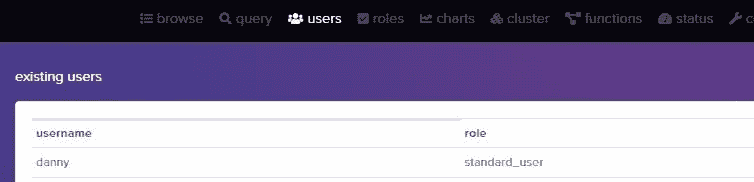

现在，回到前端，我们需要处理从服务器发回的响应和结果。

如果从服务器发回的响应状态代码不是 200，我们知道出了问题。因此，我们可以在状态变量中设置错误，并提前从`handleSubmit`返回:

```
// src/components/signup-page/SignupForm.tsx

const [errors, setErrors] = useState<string | string[]>("")

const handleSubmit = async (e: React.FormEvent) => {
  e.preventDefault()
  setErrors("")

  const formData = { username, password1, password2 }
  const { response, result } = await postFormData(formData, "/api/signup")

  // Account not created successfully
  if (response.status !== 200) {
    setErrors(result.error)
    return
  }
} 
```

让我们在表单底部显示这些错误:

```
// src/components/signup-page/SignupForm.tsx

// ...
import Alert from "../Alert"

const SignupForm = () => {
  // ...
  const [errors, setErrors] = useState<string | string[]>("")

  // ...

  const displayErrors = () => {
    if (errors.length === 0) return

    return typeof errors === "string" ? (
      <Alert type="danger">{errors}</Alert>
    ) : (
      errors.map((err, i) => (
        <Alert key={i} type="danger">
          {err}
        </Alert>
      ))
    )
  }

  return (
    <form className="w-full sm:w-96" onSubmit={handleSubmit}>
      {/* form stuff... */}

      {displayErrors()}
    </form>
  )
}

export default SignupForm 
```

现在，如果用户输入无效的表单数据，将会显示错误:

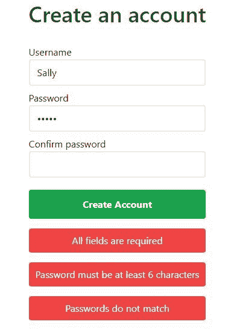

如果用户已经存在，HarperDB 将向我们发送一条适当的错误消息:

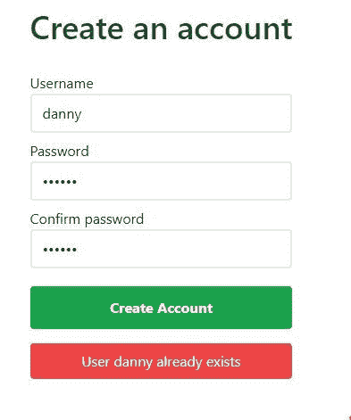

不错！

但是如果响应状态代码是 200，那么我们就知道帐户创建成功了。因此，我们可以为用户获取一个 JSON Web 令牌(JWT ),它将用于对用户进行身份验证，并允许他们访问受保护的路由。

### 如何让用户获得一个 JSON Web 令牌

HarperDB 可以为数据库中的每个用户创建 jwt，这意味着我们不必安装任何包并自己处理逻辑——太好了！

我们的 JWT 认证将如何工作？当 HarperDB 向前端发回一个 JWT 时，我们将把 JWT 保存在浏览器的 localStorage 中。然后，每当用户发出请求时，我们将从 localStorage 获取 JWT，并将其附加到请求头。HarperDB 将自动检查请求头中是否有 JWT，并检查它是否有效。如果是，它将继续请求。

但是首先，我们需要使用 React 的上下文 API 创建一个用户上下文，这样用户的用户名在整个应用程序中都是可用的。

```
// src/contexts/UserContext.ts

import { createContext } from "react"

export const UserContext = createContext({
  username: "",
  setUsername: (username: string) => {},
}) 
```

然后，我们需要将整个应用程序包装在`UserContext.Provider`中，这样`username`和`setUsername`在每个页面上都是可用的。最初，`username`将是一个空字符串。

```
// src/pages/_app.tsx

import { useState } from "react"
// ...
import { UserContext } from "../contexts/UserContext"

function MyApp({ Component, pageProps }: AppProps) {
  const [username, setUsername] = useState("")

  return (
    <UserContext.Provider value={{ username, setUsername }}>
      <Layout>
        <Component {...pageProps} />
      </Layout>
    </UserContext.Provider>
  )
}

export default MyApp 
```

现在让我们编写一个从 HarperDB 获取 jwt 的函数。HarperDB 将检查用户名和密码是否正确，然后根据用户名创建 jwt，并将它们发送回我们的应用程序:

```
// src/utils/harperdb/fetchJWTTokens.ts

import { DB_URL } from "../../constants/constants"

export const harperFetchJWTTokens = async (
  username: string,
  password: string
) => {
  if (!DB_URL) {
    console.log("Error: DB_URL undefined")
    throw "Internal server error"
  }

  const myHeaders = new Headers()
  myHeaders.append("Content-Type", "application/json")

  const raw = JSON.stringify({
    operation: "create_authentication_tokens",
    username: username,
    password: password,
  })

  const requestOptions: RequestInit = {
    method: "POST",
    headers: myHeaders,
    body: raw,
    redirect: "follow",
  }

  const response = await fetch(DB_URL, requestOptions)
  const result = await response.json()
  return { response, result }
} 
```

回到`SignupForm.tsx`，我们需要使用上面的函数获取 jwt，检查 HarperDB 是否成功创建并发送回它们，如果是，则验证用户:

```
// src/components/signup-page/SignupForm.tsx

import { useState, useContext } from "react"
import { UserContext } from "../../contexts/UserContext"
import { useRouter } from "next/router"
import { harperFetchJWTTokens } from "../../utils/harperdb/fetchJWTTokens"
// ...

const SignupForm = () => {
  //...

  const user = useContext(UserContext)
  const router = useRouter()

  const handleSubmit = async (e: React.FormEvent) => {
    // ...

    // Account created successfully; get JWTs
    try {
      const { response, result } = await harperFetchJWTTokens(
        username,
        password1
      )
      const accessToken = result.operation_token
      if (response.status === 200 && accessToken) {
        authenticateUser(username, accessToken)
      } else {
        // Account created, but failed to get JWTs
        // Redirect to login page
        router.push("/login")
      }
    } catch (err) {
      console.log(err)
      setErrors("Whoops, something went wrong :(")
    }
  }

  const authenticateUser = (username: string, accessToken: string) => {
    user.setUsername(username)
    localStorage.setItem("access_token", accessToken)
  }

  // ...
}

export default SignupForm 
```

上面，如果 HarperDB 成功发送回操作令牌，我们将它保存到 localStorage，这样只要 JWT 没有过期，它就可以用来认证用户，并在上下文中设置用户名。

让我们来测试一下。当我们创建一个新用户时，我们应该获得一个存储在 localStorage 中的访问令牌。创建一个新用户，打开你的 chrome 开发工具，然后在“应用程序”下你应该会看到访问令牌。

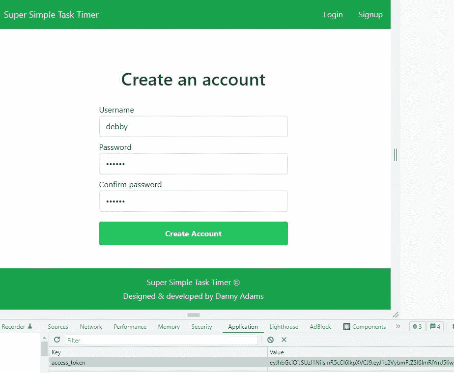

厉害！

在`src/pages/signup.tsx`中，让我们根据是否设置了用户名来渲染不同的组件:

```
// src/pages/signup.tsx

import { useContext } from "react"
import { UserContext } from "../contexts/UserContext"
import Alert from "../components/Alert"
// ...

const Signup: NextPage = () => {
  const { username } = useContext(UserContext)

  return (
    <div className="mx-auto mt-20">
      {username ? (
        <Alert type="success">You are logged in as {username}</Alert>
      ) : (
        <>
          <PageHeading extraClasses="text-center mb-8">
            Create an account
          </PageHeading>
          <SignupForm />
        </>
      )}
    </div>
  )
}

export default Signup 
```

现在，当我们创建一个帐户时，我们得到这个:


但是我们有一个问题:当我们刷新页面时，context 不保存用户名，这意味着当我们刷新页面时，注册表单将再次显示，即使用户已经登录。

为了解决这个问题，我们可以创建一个名为`useUser`的自定义钩子。

### 创建用户自定义挂钩

每当用户转到新页面或刷新当前页面时，`useUser`钩子将运行一次。

让我们首先创建钩子。我们还将把`username`和`setUsername`移到这个钩子中，以保持事物的有序。

```
// src/custom-hooks/useUser.ts

import { useState, useEffect } from "react"
import { harperGetUsername } from "../utils/harperdb/getUsername"

export const useUser = () => {
  const [username, setUsername] = useState("")

  useEffect(() => {
    // User is logged in
    if (username) return

    // Check for access token and try to log user in
    const accessToken = localStorage.getItem("access_token")
    if (accessToken) {
      tryLogUserIn(accessToken)
    }

    async function tryLogUserIn(accessToken: string) {
      const username = await harperGetUsername(accessToken)
      if (username) {
        setUsername(username)
      }
    }
  })

  return { username, setUsername }
} 
```

现在我们需要创建`harperGetUsername`函数。这个函数将把访问令牌发送给 HarperDB。然后 HarperDB 将检查访问令牌是否有效，并检查它属于哪个用户。如果一切正常，那么 HarperDB 将发回相应的用户信息。

```
// src/utils/harperdb/getUsername.ts

import { DB_URL } from "../../constants/constants"

export const harperGetUsername = async (accessToken: string) => {
  const myHeaders = new Headers()
  myHeaders.append("Content-Type", "application/json")
  myHeaders.append("Authorization", "Bearer " + accessToken)

  const raw = JSON.stringify({
    operation: "user_info",
  })

  const requestOptions: RequestInit = {
    method: "POST",
    headers: myHeaders,
    body: raw,
    redirect: "follow",
  }

  try {
    const response = await fetch(DB_URL, requestOptions)
    const result = await response.json()
    if (response.status === 200) {
      return result.username
    }
  } catch (err) {
    console.log(err)
  }
  return null
} 
```

我们的`useUser`钩子做好了。让我们在`_app.tsx`中实例化它，以便每次访问新页面时，`useEffect`函数将运行并验证用户:

```
// src/pages/_app.tsx

// ...
import { useUser } from "../custom-hooks/useUser"

function MyApp({ Component, pageProps }: AppProps) {
  // Remove below line
  // const [username, setUsername] = useState('');
  const { username, setUsername } = useUser()

  return (
    <UserContext.Provider value={{ username, setUsername }}>
      <Layout>
        <Component {...pageProps} />
      </Layout>
    </UserContext.Provider>
  )
}

export default MyApp 
```

现在，当我们刷新页面时，使用存储在 localStorage 中的访问 JWT 获取用户的用户名，使我们的用户保持登录状态。厉害！


Logged in alert

## 如何注销用户

我们正在实现的身份验证系统是“无状态的”——这意味着不会在数据库或服务器中存储任何信息来告诉我们谁登录了，谁没有登录。只有一个访问 JWT 存储在客户端以验证用户。

我们注销用户的唯一方法是删除用户本地存储中的访问令牌。当然，如果他们在多个设备上登录，那么他们只能从他们所在的设备上注销。

此外，如果访问令牌被盗，那么任何人都可以冒充该用户并访问他们的数据。这是我们认证系统的一个主要弱点。

解决这个问题的一种方法是使用[刷新令牌](https://auth0.com/blog/refresh-tokens-what-are-they-and-when-to-use-them/)，但是在本教程中，我们将保持简单，只使用一个 JWT 来访问受保护的路由。

在我们的`Navbar`组件中，让我们添加一个注销按钮。如果没有设置`username`，我们将使用一个三元运算符来显示“登录”和“注册”链接。如果设置了`username`，那么用户就登录了，所以我们可以向他们显示“定时器”和“统计”页面的链接，以及“注销”按钮。

```
// src/components/layout/Navbar.tsx

import Link from "next/link"
import { useContext } from "react"
import { SITE_TITLE } from "../../constants/constants"
import { UserContext } from "../../contexts/UserContext"

const Navbar = () => {
  const { username, setUsername } = useContext(UserContext)

  const handleLogout = () => {
    localStorage.removeItem("access_token")
    setUsername("")
  }

  return (
    <header className="flex justify-between items-center bg-green-600 text-white py-4 px-4">
      <h2 className="text-lg">
        <Link href="/">
          <a>{SITE_TITLE}</a>
        </Link>
      </h2>
      <nav>
        <ul className="flex items-center">
          {username ? (
            <>
              <NavLink href="/">Timer</NavLink>
              <NavLink href="/stats">Stats</NavLink>
              <button
                onClick={handleLogout}
                className="border py-1 px-3 ml-8 rounded hover:bg-green-700"
                type="button"
              >
                Logout
              </button>
            </>
          ) : (
            <>
              <NavLink href="/login">Login</NavLink>
              <NavLink href="/signup">Signup</NavLink>
            </>
          )}
        </ul>
      </nav>
    </header>
  )
}
// ... 
```

## 登录页面

[这是我们将在本部分构建的登录页面](https://next-js-harper-db-task-timer.vercel.app/login)。

### 登录页面用户界面

让我们制作登录页面的 UI。首先:

```
// src/pages/login.tsx

import { useContext } from "react"
import type { NextPage } from "next"
import { UserContext } from "../contexts/UserContext"
import PageHeading from "../components/PageHeading"
import LoginForm from "../components/login-page/LoginForm"

const Login: NextPage = () => {
  const { username } = useContext(UserContext)

  return (
    <div className="grow flex flex-col items-center mt-20">
      {username ? (
        <p>
          You are logged in as{" "}
          <span className="text-green-600 font-semibold">{username}</span> 👋
        </p>
      ) : (
        <>
          <PageHeading extraClasses="text-center mb-8">Log in</PageHeading>
          <LoginForm />
        </>
      )}
    </div>
  )
}

export default Login 
```

接下来，创建`LoginForm`:

```
// src/components/login-page/LoginForm.tsx

import { useState } from "react"
import { LabelAndInput } from "../Form"
import Button from "../Button"
import Alert from "../Alert"

const LoginForm = () => {
  const [username, setUsername] = useState("")
  const [password, setPassword] = useState("")

  return (
    <form className="w-full sm:w-96">
      <LabelAndInput
        label="Username"
        inputType="text"
        inputName="username"
        handleChange={e => setUsername(e.target.value)}
        value={username}
      />
      <LabelAndInput
        label="Password"
        inputType="password"
        inputName="password"
        handleChange={e => setPassword(e.target.value)}
        value={password}
      />
      <Button color="success" extraClasses="w-full mt-3 py-3 font-semibold">
        Login
      </Button>

      {error && <Alert type="danger">{error}</Alert>}
    </form>
  )
}

export default LoginForm 
```

现在我们可以在登录表单上创建一个`handleSubmit`函数:

```
// src/components/login-page/LoginForm.tsx

import { useState, useContext } from "react"
// ...
import { UserContext } from "../../contexts/UserContext"

const LoginForm = () => {
  // ...
  const [error, setError] = useState("")
  const user = useContext(UserContext)

  const handleSubmit = (e: React.FormEvent) => {
    e.preventDefault()
    setError("")
  }

  return (
    <form className="w-full sm:w-96" onSubmit={handleSubmit}>
      {/* ... */}
    </form>
  )
}

export default LoginForm 
```

完成我们剩余的`handleSubmit`功能:

```
// src/components/login-page/LoginForm.tsx

const handleSubmit = async (e: React.FormEvent) => {
  e.preventDefault()
  setError("")
  if (!username || !password) {
    setError("Username and password required")
    return
  }

  try {
    const { response, result } = await harperFetchJWTTokens(username, password)
    const { status } = response
    const accessToken = result.operation_token
    if (status === 200 && accessToken) {
      authenticateUser(username, accessToken)
    } else if (status === 401) {
      setError("Check your username and password are correct")
    } else {
      setError("Whoops, something went wrong :(")
    }
  } catch (err) {
    console.log(err)
    setError("Whoops, something went wrong :(")
  }
}

const authenticateUser = (username: string, accessToken: string) => {
  user.setUsername(username)
  localStorage.setItem("access_token", accessToken)
} 
```

现在，如果我们输入一个不在我们数据库中的用户的详细信息，我们会得到一个错误:

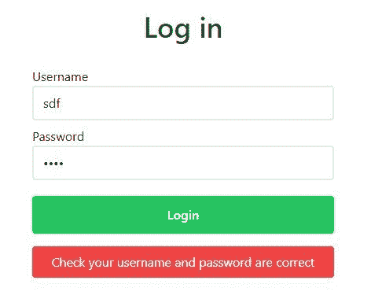

如果我们以现有用户身份登录:


我们现在可以创建一个帐户并登录我们的应用程序。厉害！

## 创建任务上下文

我们的计时器页面('/')和统计页面('/stats ')都需要知道用户添加的任务，以及用户在每个任务上花费的秒数。我们可以使用上下文 API 在页面之间共享任务状态。

首先，让我们为任务创建一个类型，以便 TypeScript 可以告诉我们任务是否缺少属性，或者我们是否试图访问任务上不存在的属性，从而使我们的代码更加健壮:

```
// src/types/Task.ts

export interface Task {
  __createdtime__: number
  __updatedtime__: number
  username: string
  time_in_seconds: number
  id: string
  task_name: string
} 
```

接下来，我们可以创建任务上下文:

```
// src/contexts/TasksContext.ts

import React, { createContext } from "react"
import type { Task } from "../types/Task"

interface TasksContext {
  tasks: Task[]
  setTasks: React.Dispatch<React.SetStateAction<Task[]>>
  getAndSetTasks: (username: string) => Promise<void>
}

export const TasksContext = createContext({} as TasksContext) 
```

在我们用任务上下文提供者包装我们的应用程序之前，让我们创建一个定制钩子，它将包含一个`useEffect`钩子，每次访问新页面或刷新页面时都会运行这个钩子。它将检查用户是否登录，如果任务状态不包含任务，它将尝试从数据库中提取任务:

```
// src/custom-hooks/useTasks.ts

import { useState, useCallback, useEffect } from "react"
import type { Task } from "../types/Task"
import { harperGetTasks } from "../utils/harperdb/getTasks"

export const useTasks = (username: string) => {
  const [tasks, setTasks] = useState<Task[]>([])

  // Get tasks from db then set task state
  const getAndSetTasks = useCallback(
    async (username: string) => {
      try {
        const tasks: Task[] = await harperGetTasks(username)
        setTasks(tasks)
      } catch (err) {
        console.log(err)
      }
    },
    [setTasks]
  )

  useEffect(() => {
    if (!username || tasks.length > 0) return
    getAndSetTasks(username)
  }, [username, tasks.length, getAndSetTasks])

  return { tasks, setTasks, getAndSetTasks }
} 
```

现在我们需要定义`harperGetTasks`函数来从数据库中获取所有包含我们用户用户名的任务。如您所见，HarperDB 支持 SQL 和 NoSQL 操作。我们将用户最近处理的任务排在最上面:

```
// src/utils/harperdb/getTasks.ts

import { harperFetch } from "./harperFetch"

export const harperGetTasks = async (username: string) => {
  const data = {
    operation: "sql",
    sql: `SELECT * FROM productivity_timer.tasks WHERE username = '${username}' ORDER BY __updatedtime__ DESC`,
  }

  const { result } = await harperFetch(data)
  return result
} 
```

从现在开始，我们所有的 HarperDB 函数都包含相同的样板文件，所以我创建了一个`harperFetch`实用函数来保持代码简洁:

```
// src/utils/harperFetch.ts

import { DB_URL } from "../../constants/constants"

export const harperFetch = async (data: { [key: string]: any }) => {
  const accessToken = localStorage.getItem("access_token")
  if (!accessToken) throw { error: "You need to log in" }

  const myHeaders = new Headers()
  myHeaders.append("Content-Type", "application/json")
  myHeaders.append("Authorization", "Bearer " + accessToken)

  const raw = JSON.stringify(data)

  const requestOptions: RequestInit = {
    method: "POST",
    headers: myHeaders,
    body: raw,
    redirect: "follow",
  }

  const response = await fetch(DB_URL, requestOptions)
  const result = await response.json()
  return { response, result }
} 
```

好了，现在让我们让应用程序中的所有页面访问`tasks`状态:

```
// src/pages/_app.tsx

// ...
import { TasksContext } from "../contexts/TasksContext"
import { useTasks } from "../custom-hooks/useTasks"

function MyApp({ Component, pageProps }: AppProps) {
  // ...
  const { tasks, setTasks, getAndSetTasks } = useTasks(username)

  console.log(tasks)

  return (
    <UserContext.Provider value={{ username, setUsername }}>
      <TasksContext.Provider value={{ tasks, setTasks, getAndSetTasks }}>
        <Layout>
          <Component {...pageProps} />
        </Layout>
      </TasksContext.Provider>
    </UserContext.Provider>
  )
}

export default MyApp 
```

现在，我以“dan”的身份登录，所以我应该可以看到 dan 的所有任务。

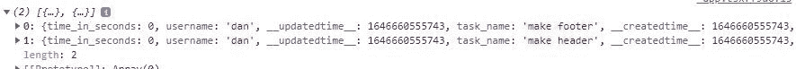

## 创建任务计时器页面

主页用户界面需要看起来像这样:

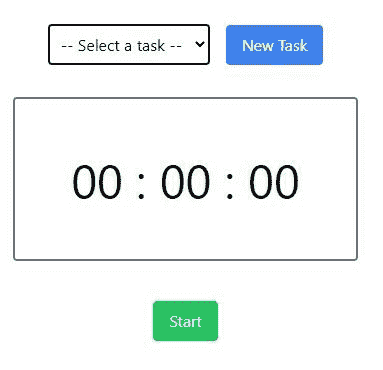

最上面一行是用户可以从下拉菜单中选择一个存储在数据库中的任务。他们还可以向数据库添加新任务。

然后在下面，我们有一个计时器，它会跟踪用户在每项任务上花了多长时间。

[这是我们将在本节中构建的页面](https://next-js-harper-db-task-timer.vercel.app/)。

## 创建添加/选择任务栏

让我们首先创建选择或添加任务行，使其成为要导入到主页中的组件:

```
// src/components/home-page/Taskbar.tsx

import { useState, useContext } from "react"
import { harperAddNewTask } from "../../utils/harperdb/addNewTask"
import { UserContext } from "../../contexts/UserContext"
import { TasksContext } from "../../contexts/TasksContext"
import Button from "../Button"

interface Props {
  selectedTaskId: string
  setSelectedTaskId: React.Dispatch<React.SetStateAction<string>>
  setErrorMessage: React.Dispatch<React.SetStateAction<string>>
  setSeconds: React.Dispatch<React.SetStateAction<number>>
  pauseTimer: () => void
}

const TaskBar = ({
  selectedTaskId,
  setSelectedTaskId,
  setErrorMessage,
  setSeconds,
  pauseTimer,
}: Props) => {
  const { username } = useContext(UserContext)
  const { tasks, getAndSetTasks } = useContext(TasksContext)

  const [isUserAddingNewTask, setIsUserAddingNewTask] = useState(false)
  const [taskInputValue, setTaskInputValue] = useState("")

  const handleChangeTaskInput = (e: { target: HTMLInputElement }) => {
    setTaskInputValue(e.target.value)
  }

  const handleSelectTask = (e: { target: HTMLSelectElement }) => {
    setErrorMessage("")
    setSelectedTaskId(e.target.value)
    setSeconds(0)
    pauseTimer()
  }

  const handleClickAddNewTask = () => {
    if (taskInputValue.trim() === "") {
      setErrorMessage("Type a task!")
      return
    }
    addNewTask()
    resetAddingNewTask()
  }

  const addNewTask = async () => {
    try {
      const { response } = await harperAddNewTask(username, taskInputValue)
      if (response.status === 200) {
        // Task added to db successfully
        getAndSetTasks(username)
      } else setErrorMessage("Whoops, something went wrong")
    } catch (err) {
      console.log(err)
      setErrorMessage("Whoops, something went wrong")
    }
  }

  const resetAddingNewTask = () => {
    setTaskInputValue("")
    setIsUserAddingNewTask(false)
  }

  return (
    <div>
      {isUserAddingNewTask ? (
        <>
          <input
            type="text"
            placeholder="Enter task here..."
            value={taskInputValue}
            onChange={handleChangeTaskInput}
            className="border p-2 mr-2"
          />
          <Button color="primary" handleClick={handleClickAddNewTask}>
            Add task
          </Button>
          <Button
            color="secondary"
            handleClick={() => setIsUserAddingNewTask(false)}
            extraClasses="ml-1"
          >
            Cancel
          </Button>
        </>
      ) : (
        <>
          <select
            className="mr-4 p-2 border"
            name="task"
            id="task"
            onChange={handleSelectTask}
          >
            {selectedTaskId === "" && (
              <option disabled selected value="" hidden>
                -- Select a task --
              </option>
            )}
            {tasks.map(task => (
              <option
                key={task.id}
                value={task.id}
                selected={task.id === selectedTaskId}
              >
                {task.task_name}
              </option>
            ))}
          </select>
          <Button
            handleClick={() => setIsUserAddingNewTask(true)}
            color="primary"
          >
            New Task
          </Button>
        </>
      )}
    </div>
  )
}

export default TaskBar 
```

上图，在 JSX 中，当用户点击“新建任务”按钮时，`isUserAddingNewTask`被设置为 true，并呈现三元语句的第一部分。这允许用户添加新任务。

让我们创建`harperAddNewTask`函数:

```
// src/utils/harperdb/addNewTask.ts

import { harperFetch } from "./harperFetch"

export const harperAddNewTask = async (username: string, taskName: string) => {
  const data = {
    operation: "insert",
    schema: "productivity_timer",
    table: "tasks",
    records: [
      {
        username: username,
        task_name: taskName,
        time_in_seconds: 0,
      },
    ],
  }

  const responseAndResult = await harperFetch(data)
  return responseAndResult
} 
```

现在，如果我们将`Taskbar`导入主页，我们将看到:

```
// src/pages/index.tsx

import type { NextPage } from "next"
import Taskbar from "../components/home-page/Taskbar"

const Home: NextPage = () => {
  return (
    <div>
      <Taskbar />
    </div>
  )
}

export default Home 
```

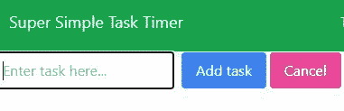

TypeScript 对我们的指责是正确的，因为`Taskbar`缺少了一些道具，但我们很快会回来讨论这个问题。

### 创建计时器

首先，让我们编写一个函数，它接受任务 ID 和以秒为单位的时间，并更新数据库中的任务:

```
// src/utils/harperdb/saveTaskTime.ts

import { harperFetch } from "./harperFetch"

export const harperSaveTaskTime = async (
  taskId: string,
  newSeconds: number
) => {
  const data = {
    operation: "sql",
    sql: `UPDATE productivity_timer.tasks SET time_in_seconds = '${newSeconds}' WHERE id = '${taskId}'`,
  }

  const responseAndResult = await harperFetch(data)
  return responseAndResult
} 
```

接下来，创建一个自定义钩子来保存秒的状态(`seconds`)、计时器是否正在运行(`isTimerOn`)以及启动和停止计时器运行所需的函数:

```
// src/custom-hooks/useTimer.ts

import { useState, useRef } from "react"

const useTimer = () => {
  const [isTimerOn, setIsTimerOn] = useState(false)
  const [seconds, setSeconds] = useState(0)

  const intervalRef = useRef<NodeJS.Timer | null>(null)

  const startTimer = () => {
    setIsTimerOn(true)

    const intervalId = setInterval(() => {
      setSeconds(prev => prev + 1)
    }, 1000)

    intervalRef.current = intervalId
  }

  const pauseTimer = () => {
    setIsTimerOn(false)
    clearInterval(intervalRef.current as NodeJS.Timeout)
  }

  return {
    isTimerOn,
    seconds,
    setSeconds,
    startTimer,
    pauseTimer,
  }
}

export default useTimer 
```

在我们的计时器上，我们希望以小时:分钟:秒显示时间，但我们将以秒为单位记录经过的时间。所以我们需要一种将秒转换成 HH:MM:SS 的方法。我们将通过一个`formatTime`实用函数来实现这一点:

```
// src/utils/formatTime.ts

const SECONDS_PER_HOUR = 3600
const SECONDS_PER_MINUTE = 60

// HH:MM:SS
export const formatTime = (seconds: number) => {
  const { hours, mins, secs } = calculateHoursMinsAndSecs(seconds)

  const formattedHours = prependZeroIfLessThanTen(hours)
  const formattedMins = prependZeroIfLessThanTen(mins)
  const formattedSecs = prependZeroIfLessThanTen(secs)

  return {
    formattedHours,
    formattedMins,
    formattedSecs,
  }
}

// Prefix time with 0 if less than 10\. E.g. '1' => '01'.
const prependZeroIfLessThanTen = (time: number) => {
  const formattedTime: string = time < 10 ? `0${time}` : `${time}`
  return formattedTime
}

// Convert seconds into hours, mins, and secs
const calculateHoursMinsAndSecs = (seconds: number) => {
  const hours = calculateHours(seconds)
  const mins = calculateMins(seconds)
  const secs = calculateSecs(seconds)

  return {
    hours,
    mins,
    secs,
  }
}

const calculateHours = (seconds: number) => {
  const hours = Math.floor(seconds / SECONDS_PER_HOUR)
  return hours
}

const calculateMins = (seconds: number) => {
  const mins = Math.floor((seconds % SECONDS_PER_HOUR) / SECONDS_PER_MINUTE)
  return mins
}

const calculateSecs = (seconds: number) => {
  const secs = Math.floor((seconds % SECONDS_PER_HOUR) % SECONDS_PER_MINUTE)
  return secs
} 
```

让我们现在创建我们的计时器组件(注意:不要惊慌，我们接下来将传递所有的道具！):

```
// src/components/home-page/Timer.tsx

import { useContext } from "react"
import { TasksContext } from "../../contexts/TasksContext"
import { UserContext } from "../../contexts/UserContext"
import { formatTime } from "../../utils/formatTime"
import { harperSaveTaskTime } from "../../utils/harperdb/saveTaskTime"
import Button from "../Button"
import type { RecentTaskTime } from "../../types/RecentTaskTime"

interface TimerProps {
  seconds: number
  setSeconds: React.Dispatch<React.SetStateAction<number>>
  isTimerOn: boolean
  startTimer: () => void
  pauseTimer: () => void
  setErrorMessage: React.Dispatch<React.SetStateAction<string>>
  selectedTaskId: string
  selectedTaskName: string
  setRecentTaskTimes: React.Dispatch<React.SetStateAction<RecentTaskTime[]>>
}

export const Timer: React.FC<TimerProps> = ({
  seconds,
  setSeconds,
  isTimerOn,
  startTimer,
  pauseTimer,
  setErrorMessage,
  selectedTaskId,
  selectedTaskName,
  setRecentTaskTimes,
}) => {
  const { tasks, getAndSetTasks } = useContext(TasksContext)
  const { username } = useContext(UserContext)

  const { formattedHours, formattedMins, formattedSecs } = formatTime(seconds)

  const handleStartTimer = () => {
    setErrorMessage("")
    if (selectedTaskId == "") {
      setErrorMessage("Please select a task")
    } else {
      startTimer()
    }
  }

  const handleLogTime = async () => {
    pauseTimer()
    const prevTaskSeconds = getTaskTimeFromId(selectedTaskId)
    const newTaskSeconds = prevTaskSeconds + seconds
    const { response, result } = await harperSaveTaskTime(
      selectedTaskId,
      newTaskSeconds
    )
    if (response.status === 200) {
      getAndSetTasks(username)
      setSeconds(0)
      setRecentTaskTimes(prev => [
        { name: selectedTaskName, seconds: seconds },
        ...prev,
      ])
    } else setErrorMessage("Whoops, something went wrong :(")
    console.log({ response, result })
  }

  const getTaskTimeFromId = (id: string) => {
    const task = tasks.find(task => task.id === id)
    if (!task) return 0
    return task.time_in_seconds
  }

  const handleResetTimer = () => {
    pauseTimer()
    setSeconds(0)
  }

  return (
    <div>
      <div className="mt-8 border-2 border-gray-500 rounded p-14 text-5xl">
        {formattedHours} : {formattedMins} : {formattedSecs}
      </div>
      <div className="flex justify-center mt-10">
        {/* Pause and start the timer buttons */}
        {isTimerOn ? (
          <>
            <Button color="warning" handleClick={pauseTimer}>
              Pause
            </Button>
          </>
        ) : (
          <Button color="success" handleClick={handleStartTimer}>
            Start
          </Button>
        )}

        {/* Button to update the time in the db for the chosen task */}
        {(seconds > 0 || isTimerOn) && (
          <Button
            color="danger"
            handleClick={handleLogTime}
            extraClasses="ml-4"
          >
            Log time
          </Button>
        )}
      </div>

      {/* Stop timer and reset to 0 secs */}
      {(seconds > 0 || isTimerOn) && (
        <button
          onClick={handleResetTimer}
          className="underline underline-offset-2 mt-8 cursor-pointer text-gray-500 mx-auto block"
        >
          Reset
        </button>
      )}
    </div>
  )
}

interface TimerBtnProps {
  handleClick: () => void
  text: string
  extraClasses?: string
}

export const TimerBtn: React.FC<TimerBtnProps> = ({
  handleClick,
  text,
  extraClasses,
}) => {
  return (
    <button
      className={`${
        text === "Start" ? "bg-blue-500" : "bg-red-500"
      } rounded px-4 py-2 text-white mt-8 ${extraClasses}`}
      onClick={handleClick}
    >
      {text}
    </button>
  )
} 
```

我们现在可以将`Taskbar`和`Timer`添加到我们的索引页面，并将所有必要的道具传递给这些组件:

```
// src/pages/index.tsx

import { useState, useContext } from "react"
import type { NextPage } from "next"
import type { RecentTaskTime } from "../types/RecentTaskTime"
import { UserContext } from "../contexts/UserContext"
import useTimer from "../custom-hooks/useTimer"
import Taskbar from "../components/home-page/Taskbar"
import { Timer } from "../components/home-page/Timer"
import Alert from "../components/Alert"
import Link from "../components/Link"

const Home: NextPage = () => {
  const [selectedTaskId, setSelectedTaskId] = useState("")
  const [selectedTaskName, setSelectedTaskName] = useState("")
  const [errorMessage, setErrorMessage] = useState("")
  const [recentTaskTimes, setRecentTaskTimes] = useState<RecentTaskTime[]>([])

  const { isTimerOn, seconds, setSeconds, startTimer, pauseTimer } = useTimer()

  const { username } = useContext(UserContext)

  return (
    <div className="flex flex-col items-center justify-center pt-4 grow">
      {!username && (
        <Alert type="warning" extraClasses="mb-12">
          Please <Link href="/login">log in</Link> or{" "}
          <Link href="/signup">create an account</Link> to use Super
          Productivity Timer
        </Alert>
      )}

      <Taskbar
        selectedTaskId={selectedTaskId}
        setSelectedTaskId={setSelectedTaskId}
        setSelectedTaskName={setSelectedTaskName}
        setErrorMessage={setErrorMessage}
        setSeconds={setSeconds}
        pauseTimer={pauseTimer}
      />
      <Timer
        seconds={seconds}
        setSeconds={setSeconds}
        setRecentTaskTimes={setRecentTaskTimes}
        selectedTaskName={selectedTaskName}
        isTimerOn={isTimerOn}
        startTimer={startTimer}
        pauseTimer={pauseTimer}
        setErrorMessage={setErrorMessage}
        selectedTaskId={selectedTaskId}
      />

      {errorMessage && <div className="text-red-500 mt-4">{errorMessage}</div>}
    </div>
  )
}

export default Home 
```

我们的计时器现在应该工作了。尝试添加任务，启动计时器，然后记录时间。它应该出现在您的 HarperDB 数据库中:

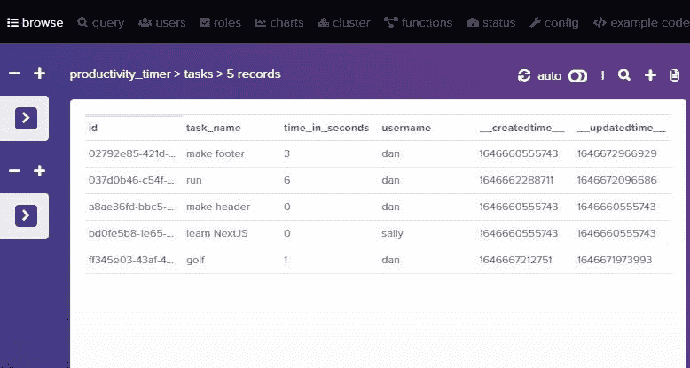

### 添加最近完成的时间日志

让我们添加一个日志来结束我们的计时器页面，向用户反馈已经成功记录了时间。它看起来会像这样:

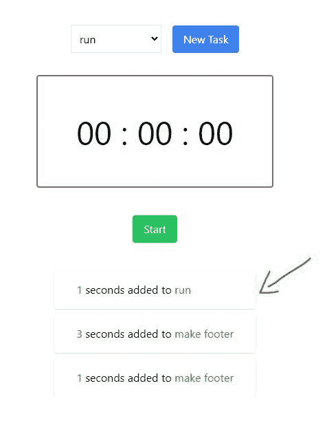

创建一个名为`RecentTaskTime`的类型:

```
// src/types/RecentTaskTime.ts

export interface RecentTaskTime {
  name: string
  seconds: number
} 
```

然后在`index.tsx`中:

```
// ...
import LogOfRecentTaskTimes from "../components/home-page/LogOfRecentTaskTimes"

const Home: NextPage = () => {
  // ...
  const [recentTaskTimes, setRecentTaskTimes] = useState<RecentTaskTime[]>([])

  return (
    <div className="flex flex-col items-center justify-center pt-4 grow">
      {/* ... */}

      {recentTaskTimes.length > 0 && (
        <LogOfRecentTaskTimes recentTaskTimes={recentTaskTimes} />
      )}
    </div>
  )
} 
```

现在让我们创建`LogOfRecentTaskTimes`组件:

```
// src/components/home-page/LogOfRecentTaskTimes.tsx

import type { RecentTaskTime } from "../../types/RecentTaskTime"

interface Props {
  recentTaskTimes: RecentTaskTime[]
}

const LogOfRecentTaskTimes = ({ recentTaskTimes }: Props) => {
  return (
    <div className="mt-8 max-h-56 overflow-y-auto px-8">
      {recentTaskTimes.map((t, i) => (
        <div key={i} className="flex shadow rounded px-8 py-4 mt-2">
          <p>
            <span className="text-green-600">{t.seconds}</span> seconds added to{" "}
            <span className="text-green-600">{t.name}</span>
          </p>
        </div>
      ))}
    </div>
  )
}

export default LogOfRecentTaskTimes 
```

我们的计时器页面已经完成🎉

## 统计页面

如果你能走到这一步，干得好！我们只剩下最后一页了:[统计页面](https://next-js-harper-db-task-timer.vercel.app/stats)。

在 stats 页面中，我们将从 HarperDB tasks 表中获取用户的所有任务，并在一个表中很好地显示它们。

首先，我们需要一些实用函数来在统计页面表中很好地显示时间和日期。将以下两个函数添加到我们的 formatTime utils 文件中:

```
// src/utils/formatTime.ts

// ...

export const displayTimeString = (seconds: number) => {
  const { formattedHours, formattedMins, formattedSecs } = formatTime(seconds)
  return `${formattedHours}h ${formattedMins}m ${formattedSecs}s`
}

// timestamp => dd/mm/yyyy
export const timestampToDayMonthYear = (timestamp: number) => {
  const date = new Date(timestamp)
  const formattedDate = date.toLocaleDateString()
  return formattedDate
}

// ... 
```

我们现在可以创建一个表格，并通过`tasks`循环显示表格行中的数据。在每一行的末尾，我添加了一个删除按钮，这样用户就可以从数据库中永久删除任务:

```
// src/pages/stats.tsx

import { useState, useContext } from "react"
import type { NextPage } from "next"
import { UserContext } from "../contexts/UserContext"
import { TasksContext } from "../contexts/TasksContext"
import Header from "../components/PageHeading"
import Link from "../components/Link"
import Alert from "../components/Alert"
import { displayTimeString, timestampToDayMonthYear } from "../utils/formatTime"
import { harperDeleteTask } from "../utils/harperdb/deleteTask"

const Stats: NextPage = () => {
  const [errorMessage, setErrorMessage] = useState("")

  const { username } = useContext(UserContext)
  const { tasks, getAndSetTasks } = useContext(TasksContext)

  const handleDeleteRow = async (taskId: string) => {
    setErrorMessage("")
    const areYouSure = confirm("Are you sure you want to delete this row?")
    if (!areYouSure) return

    try {
      // Delete task from db
      const { response } = await harperDeleteTask(taskId)
      if (response.status === 200) {
        // Get tasks from db and setTasks
        getAndSetTasks(username)
        return
      }
    } catch (err) {
      console.log(err)
    }
    setErrorMessage("Whoops, something went wrong :(")
  }

  return (
    <div>
      {!username && (
        <Alert type="warning" extraClasses="mb-12">
          Please <Link href="/login">log in</Link> or{" "}
          <Link href="/signup">create an account</Link> to use Super
          Productivity Timer
        </Alert>
      )}

      <Header extraClasses="mb-6 text-center mt-8">Stats</Header>

      {errorMessage && (
        <p className="text-center text-red-500 mb-8">{errorMessage}</p>
      )}

      <div className="overflow-x-auto ">
        <table className="table-auto border-collapse border border-slate-400 w-full sm:w-3/4 mx-auto">
          <thead className="bg-slate-100 text-left">
            <tr>
              <TH>Task</TH>
              <TH>Total Time</TH>
              <TH>Last Updated</TH>
              <TH>Start Date</TH>
              <TH>Delete</TH>
            </tr>
          </thead>
          <tbody>
            {tasks.length > 0 &&
              tasks.map(task => (
                <tr key={task.id}>
                  <TD>{task.task_name}</TD>
                  <TD>{displayTimeString(task.time_in_seconds)}</TD>
                  <TD>{timestampToDayMonthYear(task.__updatedtime__)}</TD>
                  <TD>{timestampToDayMonthYear(task.__createdtime__)}</TD>
                  <TD>
                    <button
                      onClick={() => handleDeleteRow(task.id)}
                      className="bg-red-500 text-white rounded px-3 py-1"
                    >
                      x
                    </button>
                  </TD>
                </tr>
              ))}
          </tbody>
        </table>
      </div>
    </div>
  )
}

const TH: React.FC<{ children: string }> = ({ children }) => {
  const classes = "border border-slate-300 rounded-top p-4"
  return <th className={classes}>{children}</th>
}

interface TDProps {
  children: React.ReactNode
}
const TD = ({ children }: TDProps) => {
  const classes = "border border-slate-300 p-4"
  return <td className={classes}>{children}</td>
}

export default Stats 
```

这是我们的统计页面:

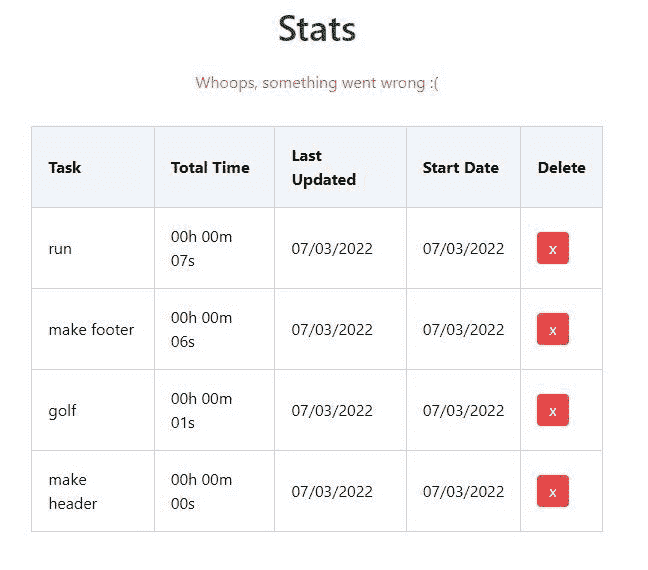

最后一件事:创建`harperDeleteTask`函数:

```
// src/utils/harperdb/deleteTask.ts

import { harperFetch } from "./harperFetch"

export const harperDeleteTask = async (taskId: string) => {
  const data = {
    operation: "delete",
    schema: "productivity_timer",
    table: "tasks",
    hash_values: [taskId],
  }

  const responseAndResult = await harperFetch(data)
  return responseAndResult
} 
```

现在试着删除一个任务并检查你的数据库——它会消失的。完美！

此外，尝试添加一个新任务，然后记录一些时间。然后转到统计页面，您会看到统计页面也更新了。

现在您已经知道如何用 NextJS 和 HarperDB 构建一个全栈应用程序。

## 感谢您的阅读！

如果您觉得这篇文章有用，请随意:

*   [订阅我的 YouTube 频道](https://www.youtube.com/channel/UC0URylW_U4i26wN231yRqvA)。我计划把它变成一个以 React/NextJS/Node 为中心的通道。
*   [在 Twitter 上关注我](https://twitter.com/doabledanny),我在 Twitter 上发布我的自由职业之旅、兼职项目和当前的学习。

干杯！