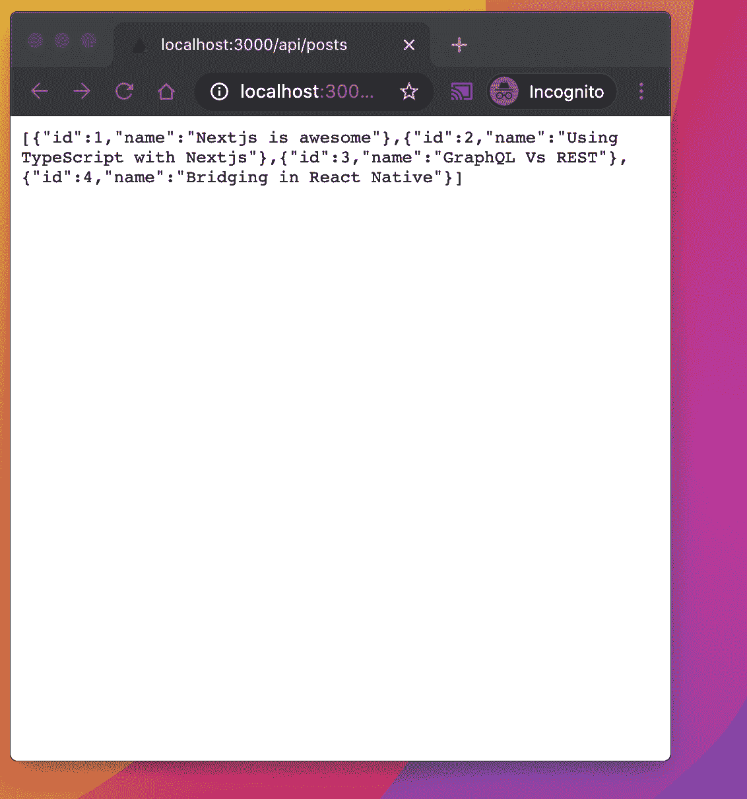

# Next.js 基础教程——服务器端渲染、静态站点、REST APIs、路由等等

> 原文：<https://www.freecodecamp.org/news/nextjs-basics/>

Nextjs 是一个 JavaScript 框架，帮助你使用 Reactjs 构建 web 应用。它提供了大量的特性和工具，使得构建一个完整的应用程序更加简单和容易。

Nextjs 在许多领域提供了出色的开发人员体验。它还简化了许多过去很复杂的功能，比如服务器端渲染、静态网站生成和使用 REST APIs。

在本文中，我将带您了解我个人最常用的 [Nextjs](https://nextjs.org/) 特性。

## 如何设置和配置 Nextjs

您可以使用 Nextjs 运行并构建一个完整的 web 应用程序，而无需任何配置。它非常容易使用——你只需要一个命令就可以引导一个完整的 **Nextjs** 应用程序，就像这样:

```
yarn create next-app
```

然后你只要运行`yarn dev`你的 app 就起来了！

### 向 Nextjs 应用程序添加自定义配置

Nextjs 允许您为 [webpack](https://webpack.js.org/) 添加自定义配置。你也可以添加和集成插件。

有时候你可能需要添加一个插件来处理图像处理或者支持一个默认情况下不受 Nextjs 支持的包，比如 CSS 处理。

为此，您可以在应用程序的路径目录中创建`next.config.js`。下面的例子展示了如何添加一个插件来加载环境文件。

```
require("dotenv").config();
const webpack = require("webpack");
module.exports = {

  webpack: (config) => {
    config.plugins.push(new webpack.EnvironmentPlugin(process.env));
    return config;
  },
};
```

## 如何整合自己喜欢的工具

添加像 TypeScript、Firebase 或 AWS 这样的工具很简单。Nextjs 还在其 [GitHub 库](https://github.com/vercel/next.js/tree/canary/examples)中为每种情况提供了许多样板文件。看看你想用哪一个。

### 将 Firebase 添加到 Nextjs

例如，如果您想要添加现成的 firebase，可以运行以下命令:

```
yarn create next-app --example with-firebase with-firebase-app
```

它将引导一个预先配置了 firebase 的 Nextjs 应用程序，并安装 Firebase 运行所需的包。你可以在这里看一下完整的例子[。](https://github.com/vercel/next.js/tree/canary/examples/with-firebase)

### 添加类型脚本支持

一个命令就足以为 Nextjs 添加 TypeScript 支持:

```
touch tsconfig.json
```

这将为 TypeScript 编译器创建一个`tsconfig.json`文件。Nextjs 将自动检测该文件，并为您生成一个默认的 TypeScript 配置。您可以稍后添加您的自定义配置，只需确保为您的组件添加一个`ts`扩展名，这样编译器就可以将您的文件解释为 TypeScript 文件。

## 服务器端渲染

服务器端渲染帮助你站点的 [**SEO**](https://en.wikipedia.org/wiki/Search_engine_optimization) 。所以如果搜索是你优先考虑的事情之一，那么 Nextjs 是你不错的选择。

Nextjs 给了你更好的选择来呈现你的应用。例如，您可以启用或禁用每个页面的服务器端呈现。

如果你使用`getServerSideProps`,它会使页面默认呈现在服务器端，并允许你访问服务器端的属性。

## 静态网站和组件

您可以将应用程序导出为静态站点，并将其托管在 Netlify 等静态 web 托管工具上。

`next export command`将为您生成一个静态组件。

要构建应用程序并将其导出为静态 HTML，请运行以下命令:

```
next build && next export
```

查看官方的 [Nextjs](https://nextjs.org/docs/advanced-features/static-html-export) 文档，探索导出为 HTML 时的更多选项。

## 按指定路线发送

路由内置了**Nextjs**——你不需要使用任何第三方库来处理它。它还提供了两种不同的方法，动态路由和帝国(预定义)路由。

动态路线允许您创建动态废料和路径。假设你有一个博客，你想显示每篇文章的细节。您可以使用一个动态的、可重用的页面，而不是为每篇文章创建多个(预定义的)页面。

动态路由可以通过以下方式实现:

*   在**页面**文件夹中创建一个用于渲染动态路径的文件夹。我们可以称之为`page`。
*   为了使它动态，我们可以只添加一个斜杠和 param，就像这样:`page/[pid]`。参数应该在两个括号内。
*   然后我们在`page/[pid]`文件夹中创建一个`index.js`文件。它包含以下代码:

```
import React from 'react'
import {useRouter, Router} from 'next/router'
import {route} from 'next/dist/next-server/server/router'

export default function pid() {
  const router = useRouter()
  const {pid} = router.query
  return <div>Page id :{pid}</div>
}
```

`http://localhost:3000/page/2`是一个示例路径。我们也可以使用`route.query`来访问上面例子中的所有参数。

## 如何构建 REST API

在其他特性之上，您可以在 Nextjs 应用程序中构建 REST API 端点，并在同一应用程序或任何其他应用程序中使用它。

下面的例子是一个简单端点的小演示，它返回一个帖子列表。



如果你使用的是`nextjs 9.5.2`或更高版本，默认情况下会附带一个`api`文件夹，通常在**页面**文件夹中。

下面是一个使用返回`json`响应的端点的例子。

`/api/posts`

```
// Next.js API route support: https://nextjs.org/docs/api-routes/introduction

const posts = [
  {
    id: 1,
    name: 'Nextjs is awesome'
  },
  {
    id: 2,
    name: 'Using TypeScript with Nextjs'
  },
  {
    id: 3,
    name: 'GraphQL Vs REST'
  },
  {
    id: 4,
    name: 'Bridging in React Native'
  }
]
export default (req, res) => {
  res.statusCode = 200
  res.json(posts)
}
```

如果你去`https://localhost:5000/api/posts`，它会返回一个帖子的 JSON 响应。

## 附加功能

### CSS 模块

Nextjs 默认支持 CSS 模块。您可以使用`style.module.css`命令直接创建一个 CSS 模块，并将其导入任何组件，如下所示:

```
import styles from './style.module.css' 
```

您也可以像在 React 中一样在 JS 中使用 CSS。

```
<div style={{
  width:300 
}>
   Card
</div>
```

我建议你去看看 nextjs.org，了解更多的附加功能。

这篇博客中使用的例子的源代码可以在 GitHub 上找到[。](https://github.com/hayanisaid/nextjs-all-in-one)

你应该在推特上关注我，订阅我的[](https://subscribi.io/subscribe/5f63b2b306cb71c069272c47)**。**

> *嗨，我叫赛义德·哈亚尼。我创建了 [subscribi.io](https://subscribi.io/) 来帮助创作者、博客作者和有影响力的人通过时事通讯增加他们的受众。*