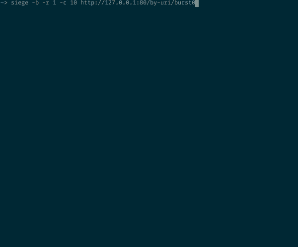
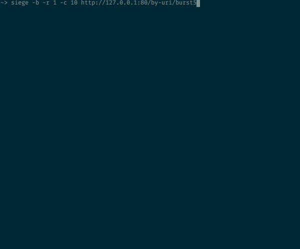
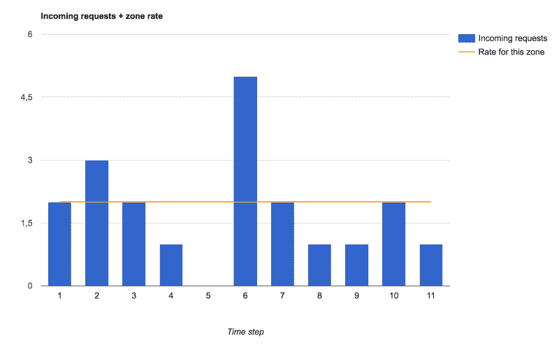
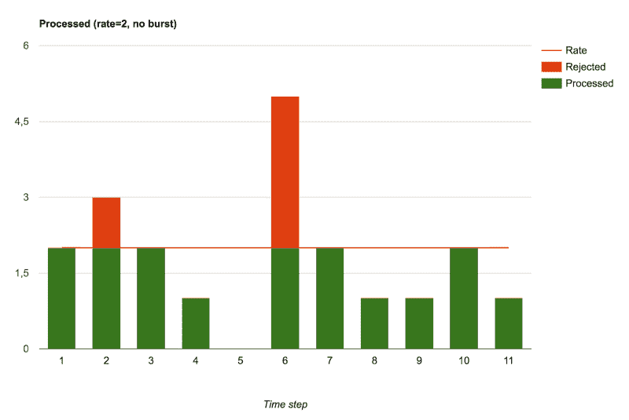
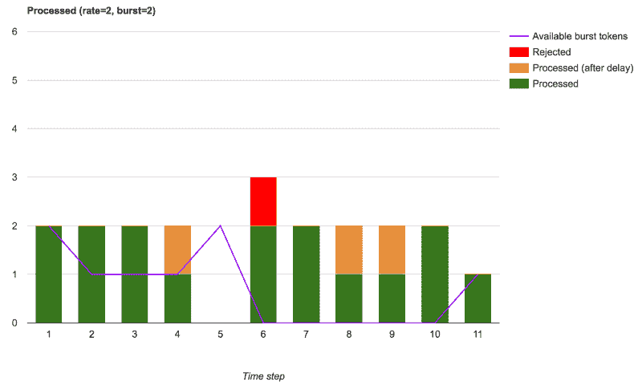
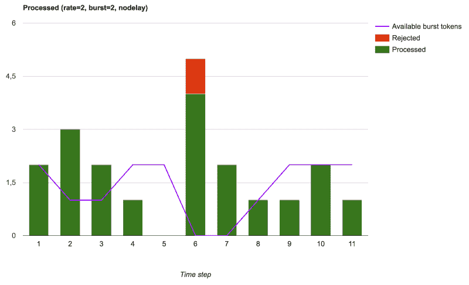

# NGINX 限速简而言之

> 原文：<https://www.freecodecamp.org/news/nginx-rate-limiting-in-a-nutshell-128fe9e0126c/>

塞巴斯蒂安·波特布瓦

# NGINX 限速简而言之


Picture by Wonderlane , on [Flickr](https://www.flickr.com/photos/wonderlane/5516928454/)

NGINX 很棒……但是我发现它关于速率限制的文档有点……有限。因此，我写了这个指南，用 NGINX 进行速率限制和流量整形。

我们将:

*   描述 NGINX 指令
*   解释 NGINX 的接受/拒绝逻辑
*   帮助您了解如何使用各种设置处理真实的流量突发:速率限制、流量策略和允许小突发

作为奖励，我包含了一个 [GitHub repo](https://github.com/sportebois/nginx-rate-limit-sandbox) 和由此产生的 [Docker 图像](https://hub.docker.com/r/sportebois/nginx-rate-limit-sandbox/)，这样你就可以试验和重现测试。边做边学总是更容易！

### NGINX 速率限制指令及其作用


这篇文章主要关注[ngx _ http _ limit _ req _ module](https://nginx.org/en/docs/http/ngx_http_limit_req_module.html)，它为您提供了`limit_req_zone`和`limit_req`指令。它还提供了`limit_req_status`和`limit_req_level`。这些允许您控制被拒绝请求的 HTTP 响应状态代码，以及如何记录这些拒绝。

大多数困惑源于拒绝逻辑。

首先你需要了解`limit_req`指令，它需要一个`zone`参数，还提供了*`burst`和`nodelay`参数。*

*这里有多个概念在起作用:*

*   *让您定义一个桶，一个共享的“空间”,在其中对传入的请求进行计数。所有进入同一个存储桶的请求都将被计入相同的速率限制。这是什么让你限制每个网址，每个 IP，或任何花式。*
*   *`burst`是可选的。如果设置，它将定义您可以接受的超出基本费率的超出请求数。这里需要注意一点:*突发是一个绝对值，它不是一个速率*。*
*   *`nodelay`也是可选的，只有当你设置了一个`burst`值时才有用，我们将在下面看到原因。*

### *NGINX 如何决定一个请求是被接受还是被拒绝？*

*当你设置一个区域时，你定义一个速率，比如`300r/m`允许每分钟 300 个请求，或者`5r/s`允许每秒 5 个请求。*

*例如:*

*   *`limit_req_zone $request_uri zone=zone1:10m rate=300r/m;`*
*   *`limit_req_zone $request_uri zone=zone2:10m rate=5r/s;`*

*了解这两个区域具有相同的限制很重要。NGINX 使用`rate`设置来计算频率:接受新请求之前的时间间隔是多少？NGINX 将使用这个令牌刷新率应用漏桶算法。*

*对于 NGINX，`300r/m`和`5r/s`的处理方式是一样的:对于这个区域，允许每 0.2 秒一个请求。在这种情况下，每隔 0.2 秒，NGINX 就会设置一个标志来记住它可以接受请求。当一个请求进入这个区域时，NGINX 将标志设置为 false 并处理它。如果在计时器计时之前有另一个请求进来，它将被立即拒绝，并显示一个 503 状态代码。如果计时器计时，并且标志已经设置为接受请求，则不会发生任何变化。*

### *你需要限速还是流量整形？*

*输入`burst`参数。为了理解它，想象我们上面解释的标志不再是一个布尔值，而是一个整数:NGINX 在一个突发中可以允许的最大请求数。*

*这不再是漏桶算法，而是令牌桶。`rate`控制计时器的计时速度，但它不再是真/假令牌，而是一个从`0`到`1+burst value`的计数器。每当定时器滴答时，计数器递增，除非它已经达到最大值`b+1`。现在你应该明白为什么`burst`设置是一个值，而不是一个比率。*

*当一个新的请求进来时，NGINX 检查一个令牌是否可用(即计数器> 0)，如果不可用，请求被拒绝。如果有令牌，则请求被接受并被处理，该令牌将被使用(计数器递减)。*

*好的，所以如果有突发令牌可用，NGINX 将接受请求。但是 NGINX 什么时候会处理这个请求呢？*

*您要求 NGINX 应用最大速率`5r/s`，如果突发令牌可用，NGINX 接受超出的请求，但会在最大速率限制内等待一些空间来处理它们。因此**这些突发请求将被延迟**处理，否则它们将超时。*

*换句话说，NGINX 不会超过 zone 声明中设置的速率限制，因此会将额外的请求排队，并在一定的延迟后处理它们，因为令牌计时器发出滴答声，收到的请求越来越少。*

*举个简单的例子，假设你有一个速率`1r/s`，和一个突发`3`。NGINX 同时接收 5 个请求:*

*   *第一个被接受和处理*
*   *因为您允许 1+3，所以有 1 个请求被立即拒绝，并带有 503 状态代码*
*   *另外三个会被一个接一个地治疗，但不是马上。他们将以`1r/s`的速度被处理，以保持在您设定的限制内。如果没有其他请求进来，已经消耗了这个配额。一旦队列为空，突发计数器将再次开始递增(令牌桶再次开始填充)*

*如果您使用 NGINX 作为代理，上游将以最大速率`1r/s`获得请求，它不会意识到任何传入请求的突发，一切都将被限制在该速率。*

*你只是做了一些流量整形，引入一些延迟来调节突发，并在 NGINX 之外产生一个更规则的流。*

#### *不要耽搁*

*`nodelay`告诉 NGINX 它在突发窗口中接受的请求应该立即处理，就像常规请求一样。*

*因此，峰值将传播到 NGINX 上游，但有一些限制，由`burst`值定义。*

### *可视化速率限制*

*因为我认为记住这一点的最佳方式是以动手的方式体验它，所以我用 NGINX 配置设置了一个小的 Docker 图像，显示各种速率限制设置，以查看对基本速率限制位置、`burst`启用速率限制位置和`burst`使用`nodelay`速率限制位置的响应，让我们来玩一玩。*

*这些示例使用这个简单的 NGINX 配置(我们将在本文末尾提供一个 Docker 图像，这样您可以更容易地测试它):*

```
*`limit_req_zone $request_uri zone=by_uri:10m rate=30r/m;

server {
    listen 80;

    location /by-uri/burst0 {
        limit_req zone=by_uri;
        try_files $uri /index.html;
    }

    location /by-uri/burst5 {
        limit_req zone=by_uri burst=5;
        try_files $uri /index.html;
    }

    location /by-uri/burst5_nodelay {
        limit_req zone=by_uri burst=5 nodelay;
        try_files $uri /index.html;
    }
}`*
```

*从这个配置开始，下面的所有示例将一次发送 10 个并发请求。让我们看看:*

*   *有多少人被限速拒绝？*
*   *被接受的处理率是多少？*

#### *向速率受限的端点发送 10 个并行请求*

*

10 requests hitting a rate-limited endpoint at the same time* 

*该配置允许每分钟 30 个请求。但在这种情况下，10 个请求中有 9 个被拒绝。如果您遵循前面的步骤，这应该是有意义的:`30r/m`意味着每 2 秒钟允许一个新请求。这里 10 个请求同时到达，一个被允许，另外 9 个在令牌计时器计时之前被 NGINX 发现，因此全部被拒绝。*

#### *但是我可以容忍一些客户端/端点出现一些突发*

*好了，让我们添加`burst=5`参数，让 NGINX 处理限速区端点的小突发:*

*

10 concurrent requests sent at once to an endpoint with a burst=5 argument* 

*这是怎么回事？正如对`burst`参数的预期，又有 5 个请求被接受，所以我们从 1 /10 成功到 6/10 成功(其余的被拒绝)。但是 NGINX 刷新它的令牌和处理接受的请求的方式在这里非常明显:输出速率被限制在`30r/m`，相当于每 2 秒钟 1 个请求。*

*第一个在 0.2 秒后返回。计时器在 2 秒后停止计时，处理并返回一个挂起的请求，总往返时间为 2.02 秒。2 秒钟后，计时器再次计时，处理另一个挂起的请求，返回的总往返时间为 4.02 秒。如此等等…*

*`burst`参数只是让您将 NGINX 速率限制从一些基本的阈值过滤器变成流量整形策略网关。*

#### *我的服务器有一些额外的容量。我想使用一个速率限制来防止它超过这个容量。*

*在这种情况下，`nodelay`参数会很有帮助。让我们向一个`burst=5 nodelay`端点发送同样的 10 个请求:*

*

10 concurrent requests sent to an endpoint set up with burst=5 nodelay* 

*正如对`burst=5`的预期，我们仍然有相同数量的状态 200 和 503。但是现在传出速率不再严格限制为每 2 秒 1 个请求的速率。只要有一些突发令牌可用，任何传入的请求都会被立即接受和处理。定时器滴答速率对于控制这些突发令牌的刷新/再填充速率仍然像以前一样重要，但是被接受的请求不再遭受任何额外的延迟。*

**注意*:在这种情况下，`zone`使用了`$request_uri`，但是下面所有的测试都以完全相同的方式对客户端 IP 进行速率限制的`$binary_remote_addr`配置进行测试。您可以在 Docker 图像中使用它。*

### *让我们回顾一下*

*如果我们试图想象 NGINX 如何接受传入的请求，然后根据`rate`、`burst`和`nodelay`参数处理它们，这里有一个综合视图。*

*为了简单起见，我们将显示每个时间步长的传入请求(然后接受或拒绝，以及处理)的数量，时间步长的值取决于区域定义的速率限制。但是这个步骤的实际持续时间最终并不重要。有意义的是 NGINX 在每个步骤中必须处理的请求数量。*

*这是我们将通过各种速率限制设置发送的流量:*

*

Incoming requests, and the rate-limit defined in this zone* *

Accepted and rejected requests when no burst setting is defined* 

*在不使用突发(即`burst=0`)的情况下，我们看到 NGINX 充当了一个纯粹的速率限制/流量策略参与者。如果速率计时器已经计时，所有请求要么立即被处理，要么立即被拒绝。*

*现在，如果我们希望允许小突发在速率限制下使用未使用的容量，我们会看到添加一个`burst`参数会让用户这样做，这意味着在处理消耗突发令牌的请求时会有一些额外的延迟:*

*

Accepted, accepted with delay and rejected requests when burst is used* 

*我们可以看到，被拒绝的请求的总体数量更低，NGINX 处理的请求更多。只有当没有突发令牌可用时的额外请求被拒绝。在这个设置中，NGINX 执行一些真正的流量整形。*

*最后，我们看到 NGINX 可以用于执行一些流量策略或限制突发的大小，但仍然会将一些突发传播到处理工作者(上游或本地)，最终会产生不太稳定的传出速率，但延迟更长，如果您可以处理这些额外的请求:*

*

Accepted & processed requests and rejected requests when burst is used with nodelay* 

### *自己玩限速沙盒*

*现在，您可以去探索代码，克隆 repo，使用 Docker 映像，并很快地获得它，以更好地巩固您对这些概念的理解。[https://github.com/sportebois/nginx-rate-limit-sandbox](https://github.com/sportebois/nginx-rate-limit-sandbox)*

### *更新(2017 年 6 月 14 日)*

*NGINX 在几天前发表了他们自己对其限速机制的详细解释。你现在可以在他们的[用 NGINX 和 NGINX Plus](https://www.nginx.com/blog/rate-limiting-nginx/) 限制速率的博客文章中了解更多。*